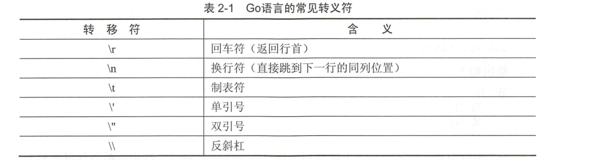

# 数据类型


```
Go语言的基本数据类型和其他语言的大同小异。
```

## 整型

整型分为两个大类
```
* 按长度分为：int8、int16、int32、int64
* 对应的无符号的整型：uint8、uint16、uint32、uint64

uint8  就是我们熟知的byte型
uint16 对应C语言中的short型
uint64 对应C语言中的long型
```

## 浮点型

Go语言支持两种浮点类型： float32和float64.两种浮点类型格式遵循IEEE754标准

```
float32的浮点数的最大范围约为 3.4e38，可以使用常量定义：math.MaxFloat32。
float64的浮点数最大范围约为 1.8e308,可以使用一个常量定义：math.MaxFloat64。
```

打印浮点数，使用格式化%f
```go
package main

import (
	"fmt"
	"math"
)

func main() {
	fmt.Printf("%f\n", math.Pi)		//3.141593
	fmt.Printf("%.2f\n", math.Pi)		//3.14
}

```

## 布尔型
```
布尔型数据在Go语言中以bool类型进行声明，布尔数据只有true和false两个值
```

## 字符串

字符串的值为双引号中的内容，可以在Go语言的源码中直接添加非ASCII码字符，代码如下：
```go
str := "hello world"

ch := "中文"
```

1.字符串转义符


Go语言源码中使用转义符代码如下：
```go
package main

import (
	"fmt"
)

func main() {
	fmt.Println("str := \"c:\\Go\\bin\\go.exe\"")			//str := "c:\Go\bin\go.exe"
}

```


### 定义多行字符串
```go
package main

import (
	"fmt"
)

func main() {
	const str  = `第一行
	第二行
	第三行
\r\n
     `
	fmt.Println(str)
}

/**
第一行
	第二行
	第三行
\r\n
 */
```

在"`"间的索引代码均不会被编译器识别，而只是作为字符串的一部分。


## 格式化动词打印

| 动词 | 输出                                       |
| ---- | ------------------------------------------ |
| %f   | 浮点数                                     |
| %d   | 十进制整数                                 |
| %s   | 字符串                                     |
| %t   | 布尔值(true、false)                        |
| %v   | 任何值，根据所提供的值的类型选择适当的格式 |
| %#v  | 任何值，按Go程序中显示的格式进行格式化     |
| %T   | 所提供值的类型（int float....）            |
| %%   | 一个%                                      |


```go
package main

import "fmt"

func main() {
	fmt.Printf("A float: %f\n", 3.1415)							//A float: 3.141500
	fmt.Printf("An integer: %d\n", 15)							//An integer: 15
	fmt.Printf("A string: %s\n", "hujianli")					//A string: hujianli
	fmt.Printf("A boolean %t\n", true)							//A boolean true
	fmt.Printf("Values: %v %v %v\n", 1, "\t", true)				//Values: 1 	 true
	fmt.Printf("Values: %#v %#v %#v\n", 1, "\t", true)			//Values: 1 "\t" true
	fmt.Printf("Types: %T %T %T\n", 1, "\t", true)				//Types: int string bool
	fmt.Printf("Percent sign: %%\n")							//Percent sign: %
}
```

对比%v和%#v，%#v可以显示一些值，如果不使用%#v的话，这些值可能会在输出中被隐藏。


### 格式化值宽度

```go
package main

import "fmt"

func main() {
	fmt.Printf("%12s | %s\n", "Product-Master", "Cost in Cents")
	fmt.Println("----------------------------------------------")
	fmt.Printf("%12s | %2d\n", "Product_A", 50)
	fmt.Printf("%12s | %2d\n", "Product_B", 5)
	fmt.Printf("%12s | %0.2f\n", "Product_C", 99.1193)		//这里会四舍五入	//99.12

	fmt.Printf("%%7.3f: %7.3f\n",12.4354231244)			//%7.3f:  12.435
	fmt.Printf("%%7.2f: %7.2f\n",12.4354231244)			//%7.2f:   12.44
	fmt.Printf("%%7.1f: %7.1f\n",12.4354231244)			//%7.1f:    12.4
	fmt.Printf("%%.1f: %.1f\n",12.1234567)				//%.1f: 12.1
	fmt.Printf("%%.2f: %.2f\n",12.1234567)				//%.2f: 12.12

}
```


## 字符

Go语言的字符有以下两种:
```
- 一种是uint8类型，或者叫byte型，代表ASCII码的一个字符。

- 另一种是rune类型，代表一个UTF-8字符，当要处理中文、日文或者其他复合字符时，则需要用到rune类型。rune类型实际是一个int32
```

fmt.Printf中的"%T"动词可以输出变量的实际类型。

```go
package main

import "fmt"

func main() {
	var a byte = 'a'
	fmt.Printf("%d %T\n", a, a)			//97 uint8    byte类型的a变量实际类型是uint8.对象的ASCII码为97

	var b rune = '你'
	fmt.Printf("%d %T\n", b, b)			//20320 int32   b变量的实际类型是int32.对应的Unicode码就是20320
}

```


### UTF-8和Unicode 有何区别？
```
Unicode 是字符集。ASCII 也是一种字符集。字符集为每个字符分配一个唯一的ID ， 我们使用到的所有字符在Unicode 字符集中都
有唯一的一个ID 对应， 例如上面例子中的a 在与ASCII 中的编码都是97 。"你"在Unicode 中的编码为20320 ，
 但是在不同国家的字符集中， "你" 的ID 会不同。而无论任何情况下， Unicode 中的字符的ID 都是不会变化的。


UTF-8 是编码规则， 将Unicode 中字符的ID 以某种方式进行编码。UTF-8 的是一种变长编码规则， 从1 到4 个字节不等。编码规则如下：
    ·   0xxxxxx 表示文字符号0 ～ 127 ， 兼容ASCII 字符集。
    ·   从128 到0x10ffff 表示其他字符。


根据这个规则， 拉丁文语系的字符编码一般情况下， 每个字符依然占用一个字节， 而中文每个字符占用3 个字节。
广义的Unicode 指一个标准， 定义字符集及编码规则， 即Unicode 字符集和UTF-8 、
UTF-16 编码等。
```


## 切片

```go
package main

import "fmt"

func main() {
	// T代表切片元素类型，可以是整型、浮点型、布尔型、切片、map、函数等
	a := make([]int, 3) //创建一个容量为3的整型切片
	a[0] = 1
	a[1] = 2
	a[2] = 3 //为切片元素赋值

	str := "hello hujianli"
	fmt.Println(str[6:]) //hujianli

}

```

## 转换不同的数据类型
Go语言使用类型前置加括号的方式进行类型转换，一般格式如下：

T(表达式)

其中，T代表要转换的类型，表达式包括变量，复杂算子和函数返回值等。
```go
package main

import (
	"fmt"
	"math"
)

func main() {
	fmt.Println("int8 range:", math.MinInt8, math.MaxInt8)
	fmt.Println("int16 range:", math.MinInt16, math.MaxInt16)
	fmt.Println("int32 range:", math.MinInt32, math.MaxInt32)
	fmt.Println("int32 range:", math.MinInt64, math.MaxInt64)

	// 初始化一个32位的整型值
	var a int32 = 1047483647
	fmt.Printf("int32: 0x%x %d\n", a, a) //输出变量十六进制和十进制
	b := int16(a)                        //将变量a转换为十六进制数
	fmt.Printf("int16: 0x%x %d\n", b, b)			// 输出十六进制和十进制的值

	var c float32  = math.Pi			// 将常量保存为float32类型
	fmt.Println(int(c))					// 转换为int类型，浮点发生精度丢失

}

```

