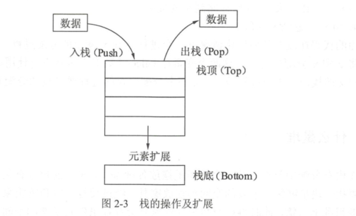

# 变量声明周期
讨论变量生命期之前，先来了解下计算机组成里两个非常重要的概念：堆和栈。


## 1.什么是栈

入栈，后进先出（LIFO） Last In First Out顺序



### 1.1变量和栈有什么关系

栈可以用于内存分配，栈的分配和回收速度非常快。

```go
package main

import "fmt"

func calc(a, b int) int {
	var c int			// 声明c整型变量，运行时，c会分配一段内存用以存储c的数值。
	c = a * b
	var x int			// 声明x整型变量，x也会被分配一段内存。
	return x			// 返回x的值
}

func main() {
	result := calc(6, 7)
	fmt.Println(result)			//420
}

```
上面的代码在没有任何优化的情况下，会进行c和x变量的分配过程，Go语言默认情况下，
会将c和x分配在栈上，这两个变量在calc()函数退出时就不再使用，函数结束时，保存c和x的栈内存将被释放。

整个分配内存的过程通过栈的分配和回收都非常迅速。


## 2.声明是堆
堆在内存分配中类似于往一个房间里摆放各种家具,家具的尺寸有大有小。
分配内存时，需要找一块足够装下家具的空间再摆放家具。

经过反复摆放和腾空家具后,房间里的空间会变得乱七八糟,
此时再往空间里摆放家具会存在虽然有足够的空间,但各空间分布在不同的区域,无法有一段连续的空间来摆放家具的问题。
此时,内存分配器就需要对这些空间进行调整优化，如图


堆分配内存和栈分配内存相比，堆适合不可预知大小的内存分配，但是为此付出的代价是分配速度较慢，而且会形成内存碎片。


## 变量逃逸(Escape Analysis)-自动决定变量分配方式，提高运行效率

堆和栈各有优缺点， 该怎么在编程中处理这个问题呢？ 在C++语言中， 需要开发者自己学习如何进行内存分配， 选用怎样的内存分配方式来适应不同的算法需求。

比如:

- 函数局部变量尽量使用栈；

- 全局变量、结构体成员使用堆分配等。


程序员不得不花费很多年的时间在不同的项目中学习、记忆这些概念并加以实践和使用。

Go语言将这个过程整合到编译器中， 命名为"变量逃逸分析"。
这个技术由编译器分析代码的特征和代码生命期， 决定应该如何堆还是栈进行内存分配，即使程序员使用Go语言完成了整个工程后也不会感受到这个过程。

### 1.逃逸分析

```go
package main

import "fmt"

// dummy()函数拥有一个参数，返回一个整型值，测试函数参数和返回值分析情况
func dummy(b int) int {
	// 声明c变量，这里演示函数临时变量通过函数返回值返回后的情况。
	var c int
	c = b
	return c
}

//空函数，什么也不做
func void() {

}

func main() {
	// 声明a变量并打印
	var a int
	void() // 调用void()函数

	// 打印a和dummy(0)的返回值，测试函数返回值没有变量接收时的分析情况。
	fmt.Println(a, dummy(0))
}

```
接着使用如下命令行运行上面的代码：
```shell
$ go run -gcflags "-m -l" main.go
# command-line-arguments
./main.go:21:13: ... argument does not escape
./main.go:21:13: a escapes to heap			// 变量a逃逸到堆
./main.go:21:22: dummy(0) escapes to heap

// “dummy(0)调用逃逸到堆”。由于dummy()函数会返回一个整型值，这个值被fmt.Println使用后还是会在其声明后继续在main()函数中存在。
0 0

```

使用go run运行程序时，-gcflags参数是编译参数。其中-m表示进行内存分配分析，-l表示避免程序内联，也就是避免进行程序优化。


### 2.取地址发生逃逸
下面的例子使用结构体做数据，了解在堆上分配的情况，代码如下：

```go
package main

import "fmt"

// 声明一个空的结构体做结构体逃逸分析。
type Data struct {
}


// 将dummy()函数的返回值修改为*Data指针类型。
func dummy() *Data {
	// 将c变量声明为Data类型，此时c的结构体为值类型。
	var c Data
	// 取函数局部变量c的地址并返回
	return &c
}

func main() {
	// 打印dummy()函数的返回值。
	fmt.Println(dummy())

	// Go语言最终选择将c的Data结构分配在堆上。然后由垃圾回收器去回收c的内存
}

```

原则：

在使用Go语言进行编程时，Go语言的设计者不希望开发者将精力放在内存应该分配在栈还是堆上的问题。
编译器会自动帮助开发者完成这个纠结的选择。
但变量逃逸分析也是需要了解的一个编译器技术，这个技术不仅用于Go语言，在Java等语言的编译器优化上也使用了类似的技术。

编译器觉得变量应该分配在堆和栈上的原则是：

- 变量是否被取地址。

- 变量是否发生逃逸。
