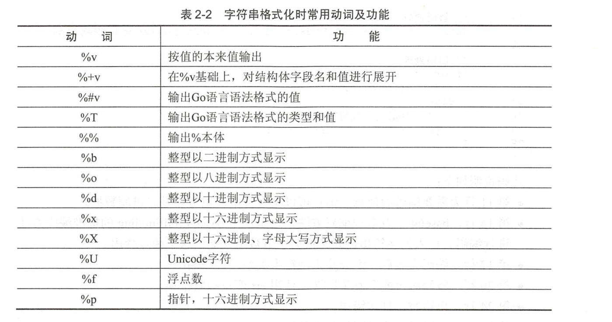

# 字符串应用

## 1.计算字符串长度


Go语言的内建函数len()，可以用来获取切片、字符串、通道（channel）等的长度。下面的代码可以用len()来获取字符串的长度。
```go
tip1 := "genji is a ninja"
fmt.Println(len(tip1))

tip2 := "忍者"
fmt.Println(len(tip2))

```

```go
package main

import "fmt"

func main() {
	tip1 := "hujianli00001"

	tip2 := "hujianli02"
	tip3 :="胡建力"
	fmt.Println(len(tip1))		//13
	fmt.Println(len(tip2))		//10
	fmt.Println(len(tip3))		//9
}

```

每个中文占3个字节，中文len后结果为9.如果希望按照字符串个数进行计算，就要使用Go语言中的UTF-8包提供的RuneCountInString()函数，
统计Uncode字符数量。

```go
fmt.Println(utf8.RuneCountInString("你好"))	//2
fmt.Println(utf8.RuneCountInString("你好，安河桥"))		//6
```


总结：

- ASCII字符串长度使用len()函数。

- Unicode字符串长度使用utf8.RuneCountInString()函数。

## 2.字符串拼接

### 2.1 直接使用运算符

```go
str := "beijing wellcom to you" + "beibei jingjing huanhuan yy nini"
fmt.Println(str)

s := "hello " + "hujianli"
s += "study golang! "
fmt.Println(s)		//hello hujianlistudy golang!
```

- fmt.Sprintf()

```go
	ss := fmt.Sprintf("%d %s", 2020, "年")
	fmt.Println(ss)		//2020 年
```

- strings.Join()
```go
	hu :=strings.Join([]string{"hello world", "hujianli"}, ",")
	fmt.Println(hu)		//hello world,hujianli

```

### 2.2 bytes.Buffer

bytes.Buffer是可以缓冲并可以往里面写入各种字节数组的。字符串也是一种字节数组，使用WriteString()方法进行写入。

将需要连接的字符串，通过调用WriteString()方法，写入stringBuilder中，然后再通过stringBuilder.String()方法将缓冲转换为字符串。

```go
	// 声明字节缓冲
	var buffer bytes.Buffer
	// 把字符串写入缓冲
	buffer.WriteString("hello")
	buffer.WriteString(",")
	buffer.WriteString("world")
	// 将缓冲以字符串形式输出
	fmt.Println(buffer.String())		//hello,world
```

```go
package main

import (
	"bytes"
	"fmt"
)

func main() {
	hammer := "吃我一锤"
	sickle := "去死吧"

	// 声明字节缓冲
	var stringBuilder bytes.Buffer

	// 把字符串写入缓冲
	stringBuilder.WriteString(hammer)
	stringBuilder.WriteString(sickle)

	// 将缓冲以字符串形式输出
	fmt.Println(stringBuilder.String())

}

//吃我一锤去死吧
```

### 2.3 strings.Builder

strings.Builder 内部通过 slice 来保存和管理内容。slice 内部则是通过一个指针指向实际保存内容的数组。
strings.Builder 同样也提供了 Grow() 来支持预定义容量。
当我们可以预定义我们需要使用的容量时，strings.Builder 就能避免扩容而创建新的 slice 了。

strings.Builder是非线程安全，性能上和 bytes.Buffer 相差无几。

```go
	var b1 strings.Builder
	b1.WriteString("ABC")
	b1.WriteString("DEF")
	fmt.Println(b1.String())		//ABCDEF
```


## 3.有关string的处理

```
strings 包提供了很多操作字符串的简单函数，通常一般的字符串操作需求都可以在这个包中找到。下面简单举几个例子：

判断是否以某字符串打头  strings.HasPrefix(s, prefix string) bool

判断是否以某字符串结尾  strings.HasSuffix(s, suffix string) bool

字符串分割 strings.Split(s, sep string) []string

返回子串索引 strings.Index(s, substr string) int strings.LastIndex 最后一个匹配索引

字符串连接 strings.Join(a []string, sep string) string 另外可以直接使用“+”来连接两个字符串

字符串替换 strings.Replace(s, old, new string, n int) string

字符串转化为大小写 strings.ToUpper(s string) string strings.ToLower(s string) string

统计某个字符在字符串出现的次数 strings.Count(s, substr string) int

判断字符串的包含关系 strings.Contains(s, substr string) bool
```


## 4.遍历字符串-获取每一个字符串元素

### 4.1遍历每一个ASCII字符
```go
package main

import "fmt"

func main() {
	theme := "狙击 start"

	for i := 0; i< len(theme); i++{
		fmt.Printf("ascii: %c %d \n",theme[i],theme[i])
	}
}


/*ascii: ç 231
ascii: ‹ 139
ascii: ™ 153
ascii: å 229
ascii: ‡ 135
ascii: » 187
ascii:   32
ascii: s 115
ascii: t 116
ascii: a 97
ascii: r 114
ascii: t 116 */
```

### 4.2 按Unicode字符遍历字符串
```go
package main

import "fmt"

func main() {
	theme := "狙击 start"
	for _, s := range theme {
		fmt.Printf("Unicode: %c %d\n", s, s)
	}
}


/*Unicode: 狙 29401
Unicode: 击 20987
Unicode:   32
Unicode: s 115
Unicode: t 116
Unicode: a 97
Unicode: r 114
Unicode: t 116*/
```

总结：

- ASCII字符串遍历直接使用下标。

- Unicode字符串遍历用for range。


## 5.获取字符串的某一段字符

```go
package main

import (
	"fmt"
	"strings"
)

func main() {
	tracer := "死神来了,死神bye bye"
	comma := strings.Index(tracer, ",") // 获取索引
	//fmt.Println(comma)
	pos := strings.Index(tracer[comma:], "死神")
	fmt.Println(comma, pos, tracer[comma+pos:])
}

// 12 1 死神bye bye

```


总结：

字符串索引比较常用的有如下几种方法。

- strings.Index：正向搜索子字符串。

- strings.LastIndex：反向搜索子字符串。

- 搜索的起始位置可以通过切片偏移制作。


## 6.修改字符串

```go
package main

import "fmt"

func main() {
	ange1 := "Heros never die"
	// 将字符串转为字符串数组。
	angeleBytes := [] byte(ange1)

	// 利用循环，将never单词替换为空格。
	for i := 5; i <= 10; i++ {
		angeleBytes[i] = ' '
	}
	// 使用string()将[]byte转为字符串时，重新创造了一个新的字符串。
	fmt.Println(string(angeleBytes))
}

// Heros       die

```

GO语言中的字符串和其他高级语言（java C#）一样，默认是不可变的。

字符串不可变的好处有很多，如天生线程安全，大家使用的都是只读对象，无须加锁；
再者，方便内存共享，而不必使用写时复制等技术，字符串的hash值也只需要制作一份。

代码中实际修改的是[]byte，[]byte在Go语言中是可变的，本身就是一个切片。

完成对[]byte操作后，在使用string()将[]byte转为字符串时，重新创建一个新的字符串。


总结：

- Go语言的字符串是不可变的。
- 修改字符串时，可以将字符串转换为[]byte进行修改。
- []byte和string可以通过强制类型转换互转。


## 7.格式化

格式化在逻辑中非常常用，使用格式化函数，要注意写法：

```
fmt.Sprintf(格式化样式，参数列表)
```

- 格式化样式： 字符串形式，格式化动词以%开头。
- 参数列表：多个参数以逗号分隔，个数必须与格式化样式中的个数一一对应，否则运行时会报错。


```go
package main

import "fmt"

func main() {
	var progress = 2
	var target = 8
	title := fmt.Sprintf("已采集%d个草药，还需要%d个完成任务", progress, target)
	fmt.Println(title)
	pi := 3.14159

	// 按照数值本身的格式输出
	variant := fmt.Sprintf("%v %v %v", "月球基地", pi, true)
	fmt.Println(variant)


	// 匿名结构体声明，并赋予初值
	profile := &struct {
		Name string
		HP   int
	}{
		Name: "rat",
		HP:   150,
	}
	fmt.Printf("使用'%%+v' %+v\n", profile)
	fmt.Printf("使用'%%#v' %#v\n", profile)
	fmt.Printf("使用'%%T' %T\n", profile)
}


/*已采集2个草药，还需要8个完成任务
月球基地 3.14159 true
使用'%+v' &{Name:rat HP:150}
使用'%#v' &struct { Name string; HP int }{Name:"rat", HP:150}
使用'%T' *struct { Name string; HP int }*/

```




## 8.Base64解码-电子邮件的基础解码格式

```go
package main

import (
	"encoding/base64"
	"fmt"
)

func main() {
	// 需要处理的字符串
	mesage := "Away from keyboard. https://goolang.org"

	// 编码消息
	encodeMessage := base64.StdEncoding.EncodeToString([]byte(mesage))
	fmt.Println(encodeMessage) // 输出编码完成的消息
	//QXdheSBmcm9tIGtleWJvYXJkLiBodHRwczovL2dvb2xhbmcub3Jn

	//解码消息
	data, err := base64.StdEncoding.DecodeString(encodeMessage)
	//出错处理
	if err != nil {
		fmt.Println(err)
	} else {
		// 打印解码完成的数据
		fmt.Println(string(data))			//Away from keyboard. https://goolang.org
	}

}

```


## 9.从INI配置文件中查询需要的值
INI文件格式是一种古老的配置文件格式。一些操作系统、虚幻游戏引擎、GIT版本管理中都在使用INI文件格式。下面用从GIT版本管理的配置文件中截取的一部分内容，展示INI文件的样式。

### 1.INI文件的格式

`example.ini`

```ini
[core]
repositoryformatversion = 0

filemode = false
bare = false
logallrefupdates = true
symlinks = false
ignorecase = true
hideDotFiles = dotGitOnly
[remote "origin"]
url = https://github.com/davyxu/cellnet
fetch = +refs/heads/*:refs/remotes/origin/*
[branch "master"]
remote = origin
merge = refs/heads/master
```

### 2.从INI文件中取值的函数

getValue() 函数的声明如下：
```go
func getValue(filename, expectSection, expectKey string) string{}
```

参数说明如下。
  - filename：INI 文件的文件名。
  - expectSection：期望读取的段。
  - expectKey：期望读取段中的键。

getValue()函数的实际使用例子参考代码如下：
```go
func main() {
	fmt.Println(getValue("example.ini", "remote \"origin\"", "fetch"))
	fmt.Println(getValue("example.ini", "core", "hideDotFiles"))
}

```


### 3.读取文件
Go语言的os包中提供了文件打开函数os.Open()。文件读取完成后需要及时关闭，否则文件会发生占用，系统无法释放缓冲资源。参考下面代码：
```go
	// 打开文件
	file, err := os.Open(filename)
	// 文件找不到返回空
	if err != nil {
		return ""
	}
	// 在函数结束时，关闭文件
	defer file.Close()

```


### 4.读取行文本
INI文件的格式是由多行文本组成，因此需要构造一个循环，不断地读取INI文件的所有行。
Go语言总是将文件以二进制格式打开，通过不同的读取方式对二进制文件进行操作。
Go语言对二进制读取有专门的代码抽象，bufio包即可以方便地以比较常见的方式读取二进制文件。
```go
	reader := bufio.NewReader(file)
	// 当前读取的段的名字
	var sectionName string
	for {
		// 读取文件的一行
		// 使用reader.ReadString()从文件中读取字符串，直到碰到“\n”，也就是行结束。这个函数返回读取到的行字符串（包括“\n”）和可能的读取错误err，例如文件读取完毕。
		linestr, err := reader.ReadString('\n')
		if err != nil {
			break
		}
		// 切掉行的左右两边的空白字符
		linestr = strings.TrimSpace(linestr)
		// 忽略空行
		if linestr == "" {
			continue
		}
		// 忽略注释
		if linestr[0] == ':' {
			continue
		}

	}
```


### 5.读取段
行字符串linestr已经去除了空白字符串，段的起止符又以"[" 开头，以 "]"结尾，因此可以直接判断行首和行尾的字符串匹配段的起止符匹配时读取的是段，
```go
		// 行首和行尾分别是方括号的，说明是段标记的起止符
		if linestr[0] == '[' && linestr[len(linestr)-1] == ']' {
			// 将段名取出
			sectionName = linestr[1 : len(linestr)-1]
			// 这个段是希望读取的
		}

```

### 6.读取键值
这里代码紧接着前面的代码。当前行不是段时（不以“[”开头），那么行内容一定是键值对。别忘记此时getValue()的参数对段有匹配要求。找到能匹配段的键值对后，开始对键值对进行解析，参考下面的代码：

```go
else if sectionName == expectSection {
			//切开等号分割的键值对
			pair := strings.Split(linestr, "=")
			// 保证切开只有1个等号分割的简直情况
			if len(pair) == 2 {
				// 去掉键的多余空白字符
				key := strings.TrimSpace(pair[0])
				// 是期望的值
				if key == expectKey {
					// 返回去掉空白字符的值
					return strings.TrimSpace(pair[1])
				}
			}
		}
```


### 7.完整代码示例

```go
package main

import (
	"bufio"
	"fmt"
	"os"
	"strings"
)

//根据文件名，段名，键名获取ini的值
func getValue(filename, expectSection, expectKey string) string {
	// 打开文件
	file, err := os.Open(filename)
	// 文件找不到返回空
	if err != nil {
		return ""
	}
	// 在函数结束时，关闭文件
	defer file.Close()

	// 使用读取器读取文件
	reader := bufio.NewReader(file)
	// 当前读取的段的名字
	var sectionName string
	for {
		// 读取文件的一行
		linestr, err := reader.ReadString('\n')
		if err != nil {
			break
		}
		// 切掉行的左右两边的空白字符
		linestr = strings.TrimSpace(linestr)
		// 忽略空行
		if linestr == "" {
			continue
		}
		// 忽略注释
		if linestr[0] == ':' {
			continue
		}
		// 行首和行尾分别是方括号的，说明是段标记的起止符
		if linestr[0] == '[' && linestr[len(linestr)-1] == ']' {
			// 将段名取出
			sectionName = linestr[1 : len(linestr)-1]
			// 这个段是希望读取的
		} else if sectionName == expectSection {
			//切开等号分割的键值对
			pair := strings.Split(linestr, "=")
			// 保证切开只有1个等号分割的简直情况
			if len(pair) == 2 {
				// 去掉键的多余空白字符
				key := strings.TrimSpace(pair[0])
				// 是期望的值
				if key == expectKey {
					// 返回去掉空白字符的值
					return strings.TrimSpace(pair[1])
				}
			}
		}

	}
	return ""

}
func main() {
	fmt.Println(getValue("example.ini", "remote \"origin\"", "fetch"))
	fmt.Println(getValue("example.ini", "core", "hideDotFiles"))
}

```


## 10.字符串的常见操作

```go
package main

import (
	"fmt"
	"strings"
)

func main() {
	str0:="hujianli"
	str1:=`第一行
	第二行
	第三行
	`
	fmt.Println(len(str0),len(str1))		//求长度
	var str3 string = str0 + str1
	fmt.Println(str3)

	str4 :=fmt.Sprintf("%s %s",str0,str1)	//拼接字符串
	fmt.Println(str4)

	str5:="hu,jian,li"
	fmt.Println(strings.Split(str5,","))		//分割
	fmt.Println(strings.Split(str5,"i"))
	fmt.Printf("%q\n", strings.Split(" xyz ", ""))
	fmt.Printf("%q\n", strings.Split("", "Bernardo O'Higgins"))

	fmt.Printf("%t\n",strings.Contains("sssss","ss"))		//判断是否包含

	fmt.Printf("%t\n",strings.HasPrefix("hujianli","hu"))	//判断前缀
	fmt.Printf("%t\n",strings.HasSuffix("hujianli","li"))	//判断后缀
	fmt.Printf("%d\n",strings.Index("hujianli","li"))	//判断子串出现的位置
	fmt.Printf("%d\n",strings.LastIndex("hujianli","i"))	//判断子串最后出现的位置
	s := []string{"foo", "bar", "baz"}
	fmt.Println(strings.Join(s, ","))		//将一系列字符串连接为一个字符串，之间用sep来分隔。
```


