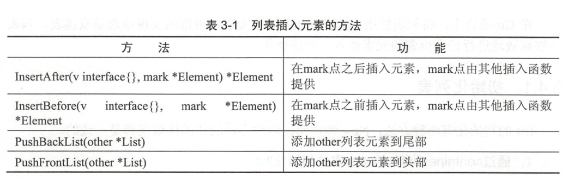

.. contents::
   :depth: 3
..

列表
====

1.初始化列表
------------

list的初始化有两种方法：New和声明。 两种方法的初始化效果都是一致的。

1. 通过container/list包的New方法初始化list

::

   变量名 := list.New()

2. 通过声明初始化list

::

   var 变量名 list.List

列表与切片和map不同的是，列表并没有具体元素类型的限制。因此，列表的元素可以是任意类型。这既带来遍历，也会引来一些问题。给一个列表放入了非期望类型的值，在取出值后，将interface{}转换为期望类型时将会发生宕机。

2.在列表中插入元素
------------------

.. code:: go

   package main

   import (
       "container/list"
       "fmt"
   )

   func main() {
       // 创建一个列表实例
       l := list.New()
       // 将first字符串插入到列表的尾部，此时列表有一个元素
       l.PushBack("first")
       //67这个元素将被放在fist的前面
       l.PushFront(67)
       // 返回list最后一个元素
       fmt.Println(l.Back())   //first
       //返回list第一个元素
       fmt.Println(l.Front())  //67
   }

3.在列表中删除元素
------------------

列表的插入函数的返回值会提供一个*list.Element机构，这个结构记录着列表元素的值及和其他节点之间的关系等信息，
从列表中删除元素时，需要用到这个结构进行快速删除。

.. code:: go

   package main

   import (
       "container/list"
       "fmt"
   )

   func main() {
       // 创建一个列表实例
       l := list.New()
       l.PushBack("cancon") //尾部加          canon
       l.PushFront(67)      // 头部加         67 canon
       // 尾部添加后保存元素句柄
       element := l.PushBack("fist")       // 67 canon fist
       l.InsertAfter("hight", element)     // 在first后添加hight       67 canon fist hight
       l.InsertBefore("None", element)     // 在first之前添加None   67 canon None fist hight 
       l.Remove(element)                   // 移除element变量对象的元素  67 canon None hight
       // 循环打印列表
       for i := l.Front(); i != nil; i = i.Next() {
           fmt.Println(i.Value)
       }
   }

4.遍历列表，访问列表的每一个元素
--------------------------------

.. code:: go

       // 循环打印列表
       for i := l.Front(); i != nil; i = i.Next() {
           fmt.Println(i.Value)
       }
