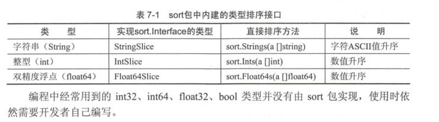

# 常见的类型的便捷排序

通过事先sort.Interface接口的排序过程具有很强的可定制性，可以根据被排序对象比较复杂的特性进行定制。

## 1.字符串切片的便捷排序


sort包中又一个StringSlice类型，定义如下：
```go
type StringSlice []string

func (p StringSlice) Len() int           { return len(p) }
func (p StringSlice) Less(i, j int) bool { return p[i] < p[j] }
func (p StringSlice) Swap(i, j int)      { p[i], p[j] = p[j], p[i] }

// Sort is a convenience method.
func (p StringSlice) Sort() { Sort(p) }
```

sort包中农的StringSlice的代码与MyStringList的实现代码几乎一样，只需要使用sort包的StringSlice就可以更简单快速地
进行字符串排序，简化后的代码如下：

```go
package main

import (
	"fmt"
	"sort"
)

func main() {

	// 准备一个内容被打乱顺序的字符串切片
	names := sort.StringSlice{
		"3. Triple Kill",
		"5. Penta Kill",
		"2. Double Kill",
		"4. Quadra Kill",
		"1. First Blood",
	}
	sort.Sort(names)
	for _, i2 := range names {
		fmt.Println(i2)
	}
}

/*
1. First Blood
2. Double Kill
3. Triple Kill
4. Quadra Kill
5. Penta Kill
 */
```

## 2.对整型切片进行排序

```go
type IntSlice []int

func (p IntSlice) Len() int           { return len(p) }
func (p IntSlice) Less(i, j int) bool { return p[i] < p[j] }
func (p IntSlice) Swap(i, j int)      { p[i], p[j] = p[j], p[i] }

// Sort is a convenience method.
func (p IntSlice) Sort() { Sort(p) }
```


sort包在sort.Interface对各类型的封装上还有更进一步的简化。下面使用sort.Strings继续对代码简化：
```go
	// 准备一个内容被打乱顺序的字符串切片
	names := []string{
		"3. Triple Kill",
		"5. Penta Kill",
		"2. Double Kill",
		"4. Quadra Kill",
		"1. First Blood",
	}
	sort.Strings(names)
	for _, i2 := range names {
		fmt.Println(i2)
	}
```

## 3.sort包内建的类型排序接口一览

