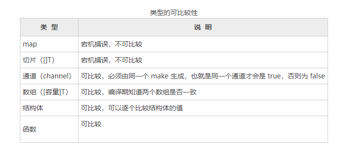

# 空接口类型

空接口是接口类型的特殊形式，空接口没有任何方法，因此任何类型都无须实现空接口。


从实现的角度看，任何值都满足这个接口的需求。因此空接口可以保存任何值，也可以从空接口中取出原值。


使用空接口保存一个数据的过程会比直接使用数据对应类型的变量保存稍慢，因此在开发中，应在需要的地方使用空接口，而不是在所有地方使用空接口。


## 1.将值保存到空接口
``` go
package main

import "fmt"

//声明 any 为 interface{} 类型的变量。
var any interface{}

func main() {
	any = 1
	fmt.Println(any)		//1

	any = "hello"
	fmt.Println(any)		//hello

	any = false
	fmt.Println(any)		//false
}
```

## 2.从空接口获取值
``` go
package main

import "fmt"

func main() {
	var a = 1
	// 声明i变量，类型为interface{},初始值为a，此时i的变量为1
	var i interface{} = a
	fmt.Println(i)			//1
	// 使用类型断言,b可以获得i变量保存的a变量的值: 1
	var b int = i.(int)
	fmt.Println(b)			//1

}
```
## 3.空接口的值比较

### 3.1 类型不同的空接口间的比较结果不相同
``` go
package main

import "fmt"

func main() {
	// a保存整型
	var a interface{} = 100

	// b保存字符串
	var b interface{} = "str"

	// 两个接口不相等
	fmt.Println(a == b)		//fals
}

```
### 3.2 不能比较空接口中的动态值
当接口中保存有动态类型的值时，运行时将触发错误，代码如下：
``` go
var a1 interface{} = []int{10}
var a2 interface{} = []int{20}
//这里会发生崩溃
fmt.Println(a1 == a2)
```

### 3.3 类型的可比较性

类型的可比较性

可选参数：



## 4.空接口作为函数的参数

使用空接口实现可以接收任意类型的函数参数。

```go
package main

import "fmt"

func show(a interface{}) {
	fmt.Printf("type:%T value:%v\n", a, a)
}

func justifyType(x interface{}) {
	switch v := x.(type) {
	case string:
		fmt.Printf("x is a string，value is %v\n", v)
	case int:
		fmt.Printf("x is a int is %v\n", v)
	case bool:
		fmt.Printf("x is a bool is %v\n", v)
	default:
		fmt.Println("unsupport type！")
	}
}

func main() {
	var arrAge  = [5]int{18, 20, 15, 22, 16}
	a := make([]int, 2)
	show("hujianli")
	show(17)
	show(false)
	show(1.222)
	show(arrAge)
	show(a)

	fmt.Println("---------------------------------------------------")
	justifyType("string")
	justifyType(18)
	justifyType(19.999)
	justifyType(false)
}
```

## 5.空接口作为map的值

使用空接口实现可以保存任意值的字典。

```go
package main

import "fmt"

func main() {
	var studentInfo = make(map[string]interface{})
	studentInfo["name"] = "李白"
	studentInfo["age"] = 18
	studentInfo["married"] = false
	fmt.Println(studentInfo)
}
```


### 5.1 示例：使用空接口实现可以保存任意值的字典

空接口可以保存任何类型这个特性可以方便地用于容器的设计。下面例子：

使用map和interface{}实现一个字典。
字典在其他语言中的功能和map类型，可以将任意的值做成键值对保存，然后进行找回、遍历操作。

#### 1.值设置和获取
``` go
package main

//字典结构
type Dictionary struct {
	data map[interface{}]interface{} //键值都为interface{}类型
}

//根据键获取值,类方法为Get，返回值为一个接口
func (d *Dictionary) Get(key interface{}) interface{} {
	return d.data[key]			// 通过map直接获取值，如果键不存在，将返回nill。
}

// 设置键值
func (d *Dictionary) Set(key interface{}, value interface{}) {
	d.data[key] = value			// 通过map设置键值。
}

```
#### 2.遍历字段的索引键值关联数据
每个容器都有遍历操作，遍历时，需要提供一个回调返回需要遍历的数据。
为了方便在必要时终止遍历操作，可以将回调的返回值设置为bool类型。外部逻辑在回调中不需要遍历时直接返回false即可终止遍历。

``` go
// 定义回调函数，func(k, v interface{}) bool 意思是返回键值数据(k,v)
func (d *Dictionary) Visit(callback func(k, v interface{}) bool) {
	if callback == nil {
		return
	}
	//遍历字典结构的 data 成员，也就是遍历 map 的所有元素。
	for k, v := range d.data {
		if !callback(k, v) {
			//根据 callback 的返回值，决定是否继续遍历
			return
		}
	}
}
```


#### 3.初始化和清除
``` go
// 清空所有的数据，map没有独立的复位内部元素的操作，需要复位元素时，使用 make 创建新的实例。
func (d *Dictionary) Clear() {
	d.data = make(map[interface{}]interface{})

}

// 创建一个字典
func NewDictionary() *Dictionary {
	d := &Dictionary{}

	//初始化map,在初始化时调用 Clear 进行 map 初始化操作
	d.Clear()
	return d
}
```

#### 4.使用字典
``` go
func main() {
	// 创建字典实例
	dict := NewDictionary()
	dict.Set("hujianli1", 100)
	dict.Set("hujianli2", 110)
	dict.Set("hujianli3", 120)

	// 获取值并打印
	favorite := dict.Get("hujianli2")
	fmt.Println("favorite: ", favorite)

	// 遍历所有的字典元素
	dict.Visit(func(k, v interface{}) bool {
		// 将值转为int型，判断大小
		if v.(int) > 100 {
			// 输出"很贵"
			fmt.Println(k, "is expensive")
			return true
		}
		// 默认输出 "很便宜"
		fmt.Println(k,"is cheap")
		return true
	})

}

/*
favorite:  110
hujianli3 is expensive
hujianli1 is cheap
hujianli2 is expensive
 */
```
