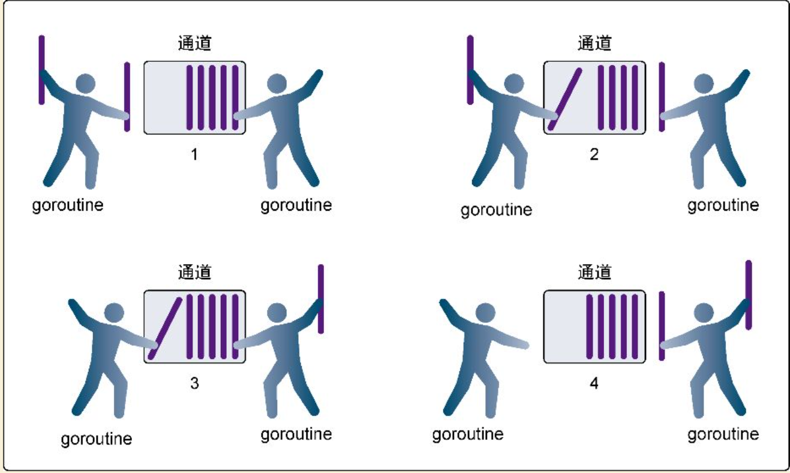

# 带缓冲的通道

Go语言中有缓冲的通道（buffered channel）是一种在被接收前能存储一个或者多个值的通道。这种类型的通道并不强制要求 goroutine 之间必须同时完成发送和接收。通道会阻塞发送和接收动作的条件也会不同。只有在通道中没有要接收的值时，接收动作才会阻塞。只有在通道没有可用缓冲区容纳被发送的值时，发送动作才会阻塞。

这导致有缓冲的通道和无缓冲的通道之间的一个很大的不同：
无缓冲的通道保证进行发送和接收的 goroutine 会在同一时间进行数据交换；
有缓冲的通道没有这种保证。

在无缓冲通道的基础上，为通道增加一个有限大小的存储空间形成带缓冲通道。
带缓冲通道在发送时无需等待接收方接收即可完成发送过程，并且不会发生阻塞，只有当存储空间满时才会发生阻塞。
同理，如果缓冲通道中有数据，接收时将不会发生阻塞，直到通道中没有数据可读时，通道将会再度阻塞。

无缓冲通道保证收发过程同步。无缓冲收发过程类似于快递员给你电话让你下楼取快递，整个递交快递的过程是同步发生的，你和快递员不见不散。但这样做快递员就必须等待所有人下楼完成操作后才能完成所有投递工作。如果快递员将快递放入快递柜中，并通知用户来取，快递员和用户就成了异步收发过程，效率可以有明显的提升。带缓冲的通道就是这样的一个"快递柜"。




- 有缓冲的通道(buffered channel)是一种在被接收前能存储一个或者多个值的通道。

这种类型的通道并不强制要求goroutine之间必须同时完成发送和接收。通道会阻塞发送和接收动作的条件也会不同。
只有在通道中没有要接收的值时，接收动作才会阻塞。只有在通道没有可用缓冲区容纳被发送的值时，发送动作才会阻塞。


## 1.创建带缓冲的通道
如何创建带缓冲的通道呢？参见如下代码：
```
通道实例:=make(chan 通道类型,缓冲大小)

· 通道类型：和无缓冲通道用法一致，影响通道发送和接收的数据类型
· 缓冲大小： 决定通道最多可以保存的元素数量。
· 通道实例：被创建出的通道实例。
```

```go
func main() {
	ch := make(chan int, 1) // 创建一个容量为1的有缓冲区通道
	ch <- 10
	fmt.Println("发送成功")
}
```


下面通过一个例子中来理解带缓冲通道的用法，参见下面代码：

``` go
package main

import "fmt"

func main() {
	// 创建一个3个元素缓冲大小的整型通道
	ch := make(chan int, 3)
	// 查看当前通道的大小
	fmt.Println(len(ch)) //0

	// 发送3个整型元素到通道
	ch <- 1
	ch <- 2
	ch <- 3

	//查看当前通道的大小
	fmt.Println(len(ch)) //3

}

```

## 2.阻塞条件
带缓冲通道在很多特性上和无缓冲通道是类似的。
无缓冲通道可以看作是长度永远为0的带缓冲通道。
因此根据这个特性，带缓冲通道在下面列举的情况下依然会发生阻塞：

- 带缓冲通道被填满时，尝试再次发送数据时发生阻塞。
- 带缓冲通道为空时，尝试接收数据时发生阻塞。

就像你小区的快递柜只有那么个多格子，格子满了就装不下了，就阻塞了，等到别人取走一个快递员就能往里面放一个。


为什么Go语言对通道要限制长度而不提供无限长度的通道？

我们知道通道（channel）是在两个goroutine间通信的桥梁。
使用goroutine的代码必然有一方提供数据，一方消费数据。
当提供数据一方的数据供给速度大于消费方的数据处理速度时，如果通道不限制长度，那么内存将不断膨胀直到应用崩溃。
因此，限制通道的长度有利于约束数据提供方的供给速度，供给数据量必须在消费方处理量+通道长度的范围内，才能正常地处理数据。


## 3.示例-同时接收和发送(带缓冲)
``` go
package main

import (
	"fmt"
	"time"
)

/*
可以建立带缓冲区的 channel
c := make(chan int,1024)
*/

func main() {
	c := make(chan int, 10) // 使用带缓冲区的channel
	go send(c)
	go recv(c)
	time.Sleep(3 * time.Second)
	close(c)
}

// 只能向chan里send数据
func send(c chan<- int) {
	for i := 0; i < 10; i++ {
		fmt.Println("send readey", i)
		c <- i
		fmt.Println("send", i)
	}
}

// 只能接收channel中的数据
func recv(c <-chan int) {
	for i := range c {
		fmt.Println("received", i)
		fmt.Println("--------------------------------------------------")
		fmt.Printf("The remaining data in the channel is %d \n", len(c))
		fmt.Println("--------------------------------------------------")
	}
}
```


让我们看一个使用有缓冲的通道的例子，这个例子管理一组goroutine来接收并完成工作。
有缓冲的通道提供了一种清晰而直观的方式来实现这个功能。

```go
// This sample program demonstrates how to use a buffered
// channel to work on multiple tasks with a predefined number
// of goroutines.
package main

import (
	"fmt"
	"math/rand"
	"sync"
	"time"
)

const (
	numberGoroutines = 4  // Number of goroutines to use.
	taskLoad         = 10 // Amount of work to process.
)

// wg is used to wait for the program to finish.
var wg sync.WaitGroup

// init is called to initialize the package by the
// Go runtime prior to any other code being executed.
func init() {
	// Seed the random number generator.
	rand.Seed(time.Now().Unix())
}

// main is the entry point for all Go programs.
func main() {
	// 创建了一个string 类型的有缓冲的通道，缓冲的容量是10
	tasks := make(chan string, taskLoad)

	// 代表创建了4个工作goroutine。
	wg.Add(numberGoroutines)
	for gr := 1; gr <= numberGoroutines; gr++ {
        // 创建了4个goroutine，并传入用来接收工作的通道。
		go worker(tasks, gr)
	}

	// Add a bunch of work to get done.
	for post := 1; post <= taskLoad; post++ {
		tasks <- fmt.Sprintf("Task : %d", post)
	}

　　 // 当所有工作都处理完时关闭通道
　　 // 以便所有goroutine退出
	close(tasks)

	// Wait for all the work to get done.
	wg.Wait()
}

// worker is launched as a goroutine to process work from
// the buffered channel.
func worker(tasks chan string, worker int) {
	// Report that we just returned.
	defer wg.Done()
	
    // 在这个循环里，会处理所有接收到的工作。
	for {
		//每个goroutine都会在这行阻塞，等待从通道里接收新的工作。.
		task, ok := <-tasks
        //一旦接收到返回，就会检查ok 标志，看通道是否已经清空而且关闭。如果ok 的值是false ，goroutine就会终止，
		if !ok {
			// This means the channel is empty and closed.
			fmt.Printf("Worker: %d : Shutting Down\n", worker)
			return
		}

		// Display we are starting the work.
		fmt.Printf("Worker: %d : Started %s\n", worker, task)

		// Randomly wait to simulate work time.
		sleep := rand.Int63n(100)
		time.Sleep(time.Duration(sleep) * time.Millisecond)

		// Display we finished the work.
		fmt.Printf("Worker: %d : Completed %s\n", worker, task)
	}
}

```


## 4. 带缓存通道示例

无缓存耗时8s

```go
/*
 * @Descripttion:
 * @version:
 * @Author: hujianli
 * @Date: 2022-07-03 16:06:52
 * @LastEditors: hujianli
 * @LastEditTime: 2022-07-03 16:12:13
 */
package main

import (
	"fmt"
	"time"
)

func sendLetters(channel chan string) {
	time.Sleep(time.Second)
	channel <- "a"
	time.Sleep(time.Second)
	channel <- "b"
	time.Sleep(time.Second)
	channel <- "c"
	time.Sleep(time.Second)
	channel <- "d"
}

func main() {
	fmt.Println(time.Now())
	channel1 := make(chan string)
	go sendLetters(channel1)
	time.Sleep(time.Second * 5)
	fmt.Println(<-channel1, time.Now())
	fmt.Println(<-channel1, time.Now())
	fmt.Println(<-channel1, time.Now())
	fmt.Println(<-channel1, time.Now())
	fmt.Println(time.Now())
	// 总共花费了8s
}
```

有缓存耗时5s

```go
/*
 * @Descripttion:
 * @version:
 * @Author: hujianli
 * @Date: 2022-07-03 16:06:52
 * @LastEditors: hujianli
 * @LastEditTime: 2022-07-03 16:14:00
 */
package main

import (
	"fmt"
	"time"
)

func sendLetters(channel chan string) {
	time.Sleep(time.Second)
	channel <- "a"
	time.Sleep(time.Second)
	channel <- "b"
	time.Sleep(time.Second)
	channel <- "c"
	time.Sleep(time.Second)
	channel <- "d"
}

func main() {
	fmt.Println(time.Now())
	// channel1 := make(chan string, 1) // 总共花费了7s
	channel1 := make(chan string, 3) // 总共花费了5s
	go sendLetters(channel1)
	time.Sleep(time.Second * 5) // 让主进程休眠5s
	fmt.Println(<-channel1, time.Now())
	fmt.Println(<-channel1, time.Now())
	fmt.Println(<-channel1, time.Now())
	fmt.Println(<-channel1, time.Now())
	fmt.Println(time.Now())
}
```


## 5.小结

- 并发是指goroutine运行的时候是相互独立的。

- 使用关键字`go` 创建goroutine来运行函数。

- goroutine在逻辑处理器上执行，而逻辑处理器具有独立的系统线程和运行队列。

- 竞争状态是指两个或者多个goroutine试图访问同一个资源。

- 原子函数和互斥锁提供了一种防止出现竞争状态的办法。

- 通道提供了一种在两个goroutine之间共享数据的简单方法。

- 无缓冲的通道保证同时交换数据，而有缓冲的通道不做这种保证。