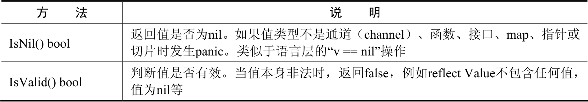

```
package main

import (
   "fmt"
   "reflect"
)

func main() {
   var a int

   // 取变量a的反射类型对象
   typeOfA := reflect.TypeOf(a)

   // 根据反射类型对象创建类型实例
   aIns := reflect.New(typeOfA)

   // 输出Value的类型和种类
   fmt.Println(aIns.Type(), aIns.Kind())
}
```

# 反射


## 1.反射

反射是指在程序运行期对程序本身进行访问和修改的能力。程序在编译时，变量被转换为内存地址，变量名不会被编译器写入到可执行部分。在运行程序时，程序无法获取自身的信息。

支持反射的语言可以在程序编译期将变量的反射信息，如字段名称、类型信息、结构体信息等整合到可执行文件中，并给程序提供接口访问反射信息，这样就可以在程序运行期获取类型的反射信息，并且有能力修改它们。


Go程序在运行期使用reflect包访问程序的反射信息。

提示：C/C++语言没有支持反射功能，只能通过typeid提供非常弱化的程序运行时类型信息。Java、C#等语言都支持完整的反射功能。

Lua、JavaScript类动态语言，由于其本身的语法特性就可以让代码在运行期访问程序自身的值和类型信息，因此不需要反射系统。

Go程序的反射系统无法获取到一个可执行文件空间中或者是一个包中的所有类型信息，需要配合使用标准库中对应的词法、语法解析器和抽象语法树（AST）对源码进行扫描后获得这些信息。


## 2. 反射的类型对象（reflect.Type）

在Go程序中，使用reflect.TypeOf()函数可以获得任意值的类型对象（reflect.Type），程序通过类型对象可以访问任意值的类型信息。下面通过例子来理解获取类型对象的过程：

```go
package main

import (
	"fmt"
	"reflect"
)

func main() {

	var a int
	typeOfA := reflect.TypeOf(a)
    // 通过typeOfA类型对象的成员函数，可以分别获取到typeOfA变量的类型名为int，种类（Kind）为int。
	fmt.Println(typeOfA.Name(),typeOfA.Kind())

}
```

代码输出如下：

```
int int
```


### 2.1 理解反射的类型(Type)与种类(Kind)

在使用反射时，需要首先理解类型（Type）和种类（Kind）的区别。编程中，使用最多的是类型，但在反射中，当需要区分一个大品种的类型时，就会用到种类（Kind）。

例如，需要统一判断类型中的指针时，使用种类（Kind）信息就较为方便。

#### 1 反射种类(Kind)的定义

Go程序中的类型（Type）指的是系统原生数据类型，

如int、string、bool、float32等类型，以及使用type关键字定义的类型，这些类型的名称就是其类型本身的名称。

例如使用type A struct{}定义结构体时，A就是struct{}的类型。

种类（Kind）指的是对象归属的品种，在reflect包中有如下定义：

```go
type Kind uint

const (
        Invalid Kind = iota                                 // 非法类型
        Bool                                                // 布尔型
        Int                                                 // 有符号整型
        Int8                                                // 有符号8位整型
        Int16                                               // 有符号16位整型
        Int32                                               // 有符号32位整型
        Int64                                               // 有符号64位整型
        Uint                                                // 无符号整型
        Uint8                                               // 无符号8位整型
        Uint16                                              // 无符号16位整型
        Uint32                                              // 无符号32位整型
        Uint64                                              // 无符号64位整型
        Uintptr                                             // 指针
        Float32                                             // 单精度浮点数
        Float64                                             // 双精度浮点数
        Complex64                                           // 64位复数类型
        Complex128                                          // 128位复数类型
        Array                                               // 数组
        Chan                                                // 通道
        Func                                                // 函数
        Interface                                           // 接口
        Map                                                 // 映射
        Ptr                                                 // 指针
        Slice                                               // 切片
        String                                              // 字符串
        Struct                                              // 结构体
        UnsafePointer                                       // 底层指针
)
```

Map、Slice、Chan属于引用类型，使用起来类似于指针，但是在种类常量定义中仍然属于独立的种类，不属于Ptr。

`type A struct{}定义的结构体属于Struct种类，*A属于Ptr`。

#### 2 从类型对象中获取类型名称和种类的例子

Go语言中的类型名称对应的反射获取方法是reflect.Type中的Name()方法，返回表示类型名称的字符串。

类型归属的种类（Kind）使用的是reflect.Type中的Kind()方法，返回reflect.Kind类型的常量。

下面的代码中会对常量和结构体进行类型信息获取。

```go
package main

import (
	"fmt"
	"reflect"
)

// 定义一个Enum类型
type Enum int

const (
	Zero  Enum = 0
)

func main() {
	// 声明一个空结构体
	type cat struct {
	}

	// 获取结构体实例的反射类型对象
	typeOfCat := reflect.TypeOf(cat{})

	// 显示反射类型对象的名称和种类
	fmt.Println(typeOfCat.Name(), typeOfCat.Kind())

	// 获取Zero常量的反射类型对象
	typeOfA := reflect.TypeOf(Zero)

	// 显示反射类型对象的名称和种类
	fmt.Println(typeOfA.Name(), typeOfA.Kind())

}

```

代码输出如下：

```
cat struct
Enum int
```


### 2.2 指针与指针指向的元素

Go程序中对指针获取反射对象时，可以通过reflect.Elem()方法获取这个指针指向的元素类型。

这个获取过程被称为取元素，等效于对指针类型变量做了一个"*"操作，代码如下：

```go
package main

import (
	"fmt"
	"reflect"
)

func main() {
	// 声明一个空结构体
	type cat struct {
	}

	// 创建cat的实例
	ins := &cat{}

	// 获取结构体实例的反射类型对象
	typeOfCat := reflect.TypeOf(ins)

	// 显示反射类型对象的名称和种类
	// 输出指针变量的类型名称和种类。Go语言的反射中对所有指针变量的种类都是Ptr，但注意，指针变量的类型名称是空，不是*cat。
	fmt.Printf("name:'%v' kind:'%v'\n", typeOfCat.Name(), typeOfCat.Kind())

	// 取类型的元素
	// 取指针类型的元素类型，也就是cat类型。这个操作不可逆，不可以通过一个非指针类型获取它的指针类型。
	typeOfCat = typeOfCat.Elem()

	// 显示反射类型对象的名称和种类
	fmt.Printf("element name: '%v', element kind: '%v'\n", typeOfCat.Name(), typeOfCat.Kind())

}
```

### 2.3 获取结构体的成员类型

任意值通过reflect.TypeOf()获得反射对象信息后，如果它的类型是结构体，可以通过反射值对象（reflect.Type）的NumField()和Field()方法获得结构体成员的详细信息。

与成员获取相关的reflect.Type的方法如表:

结构体成员访问的方法列表


#### 1 结构体字段类型

reflect.Type的Field()方法返回StructField结构，这个结构描述结构体的成员信息，通过这个信息可以获取成员与结构体的关系，如偏移、索引、是否为匿名字段、结构体标签（Struct Tag）等，而且还可以通过StructField的Type字段进一步获取结构体成员的类型信息。StructField的结构如下：

```go
type StructField struct {
        Name string                                  // 字段名
        PkgPath string                               // 字段路径
        Type      Type                               // 字段反射类型对象
        Tag       StructTag                          // 字段的结构体标签
        Offset    uintptr                            // 字段在结构体中的相对偏移
        Index     []int                              // Type.FieldByIndex中的返回的索引值
        Anonymous bool                               // 是否为匿名字段
}
```

字段说明如下。

- Name：为字段名称。
- PkgPath：字段在结构体中的路径
- Type：字段本身的反射类型对象，类型为reflect.Type，可以进一步获取字段的类型信息。
- Tag：结构体标签，为结构体字段标签的额外信息，可以单独提取。
- Index：FieldByIndex中的索引顺序。
- Anonymous：表示该字段是否为匿名字段。


#### 2 获取成员反射信息

下面代码中，实例化一个结构体并遍历其结构体成员，再通过reflect.Type的FieldByName()方法查找结构体中指定名称的字段，直接获取其类型信息。

```go
package main

import (
	"fmt"
	"reflect"
)

func main() {
	// 声明一个空结构体
	type cat struct {
		Name string

		// 带有结构体tag的字段
		Type int `json:"type" id:"100"`
	}

	// 创建cat的实例
	ins := cat{Name: "mimi", Type: 1}

	// 获取结构体实例的反射类型对象
	typeOfCat := reflect.TypeOf(ins)

	// 遍历结构体所有成员
	for i := 0; i < typeOfCat.NumField(); i++ {
		// 获取每个成员的结构体字段类型
		fieldType := typeOfCat.Field(i)
		// 输出成员名和tag
		fmt.Printf("name: %v  tag: '%v'\n", fieldType.Name, fieldType.Tag)
	}

	// 通过字段名，找到字段类型信息
	if catType, ok := typeOfCat.FieldByName("Type"); ok {
		// 从tag中取出需要的tag
		fmt.Println(catType.Tag.Get("json"), catType.Tag.Get("id"))
	}

}
```

代码输出如下：

```
name: Name  tag: ''
name: Type  tag: 'json:"type" id:"100"'
type 100
```


### 2.4. 结构体标签

通过reflect.Type获取结构体成员信息reflect.StructField结构中的Tag被称为结构体标签（Struct Tag）。

JSON、BSON等格式进行序列化及对象关系映射（Object Relational Mapping，简称ORM）系统都会用到结构体标签，这些系统使用标签设定字段在处理时应该具备的特殊属性和可能发生的行为。这些信息都是静态的，无须实例化结构体，可以通过反射获取到。

提示：结构体标签（Struct Tag）类似于C#中的特性（Attribute）。C#允许在类、字段、方法等前面添加Attribute，然后在反射系统中可以获取到这个属性系统。例如：

```
[Conditional("DEBUG")]
public static void Message(string msg)
{
        Console.WriteLine(msg)；
}
```


#### 1 结构体标签的格式

Tag在结构体字段后方书写的格式如下：

```
`key1:"value1" key2:"value2"`
```

结构体标签由一个或多个键值对组成。键与值使用冒号分隔，值用双引号括起来。键值对之间使用一个空格分隔。

#### 2 从结构体标签中获取值

StructTag拥有一些方法，可以进行Tag信息的解析和提取，如下所示。

- func(tag StructTag)Get(key string)string：根据Tag中的键获取对应的值，例如`key1:"value1"key2:"value2"`的Tag中，可以传入“key1”获得“value1”。
- func(tag StructTag)Lookup(key string)(value string,ok bool)：根据Tag中的键，查询值是否存在。


#### 3. 结构体标签格式错误导致的问题

编写Tag时，必须严格遵守键值对的规则。结构体标签的解析代码的容错能力很差，一旦格式写错，编译和运行时都不会提示任何错误，参见下面这个例子：

```go
package main

import (
	"fmt"
	"reflect"
)

func main() {
	// 声明一个空结构体
	type cat struct {
		Name string

		// 带有结构体tag的字段
         // 在json:和＂type＂之间增加了一个空格。这种写法没有遵守结构体标签的规则，因此无法通过Tag.Get获取到正确的json对应的值。
		Type int `json: "type" id:"100"`
	}

	typeOfCat := reflect.TypeOf(cat{})

	if catType, ok := typeOfCat.FieldByName("Type"); ok {
		fmt.Println(catType.Tag.Get("json"))
	}

}
```

代码输出空字符串，并不会输出期望的type。

这个错误在开发中非常容易被疏忽，造成难以察觉的错误。


## 3.反射的值对象(reflect.Value)

反射不仅可以获取值的类型信息，还可以动态地获取或者设置变量的值。Go语言中使用reflect.Value获取和设置变量的值。

### 3.1 使用反射值对象包装任意值

Go语言中，使用reflect.ValueOf()函数获得值的反射值对象(reflect.Value)。书写格式如下：

```
value := reflect.ValueOf(rawValue)
```

reflect.ValueOf返回reflect.Value类型，包含有rawValue的值信息。

reflect.Value与原值间可以通过值包装和值获取互相转化。reflect.Value是一些反射操作的重要类型，如反射调用函数。


### 3.2 从反射值对象获取被包装的值

Go语言中可以通过reflect.Value重新获得原始值。

#### 1.从反射值对象(reflect.Value)中获取值的方法

可以通过下面几种方法从反射值对象reflect.Value中获取原值，如表

反射值获取原始值的方法


#### 2.从反射值对象(reflect.Value)中获取值的例子

下面代码中，将整型变量中的值使用reflect.Value获取反射值对象(reflect.Value)。

再通过reflect.Value的Interface()方法获得interface{}类型的原值，通过int类型对应的reflect.Value的Int()方法获得整型值。

```go
package main

import (
	"fmt"
	"reflect"
)

func main() {
	// 声明整型变量a并赋初值
	var a int = 1024

	// 获取变量a的反射值对象
	valueOfA := reflect.ValueOf(a)

	// 获取interface{}类型的值，通过类型断言转换
    // 将valueOfA反射值对象以interface{}类型取出，通过类型断言转换为int类型并赋值给getA。
	var getA int = valueOfA.Interface().(int)

	// 获取64位的值，强制类型转换为int类型
    // 将valueOfA反射值对象通过Int方法，以int64类型取出，通过强制类型转换，转换为原本的int类型。
	var getA2 int = int(valueOfA.Int())

	fmt.Println(getA, getA2)

}
```

代码输出如下：

```
1024 1024
```


### 3.3 使用反射访问结构体的成员字段的值

反射值对象(reflect.Value)提供对结构体访问的方法，通过这些方法可以完成对结构体任意值的访问，如表

反射值对象的成员访问方法


下面代码构造一个结构体包含不同类型的成员。通过reflect.Value提供的成员访问函数，可以获得结构体值的各种数据。

```go
package main

import (
	"fmt"
	"reflect"
)

// 定义结构体
type dummy struct {
	a int
	b string
	// 嵌入字段
	float32
	bool
	next *dummy
}

func main() {
	// 值包装结构体
	d := reflect.ValueOf(dummy{
		next: &dummy{},
	})

	// 获取字段数量
	fmt.Println("NumField", d.NumField())

	// 获取索引为2的字段（float32字段）
	floatField := d.Field(2)

	// 输出字段类型
	fmt.Println("Field", floatField.Type())

	// 根据名字查找字段
	fmt.Println("FieldByName(\"b\").Type", d.FieldByName("b").Type())

	// 根据索引查找值中，next字段的int字段的值
    // []int{4,0}中的4表示，在dummy结构中索引值为4的成员，也就是next。next的类型为dummy，也是一个结构体，因此使用[]int{4,0}中的0继续在next值的基础上索引，结构为dummy中索引值为0的a字段，类型为int。
	fmt.Println("FieldByIndex([]int{4, 0}).Type()", d.FieldByIndex([]int{4, 0}).Type())

}

```

代码输出如下

```
NumField 5
Field float32
FieldByName("b").Type string
FieldByIndex([]int{4, 0}).Type() int
```


### 3.4 反射对象的空和有效性判断

反射值对象（reflect.Value）提供一系列方法进行零值和空判定，如表



下面的例子将会对各种方式的空指针进行IsNil和IsValid的返回值判定检测。同时对结构体成员及方法查找map键值对的返回值进行IsValid判定，参考代码

```go
package main

import (
	"fmt"
	"reflect"
)

func main() {

	// *int的空指针
	var a *int
	fmt.Println("var a *int:", reflect.ValueOf(a).IsNil())

	// nil值
	fmt.Println("nil:", reflect.ValueOf(nil).IsValid())

	// *int类型的空指针
	fmt.Println("(*int)(nil):", reflect.ValueOf((*int)(nil)).Elem().IsValid())

	// 实例化一个结构体
	s := struct{}{}

	// 尝试从结构体中查找一个不存在的字段
	fmt.Println("不存在的结构体成员:", reflect.ValueOf(s).FieldByName("").IsValid())

	// 实例化一个map
	m := map[int]int{}

	// 尝试从map中查找一个不存在的键
	fmt.Println("不存在的键：", reflect.ValueOf(m).MapIndex(reflect.ValueOf(3)).IsValid())
}

```

IsNil常被用于判断指针是否为空；IsValid常被用于判定返回值是否有效。

代码输出如下：

```
var a *int: true
nil: false
(*int)(nil): false
不存在的结构体成员: false
不存在的结构体方法: false
不存在的键： false
```

### 3.5 使用反射值对象修改变量的值

使用reflect.Value对包装的值进行修改时，需要遵循一些规则。如果没有按照规则进行代码设计和编写，轻则无法修改对象值，重则程序在运行时会发生宕机。


#### 1.判定及获取元素的相关方法

使用reflect.Value取元素、取地址及修改值的属性方法请参考表

反射值对象的判定及获取元素的方法


#### 2.值修改相关方法

使用reflect.Value修改值的相关方法如表

反射值对象修改值的方法


以上方法，在reflect.Value的CanSet返回false仍然修改值时会发生宕机。

在已知值的类型时，应尽量使用值对应类型的反射设置值。

#### 3.值可修改条件之一：可被寻址

通过反射修改变量值的前提条件之一：这个值必须可以被寻址。简单地说就是这个变量必须能被修改。示例代码如下：

```go
package main

import "reflect"

func main() {
	// 声明整型变量a并赋初值
	var a int = 1024

	// 获取变量a的反射值对象
	valueOfA := reflect.ValueOf(a)

	// 尝试将a修改为1（此处会发生崩溃）
	valueOfA.SetInt(1)
}

```

程序运行崩溃，打印错误：

```
panic: reflect: reflect.Value.SetInt using unaddressable value
```

报错意思是：SetInt正在使用一个不能被寻址的值。从reflect.ValueOf传入的是a的值，而不是a的地址，这个reflect.Value当然是不能被寻址的。将代码修改一下，重新运行：

```go
package main

import (
	"fmt"
	"reflect"
)

func main() {
	// 声明整型变量a并赋初值
	var a int = 1024

	// 获取变量a的反射值对象（a的地址）
	valueOfA := reflect.ValueOf(&a)

	// 取出a地址的元素（a的值）
	// 使用reflect.Value类型的Elem()方法获取a地址的元素，也就是a的值。reflect.Value的Elem()方法返回的值类型也是reflect.Value。
	valueOfA = valueOfA.Elem()

	// 尝试将a修改为1
	// 此时valueOfA表示的是a的值且可以寻址。使用SetInt()方法设置值时不再发生崩溃。
	valueOfA.SetInt(1)

	// 打印a的值
	fmt.Println(valueOfA.Int())
}

```

代码输出如下：

```
1
```

提示：当reflect.Value不可寻址时，使用Addr()方法也是无法取到值的地址的，同时会发生宕机。

虽然说reflect.Value的Addr()方法类似于语言层的“&”操作；Elem()方法类似于语言层的“*”操作，但并不代表这些方法与语言层操作等效。

#### 4.值可修改条件之一：被导出

结构体成员中，如果字段没有被导出，即便不使用反射也可以被访问，但不能通过反射修改，代码如下：

```go
package main

import "reflect"

func main() {
	type dog struct {
		legCount int
	}

	// 获取dog实例的反射值对象
	valueOfDog := reflect.ValueOf(dog{})

	// 获取legCount字段的值
	vLegCount := valueOfDog.FieldByName("legCount")

	// 尝试设置legCount的值（这里会发生崩溃）
	vLegCount.SetInt(4)
}

```

程序发生崩溃，报错：

```
panic: reflect: reflect.Value.SetInt using value obtained using unexported 
field
```

报错的意思是：SetInt()使用的值来自于一个未导出的字段。

为了能修改这个值，需要将该字段导出。将dog中的legCount的成员首字母大写，导出LegCount让反射可以访问，修改后的代码如下：

```go
type dog struct {
    LegCount int
}
```

然后根据字段名获取字段的值时，将字符串的字段首字母大写，修改后的代码如下：

```go
package main

import "reflect"

func main() {
	type dog struct {
		LegCount int
	}

	// 获取dog实例的反射值对象
	valueOfDog := reflect.ValueOf(dog{})

	// 获取legCount字段的值
	vLegCount := valueOfDog.FieldByName("LegCount")

	// 尝试设置legCount的值（这里会发生崩溃）
	vLegCount.SetInt(4)
}
```

再次运行程序，发现仍然报错：

```
panic: reflect: reflect.Value.SetInt using unaddressable value
```

这个错误表示构造的valueOfDog这个结构体实例不能被寻址，因此其字段也不能被修改。

修改代码，取结构体的指针，再通过reflect.Value的Elem()方法取到值的反射值对象。修改后的完整代码如下：

```go
package main

import (
	"fmt"
	"reflect"
)

func main() {
	type dog struct {
		LegCount int
	}

	// 获取dog实例的反射值对象
	valueOfDog := reflect.ValueOf(&dog{})

	// 取出dog实例地址的元素
	valueOfDog = valueOfDog.Elem()

	// 获取legCount字段的值
	vLegCount := valueOfDog.FieldByName("LegCount")

	// 尝试设置legCount的值（这里会发生崩溃）
	vLegCount.SetInt(4)

	fmt.Println(vLegCount.Int())
}

```

代码输出如下：

```
4
```

值的修改从表面意义上叫可寻址，换一种说法就是值必须“可被设置”。那么，想修改变量值，一般的步骤是：

（1）取这个变量的地址或者这个变量所在的结构体已经是指针类型。

（2）使用reflect.ValueOf进行值包装。

（3）通过Value.Elem()获得指针值指向的元素值对象（Value），因为值对象（Value）内部对象为指针时，使用set设置时会报出宕机错误。

（4）使用Value.Set设置值。


### 3.6 通过类型创建类型的实例

当已知reflect.Type时，可以动态地创建这个类型的实例，实例的类型为指针。

例如reflect.Type的类型为int时，创建int的指针，即*int，代码如下：

```go
package main

import (
	"fmt"
	"reflect"
)

func main() {
	var a int

	// 取变量a的反射类型对象
	typeOfA := reflect.TypeOf(a)

	// 根据反射类型对象创建类型实例
    // 使用reflect.New()函数传入变量a的反射类型对象，创建这个类型的实例值，值以reflect.Value类型返回。
    // 这步操作等效于：new(int) 因此返回的是*int类型的实例。
	aIns := reflect.New(typeOfA)

	// 输出Value的类型和种类
    // 打印aIns的类型为*int，种类为指针。
	fmt.Println(aIns.Type(), aIns.Kind())
}

```

代码输出如下：

```
*int ptr
```


### 3.7 使用反射调用函数

如果反射值对象（reflect.Value）中值的类型为函数时，可以通过reflect.Value调用该函数。

使用反射调用函数时，需要将参数使用反射值对象的切片[]reflect.Value构造后传入Call()方法中，调用完成时，函数的返回值通过[]reflect.Value返回。

下面的代码声明一个加法函数，传入两个整型值，返回两个整型值的和。

将函数保存到反射值对象（reflect.Value）中，然后将两个整型值构造为反射值对象的切片（[]reflect.Value），使用Call()方法进行调用。

```go
package main

import (
	"fmt"
	"reflect"
)

// 普通函数
func add(a,b int) int {
	return a+b
}

func main() {
	// 将函数包装为反射值对象
	funcValue := reflect.ValueOf(add)


	// 构造函数参数，传入两个整型值
	// 将10和20两个整型值使用reflect.ValueOf包装为reflect.Value，再将反射值对象的切片[]reflect.Value作为函数的参数。
	paramList := []reflect.Value{reflect.ValueOf(10), reflect.ValueOf(20)}

	// 反射调用函数
	// 使用funcValue函数值对象的Call()方法，传入参数列表paramList调用add()函数。
	retList := funcValue.Call(paramList)

	// 获取第一个返回值，取整数值
	// 调用成功后，通过retList[0]取返回值的第一个参数，使用Int取返回值的整数值。
	fmt.Println(retList[0].Int())
}

```


**提示：**

反射调用函数的过程需要构造大量的reflect.Value和中间变量，对函数参数值进行逐一检查，还需要将调用参数复制到调用函数的参数内存中。

调用完毕后，还需要将返回值转换为reflect.Value，用户还需要从中取出调用值。

因此，反射调用函数的性能问题尤为突出，不建议大量使用反射函数调用。

## 4 示例-将结构体的数据保存为JSON格式的文本数据

JSON格式是一种用途广泛的对象文本格式。在Go语言中，结构体可以通过系统提供的json.Marshal()函数进行序列化。为了演示怎样通过反射获取结构体成员及各种值的过程，下面使用反射将结构体序列化为文本数据。


### 4.1 自己动手实现

#### 1 实现思路

将结构体序列化为JSON的步骤如下：

（1）准备数据结构体。

（2）准备要序列化的结构体数据。

（3）调用序列化函数。


```go
package main

import (
	"bytes"
	"errors"
	"fmt"
	"reflect"
	"strconv"
)

// MarshalJson 这个函数其实是对writeAny()函数的一个封装，将外部的interface{}类型转换为内部的reflect.Value类型，同时构建输出缓冲，将一些复杂的操作简化，方便外部使用。
func MarshalJson(v interface{}) (string, error) {
	// 准备一个缓冲
	// 使用bytes.Buffer构建一个缓冲，这个对象类似于其他语言中的StringBuilder，在大量字符串连接时，推荐使用这个结构。
	var b bytes.Buffer

	// 将任意值转换为JSON并输出到缓冲中
	// 调用writeAny()函数，将bytes.Buffer以指针的方式传入，以方便将各种类型的数据都写入这个bytes.Buffer中。
	// 同时，将v转换为反射值对象并传入。
	if err := writeAny(&b, reflect.ValueOf(v)); err == nil {
		// 如果没有错误发生时，将bytes.Buffer的内容转换为字符串并返回。
		return b.String(), nil
	}else {
		// 发生错误时，返回空字符串结果和错误
		return "", err
	}

}
func writeAny(buff *bytes.Buffer, value reflect.Value) error {
	// 根据传入反射值对象的种类进行判断，如字符串、整型、切片及结构体。
	switch value.Kind() {
	case reflect.String:
		// 写入带有双引号括起来的字符串
		// 使用reflect.Value的String函数将传入值转换为字符串，再将字符串用双引号括起来，strconv.Quote()函数提供了比较正规的封装。
		// 最终使用bytes.Buffer的WriteString()函数，将前面输出的字符串写入缓冲中。
		buff.WriteString(strconv.Quote(value.String()))
	case reflect.Int:
		// 将整型转换为字符串并写入缓冲中
		// 当传入值为整型时，使用reflect.Value的Int()函数，将传入值转换为整型，
		// 再将整型以十进制格式使用strconv.FormatInt()函数格式化为字符串，最后写入缓冲中。
		buff.WriteString(strconv.FormatInt(value.Int(), 10))
	case reflect.Slice:
		// 使用writeSlice()函数把切片序列化为JSON操作。
		return writeSlice(buff, value)
	case reflect.Struct:
		// 使用writeStruct()函数把切片序列化为JSON操作。
		return writeStruct(buff, value)
	default:
		// 遇到不认识的种类，返回错误
		return errors.New("unsupport kind: " + value.Kind().String())
	}
	return nil
}

// 将切片转换为JSON格式并输出到缓冲中
func writeSlice(buff *bytes.Buffer, value reflect.Value) error {
	// 写入切片开始标记
	buff.WriteString("[")

	// 遍历每个切片元素
	for s := 0; s < value.Len(); s++ {
		sliceValue := value.Index(s)

		// 写入每个切片元素
		writeAny(buff, sliceValue)

		// 每个元素尾部写入逗号，最后一个字段不添加
		if s < value.Len()-1 {
			buff.WriteString(",")
		}
	}
	// 写入切片结束标记
	buff.WriteString("]")
	return nil

}

// 将结构体序列化为JSON格式并输出到缓冲中
func writeStruct(buff *bytes.Buffer, value reflect.Value) error {
	// 取值的类型对象
	// 遍历结构体获取值时，习惯性取出反射类型对象。
	valueType := value.Type()

	// 写入结构体左大括号
	buff.WriteString("{")

	// 遍历结构体的所有值
	// 根据reflect.Value的NumField()方法遍历结构体的成员值。
	for i := 0; i < value.NumField(); i++ {
		// 获取每个字段的字段值(reflect.Value)
		fieldValue := value.Field(i)

		// 获取每个字段的类型(reflect.StructField)
		// 获取每一个结构体成员的反射值对象。
		fieldType := valueType.Field(i)

		// 写入字段名左双引号
		buff.WriteString("\"")

		// 写入字段名
		buff.WriteString(fieldType.Name)

		// 写入字段名右双引号和冒号
		buff.WriteString("\":")

		// 写入每个字段值
		// 递归调用任意值序列化函数writeAny()，将fieldValue继续序列化。
		writeAny(buff, fieldValue)

		// 每个字段尾部写入逗号，最后一个字段不添加
		if i < value.NumField()-1 {
			buff.WriteString(",")
		}
	}

	// 写入结构体右大括号
	buff.WriteString("}")

	return nil
}

func main() {
	// 声明技能结构体
	type Skill struct {
		Name  string
		Level int
	}
	// 声明角色结构体
	type Actor struct {
		Name   string
		Age    int
		Skills []Skill
	}
	// 填充基本角色数据
	a := Actor{
		Name: "cow boy",
		Age:  37,
		Skills: []Skill{
			{Name: "Roll and roll", Level: 1},
			{Name: "Flash your dog eye", Level: 2},
			{Name: "Time to have Lunch", Level: 3},
		},
	}
	// 调用自己实现的MarshalJson()函数，将Actor实例化的数据转换为JSON字符串。
	if result, err := MarshalJson(a); err == nil {
		fmt.Println(result)
	}else {
		fmt.Println(err)
	}
}
```


#### 2  总结

上面例子只支持整型、字符串、切片和结构体类型序列化为JSON格式。

如果需要扩充类型，可以在writeAny()函数中添加。程序功能和结构上还有一些不足，例如：

- 没有处理各种异常情况，切片或结构体为空时应该提前判断，否则会触发宕机。

- 可以支持结构体标签（Struct Tag），方便自定义JSON的键名及忽略某些字段的序列化过程，避免这些字段被序列化到JSON中。

- 支持缩进且可以自定义缩进字符，将JSON序列化后的内容格式化，方便查看。

- 默认应该序列化为[]byte字节数组，外部自己转换为字符串。在大部分的使用中，JSON一般以字节数组方式解析、存储、传输，很少以字符串方式解析，因此避免字节数组和字符串的转换可以提高一些性能。


### 4.2 使用encoding/json包

 ```go
package main

import (
	"encoding/json"
	"fmt"
)
func main() {
	// 声明技能结构体
	type Skill struct {
		Name  string
		Level int
	}
	// 声明角色结构体
	type Actor struct {
		Name   string
		Age    int
		Skills []Skill
	}
	// 填充基本角色数据
	a := Actor{
		Name: "cow boy",
		Age:  37,
		Skills: []Skill{
			{Name: "Roll and roll", Level: 1},
			{Name: "Flash your dog eye", Level: 2},
			{Name: "Time to have Lunch", Level: 3},
		},
	}
	result, err := json.MarshalIndent(a, "", "\t")
	if err != nil {
		fmt.Println(err)
	}
	jsonStringData := string(result)
	fmt.Println(jsonStringData)
}
 ```


