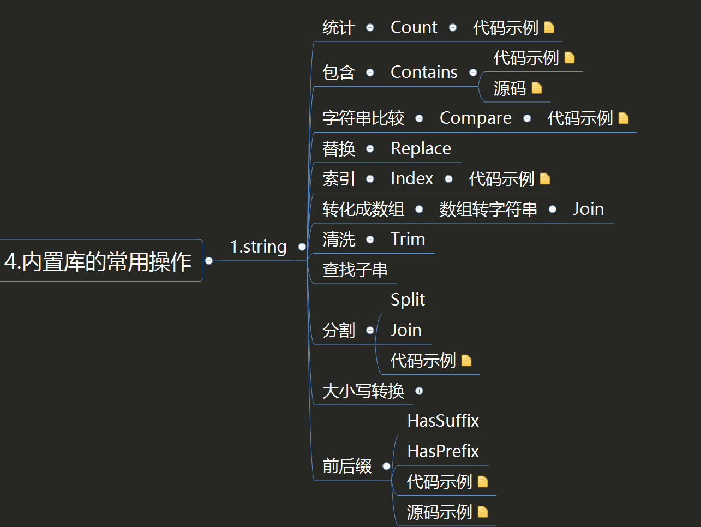

# strings


## 1.字符串的常见操作

* 包含：某个字符串是否包含另一个字符串。
* 索引：获取字符串中某个子串的第一个字符的位置。
* 清洗：去除前后的空格或者特定的字符。
* 替换：替换字符串中原有的字符。
* 分割：将字符串按特定的字符分割成字符串数组。
* 统计：统计某字符出现的次数。
* 大小写转换：转换字符串中字母的大小写。
* 前后缀：判断某个字符串是不是以另一个字符串开头或者结尾。





### 1.1 判断是否包含子字符串

```go
package main

import (
	"fmt"
	"strings"
)

const Value = "Go is an open source programming language that makes it easy....."

func StringsContains(subStrings string) bool {
	return strings.Contains(Value, subStrings)
}

func main() {
	fmt.Println(StringsContains("Go"))	//true
	fmt.Println(StringsContains("Java"))	//false
}
```

源码

```go
// Contains reports whether substr is within s.
func Contains(s, substr string) bool {
	return Index(s, substr) >= 0
}
```


### 1.2  字符串比较

字符串的比较方法是根据单个字符的ASCII编码来进行的，比如A的编码为65，B的编码为66，如果A和B作为字符串进行比较，就会返回‒1。关于字符串的比较关系，可以通过非负值来表示大于关系，负值来表示小于关系，零值来表示相等关系。

下面函数的作用是比较两个字符串的关系。相等的话，比较结果为0；前者大于后者则比较结果为1；否则为‒1。

```go
package main

import (
	"fmt"
	"strings"
)


func StringsCompare(values string, subString string) int {
	return strings.Compare(values, subString)
}

func main() {
	fmt.Println(StringsCompare("Java","Go"))	//1
	fmt.Println(StringsCompare("Go","Java"))	//-1
	fmt.Println(StringsCompare("A","B"), rune('A'),rune('B'))	//-1 65 66
}
```


### 1.3 大小写转换

```go
package main

import (
	"fmt"
	"strings"
)

func StringsToUpper(subStrings string) string  {
	return strings.ToUpper(subStrings)
}

func StringsToLower(subStrings string) string  {
	return strings.ToLower(subStrings)
}

func StringsToTitle(subStrings string) string  {
	return strings.ToTitle(subStrings)
}

func main() {
	fmt.Println(StringsToUpper("goLang, hello world"))	//GOLANG, HELLO WORLD
	fmt.Println(StringsToLower("GoLang"))	//golang
	fmt.Println(StringsToTitle("goLang, hello world"))	//GOLANG, HELLO WORLD
}
```


### 1.4 统计子串出现的次数

```go
package main

import (
	"fmt"
	"strings"
)

const Value = "Go is an open source programming language that makes it easy....."

func StringsCount(subStrings string) int  {
	return strings.Count(Value,subStrings)
}

func main() {
	fmt.Println(StringsCount("Go"))	//1
	fmt.Println(StringsCount("s"))	//4
}
```


### 1.5 字符串的前后缀

```go
package main

import (
	"fmt"
	"strings"
)

const Value = "Go is an open source programming language that makes it easy....."

// 前缀
func StringsHasPrefix(subStrings string) bool {
	return strings.HasPrefix(Value, subStrings)
}

//后缀
func StringsHasSuffix(subStrings string) bool {
	return strings.HasSuffix(Value, subStrings)
}

func main() {
	fmt.Println(StringsHasSuffix(".."))			//true
	fmt.Println(StringsHasSuffix("easy....."))	//true
	fmt.Println(StringsHasSuffix("huj....."))	//false
	fmt.Println(StringsHasPrefix("Go"))			//true
	fmt.Println(StringsHasPrefix("Java"))		//false
}
```

进行前后缀逻辑判断的源代码特别简单，就是判断字符串截取之后的子字符串是否相等，源码如下：

```go
// HasPrefix tests whether the string s begins with prefix.
func HasPrefix(s, prefix string) bool {
	return len(s) >= len(prefix) && s[0:len(prefix)] == prefix
}

// HasSuffix tests whether the string s ends with suffix.
func HasSuffix(s, suffix string) bool {
	return len(s) >= len(suffix) && s[len(s)-len(suffix):] == suffix
}
```


### 1.5 分割和连接

这两个操作是一对互逆的操作，一个是按照指定的字符分割成字符数组，另一个是按照指定的字符数组连接成字符串。

```go
package main

import (
	"fmt"
	"strings"
)

const Value = "Go is an open source, programming language, that makes it easy....."
//分割
func StringsSplit(split string) []string {
	return strings.Split(Value, split)
}

//连接
func StringsJoin(subStrings []string) string {
	return strings.Join(subStrings, " ")
}

func main() {
	fmt.Println(StringsSplit(","), len(StringsSplit(",")))	//[Go is an open source  programming language  that makes it easy.....] 3
	fmt.Println(StringsJoin([]string{"Go", "Python", "Java"}))	//Go Python Java
}
```


### 1.6 索引

这个操作获取指定字符首次出现的位置，通常用来判断子字符串在对应字符串中的位置。

```go
package main

import (
	"fmt"
	"strings"
)

const Value = "Go is an open source, programming language, that makes it easy....."

// 判断索引首次出现位置
func StringsIndex(subStrings string) int {
	return strings.Index(Value, subStrings)
}
func main() {
	fmt.Println(StringsIndex("s"))	//4
}
```


### 1.7 清洗

清洗操作可以将字符串两端的一些字符删掉。当然，常用的是去除两端的空格，所以内置库提供了专门的API。

```go
package main

import (
	"fmt"
	"strings"
)

func StringsTrim(values string) string  {
	return strings.TrimSpace(values)
}

func main() {
	fmt.Println(StringsTrim("     hello world  "))	//hello world
}
```


### 1.8 替换操作

清洗操作只能完成首尾的空格或者指定字符的替换，要完成更为复杂的操作则需要调用NewReplacer函数。该替换函数用于应对复杂的字符串清洗过程。比如，网络爬虫程序获取的数据经常包含一些用户并不需要的字符，使用字符串替换操作可以完成数据层面的清洗工作，方便后续更加复杂的操作。

```go
package main

import (
	"fmt"
	"strings"
)


// 替换
func StringsReplacer(values string) string {
	newReplacer := strings.NewReplacer("\n", "", "\t", "", " ", "")
	return newReplacer.Replace(values)
}

func main() {
	fmt.Println(StringsReplacer("hello world, \n goloang"))	//helloworld,goloang
}
```


## 2. strings实践

```go
package main

import (
	"fmt"
	"strings"
)

func main() {
	var hustr string
	hustr = "My name is hujianli go go go"
	fmt.Println(strings.Index(hustr,"g"))		//20
	fmt.Println(strings.LastIndex(hustr,"g"))	//26
	fmt.Println(strings.Replace(hustr, "hujianli", "huxioajian", -1)) //hustr(替换，n为替换次数，<0替换所有子串)
	fmt.Println(strings.HasPrefix(hustr, "My"))            //true(判断hustr是否有前缀字符串"my"))
	fmt.Println(strings.HasSuffix(hustr, "go"))           //true(判断hustr是否有后缀字符串"go")
	fmt.Println(strings.Contains(hustr, "jianli"))           //true(判断字符串hustr是否包含子串"jianli"))


	fmt.Println(strings.Count("nnnnnn", "n"))        //6(字符串中有几个不重复的子串)
	fmt.Println(strings.Repeat("n", 6))              //nnnnnn(返回count个s串联的字符串)

	fmt.Println(strings.ToLower("SuoNing"))           //suoning(将所有字母都转为对应的小写版本的拷贝)
	fmt.Println(strings.ToUpper("suoning"))          //SUONING(将所有字母都转为对应的大写版本的拷贝)

	fmt.Println(strings.TrimSpace("  \nsuoning\n  ")) //suoning(去掉前后端所有空白)
	fmt.Println(strings.Trim("!!suoning!!", "!"))     //suoning(将s前后端所有cutset包含的utf-8码值都去掉的字符串)
	fmt.Println(strings.TrimLeft("!suoning!", "!"))   //suoning!(将s前端所有cutset包含的utf-8码值都去掉的字符串)
	fmt.Println(strings.TrimRight("!suoning!", "!"))  //!suoning(将s后端所有cutset包含的utf-8码值都去掉的字符串)

	fmt.Println(strings.Fields(" suo ning "))                   //[suo ning](按照空白分割的多个字符串)
	fmt.Println(strings.Split(",suo,ning,", ","))               //[ suo ning ](去掉s中出现的sep的方式进行分割)
	fmt.Println(strings.Join([]string{"suo", "ning"}, " "))     //suo ning(用sep来拼接为一个字符串)
```


## 3. string速查表

`import "strings"`

strings包实现了用于操作字符的简单函数。

```go
strings.Index("suoning", "n")        //3(子串第一次出现的位置，不存在则返回-1)
strings.LastIndex("suoning", "n")    //5(子串最后一次出现的位置，不存在则返回-1)

strings.Replace("suoning", "ning", "nick", -1) //suonick(替换，n为替换次数，<0替换所有子串)
strings.HasPrefix("suoning", "suo")            //true(判断s是否有前缀字符串prefix)
strings.HasSuffix("suoning", "ning")           //true(判断s是否有后缀字符串suffix)
strings.Contains("suoning", "suoni")           //true(判断字符串s是否包含子串substr)

strings.Count("nnnnnn", "n")         //6(字符串中有几个不重复的子串)
strings.Repeat("n", 6)               //nnnnnn(返回count个s串联的字符串)

strings.ToLower("SuoNing")           //suoning(将所有字母都转为对应的小写版本的拷贝)
strings.ToUpper("suoning")           //SUONING(将所有字母都转为对应的大写版本的拷贝)

strings.TrimSpace("  \nsuoning\n  ") //suoning(去掉前后端所有空白)
strings.Trim("!!suoning!!", "!")     //suoning(将s前后端所有cutset包含的utf-8码值都去掉的字符串)
strings.TrimLeft("!suoning!", "!")   //suoning!(将s前端所有cutset包含的utf-8码值都去掉的字符串)
strings.TrimRight("!suoning!", "!")  //!suoning(将s后端所有cutset包含的utf-8码值都去掉的字符串)

strings.Fields(" suo ning ")                   //[suo ning](按照空白分割的多个字符串)
strings.Split(",suo,ning,", ",")               //[ suo ning ](去掉s中出现的sep的方式进行分割)
strings.Join([]string{"suo", "ning"}, " ")     //suo ning(用sep来拼接为一个字符串)
```


## 4. strings-字符串操作

https://www.topgoer.cn/docs/golangstandard/golangstandard-1cmksr4dhortl


## 5. 小结

语义化：字符串操作相关的函数一般按照其功能进行命名，这样能够更加直观地知道其语义。

丰富的对外API接口。

关于语义化命名，表示转换操作时可以使用To开头，表示是否为布尔结果类型时可以使用Has、Is或者Can等开头。
