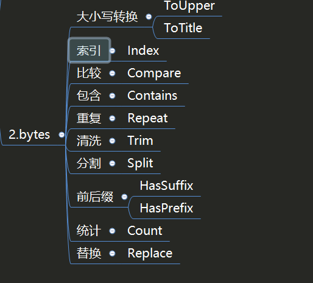

.. contents::
   :depth: 3
..

bytes
=====

内置库bytes提供了与strings库几乎相同的常用操作，只不过两者的数据类型不一样，前者是字节数组，后者是字符串。其实两者可以相互转换，所以只需记住一个常用的用法即可。

1.byte与string转换
------------------

如果只想记住其中一种类型的用法，就可以对两者进行转换。

.. code:: go

   package main

   import "fmt"

   func ToString(value []byte) string {
       return string(value)
   }

   func ToBytes(value string) []byte {
       return []byte(value)
   }

   func main() {
       var A []byte
       A = []byte("a b")

       var B string
       B = "a b"
       fmt.Println(fmt.Sprintf("%T,%T", A, B)) //[]uint8,string
       fmt.Println(fmt.Sprintf("%T,%T", ToString(A), ToBytes(B)))  //string,[]uint8
   }

进行强制类型转换之后，就可以使用对应的数据类型进行后续的操作。

2.Buffer和Reader
----------------

我们经常在网络请求中构造body时如下操作：

-  bytes.NewBuffer(p []bytes)
-  bytes.NewReader(p []bytes)
-  strings.NewReader(s string)

.. code:: go

   func HttpByBytes() {
       url := "http://httpbin.org/anything?name=xix"

       var body map[string]string
       body = make(map[string]string)
       body["age"] = "20"
       body["school"] = "ShangHai"

       by, _ := json.Marshal(body)

       request, _ := http.NewRequest(http.MethodPost, url, bytes.NewBuffer(by))
       client := http.DefaultClient
       response, err := client.Do(request)
       if err != nil {
           panic(err)
       }
       content, _ := ioutil.ReadAll(response.Body)
       fmt.Println(string(content))

   }

   func HttpByByteNewReader() {
       url := "http://httpbin.org/anything?name=xix"

       var body map[string]string
       body = make(map[string]string)
       body["age"] = "20"
       body["school"] = "ShangHai"

       by, _ := json.Marshal(body)

       request, _ := http.NewRequest(http.MethodPost, url, bytes.NewReader(by))
       client := http.DefaultClient
       response, err := client.Do(request)
       if err != nil {
           panic(err)
       }
       content, _ := ioutil.ReadAll(response.Body)
       fmt.Println(string(content))
   }

   func HttpByStrings() {
       url := "http://httpbin.org/anything?name=xix"

       request, _ := http.NewRequest(http.MethodPost, url, strings.NewReader(`{"name":"XieWei", "school":"ShangHai"}`))
       client := http.DefaultClient
       response, err := client.Do(request)
       if err != nil {
           panic(err)
       }
       content, _ := ioutil.ReadAll(response.Body)
       fmt.Println(string(content))
   }

内置库bytes和内置库strings的使用方法一致，读者可以根据数据类型是strings还是bytes来选择不同的库进行操作。

3. 速查表
---------

``import "bytes"``

bytes包实现了操作[]byte的常用函数。本包的函数和strings包的函数相当类似。

.. code:: go

   s1 := []byte("索宁")
   s2 := []byte("索")
   fmt.Println(bytes.Equal(s1, s2)) //false(切片的内容是否完全相同)

   //Runes函数返回和s等价的[]rune切片。（将utf-8编码的unicode码值分别写入单个rune）
   r1 := bytes.Runes(s1)
   r2 := bytes.Runes(s2)
   fmt.Println(r1)             //[32034 23425]
   fmt.Println(r2)             //[32034]
   fmt.Println(r1[0] == r2[0]) //true(可以判断中文)
