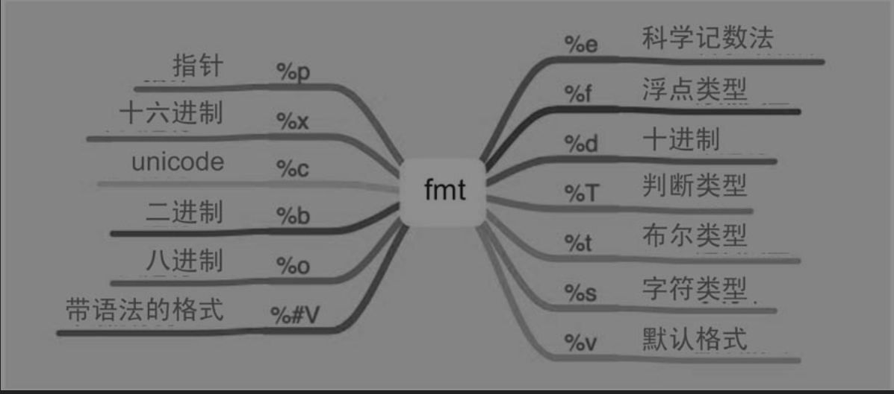

# fmt

fmt实现了格式化输出，并提供了相应的占位符。

fmt支持的占位符比较多。

Go语言内部支持的数据类型如下：

数值类型：整数类型、浮点类型。

字符类型。

指针类型。

布尔类型。

其他。

## 1.数值类型

```
%b：二进制。
%o：八进制。
%x：十六进制。
%X：十六进制。
%d：十进制。
%f：浮点类型。
%e：科学记数法。
%E：科学记数法。
%c：该值对应的unicode码值
%q：该值对应的单引号括起来的go语法字符字面值，必要时会采用安全的转义表示
%U: 表示为Unicode格式：U+1234，等价于"U+%04X"
```

```go
func FmtUsage() {
	var number = 100.203
	var numberInt = 100
	fmt.Printf("%d\n", numberInt)
	fmt.Printf("%o\n", numberInt)
	fmt.Printf("%x\n", numberInt)
	fmt.Printf("%X\n", numberInt)
	fmt.Printf("%b\n", numberInt)
	fmt.Printf("%f\n", number)
	fmt.Printf("%e\n", number)
	fmt.Printf("%E\n", number)
}
```


## 2.字符类型

```
%s    直接输出字符串或者[]byte
%q    该值对应的双引号括起来的go语法字符串字面值，必要时会采用安全的转义表示
%x    每个字节用两字符十六进制数表示（使用a-f）
%X    每个字节用两字符十六进制数表示（使用A-F）
```

```go
func FmtStringUsage() {
	var values = "golang"
	fmt.Printf("%s\n", values)
	fmt.Printf("%q\n", values)
}
```


## 3.布尔类型

```
%t：布尔类型。
```

```go
func FmtBoolUsage() {
	var ok = true
	fmt.Printf("%t\n", ok)
}
```


## 4.其他

```
%T：判断类型。
%p：指针类型。
%v：默认格式。
%#v：带语法的格式。
```

```go
func FmtOtherUsage() {
	var a = 1
	var b = 2.0
	var ok = true
	number := &a
	var s = struct {
		Name string `json:"name"`
	}{
		Name: "Go",
	}
	fmt.Printf("%T\n", a)					//int
	fmt.Printf("%T\n", b)					//float64
	fmt.Printf("%T\n", ok)					//bool
	fmt.Printf("%p\n%d\n", &a, number)		//0xc00012805   8824634933336
	fmt.Printf("%v\n", s)        //{Go}
	fmt.Printf("%#v\n", s)		//struct { Name string "json:\"name\"" }{Name:"Go"}

}
```


## 5.fmt占位符




fmt对不同的功能提供了非常类似的API：

- Fprint/Fprintf/Fprintln：带格式的输出。
- Print/Printf/Println：标准输出。
- Sprint/Sprintf/Sprintln：格式化内容为string。

其中，Fprint/Print/Sprint表示使用默认的格式输出或格式化内容。

Fprintf/Printf/Sprintf表示使用指定的格式输出或格式化内容。

Fprintln/Println/Sprintln表示使用默认的格式输出或格式化内容，同时会在最后加上换行符（'\n'）。


Print/Printf/Println是将内容输出到标准输出设备，底层调用的是Fprint/Fprintf/Fprintln，只是将第一个参数设置为os.Stdout（标准输出设备）。

```go
func Fprintln(w io.Writer, a ...interface{}) (n int, err error) {
	p := newPrinter()
	p.doPrintln(a)
	n, err = w.Write(p.buf)
	p.free()
	return
}

```

```go
func Println(a ...interface{}) (n int, err error) {
	return Fprintln(os.Stdout, a...)
}
```

总之，常用的是标准输出Print/Printf/Println方法和格式化字符串输出Sprint/Sprintf/Sprintln方法。


## 6.错误类型

创建一个错误类型有两种方式：

errors.New()

fmt.Errorf

其实，fmt.Errorf底层就是调用errors.New来格式化字符串的。

```go
func Errorf(format string, a ...interface{}) error {
	p := newPrinter()
	p.wrapErrs = true
	p.doPrintf(format, a)
	s := string(p.buf)
	var err error
	if p.wrappedErr == nil {
		err = errors.New(s)
	} else {
		err = &wrapError{s, p.wrappedErr}
	}
	p.free()
	return err
}
```


## 7.输出定制化

fmt还提供了几个接口，有些结构体实现了接口内定义的方法就能定制化输出。

```go
// Stringer is implemented by any value that has a String method,
// which defines the ``native'' format for that value.
// The String method is used to print values passed as an operand
// to any format that accepts a string or to an unformatted printer
// such as Print.
type Stringer interface {
	String() string
}

// GoStringer is implemented by any value that has a GoString method,
// which defines the Go syntax for that value.
// The GoString method is used to print values passed as an operand
// to a %#v format.
type GoStringer interface {
	GoString() string
}
```

```go
package main

import "fmt"

type Val struct {
	Name string `json:"name"`
	Age  int    `json:"age"`
}

func (v Val) String() string {
	return fmt.Sprintf("%s + %d", v.Name, v.Age)
}
func (v Val) GoString() string {
	return fmt.Sprintf("%s + %d", v.Name, v.Age)
}

func main() {
	v := Val{
		Name: "hujianli",
		Age:  10,
	}
	fmt.Println(v)

	fmt.Printf("%#v\n",v)
}
```

可以看到结构体实现了Stringer和GoStringer接口，即实现了定制化输出。

## 8.格式化verb应用

代码示例
``` go
package main

import (
	"fmt"
	"os"
)

type User struct {
	name string
	age  int
}

var valF float64 = 32.9983
var valI int = 89
var valS string = "Go is an open source programmig language that makes it"
var valB bool = true

func main() {
	p := User{
		name: "John",
		age:  18,
	}
	fmt.Printf("Printf struct %%v: %v\n", p)
	fmt.Printf("Printf struct %%+v: %+v\n", p)
	fmt.Printf("Printf struct %%#v: %#v\n", p)
	fmt.Printf("Printf struct %%T: %T\n", p)
	fmt.Printf("Printf struct %%p: %p\n", p)
	fmt.Println("-------------------------------------------------------")
	fmt.Printf("Printf float64 %%v: %v\n", valF)
	fmt.Printf("Printf float64 %%+v: %+v\n", valF)
	fmt.Printf("Printf float64 %%#v: %#v\n", valF)
	fmt.Printf("Printf float64 %%T: %T\n", valF)
	fmt.Printf("Printf float64 %%f: %f\n", valF)
	fmt.Printf("Printf float64 %%4.3f: %4.3f\n", valF)
	fmt.Printf("Printf float64 %%8.3f: %8.3f\n", valF)
	fmt.Printf("Printf float64 %%-8.3f: %-8.3f\n", valF)
	fmt.Printf("Printf float64 %%e: %e\n", valF)
	fmt.Printf("Printf float64 %%E: %E\n", valF)
	fmt.Println("-------------------------------------------------------")
	fmt.Printf("Printf int %%v: %v\n", valI)
	fmt.Printf("Printf int %%+v: %+v\n", valI)
	fmt.Printf("Printf int %%#v: %#v\n", valI)
	fmt.Printf("Printf int %%T: %T\n", valI)
	fmt.Printf("Printf int %%d: %d\n", valI)
	fmt.Printf("Printf int %%8d: %8d\n", valI)
	fmt.Printf("Printf int %%-8d: %-8d\n", valI)
	fmt.Printf("Printf int %%b: %b\n", valI)
	fmt.Printf("Printf int %%c: %c\n", valI)
	fmt.Printf("Printf int %%o: %o\n", valI)
	fmt.Printf("Printf int %%U: %U\n", valI)
	fmt.Printf("Printf int %%q: %q\n", valI)
	fmt.Printf("Printf int %%x: %x\n", valI)
	fmt.Println("-------------------------------------------------------")
	fmt.Printf("Printf string %%v:%v\n", valS)
	fmt.Printf("Printf string %%+v:%+v\n", valS)
	fmt.Printf("Printf string %%#v:%#v\n", valS)
	fmt.Printf("Printf string %%T:%T\n", valS)
	fmt.Printf("Printf string %%X:%X\n", valS)
	fmt.Printf("Printf string %%200s:%200s\n", valS)
	fmt.Printf("Printf string %%-200s:%-200s\n", valS)
	fmt.Printf("Printf string %%q:%q\n", valS)
	fmt.Println("-------------------------------------------------------")
	fmt.Printf("Printf bool %%v: %v\n", valB)
	fmt.Printf("Printf bool %%+v: %+v\n", valB)
	fmt.Printf("Printf bool %%#v: %#v\n", valB)
	fmt.Printf("Printf bool %%T: %T\n", valB)
	fmt.Printf("Printf bool %%t: %t\n", valB)
	fmt.Println("-------------------------------------------------------")
	s := fmt.Sprintf("a %s", "string")
	fmt.Println(s)

	fmt.Fprintf(os.Stderr,"an %s\n","error")

}
```

