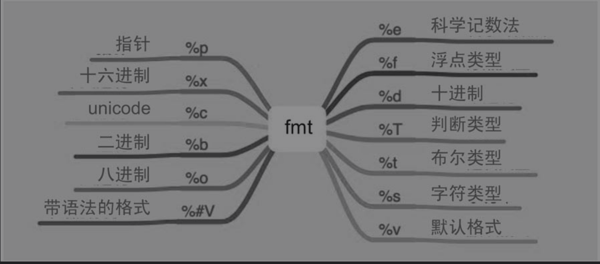

.. role:: raw-latex(raw)
   :format: latex
..

.. contents::
   :depth: 3
..

fmt
===

fmt实现了格式化输出，并提供了相应的占位符。

fmt支持的占位符比较多。

Go语言内部支持的数据类型如下：

数值类型：整数类型、浮点类型。

字符类型。

指针类型。

布尔类型。

其他。

1.数值类型
----------

::

   %b：二进制。
   %o：八进制。
   %x：十六进制。
   %X：十六进制。
   %d：十进制。
   %f：浮点类型。
   %e：科学记数法。
   %E：科学记数法。
   %c：该值对应的unicode码值
   %q：该值对应的单引号括起来的go语法字符字面值，必要时会采用安全的转义表示
   %U: 表示为Unicode格式：U+1234，等价于"U+%04X"

.. code:: go

   func FmtUsage() {
       var number = 100.203
       var numberInt = 100
       fmt.Printf("%d\n", numberInt)
       fmt.Printf("%o\n", numberInt)
       fmt.Printf("%x\n", numberInt)
       fmt.Printf("%X\n", numberInt)
       fmt.Printf("%b\n", numberInt)
       fmt.Printf("%f\n", number)
       fmt.Printf("%e\n", number)
       fmt.Printf("%E\n", number)
   }

2.字符类型
----------

::

   %s    直接输出字符串或者[]byte
   %q    该值对应的双引号括起来的go语法字符串字面值，必要时会采用安全的转义表示
   %x    每个字节用两字符十六进制数表示（使用a-f）
   %X    每个字节用两字符十六进制数表示（使用A-F）

.. code:: go

   func FmtStringUsage() {
       var values = "golang"
       fmt.Printf("%s\n", values)
       fmt.Printf("%q\n", values)
   }

3.布尔类型
----------

::

   %t：布尔类型。

.. code:: go

   func FmtBoolUsage() {
       var ok = true
       fmt.Printf("%t\n", ok)
   }

4.其他
------

::

   %T：判断类型。
   %p：指针类型。
   %v：默认格式。
   %#v：带语法的格式。

.. code:: go

   func FmtOtherUsage() {
       var a = 1
       var b = 2.0
       var ok = true
       number := &a
       var s = struct {
           Name string `json:"name"`
       }{
           Name: "Go",
       }
       fmt.Printf("%T\n", a)                   //int
       fmt.Printf("%T\n", b)                   //float64
       fmt.Printf("%T\n", ok)                  //bool
       fmt.Printf("%p\n%d\n", &a, number)      //0xc00012805   8824634933336
       fmt.Printf("%v\n", s)        //{Go}
       fmt.Printf("%#v\n", s)      //struct { Name string "json:\"name\"" }{Name:"Go"}

   }

5.fmt占位符
-----------

fmt对不同的功能提供了非常类似的API：

-  Fprint/Fprintf/Fprintln：带格式的输出。
-  Print/Printf/Println：标准输出。
-  Sprint/Sprintf/Sprintln：格式化内容为string。

其中，Fprint/Print/Sprint表示使用默认的格式输出或格式化内容。

Fprintf/Printf/Sprintf表示使用指定的格式输出或格式化内容。

Fprintln/Println/Sprintln表示使用默认的格式输出或格式化内容，同时会在最后加上换行符（‘:raw-latex:`\n`’）。

Print/Printf/Println是将内容输出到标准输出设备，底层调用的是Fprint/Fprintf/Fprintln，只是将第一个参数设置为os.Stdout（标准输出设备）。

.. code:: go

   func Fprintln(w io.Writer, a ...interface{}) (n int, err error) {
       p := newPrinter()
       p.doPrintln(a)
       n, err = w.Write(p.buf)
       p.free()
       return
   }

.. code:: go

   func Println(a ...interface{}) (n int, err error) {
       return Fprintln(os.Stdout, a...)
   }

总之，常用的是标准输出Print/Printf/Println方法和格式化字符串输出Sprint/Sprintf/Sprintln方法。

6.错误类型
----------

创建一个错误类型有两种方式：

errors.New()

fmt.Errorf

其实，fmt.Errorf底层就是调用errors.New来格式化字符串的。

.. code:: go

   func Errorf(format string, a ...interface{}) error {
       p := newPrinter()
       p.wrapErrs = true
       p.doPrintf(format, a)
       s := string(p.buf)
       var err error
       if p.wrappedErr == nil {
           err = errors.New(s)
       } else {
           err = &wrapError{s, p.wrappedErr}
       }
       p.free()
       return err
   }

7.输出定制化
------------

fmt还提供了几个接口，有些结构体实现了接口内定义的方法就能定制化输出。

.. code:: go

   // Stringer is implemented by any value that has a String method,
   // which defines the ``native'' format for that value.
   // The String method is used to print values passed as an operand
   // to any format that accepts a string or to an unformatted printer
   // such as Print.
   type Stringer interface {
       String() string
   }

   // GoStringer is implemented by any value that has a GoString method,
   // which defines the Go syntax for that value.
   // The GoString method is used to print values passed as an operand
   // to a %#v format.
   type GoStringer interface {
       GoString() string
   }

.. code:: go

   package main

   import "fmt"

   type Val struct {
       Name string `json:"name"`
       Age  int    `json:"age"`
   }

   func (v Val) String() string {
       return fmt.Sprintf("%s + %d", v.Name, v.Age)
   }
   func (v Val) GoString() string {
       return fmt.Sprintf("%s + %d", v.Name, v.Age)
   }

   func main() {
       v := Val{
           Name: "hujianli",
           Age:  10,
       }
       fmt.Println(v)

       fmt.Printf("%#v\n",v)
   }

可以看到结构体实现了Stringer和GoStringer接口，即实现了定制化输出。

8.格式化verb应用
----------------

代码示例

.. code:: go

   package main

   import (
       "fmt"
       "os"
   )

   type User struct {
       name string
       age  int
   }

   var valF float64 = 32.9983
   var valI int = 89
   var valS string = "Go is an open source programmig language that makes it"
   var valB bool = true

   func main() {
       p := User{
           name: "John",
           age:  18,
       }
       fmt.Printf("Printf struct %%v: %v\n", p)
       fmt.Printf("Printf struct %%+v: %+v\n", p)
       fmt.Printf("Printf struct %%#v: %#v\n", p)
       fmt.Printf("Printf struct %%T: %T\n", p)
       fmt.Printf("Printf struct %%p: %p\n", p)
       fmt.Println("-------------------------------------------------------")
       fmt.Printf("Printf float64 %%v: %v\n", valF)
       fmt.Printf("Printf float64 %%+v: %+v\n", valF)
       fmt.Printf("Printf float64 %%#v: %#v\n", valF)
       fmt.Printf("Printf float64 %%T: %T\n", valF)
       fmt.Printf("Printf float64 %%f: %f\n", valF)
       fmt.Printf("Printf float64 %%4.3f: %4.3f\n", valF)
       fmt.Printf("Printf float64 %%8.3f: %8.3f\n", valF)
       fmt.Printf("Printf float64 %%-8.3f: %-8.3f\n", valF)
       fmt.Printf("Printf float64 %%e: %e\n", valF)
       fmt.Printf("Printf float64 %%E: %E\n", valF)
       fmt.Println("-------------------------------------------------------")
       fmt.Printf("Printf int %%v: %v\n", valI)
       fmt.Printf("Printf int %%+v: %+v\n", valI)
       fmt.Printf("Printf int %%#v: %#v\n", valI)
       fmt.Printf("Printf int %%T: %T\n", valI)
       fmt.Printf("Printf int %%d: %d\n", valI)
       fmt.Printf("Printf int %%8d: %8d\n", valI)
       fmt.Printf("Printf int %%-8d: %-8d\n", valI)
       fmt.Printf("Printf int %%b: %b\n", valI)
       fmt.Printf("Printf int %%c: %c\n", valI)
       fmt.Printf("Printf int %%o: %o\n", valI)
       fmt.Printf("Printf int %%U: %U\n", valI)
       fmt.Printf("Printf int %%q: %q\n", valI)
       fmt.Printf("Printf int %%x: %x\n", valI)
       fmt.Println("-------------------------------------------------------")
       fmt.Printf("Printf string %%v:%v\n", valS)
       fmt.Printf("Printf string %%+v:%+v\n", valS)
       fmt.Printf("Printf string %%#v:%#v\n", valS)
       fmt.Printf("Printf string %%T:%T\n", valS)
       fmt.Printf("Printf string %%X:%X\n", valS)
       fmt.Printf("Printf string %%200s:%200s\n", valS)
       fmt.Printf("Printf string %%-200s:%-200s\n", valS)
       fmt.Printf("Printf string %%q:%q\n", valS)
       fmt.Println("-------------------------------------------------------")
       fmt.Printf("Printf bool %%v: %v\n", valB)
       fmt.Printf("Printf bool %%+v: %+v\n", valB)
       fmt.Printf("Printf bool %%#v: %#v\n", valB)
       fmt.Printf("Printf bool %%T: %T\n", valB)
       fmt.Printf("Printf bool %%t: %t\n", valB)
       fmt.Println("-------------------------------------------------------")
       s := fmt.Sprintf("a %s", "string")
       fmt.Println(s)

       fmt.Fprintf(os.Stderr,"an %s\n","error")

   }
