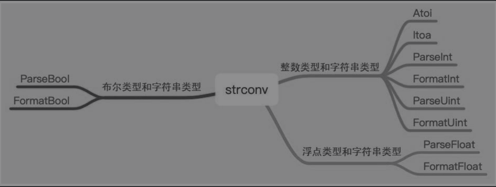

# strconv

strconv提供了字符串类型和其他常用的数据类型之间的转换，常用的基本数据类型包括数值类型、字符串类型和布尔类型。

主要有以下常用函数： Atoi()、Itia()、parse系列、format系列、append系列。



在日常开发过程中，关于数据类型的转换有很多种方式，比如强制数据类型转换，而内置库strconv的转换效率比其他方式更高效，推荐大家使用。


## 1. 字符串类型和布尔类型的转换

字符串类型和布尔类型直接转换。

```go
func ToBool() {
	var a bool
	a = true
	b := strconv.FormatBool(a)
	fmt.Println(b)
	c, _ := strconv.ParseBool("false")
	fmt.Println(c)

}
```

能够将字符串类型转换为布尔类型的字符串如下：

```
1,t,T,TRUE,true,True,0,f,F,FALSE,false,False
```

可以看出，需要有一定的规范，并不是随意的字符串都能转换为布尔类型，将字符串类型转换为布尔类型时有相应的错误处理。


## 2. 字符串类型与数值类型的转换

数值类型是很常用的数据类型，数值类型又分为整数类型和浮点类型，对应不同的转换处理函数。

```go
func ToNumber() {
	var (
		a int
		b uint64
		c float64
	)

	a = 1
	b = 2
	c = 3.14
	fmt.Println(strconv.Itoa(a))
	fmt.Println(strconv.FormatUint(b, 10))
	fmt.Println(strconv.FormatFloat(c, 'f', 1, 32))

	d := "4.178"
	floatD, _ := strconv.ParseFloat(d, 64)
	fmt.Println(floatD)
}

```

可以看出，Parse_X和Format_X是两个互逆的转换过程。


## 3. 速查表

`import "strconv"`

strconv包实现了基本数据类型和其字符串表示的相互转换。

```go
//返回字符串表示的整数值
fmt.Println(strconv.ParseInt("-999", 0, 0)) //-999 <nil>
fmt.Println(strconv.ParseUint("999", 0, 0)) //999 <nil>
fmt.Println(strconv.Atoi("999"))            //999 <nil>
//base指定进制（2到36），如果base为0，则会从字符串前置判断，"0x"是16进制，"0"是8进制，否则是10进制；
//bitSize指定结果必须能无溢出赋值的整数类型，0、8、16、32、64 分别代表 int、int8、int16、int32、int64；

//返回i的base进制的字符串表示
fmt.Println(strconv.FormatInt(-520, 10)) //-520
fmt.Println(strconv.FormatUint(520, 10)) //520
fmt.Println(strconv.Itoa(520))           //520
//base 必须在2到36之间，结果中会使用小写字母'a'到'z'表示大于10的数字。

//返回字符串表示的bool值
fmt.Println(strconv.ParseBool("false"))         //false <nil>
fmt.Println(strconv.FormatBool(true))           //true
fmt.Println(strconv.AppendBool([]byte{}, true)) //[116 114 117 101]
//它接受1、0、t、f、T、F、true、false、True、False、TRUE、FALSE；否则返回错误。

//返回字符串表示的bool值
fmt.Println(strconv.ParseFloat("520.1314", 10))        //520.1314 <nil>
fmt.Println(strconv.FormatFloat(520.1314, 'f', 6, 32)) //520.131409
//fmt表示格式：'f'（-ddd.dddd）、'b'（-ddddp±ddd，指数为二进制）、'e'（-d.dddde±dd，十进制指数）、'E'（-d.ddddE±dd，十进制指数）、'g'（指数很大时用'e'格式，否则'f'格式）、'G'（指数很大时用'E'格式，否则'f'格式）。
//prec控制精度（排除指数部分）：对'f'、'e'、'E'，它表示小数点后的数字个数；对'g'、'G'，它控制总的数字个数。如果prec 为-1，则代表使用最少数量的、但又必需的数字来表示f。
//bitSize表示f的来源类型（32：float32、64：float64），会据此进行舍入。
```


## 4.小结

内置库strconv提供了基本数据类型和字符串类型之间的转换。另外，命名规则是用正确的反义词组命名具有互斥意义或相反动作的函数等，比如format和parse。

