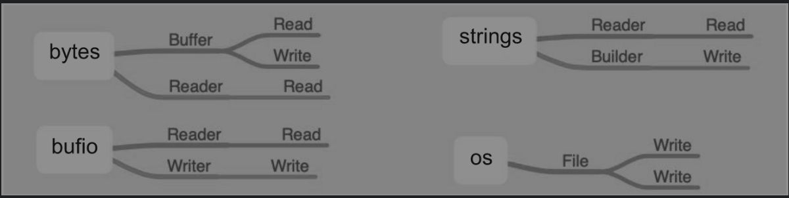

# ioutil/bufio

ioutil库提供了常见的I/O接口，bufio库实现了缓存IO。


## 1.ioutil库

ioutil标准库中提供了一些常用、方便的IO操作函数

除了io包可以读写数据，Go语言中还提供了一个辅助的工具包就是ioutil，里面的方法虽然不多，但是都还蛮好用的。


io库的两个基本接口为Reader和Writer。

```go
type Reader interface {
    Read(p []byte) (n int, err error)
}

type Writer interface {
    Write(p []byte) (n int, err error)
}
```

接口是方法的集合。接口的命名建议采用X_er这种形式。

接口的具体实现依赖于其他结构体。


内置的其他很多库都实现了这两个接口



如何知道是否实现了对应的接口？只需查看具体的结构体是否实现了相应的方法即可。

以strings的Reader为例：

```
type Reader struct {
    // 内含隐藏或非导出字段
}
    func NewReader(s string) *Reader
    func (r *Reader) Len() int
    func (r *Reader) Read(b []byte) (n int, err error)
    func (r *Reader) ReadByte() (b byte, err error)
    func (r *Reader) UnreadByte() error
    func (r *Reader) ReadRune() (ch rune, size int, err error)
    func (r *Reader) UnreadRune() error
    func (r *Reader) Seek(offset int64, whence int) (int64, error)
    func (r *Reader) ReadAt(b []byte, off int64) (n int, err error)
    func (r *Reader) WriteTo(w io.Writer) (n int64, err error)
```

Reader有Read方法，与io库中Reader的Read方法带有相同的参数和返回值，所以strings库的Reader实现了io库的Reader接口。

### 1.1 ioutil常见方法
```go 
// Discard 是一个 io.Writer 接口,调用它的 Write 方法将不做任何事情,
// 并且始终成功返回.
var Discard io.Writer = devNull(0)

// ReadAll 读取 r 中的所有数据,返回读取的数据和遇到的错误.
// 如果读取成功，则 err 返回 nil,而不是 EOF，因为 ReadAll 定义为读取
// 所有数据,所以不会把 EOF 当做错误处理.
func ReadAll(r io.Reader) ([]byte, error)

// ReadFile 读取文件中的所有数据,返回读取的数据和遇到的错误.
// 如果读取成功,则 err 返回 nil,而不是 EOF
func ReadFile(filename string) ([]byte, error)

// WriteFile 向文件中写入数据,写入前会清空文件.
// 如果文件不存在,则会以指定的权限创建该文件.
// 返回遇到的错误.
func WriteFile(filename string, data []byte, perm os.FileMode) error

// ReadDir 读取指定目录中的所有目录和文件(不包括子目录).
// 返回读取到的文件信息列表和遇到的错误,列表是经过排序的.
func ReadDir(dirname string) ([]os.FileInfo, error)

// NopCloser 将 r 包装为一个 ReadCloser 类型,但 Close 方法不做任何事情.
func NopCloser(r io.Reader) io.ReadCloser

// TempFile 在 dir 目录中创建一个以 prefix 为前缀的临时文件,并将其以读写模式打开.
// 返回创建的文件对象和遇到的错误.
// 如果 dir 为空,则在默认的临时目录中创建文件(参见 os.TempDir),多次
// 调用会创建不同的临时文件,调用者可以通过 f.Name() 获取文件的完整路径.
// 调用本函数所创建的临时文件,应该由调用者自己删除.
func TempFile(dir, prefix string) (f *os.File, err error)

// TempDir 功能同 TempFile,只不过创建的是目录,返回目录的完整路径.
func TempDir(dir, prefix string) (name string, err error)
```

### 1.2 示例-网络请求

```go
func IoUsage() {
	url := "http://httpbin.org/anything?name=xix"
	request, _ := http.NewRequest(http.MethodPost, url, strings.NewReader(`{"name":"XieXie"}`))
	client := http.DefaultClient
	response, err := client.Do(request)
	if err != nil {
		return
	}
	defer response.Body.Close()
	by, _ := ioutil.ReadAll(response.Body)
	fmt.Println(string(by))
}
```

### 1.3 示例-文件目录操作
```go
package main

import (
	"fmt"
	"io/ioutil"
)

// ioutil.ReadFile读取整个文件
func main() {
    // 读取文件
	content, err := ioutil.ReadFile("./main.go")
	if err != nil {
		fmt.Println("read file failed, err:", err)
		return
	}
	fmt.Println(string(content))
	
	// 写入文件
	str := "hello world"
	err := ioutil.WriteFile("./test.txt", []byte(str), 0644)
	if err != nil {
		fmt.Println("write file failed, err: ", err)
		return
	}
	
	// 创建临时目录
	dir, err := ioutil.TempDir("./", "Test")
	if err != nil {
		fmt.Println(err)
	}
	defer os.Remove(dir) // 用完删除
	fmt.Printf("%s\n", dir)

	// 创建临时文件
	f, err := ioutil.TempFile(dir, "Test")
	if err != nil {
		fmt.Println(err)
	}
	defer os.Remove(f.Name()) // 用完删除
	fmt.Printf("%s\n", f.Name())
}
```

### 1.4 示例-遍历文件夹
```go 
package main

import (
	"fmt"
	"io/ioutil"
	"log"
)

func listFiles(dirname string, level int) {
	// level用来记录当前递归的层次
	// 生成有层次感的空格
	s := "|--"
	for i := 0; i < level; i++ {
		s = "|   " + s
	}

	fileInfos, err := ioutil.ReadDir(dirname)
	if err != nil {
		log.Fatal(err)
	}
	for _, fi := range fileInfos {
		filename := dirname + "\\" + fi.Name() // windows
		// filename := dirname + "/" + fi.Name()  // linux
		fmt.Printf("%s%s\n", s, filename)
		if fi.IsDir() {
			// 继续遍历fi这个目录
			listFiles(filename, level+1)
		}
	}
}

func main() {
	dirname := "F:\\Linux仓库"
	listFiles(dirname, 0)
}
```


### 1.5 通过ioutil包进行文件操作

````go
package main

import (
	"fmt"
	"io/ioutil"
	"os"
)

func main() {
	filenName1 := "blockchain.txt"
	// 打开文件
	data, err := ioutil.ReadFile(filenName1)
	if err != nil {
		fmt.Println("文件打开异常", err.Error())
	} else {
		fmt.Println(string(data))
	}

	filenName2 := "block2.txt"
	s1 := "胡建力陪你学golang"
	// 写入文件
	err = ioutil.WriteFile(filenName2, []byte(s1), 0777)
	if err != nil {
		fmt.Println("文件写入异常", err.Error())
	} else {
		fmt.Println("文件写入ok")
	}

	filenName2 = "block2.txt_back"
	// 文件复制
	err = ioutil.WriteFile(filenName2, data, os.ModePerm)
	if err != nil {
		fmt.Println("文件复制异常", err.Error())
	} else {
		fmt.Println("文件复制ok")
	}

	// 遍历目录
	dirName := "./"
	fileinfos, err := ioutil.ReadDir(dirName)
	if err != nil {
		fmt.Println("目录遍历异常", err.Error())
	} else {
		for i, v := range fileinfos {
			fmt.Println(i, v.Name(), v.IsDir(), v.Size(), v.ModTime())
		}
	}

	// 创建目录
	filename, err := ioutil.TempDir("./", "temp")
	if err != nil {
		fmt.Println("创建目录失败", err.Error())
	} else {
		fmt.Println(filename)
	}

	// 创建文件
	file1, err := ioutil.TempFile(filename, "temp")
	if err != nil {
		fmt.Println("创建文件失败", err.Error())
	} else {
		fmt.Println(file1)
	}
	file1.Close()
}
````


### 1.6 示例代码

```go
package main
 
import (
    "fmt"
    "io/ioutil"
    "strings"
)
 
func main() {
    //NopCloser返回一个读取对象的ReadCloser接口
    //用于提供Close方法
    r := strings.NewReader("hello");
    rcl := ioutil.NopCloser(r);
    defer rcl.Close();
 
    //ReadAll读取所有数据
    r2 := strings.NewReader("1234567890");
    p, _ := ioutil.ReadAll(r2);
    fmt.Println(string(p));  // 1234567890
 
    //读取目录下信息
    fileInfo, _ := ioutil.ReadDir("./");
    for _, v := range fileInfo {
        fmt.Println(v.Name());
    }
 
    //读取整个文件数据
    data, _ := ioutil.ReadFile("E:/go/project/test.log");
    fmt.Println(string(data));
 
    //向指定文件写入数据，如果文件不存在，则创建文件，写入数据之前清空文件
    ioutil.WriteFile("./xxx.txt", []byte("hello,world"), 0655);
 
    //在当前目录下，创建一个以test为前缀的临时文件夹，并返回文件夹路径
    name, _ := ioutil.TempDir("./", "test");
    fmt.Println(name);
 
    //在当前目录下，创建一个以test为前缀的文件，并以读写模式打开文件，并返回os.File指针
    file, _ := ioutil.TempFile("./", "test");
    file.WriteString("写入字符串");
    file.Close();
}
```


## 2.bufio库

bufio实现了带缓冲的I/O操作，达到高效读写。

bufio包对io包下的对象Reader、Writer进行包装，分别实现了io.Reader和io.Writer接口，提供了数据缓冲功能，能够一定程度减少大块数据读写带来的开销，所以bufio比直接读写更快。

把文件读取进缓冲区之后，再读取的时候就可以避免文件系统的输出，从而提高速度；在进行写操作时，先把文件写入缓冲区，然后由缓冲区写入文件系统。


有人可能会困惑：直接把“内容—文件”和“内容—缓冲区—文件”相比，缓冲区似乎没有起到作用。其实在生活中也有这样的例子，比如每当家里产生垃圾的时候，不会有人马上去楼下倒垃圾，因为这样反复地上下楼非常麻烦，通常家里都会准备个小垃圾桶，等垃圾桶装满了之后把一批垃圾一起倒掉。用计算机的思想来看，垃圾桶就充当了缓冲区的角色。


### 2.1 bufio读文件

**NewReader()和NewReaderSize()**

这两个方法返回一个新的Reader，用于读取文件。

```go
/* bufio.NewReader()函数 */
func NewReader(rd io.Reader) *Reader {
	return NewReaderSize(rd, defaultBufSize)
}
// 调用了NewReaderSize函数,设置了默认的BufSize(4096)

/* bufio.NewReaderSize() */
func NewReaderSize(rd io.Reader, size int) *Reader
// 与NewReader的区别是可以手动设置BufSize

/* Reader */
// Reader implements buffering for an io.Reader object.
type Reader struct {
	buf          []byte
	rd           io.Reader // reader provided by the client
	r, w         int       // buf read and write positions
	err          error
	lastByte     int // last byte read for UnreadByte; -1 means invalid
	lastRuneSize int // size of last rune read for UnreadRune; -1 means invalid
}
```


#### bufio文件读取方法
```go
/* Read() */
func (b *Reader) Read(p []byte) (n int, err error)
// 当缓存区有内容的时,将缓存区内容全部填入p并清空缓存区;
// 当len(p)>len(buf),即要读取的内容比缓存区还要大,直接去文件读取;
// 当len(p)<len(buf),即要读取的内容比缓存区小,缓存区从文件读取内容充满缓存区,并将p填满(此时缓存区有剩余内容);
// 以后再次读取时缓存区有内容,将缓存区内容全部填入p并清空缓存区(此时和情况1一样).


/* ReadLine() */
func (b *Reader) ReadLine() (line []byte, isPrefix bool, err error)
// 每次读取一行文件.

/* ReadString() */
func (b *Reader) ReadString(delim byte) (string, error)
// 按指定字符读取文件.
```

#### 读取文件示例

```go
func ReadFile() {
	f, err := os.Open("io_test.txt")
	if err != nil {
		panic(err)
	}
	defer f.Close()

	rd := bufio.NewReader(f)
	for {
		line, err := rd.ReadString('\n')
		if err != nil || io.EOF == err {
			break
		}
		fmt.Println(line)
	}
}
```


### 2.2 bufio写文件 

**NewWriter()和NewReaderSize()**

这两个方法返回一个新的Writer，用于写操作。 

```go
/* bufio.NewWriter()函数 */
func NewWriter(w io.Writer) *Writer {
	return NewWriterSize(w, defaultBufSize)
}
// 调用NewWriterSize函数,传入默认的buf(4096)


/* bufio.NewWriterSize()函数 */
func NewWriterSize(w io.Writer, size int) *Writer
```


#### bufio文件写入的方法
```go 
// Write 向b写入p中的数据.
func (b *Writer) Write(p []byte) (nn int, err error)

// WriteString 向b中写入字符串s,返回写入字节数量和错误.
func (b *Writer) WriteString(s string) (int, error)

// WriteRune 向b写入r的 UTF-8 编码,返回r的编码长度.
func (b *Writer) WriteRune(r rune) (size int, err error)

// Flush 将缓存中的数据提交到底层的 io.Writer 中.
func (b *Writer) Flush() error

// Available 返回缓存中未使用的空间的长度.
func (b *Writer) Available() int

// Buffered 返回缓存中未提交的数据的长度.
func (b *Writer) Buffered() int

// Reset 将 b 的底层 Writer 重新指定为 w,同时丢弃缓存中的所有数据,复位
// 所有标记和错误信息.相当于创建了一个新的 bufio.Writer.
func (b *Writer) Reset(w io.Writer)
```


#### 写入文件示例
```go 
func main() {
	file, err := os.OpenFile("xx.txt", os.O_CREATE|os.O_TRUNC|os.O_WRONLY, 0666)
	if err != nil {
		fmt.Println("open file failed, err:", err)
		return
	}
	
	defer file.Close()
	
	writer := bufio.NewWriter(file)
	
	for i := 0; i < 10; i++ {
		writer.WriteString("hello world\n") // 将数据先写入缓存
	}
	writer.Flush() // 将缓存中的内容写入文件
}
```


