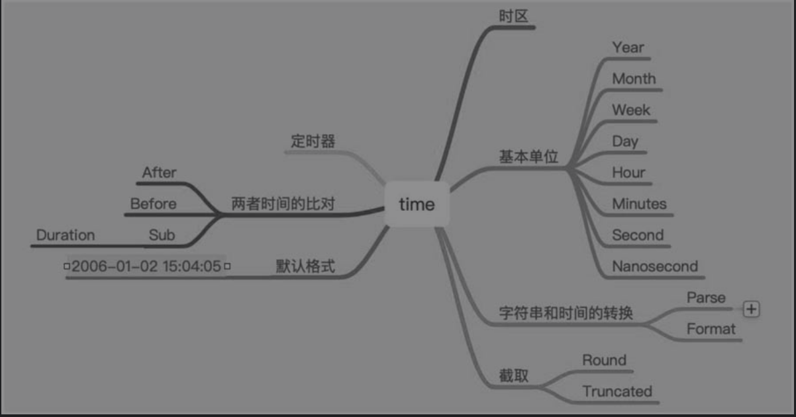

# time

## 1.基础用法

时间类型也是常用的类型，在日常开发中经常设置数据库的字段为时间类型，比如当天、一天前、一年前等数据。与时间有关的操作如图



要用好time库，重要的是理解时间的基本单位：年、月、日、时、分、秒等。

time库提供了两个比较常用的数据类型Time和Duration，同时提供了非常多的方法。与时间有关的常用操作如下：

```go
func TimeUsage() {
	now := time.Now()

	// 获取年
	fmt.Println(now.Year())
	// 获取月份
	fmt.Println(now.Month())
	// 获取日前
	fmt.Println(now.Date())
	// 获取天
	fmt.Println(now.Day())
	// 小时
	fmt.Println(now.Hour())
	// 分
	fmt.Println(now.Minute())
	// 秒
	fmt.Println(now.Second())
	// 毫秒
	fmt.Println(now.Unix())
	// 纳秒
	fmt.Println(now.UnixNano())
}

func TimeOperate() {
	start := time.Now()
	time.Sleep(1 * time.Second)
	// 两个时间差
	fmt.Println(time.Now().Sub(start))

	// 格式化
	fmt.Println(start.Format("2006-01-02 15:04:05"))

	// 截取
	fmt.Println(start.Round(time.Second))
	fmt.Println(start.Truncate(time.Second))

	stringTime := "1991-12-25 19:00:00"
	birthday, _ := time.ParseInLocation("2006-01-02 15:04:05", stringTime, time.Local)
	fmt.Println(birthday.String())
}
```

上面的示例程序演示了如何获取时间的基本属性。


```go
func TimeAdd() {
	now := time.Now()

	// 一天前
	oneDayBefore := now.AddDate(0, 0, -1)

	fmt.Println(now.String(), oneDayBefore.String())

	// 一小时前
	oneHourBefore := now.Add(-1 * time.Hour)
	fmt.Println(oneHourBefore)
}
```

上面的示例程序对几天前后的操作调用了Add和AddDate两个方法，Add用来完成小时、分、秒等操作，AddDate用来完成年、月、日等操作。正数表示之后的时间，负数表示之前的时间。


定时器代码如下：

```go
func main() {
	ticker := time.NewTicker(time.Second)
	defer ticker.Stop()
	done := make(chan bool)
	go func() {
		time.Sleep(10* time.Second)
		done <- true
	}()

	for  {
		select {
		case <-done:
			fmt.Println("Done!")
			return
		case t :=<-ticker.C:
			fmt.Println("Current time: ",t)
		}
	}

}
```

每隔一秒运行一次，持续时间10秒。


有关时间的操作，要了解如下内容：

（1）获取时间的属性，比如基本单位。

（2）有关时间的操作，比如两个时间的间隔，以及前几天、后几天之类的操作。

（3）定时器操作。


## 速查表

`import "time"`

time包提供了时间的显示和测量用的函数。日历的计算采用的是公历。

```go
fmt.Println(time.Now())        //2017-08-03 22:35:36.45766459 +0800 CST
fmt.Println(time.Now().Unix()) //时间戳1501771053
fmt.Println(time.Sunday)       //Sunday
fmt.Println(time.Stamp)        //Jan _2 15:04:05
fmt.Println(time.Date(2008, time.November, 11, 23, 0, 0, 0, time.UTC))
//2008-11-11 23:00:00 +0000 UTC

//格式化输出
now := time.Now()
fmt.Println(now.Format("02/1/2006 15:04:05")) //03/8/2017 22:37:58
fmt.Println(now.Format("2006/02/1 15:04"))    //2017/03/8 22:37
fmt.Println(now.Format("2006-1-02 15:04:05")) //2017-8-03 22:37:58

m, _ := time.ParseDuration("-10m") //10分钟前
fmt.Println(now.Add(m))            //2017-08-03 22:34:55.810202385 +0800 CST
d, _ := time.ParseDuration("-24h") //1天前
fmt.Println(now.Add(d))            //2017-08-02 22:46:28.742383801 +0800 CST
hh, _ := time.ParseDuration("1h")  //1小时后
fmt.Println(now.Add(hh))           //2017-08-03 23:47:21.458974014 +0800 CST

time.Sleep(time.Second) //睡一秒
//定时器
t := time.NewTicker(time.Second)
for v := range t.C { //每一秒执行一次, 这是个死循环
    fmt.Println(v) //2017-08-03 22:53:13.849203492 +0800 CST
}
t.Stop()
```

```go
// 获取到明天凌晨秒数
t := time.Now()
    t2 := time.Date(t.Year(), t.Month(), t.Day(), 0, 0, 0, 0, t.Location()).AddDate(0, 0, 1)
    fmt.Println(time.Second*time.Duration(t2.Unix()-t.Unix()))
```


## 3.参考文献

https://www.yuque.com/coolops/golang/aizg57


