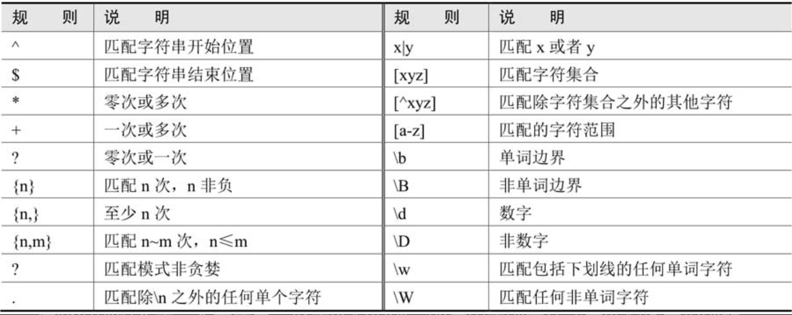

# regexp

关于字符串的操作，除了strings提供的基本操作外，还包括一个与字符串相关的重要操作一一搜索。对字符串按指定规则进行搜索，可以使用正则表达式。

Go标准库使用RE2语法，RE2语法也是Python、C和Perl使用的正则表达式语法。
Go的正则语法和Python类似。


## 1.正则表达式主要规则表



这些规则组合成一个字符串，形成匹配规则，即使用正则表达式来匹配指定规则的内容。

## 2. 使用正则表达式


### 2.1 常用函数

- MatchString()
- FindString()
- FindStringIndex()
- FindStringSubmatch()
- ReplaceAllString()
- Compile()
- MustCompile()
- FindAllString()


### 2.2 MatchString
如果字符串中有子字符串与正则表达式匹配，返回true，否则返回false。
```go
package main

import (
	"fmt"
	"regexp"
)

func main() {
	str := "To be or not to be, that's a question."
    // 判断str是否是以To开头
	m, err := regexp.MatchString(`^To`, str)
	fmt.Println("Match:", m, "Error:", err)
}
```


### 2.3 FindString
返回第一个匹配的结果。
如果没有匹配成功，返回一个空的字符串。

```go
package main

import (
	"fmt"
	"regexp"
)

func main() {
	str := "Golang expressions example"
	r, _ := regexp.Compile("Gola([a-z]+)g")
	fmt.Println(r.FindString(str))  // Golang
}
```

### 2.4 FindStringIndex
FindStringIndex()可以得到匹配的字符串在整体字符串中的索引位置。如果没有匹配的字符串，它回返回nil。
```go 
package main

import (
	"fmt"
	"regexp"
)

func main() {
	str := "Golang regular expressions example"
	r, err := regexp.Compile(`exp`)
	if err != nil {
		fmt.Println(err)
	}
	match := r.FindStringIndex(str)
	fmt.Println("Match: ", match, "Error: ", err)
}
```

### 2.5 FindStringSubmatch
FindStringSubmatch() 除了返回匹配的字符串外，还会返回子表达式的匹配项。
如果没有匹配项，则返回nil。
```go 

package main

import (
	"fmt"
	"regexp"
)

func main() {
	str := "Golang regular expressions example"
	r, err := regexp.Compile(`p([a-z]+)e`)
	match := r.FindStringSubmatch(str)
	fmt.Println("Match:", match, " Error:", err)
}

// Match: [15 18] Error: <nil>

```

### 2.6 FindAllString
FindString方法的All版本，它返回所有匹配的字符串的slice。
如果返回nil代表没有匹配的字符串。
```go
package main

import (
	"fmt"
	"log"
	"regexp"
)

func main() {
	str := "Golang regular expressions example"
	r, err := regexp.Compile(`p([a-z]+)e`)
	if err != nil {
		log.Fatalln(err)
	}
	match := r.FindAllString(str, 2)
	fmt.Println("Match: ", match, " Error: ", err)
}

```

### 2.7 ReplaceAllString
ReplaceAllString 用来替换所有匹配的字符串，返回一个源字符串的拷贝。
```go 
package main

import (
	"fmt"
	"log"
	"regexp"
)

func main() {
	str := "Golang regular expressions example"
	r, err := regexp.Compile(`examp([a-z]+)e`)
	if err != nil {
		log.Fatalln(err)
	}
	match := r.ReplaceAllString(str, "tutorial")
	fmt.Println("Match: ", match, " Error: ", err)
}

// Match: Golang regular expressions tutorial  Error: <nil>

```


## 3.Find系列函数

-  当方法名中有All的时候，它回继续查找非重叠的后续的字符串，返回slice。
-  当方法名中有String的时候，参数设计字符串，否则时byte slice。
-  当方法名中有Submatch的时候，还会返回子表达式(capturing group)的匹配项。


### 综合示例
```go
package chapter4

import (
	"fmt"
	"regexp"
)

func SimpleUsage() {
	Slogan := "Go is an open source programming language that makes it easy to build simple, reliable, and efficient software."

	reg, _ := regexp.Compile("open source programming language")
	if reg.Match([]byte(Slogan)) {
		fmt.Println("byte: Match")
	}

	if reg.MatchString(Slogan) {
		fmt.Println("string: Match")
	}

}

func SearchUsage() {
	Slogan := "Go is an open source programming language that makes it easy to build simple, reliable, and efficient software."

	reg, _ := regexp.Compile("open source programming language")
	v := reg.Find([]byte(Slogan))
	fmt.Println(string(v))

	v2 := reg.FindString(Slogan)
	fmt.Println(v2)
}

func ReplaceUsage() {
	Slogan := "Go is an open source programming language that makes it easy to build simple, reliable, and efficient software."

	reg, _ := regexp.Compile(`^Go`)
	result := reg.ReplaceAllString(Slogan, "Python")

	fmt.Println(result)
}

func SplitUsage() {
	Slogan := "Go is an open source programming language that makes it easy to build simple, reliable, and efficient software."

	reg, _ := regexp.Compile(`\s|\,|\.`) // 按" "、","、"." 分割

	result := reg.Split(Slogan, -1)
	fmt.Println(result)
}

```


## 4. 小结

regexp库提供了匹配（Match_X）、搜索（Find_X）、替换（Replace_X）和分割（Split）等功能，完成这些任务有以下两个关键点：

（1）使用Compile函数编译正则表达式。

（2）编写符合场景的匹配规则，匹配规则又取决于开发者对正则表达式的熟悉程度。

