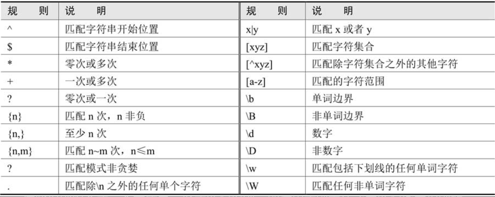
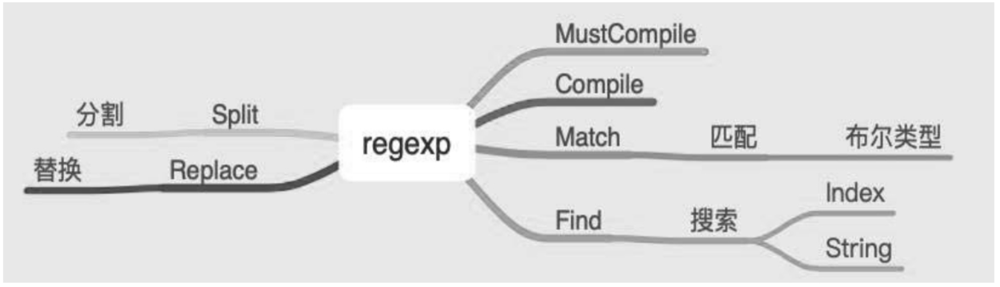

.. contents::
   :depth: 3
..

regexp
======

关于字符串的操作，除了strings提供的基本操作外，还包括一个与字符串相关的重要操作一一搜索。对字符串按指定规则进行搜索，可以使用正则表达式。

Go标准库使用RE2语法，RE2语法也是Python、C和Perl使用的正则表达式语法。
Go的正则语法和Python类似。

1.正则表达式主要规则表
----------------------

这些规则组合成一个字符串，形成匹配规则，即使用正则表达式来匹配指定规则的内容。

2. 使用正则表达式
-----------------

2.1 常用函数
~~~~~~~~~~~~

-  MatchString()
-  FindString()
-  FindStringIndex()
-  FindStringSubmatch()
-  ReplaceAllString()
-  Compile()
-  MustCompile()
-  FindAllString()

2.2 MatchString
~~~~~~~~~~~~~~~

如果字符串中有子字符串与正则表达式匹配，返回true，否则返回false。

.. code:: go

   package main

   import (
       "fmt"
       "regexp"
   )

   func main() {
       str := "To be or not to be, that's a question."
       // 判断str是否是以To开头
       m, err := regexp.MatchString(`^To`, str)
       fmt.Println("Match:", m, "Error:", err)
   }

2.3 FindString
~~~~~~~~~~~~~~

返回第一个匹配的结果。 如果没有匹配成功，返回一个空的字符串。

.. code:: go

   package main

   import (
       "fmt"
       "regexp"
   )

   func main() {
       str := "Golang expressions example"
       r, _ := regexp.Compile("Gola([a-z]+)g")
       fmt.Println(r.FindString(str))  // Golang
   }

2.4 FindStringIndex
~~~~~~~~~~~~~~~~~~~

FindStringIndex()可以得到匹配的字符串在整体字符串中的索引位置。如果没有匹配的字符串，它回返回nil。

.. code:: go

   package main

   import (
       "fmt"
       "regexp"
   )

   func main() {
       str := "Golang regular expressions example"
       r, err := regexp.Compile(`exp`)
       if err != nil {
           fmt.Println(err)
       }
       match := r.FindStringIndex(str)
       fmt.Println("Match: ", match, "Error: ", err)
   }

2.5 FindStringSubmatch
~~~~~~~~~~~~~~~~~~~~~~

FindStringSubmatch() 除了返回匹配的字符串外，还会返回子表达式的匹配项。
如果没有匹配项，则返回nil。

.. code:: go

   package main

   import (
       "fmt"
       "regexp"
   )

   func main() {
       str := "Golang regular expressions example"
       r, err := regexp.Compile(`p([a-z]+)e`)
       match := r.FindStringSubmatch(str)
       fmt.Println("Match:", match, " Error:", err)
   }

   // Match: [15 18] Error: <nil>

2.6 FindAllString
~~~~~~~~~~~~~~~~~

FindString方法的All版本，它返回所有匹配的字符串的slice。
如果返回nil代表没有匹配的字符串。

.. code:: go

   package main

   import (
       "fmt"
       "log"
       "regexp"
   )

   func main() {
       str := "Golang regular expressions example"
       r, err := regexp.Compile(`p([a-z]+)e`)
       if err != nil {
           log.Fatalln(err)
       }
       match := r.FindAllString(str, 2)
       fmt.Println("Match: ", match, " Error: ", err)
   }

2.7 ReplaceAllString
~~~~~~~~~~~~~~~~~~~~

ReplaceAllString 用来替换所有匹配的字符串，返回一个源字符串的拷贝。

.. code:: go

   package main

   import (
       "fmt"
       "log"
       "regexp"
   )

   func main() {
       str := "Golang regular expressions example"
       r, err := regexp.Compile(`examp([a-z]+)e`)
       if err != nil {
           log.Fatalln(err)
       }
       match := r.ReplaceAllString(str, "tutorial")
       fmt.Println("Match: ", match, " Error: ", err)
   }

   // Match: Golang regular expressions tutorial  Error: <nil>

3.Find系列函数
--------------

-  当方法名中有All的时候，它回继续查找非重叠的后续的字符串，返回slice。
-  当方法名中有String的时候，参数设计字符串，否则时byte slice。
-  当方法名中有Submatch的时候，还会返回子表达式(capturing
   group)的匹配项。

综合示例
~~~~~~~~

.. code:: go

   package chapter4

   import (
       "fmt"
       "regexp"
   )

   func SimpleUsage() {
       Slogan := "Go is an open source programming language that makes it easy to build simple, reliable, and efficient software."

       reg, _ := regexp.Compile("open source programming language")
       if reg.Match([]byte(Slogan)) {
           fmt.Println("byte: Match")
       }

       if reg.MatchString(Slogan) {
           fmt.Println("string: Match")
       }

   }

   func SearchUsage() {
       Slogan := "Go is an open source programming language that makes it easy to build simple, reliable, and efficient software."

       reg, _ := regexp.Compile("open source programming language")
       v := reg.Find([]byte(Slogan))
       fmt.Println(string(v))

       v2 := reg.FindString(Slogan)
       fmt.Println(v2)
   }

   func ReplaceUsage() {
       Slogan := "Go is an open source programming language that makes it easy to build simple, reliable, and efficient software."

       reg, _ := regexp.Compile(`^Go`)
       result := reg.ReplaceAllString(Slogan, "Python")

       fmt.Println(result)
   }

   func SplitUsage() {
       Slogan := "Go is an open source programming language that makes it easy to build simple, reliable, and efficient software."

       reg, _ := regexp.Compile(`\s|\,|\.`) // 按" "、","、"." 分割

       result := reg.Split(Slogan, -1)
       fmt.Println(result)
   }

4. 小结
-------

regexp库提供了匹配（Match_X）、搜索（Find_X）、替换（Replace_X）和分割（Split）等功能，完成这些任务有以下两个关键点：

（1）使用Compile函数编译正则表达式。

（2）编写符合场景的匹配规则，匹配规则又取决于开发者对正则表达式的熟悉程度。
