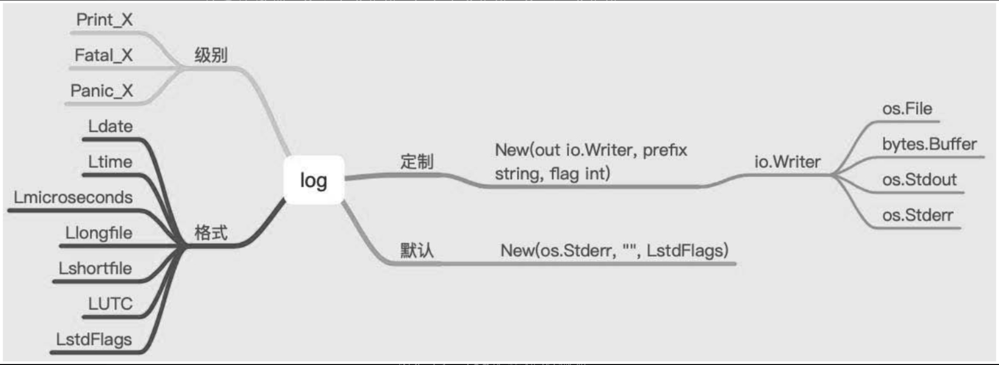

.. contents::
   :depth: 3
..

log
===

在日常开发中，有效地处理日志信息对应用程序的调试和排错都非常重要。当系统不复杂时，在终端打印出有效的处理信息就能够完成查看等功能。但是如果系统报错，终端打印的信息是不会存储下来的，如果没有日志信息，就会错过一些重要的信息，不利于调试和排错。

日志的级别：Print_X系列、Fatal_X系列、Panic_X系列。

日志的格式：比如文件的名称、具体的报错位置、时间等，方便开发人员调试和排错。日志的输出：比如将日志存储在磁盘上。

1.默认日志格式
--------------

.. code:: go

   func DefaultUsageForLog() {

       log.Print("Hello World, Golang")
       log.Println("Hello World, Golang")
       log.Printf("Hello World, %s", "Golang")

       fmt.Println("log Prefix", log.Prefix())
       fmt.Println("log Flags", log.Flags())
   }

我们可以像下面的代码一样直接通过log包来调用上面提到的方法，默认它们会将日志信息打印到终端界面：

.. code:: go

   package main

   import "log"

   func main() {
       log.Println("这是一条很普通的日志.")
       v := "很普通的"
       log.Printf("这是一条%s日志。\n",v)
       log.Fatalln("这是一条会触发fatal的日志。")
       log.Panicln("这是一条会触发panic的日志。")
   }

logger会打印每条日志信息的日期、时间，默认输出到系统的标准错误。

Fatal系列函数会在写入日志信息后调用os.Exit(1)。

Panic系列函数会在写入日志信息后panic。

2.配置logger
------------

默认情况下的logger只会提供日志的时间信息，但是很多情况下我们希望得到更多信息，比如记录该日志的文件名和行号等。log标准库中为我们提供了定制这些设置的方法。

log标准库中的Flags函数会返回标准logger的输出配置，而SetFlags函数用来设置标准logger的输出配置。

.. code:: go

   func Flags() int
   func SetFlags(flag int)

log标准库提供了如下的flag选项，它们是一系列定义好的常量。

.. code:: go

   const (
       // 控制输出日志信息的细节，不能控制输出的顺序和格式。
       // 输出的日志在每一项后会有一个冒号分隔：例如2009/01/23 01:23:23.123123 /a/b/c/d.go:23: message
       Ldate         = 1 << iota     // 日期：2009/01/23
       Ltime                         // 时间：01:23:23
       Lmicroseconds                 // 微秒级别的时间：01:23:23.123123（用于增强Ltime位）
       Llongfile                     // 文件全路径名+行号： /a/b/c/d.go:23
       Lshortfile                    // 文件名+行号：d.go:23（会覆盖掉Llongfile）
       LUTC                          // 使用UTC时间
       LstdFlags     = Ldate | Ltime // 标准logger的初始值
   )

下面我们在记录日志之前先设置一下标准logger的输出选项如下：

.. code:: go

   package main

   import "log"

   func main() {
       log.SetFlags(log.Llongfile | log.Lmicroseconds | log.Ldate)
       log.Println("这是一条很普通的日志。")
   }

   //2020/09/21 14:26:10.276892 D:/go_studay/go_path/src/github.com/go_Test/go007/src/go_log02/main.go:7: 这是一条很普通的日志。

3.配置日志前缀
--------------

log标准库中还提供了关于日志信息前缀的两个方法：

.. code:: go

       func Prefix() string    
       func SetPrefix(prefix string)

.. code:: go

   package main

   import "log"

   func main() {
       log.SetFlags(log.Llongfile | log.Lmicroseconds | log.Ldate)
       log.Println("这是一条很普通的日志。")
       log.SetPrefix("[ttserver]")
       log.Println("这是一条很普通的日志。")
   }

   //2020/09/21 14:27:55.635287 D:/go_studay/go_path/src/github.com/go_Test/go007/src/go_log03/main.go:7: 这是一条很普通的日志。

   //[ttserver]2020/09/21 14:27:55.766934 D:/go_studay/go_path/src/github.com/go_Test/go007/src/go_log03/main.go:9: 这是一条很普通的日志。

这样我们就能够在代码中为我们的日志信息添加指定的前缀，方便之后对日志信息进行检索和处理。

4.配置日志输出位置
------------------

::

   func SetOutput(w io.Writer)

SetOutput函数用来设置标准logger的输出目的地，默认是标准错误输出。

.. code:: go

   package main

   import (
       "fmt"
       "log"
       "os"
   )

   func main() {
       logFile, err := os.OpenFile("./ttserver.log", os.O_CREATE|os.O_WRONLY|os.O_APPEND, 0644)
       if err != nil {
           fmt.Println("open log file failed, err:", err)
           return
       }
       log.SetOutput(logFile)
       log.SetFlags(log.Llongfile | log.Lmicroseconds | log.Ldate)
       log.Println("这是一条很普通的日志。")
       log.SetPrefix("[小王子]")
       log.Println("这是一条很普通的日志。")

   }

如果你要使用标准的logger，我们通常会把上面的配置操作写到init函数中。

.. code:: go

   func init() {
       logFile, err := os.OpenFile("./xx.log", os.O_CREATE|os.O_WRONLY|os.O_APPEND, 0644)
       if err != nil {
           fmt.Println("open log file failed, err:", err)
           return
       }
       log.SetOutput(logFile)
       log.SetFlags(log.Llongfile | log.Lmicroseconds | log.Ldate)
   }

5.定制化日志格式
----------------

log标准库中还提供了一个创建新logger对象的构造函数–New，支持我们创建自己的logger示例。New函数的签名如下：

::

   func New(out io.Writer, prefix string, flag int) *Logger

.. code:: go

   func SpecialUsageLog() {

       // 实例化 log.Logger 结构体
       logger := log.New(os.Stdout, "Golang ", log.Lshortfile)
       //
       logger.Println("Hello World, Golang")
   }

.. code:: go

   func SpecialUsageWithBytes() {

       var buf bytes.Buffer
       logger := log.New(&buf, "Hi! ", log.Lshortfile)

       logger.Println("Hello World, Golang")

       fmt.Println(buf.String())
   }

   func SpecialUsageWithFile() {

       file, _ := os.Create("log.log")
       logger := log.New(file, "Hi!", log.Lshortfile)

       logger.Println("Hello World, Golang")
   }

.. code:: go

   package main

   import (
       "log"
       "os"
   )

   func main() {
       logger := log.New(os.Stdout,"<xtserver>:",log.Lshortfile|log.Ldate|log.Ltime)
       logger.Println("这是自定义的logger记录的日志")

   }

   // <xtserver>:2022/07/09 14:50:18 main.go:10: 这是自定义的logger记录的日志

参考文献：

https://www.cnblogs.com/zhangyafei/p/12952179.html

6.案例-log简易封装
------------------

.. code:: go

   package main
    
   import (
       "fmt"
       "io/ioutil"
       "log"
       "mime/multipart"
       "os"
       "path"
   )
    
   // Level These are the integer logging levels used by the logger
   type Level int
    
   // Comment
   const (
       DEBUG Level = iota
       INFO
       WARNING
       ERROR
       FATAL
   )
    
   var (
       logPrefix  = ""
       levelFlags = []string{"DEBG", "INFO", "WARN", "ERRO", "FATL"}
    
       logger  *log.Logger
       loggerf *log.Logger
    
       // curLevel ...
       curLevel Level
       //
       logfile *os.File
   )
    
   func init() {
       curLevel = DEBUG
       logger = log.New(os.Stdout, "[default] ", log.LstdFlags)
       logger.SetFlags(log.Ldate | log.Lmicroseconds | log.Llongfile)
   }
    
   // Println ..
   func Println(l *log.Logger, v ...interface{}) {
       if l != nil {
           l.Output(3, fmt.Sprintln(v...))
       }
    
   }
    
   // Fatalln is equivalent to l.Println() followed by a call to os.Exit(1).
   func Fatalln(l *log.Logger, v ...interface{}) {
       if l != nil {
           l.Output(3, fmt.Sprintln(v...))
           os.Exit(1)
       }
   }
    
   // Debug ...
   func Debug(v ...interface{}) {
       setPrefix(DEBUG)
       if DEBUG >= curLevel {
           Println(logger, v)
           Println(loggerf, v)
       }
    
   }
    
   // Info ...
   func Info(v ...interface{}) {
       setPrefix(INFO)
       if INFO >= curLevel {
           Println(logger, v)
           Println(loggerf, v)
       }
   }
    
   // Warn ...
   func Warn(v ...interface{}) {
       setPrefix(WARNING)
       if WARNING >= curLevel {
           Println(logger, v)
           Println(loggerf, v)
       }
   }
    
   // Error Warn
   func Error(v ...interface{}) {
       setPrefix(ERROR)
       if ERROR >= curLevel {
           Println(logger, v)
           Println(loggerf, v)
       }
   }
    
   // Fatal ...
   func Fatal(v ...interface{}) {
       setPrefix(FATAL)
       if FATAL >= curLevel {
           Fatalln(logger, v)
           Fatalln(loggerf, v)
       }
    
   }
   func setPrefix(level Level) {
       logPrefix = fmt.Sprintf("[%s] ", levelFlags[level])
       logger.SetPrefix(logPrefix)
       if loggerf != nil {
           loggerf.SetPrefix(logPrefix)
       }
   }
    
   // Config ..
   func Config(level Level, lfile *os.File) {
       curLevel = level
       loggerf = log.New(lfile, "[default] ", log.LstdFlags)
       loggerf.SetFlags(log.Ldate | log.Lmicroseconds | log.Llongfile)
   }
    
   func main() {
    
       lgfile, err := MustOpen("log.txt", "mylog1/")
       if err != nil {
           Error("Failed to open log file:" + err.Error())
       }
    
       Config(DEBUG, lgfile)
    
       Debug("message")
       Info("message")
       Warn("message")
       Error("message")
   }

要支持文件，则再加上以下几个操作文件和目录的：

.. code:: go

   func GetSize(f multipart.File) (int, error) {
       content, err := ioutil.ReadAll(f)
    
       return len(content), err
   }
    
   func GetExt(fileName string) string {
       return path.Ext(fileName)
   }
    
   func CheckNotExist(src string) bool {
       _, err := os.Stat(src)
       return os.IsNotExist(err)
   }
    
   func CheckPermission(src string) bool {
       _, err := os.Stat(src)
       return os.IsPermission(err)
   }
    
   func IsNotExistMkDir(src string) error {
       if notExist := CheckNotExist(src); notExist == true {
           if err := MkDir(src); err != nil {
               return err
           }
       }
    
       return nil
   }
    
   func MkDir(src string) error {
       err := os.MkdirAll(src, os.ModePerm)
       if err != nil {
           return err
       }
       return nil
   }
    
   func Open(name string, flag int, perm os.FileMode) (*os.File, error) {
       f, err := os.OpenFile(name, flag, perm)
       if err != nil {
           return nil, err
       }
    
       return f, nil
   }
    
   func MustOpen(fileName, filePath string) (*os.File, error) {
       dir, err := os.Getwd()
       if err != nil {
           return nil, fmt.Errorf("os.Getwd err: %v", err)
       }
    
       src := dir + "/" + filePath
       perm := CheckPermission(src)
       if perm == true {
           return nil, fmt.Errorf("file.CheckPermission Permission denied src: %s", src)
       }
    
       err = IsNotExistMkDir(src)
       if err != nil {
           return nil, fmt.Errorf("file.IsNotExistMkDir src: %s, err: %v", src, err)
       }
    
       f, err := Open(src+fileName, os.O_APPEND|os.O_CREATE|os.O_RDWR, 0644)
       if err != nil {
           return nil, fmt.Errorf("Fail to OpenFile :%v", err)
       }
    
       return f, nil
   }

7.小结
------

其他log相关的三方库

-  `logrus <https://links.jianshu.com/go?to=https%3A%2F%2Fdarjun.github.io%2F2020%2F02%2F07%2Fgodailylib%2Flogrus%2F>`__
   使用非常广泛的开源日志库。 Go的结构化记录器

参考文献：https://darjun.github.io/2020/02/07/godailylib/logrus/

-  `zap <https://github.com/uber-go/zap>`__ -
   Go中快速，结构化，分级的日志记录。

其他：

https://www.topgoer.cn/docs/gokaiyuancangku/gokaiyuanLogging

日志的有效使用能够让我们在遇到问题时快速定位问题，否则查找问题的效率将大打折扣。
日志的使用需要注意以下三点：

（1）正确使用日志的级别，什么时候使用输出级别，什么时候使用报错级别，等等。

（2）默认的日志格式，实质上默认初始化了log.Logger结构体。

（3）定制化日志格式，需要实例化log.Logger结构体，再调用相应的方法。
