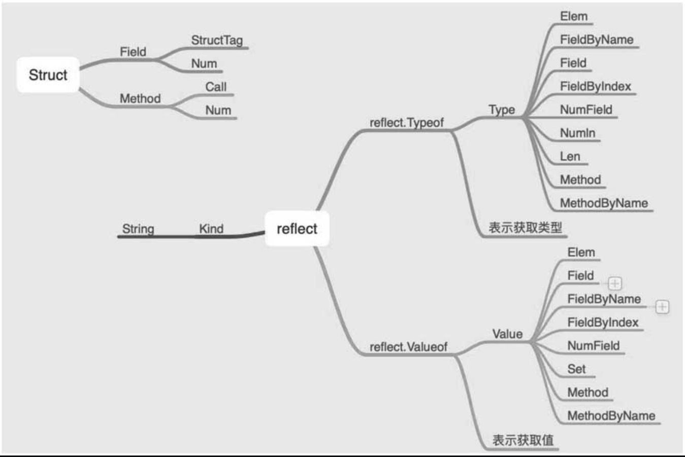

# reflect/unsafe

反射操作是指通过某种机制能够实现对自己行为的描述，根据自身行为的状态和结果去调整或修改应用所描述行为的状态和相关的语义。

## 1. reflect

在Go语言中，支持反射操作的内置库是reflect，在反射中包括Type类型和Value值两大核心，具体如图



关于类型和值的操作，其中简单的操作是调用TypeOf和ValueOf分别获取类型和值。

```GO
package main

import (
	"fmt"
	"reflect"
)

func main() {
	Age :=20
	fmt.Printf("%T\n",Age)				//int
	typ := reflect.TypeOf(Age)			//int
	fmt.Println(typ)
	fmt.Println(reflect.ValueOf(Age))	//20
}
```

格式化输出%T用于获取类型。reflect.TypeOf用于获取类型，reflect.Valueof用于获取对象的值。

更为常见的关于反射操作的应用场景是对结构体进行操作，通过之前的学习可知，结构体的基本结构如下：

```go
package main

import "fmt"

type Example struct {
	Fileld int `json:"one"`
	Fileld2 string `json:"two"`

}

func (e Example) String() string {
	return fmt.Sprintf("%d: %s",e.Fileld,e.Fileld2)
}
```


关于结构体有如下知识点：

（1）字段（属性分为是否可导出，判断标准为字段名的首字母是否为大小写），上例中为Field和Field2。

（2）结构体标签，上例中为one和two。

（3）方法，上例中为String方法。


对结构体的反射操作能够让我们很轻松地操作结构体，通过结构体标签和方法同样能够改变结构体中各字段的值。

```go
package main

import (
	"bytes"
	"fmt"
)

type ReflectUsage struct {
	Name string `json:"name"`
	Age  int    `json:"age"`
}

func (ref ReflectUsage) String() string {
	return fmt.Sprintf("Name: %s, Age: %d", ref.Name, ref.Age)
}

func (ref *ReflectUsage) AddAge(add int) int {
	ref.Age += add
	return ref.Age
}

func (ref ReflectUsage) MarshalJSON() ([]byte, error) {
	var buf bytes.Buffer
	buf.WriteString(fmt.Sprintf("Name: %s", ref.Name))
	return buf.Bytes(), nil
}

```

为了演示方便，我们定义一个结构体ReflectUsage，该结构体包含Name和Age两个字段，相应的类型为string和int，

同时定义了该结构体的String、AddAge和MarshalJSON三个方法，其中AddAge是指针方法，其他是值方法。

通过反射来操作该结构体，使其能获取到结构体的字段、方法并进行相应的操作。

```go
func Usage() {
	var example ReflectUsage
	example.Name = "XieWei"
	example.Age = 20

	// 获取类型的两种方法
	typ := reflect.TypeOf(example)
	fmt.Printf("%T\n", example)		// main.ReflectUsage
	fmt.Println(typ)						// main.ReflectUsage

	// 获取值的两种方法
	val := reflect.ValueOf(example)
	fmt.Printf("%#v\n", example)		// main.ReflectUsage{Name:"XieWei", Age:20}
	fmt.Printf("%v\n", example)		// Name: XieWei, Age: 20
	fmt.Println(val)						// Name: XieWei, Age: 20

	// 结构体包含：字段(标签、值）、方法
	fmt.Println(typ.NumField(), typ.NumMethod())	// 2 2
	fmt.Println(val.NumField(), val.NumMethod())	// 2 2

	// 通过 type 获取标签属性
	fmt.Println(typ.FieldByName("Name"))		// {Name  string json:"name" 0 [0] false} true
	fmt.Println(typ.FieldByName("Age"))		// {Age  int json:"age" 16 [1] false} true

	// 通过 value 获取标签值
	fmt.Println(val.FieldByName("Name"))		// XieWei
	fmt.Println(val.FieldByName("Age"))		// 20

	// 函数的个数是根据传值的才计数，函数的排序根据函数名称的字母，函数可以调用
	fmt.Println(typ.NumMethod(), typ.Method(0))		// 2 {MarshalJSON  func(main.ReflectUsage) ([]uint8, error) <func(main.ReflectUsage) ([]uint8, error) Value> 0}
	fmt.Println(typ.NumMethod(), typ.Method(1))		// 2 {String  func(main.ReflectUsage) string <func(main.ReflectUsage) string Value> 1}

	methodOne := val.Method(1)
	args := make([]reflect.Value, 0)
	result := methodOne.Call(args)
	fmt.Println(result)		// [Name: XieWei, Age: 20]

	methodTwo := val.MethodByName("MarshalJSON")
	argsTwo := make([]reflect.Value, 0)
	resultTwo := methodTwo.Call(argsTwo)
	fmt.Println(string(resultTwo[0].Bytes()))			// Name: XieWei

	// 可以重新对结构体赋值操作，前提是获得指针
	valCanSet := reflect.ValueOf(&example)
	ptr := valCanSet.Elem()
	ptr.FieldByName("Age").SetInt(100)
	fmt.Println(example)				// Name: XieWei, Age: 100

}
```

从这些基本的使用来看，反射库提供的函数基本是在操作对象的属性和方法。根据类型和值，开发人员可以灵活地操作对象，比如判断类型、获取值、改变值等。


如何才能快速记忆反射提供的方法呢？

主要还是对结构体的理解，毕竟一般的反射操作的是结构体。

结构体包含字段、标签和方法。

字段有类型、名称和索引。

方法有名称、索引、参数和返回值。

指针即为指向对象的地址，可以更改对象。

与此相对应的是，可以记忆反射提供的这些函数：`FieldByName/FieldByIndex/Filed`、`MethodByName/Method`。

反射操作中统计对象（结构体）方法的个数其依据是值传递，如果是引用传递，就不统计该方法，比如AddAge方法。

另外，方法的排序是根据方法名称的ASCII码排序的，虽然支持索引的方式获取字段和方法，但是建议使用X_ByName形式的函数，这样不容易出错。要改变结构体中属性的值，需要先获取指针，再调用Set_X函数。


参考文献：

https://www.cnblogs.com/itbsl/p/10551880.html


## 2. unsafe

内置库unsafe提供了更为纯粹的操作指针的库，从库名可以看出，官方并不推荐使用unsafe库，因为它绕过了Golang的内存安全原则，是不安全的，除非开发者知道它具体在做什么。


unsafe库仅提供了3个可导出的函数和两个类型：

类型1：ArbitraryType。

类型2：Pointer。

函数Sizeof：获取所占内存空间的字节数。

函数Offsetof：获取偏移量，比如数组是连续分配内存空间的，索引index表示的就是偏移量。

函数Alignof：边界对齐。

```GO
func UnsafeUsage() {
	var example ReflectUsage
	example.Name = "XieWei"
	example.Age = 20

	typ := reflect.TypeOf(unsafe.Sizeof(example))
	fmt.Println(typ)		// uintptr

	fmt.Println(unsafe.Sizeof(example))	// //获取所占内存空间的字节数  	// 24

	ptr := unsafe.Pointer(&example) //  第一个字段地址
	fmt.Println(ptr)		// 0xc000004078
	fmt.Println(*(*string)(ptr)) //  强制类型转换成第一个字段类型，获取值		// XieWei

	ptrOfSecondField := unsafe.Pointer(uintptr(ptr) + unsafe.Offsetof(example.Age))
	fmt.Println(ptrOfSecondField)		// 0xc000004088
	fmt.Println(*(*int)(ptrOfSecondField))	// 20

	*(*int)(ptrOfSecondField) = 32
	fmt.Println(example)	// Name: XieWei, Age: 32

}
```

unsafe.Pointer：将对象转换为指针。

uintptr：可以实现指针的操作，即和偏移量相加等。

unsafe.Offsetof：获取偏移量。


unsafe库提供的操作


结构体在内存分配上是连续的，如果知道结构体字段的属性，就可以通过指针的操作来改变属性的值，同时根据偏移量也能获取或者改变属性。

结构体的内存地址表示的是第一个字段的内存地址。


