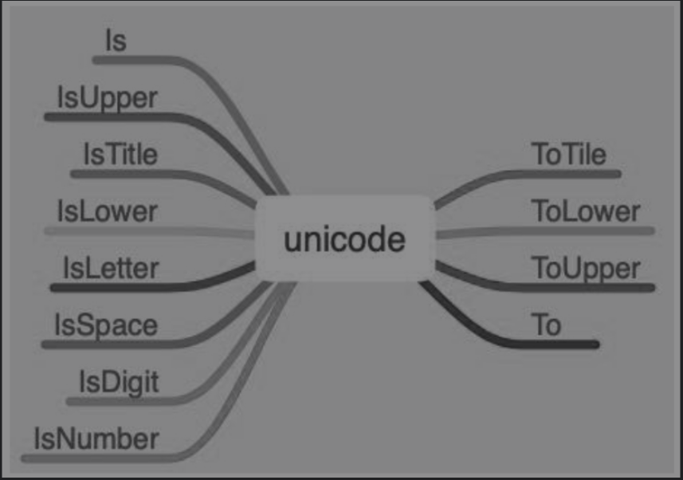

# unicode

unicode称为统一码，是为了将世界上存在的各种语言用于计算机中，统一码对世界上绝大多数语言的文字系统进行了编码，使得计算机可以使用更加简单的方式来呈现和处理这些文字，

如图所示。统一码定义了一个字符和字符编码之间的映射，每个字符的编码都是唯一的。统一码可以认为是一种标准和规范，具体的实现方式各不相同，UTF-8和UTF-16是这种映射关系的两种不同的实现。



unicode库提供的操作


## 1. 判断字符是否包含字母和数字

使用下面的代码判断字符是否包含字母、数字等。

```go
package main

import (
	"fmt"
	"unicode"
)

func UnicodeUsage() {

	var string = "你好 Golang 123"

	for _, i := range string {
        // 判断单个字符是不是字母
		if unicode.IsLetter(i) {
			fmt.Printf("Yes:%c ", i)
		} else {
			fmt.Printf("No:%c ", i)
		}

	}
	fmt.Println()
	for _, i := range string {
		if unicode.Is(unicode.Scripts["Han"], i) {
			fmt.Printf("%c\n", i)
		}
	}

	for _, i := range string {
		fmt.Printf("%c", unicode.ToUpper(i))
	}

}
func main() {
	UnicodeUsage()

}
```


IsLetter函数用于判断单个字符是不是字母，除了IsLetter函数之外，还有以下用于判断的函数：

```
func Is(rangeTab *RangeTable, r rune) bool
func In(r rune, ranges ...*RangeTable) bool
func IsOneOf(ranges []*RangeTable, r rune) bool
func IsSpace(r rune) bool
func IsDigit(r rune) bool
func IsNumber(r rune) bool
func IsLetter(r rune) bool
func IsGraphic(r rune) bool
func IsControl(r rune) bool
func IsMark(r rune) bool
func IsPrint(r rune) bool
func IsPunct(r rune) bool
func IsSymbol(r rune) bool
func IsLower(r rune) bool
func IsUpper(r rune) bool
func IsTitle(r rune) bool
```

结合使用strings和unicode库可以轻松完成一些任务，比如清除字符串首尾中符合某种条件的字符、替换字符串中符合某种条件的字符。

```go
package main

import (
	"fmt"
	"strings"
	"unicode"
)

func main() {
	fmt.Print(strings.TrimFunc("!!!Hello Gophers!!!", func(r rune) bool{return !unicode.IsLetter(r)&& !unicode.IsNumber(r)}))
	f := func(c rune) bool{ return !unicode.IsLetter(c) && !unicode.IsNumber(c)}
	fmt.Printf("Fields are: %q",strings.FieldsFunc("foo1;bar2,baz3....",f))
}
```

## 2. 转换字符

对字符进行转换，比如字母大小写的转换。

```go
func UnicodeUsage()  {
	var starings = "hello gophers!!, golang"
	for _, i:= range starings {
		fmt.Printf("%c",unicode.ToUpper(i))
	}
}
```

除了ToUpper转换函数之外，还存在ToLower、ToTitle函数。在内置库strings和bytes中也提供了类似的函数（方法）。对开发者而言，可以选择的方式更多了。


## 3. 字符集

在功能开发中有时会限定语言，比如注册用户名时只能使用中文、韩文等，统一码就是为了解决对不同文字系统的支持，使用unicode可以轻松地解决这个问题。

```go
package main

import (
	"errors"
	"fmt"
	"unicode"
)


func RegisterUserName(name string, table *unicode.RangeTable) error {
	for _, i := range name {
		if !unicode.Is(table, i) {
			return errors.New("scripts is not correct")
		}
	}
	return nil
}


func main() {
	fmt.Println(RegisterUserName("赵云1",unicode.Scripts["Han"]))
	fmt.Println(RegisterUserName("한국어",unicode.Scripts["Hangul"]))
}
```

上文中第一个函数参数包含英文字符，报错；第二个函数参数只包含韩文，通过。

## 4. 小结

本节主要讲述了统一码的使用，包括以下3个方面：

（1）判断：判断字符是否符合指定的要求。

（2）转换：将字符进行转换，例如字母大小写转换等操作。

（3）字符集：包括各国和地区语言的字符集。


