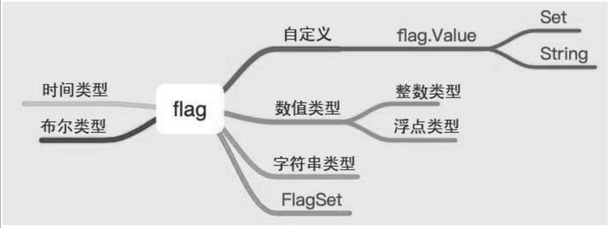

# flag和go-flags

## 1. flag简介

```
import "flag"
```

flag包实现了命令行参数的解析。

在日常开发中经常会使用终端命令，特别是使用Linux作为开发环境时，使用到命令行的机会更多，因为几乎所有的服务器都使用Linux操作系统。再者，经常使用到的服务方式都是C/S（客户端/服务器端）的架构，如何和服务器端进行交互呢？

一种方式是服务器端提供RESTful API的形式，以便于用户来操作服务器端的资源；

另一种形式是客户端对服器务端的操作进行封装，提供命令行的形式与服务器端进行交互。比如经常使用的容器服务Docker，用户之所以可以操作镜像和容器，就是因为Docker采用的是C/S架构，启动Docker本地即启动Docker服务，在终端中使用docker命令即可操作服务器端的资源。

在Go语言中支持对命令参数的解析，提供的库是flag，可以采用内置的基本数据类型用于参数的解析，比如整数类型、浮点类型、布尔类型、字符串类型、时间类型等，

有两种不同的方式可用于操作这几种基本数据类型，

**一种是先声明变量的形式，**

**另一种是直接使用指针的形式，**

如图



flag库提供的操作

下面查看基本的使用方式：

```go
func FlagUsage() {
	var number int
	flag.IntVar(&number, "n", 10, "number")

	name := flag.String("name", "Go", "name of language")

	now := flag.Duration("time", time.Second, "time")
	flag.Parse()

	flag.PrintDefaults()
	fmt.Println(number, *name, *now)
}
```

flag.IntVar/flag.Float64Var/flag.Int64Var/flag.Uint64Var/flag.UintVar/flag.BoolVar/flag.StringVar/flag.DurationVar：适用于声明变量的形式。

flag.Int/flag.Float/flag.Int64/flag.Uint64/flag.Uint/flag.Bool/flag.String/flag.Duration：适用于将值通过指针形式进行赋值。

区分这两种方式可以直接从方法的名称入手，带Var的关键字需要赋予指定的变量。

这两种方式可以指定接收命令的短参数、默认值以及帮助提示。必须使用flag.Parse才能正确地解析命令行参数。

```shell
 $ go run main.go -n 100 -name python -time 1h10m
  -n int
        number (default 10)
  -name string
        name of language (default "Go")
  -time duration
        time (default 1s)
100 python 1h10m0s
```

也能采用=的形式进行

```shell
$ go run main.go -n=1000 -name=golang -time 1h20m30s
  -n int
        number (default 10)
  -name string
        name of language (default "Go")
  -time duration
        time (default 1s)
1000 golang 1h20m30s
```

默认对整数类型、浮点类型、字符串类型、布尔类型、时间类型进行操作，即将从命令行终端中获取到的值转变为整数类型、浮点类型、字符串类型、布尔类型和时间类型。如果想把从命令行终端获取的值转变为自定义类型，比如将传入的字符串转变为切片、数组、自定义类型，如何实现呢？

```
type Value interface {
	String() string
	Set(string) error
}
```

可以看出要实现自定义的类型解析，需要实现String方法和Set方法。

Set方法的作用是将接收的值转换成自定义类型，所以需要使用指针方法；

String方法是为了实现格式化输出。

### 1.1 示例

自定义类型

```go
package main

import (
	"flag"
	"fmt"
	"strconv"
	"strings"
)

type Numbers struct {
	Num []int
}

func (n *Numbers) Set(value string) error {
	sList := strings.Split(value, "|")
	var num []int
	for _, i := range sList {
		in, _ := strconv.Atoi(i)
		num = append(num, in)
	}
	n.Num = num
	return nil
}

func (n *Numbers) String() string {
	return fmt.Sprintf("%#v", n.Num)
}

func FlagSpecial() {
	var n Numbers
	flag.Var(&n, "n", "number to parse")
	flag.Parse()
	// flag.PrintDefaults()
	fmt.Println(n.Num)
}

func main() {
	FlagSpecial()
}
```

自定义结构体Numbers。

实现Set和String方法。

具体是将“|”分隔符分隔的字符串转化为Numbers的属性。

```shell
$ go run main.go -n "1|2|3"
  -n value
        number to parse
[1 2 3]
```


### 1.2 示例

```go
package main

import (
	"flag"
	"fmt"
)

func main() {
	var confPath string
	var port int
	var b bool

	flag.StringVar(&confPath, "conf", "", "input config path.")
	flag.IntVar(&port, "p", 8000, "")
	flag.BoolVar(&b, "b", false, "input bool.")
	//注册
	flag.Parse()
	fmt.Println("configPath: ", confPath)
	fmt.Println("port: ", port)
	fmt.Println("b: ", b)
}
```


```shell
$ go build -o bin/flag.exe  github.com/flag_project/src/go_dev/args

$ flag.exe -conf "/home/config" -p 8080 -b true
configPath:  /home/config
port:  8080
b:  true
```


### 1.3 示例

Mysql接收参数的例子

```go
package main

import (
	"flag"
	"fmt"
)

func main() {
	var Username string
	var Password string
	var port int
	var DBname string

	flag.StringVar(&Username,"u","","mysql User")
	flag.StringVar(&Password,"p","","mysql Password")
	flag.IntVar(&port,"port",3306,"MySQL port default 3306")
	flag.StringVar(&DBname,"db","","MySQL database name")

	//注册
	flag.Parse()

	fmt.Println("MySQL Username: ",Username)
	fmt.Println("MySQL Password: ",Password)
	fmt.Println("MySQL Port: ",port)
	fmt.Println("MySQL DBName: ",DBname)
	if Username != "root" {
		fmt.Println("please input mysql user root!")
	}
}
```

```
D:\go_studay\go_path\src\github.com\flag_project>go build -o bin/mysql.exe  github.com/flag_project/src/go_dev/mysqlArgs

D:\go_studay\go_path\src\github.com\flag_project\bin>mysql.exe -u root -p admin#123! -db dbweb
MySQL Username:  root
MySQL Password:  admin#123!
MySQL Port:  3306
MySQL DBName:  dbweb
```


### 1.4 示例

```go
package main

import (
	"flag"
	"fmt"
	"os"
	"strconv"
	"strings"
)

func usage() {
	flag.Usage()
	fmt.Printf("\n")
	fmt.Printf("Format:\nmooon_ssh -h=host1,host2,... -P=port -u=user -p=password -c=command\n")
	fmt.Printf("\n")
	fmt.Printf("Example:\nmooon_ssh -h=192.168.31.32 -P=22 -u=root -p='root@2018' -c='whoami'\n")
	fmt.Printf("\n")
}

func main() {
	var (
		g_help     = flag.Bool("H", false, "Display a help message and exit")
		g_hosts    = flag.String("h", "", "Connect to the remote machines on the given hosts separated by comma, can be replaced by environment variable 'H'")
		g_port     = flag.Int("P", 22, "Specifies the port to connect to on the remote machines, can be replaced by environment variable 'PORT'")
		g_user     = flag.String("u", "", "Specifies the user to log in as on the remote machines, can be replaced by environment variable 'U'")
		g_password = flag.String("p", "", "The password to use when connecting to the remote machines, can be replaced by environment variable 'P'")
		g_command  = flag.String("c", "", "The command is executed on the remote machines")
	)
	var hosts, user, password string
	var port int
	flag.Parse()

	// help
	if *g_help {
		usage()
		os.Exit(1)
	}

	// hosts
	if *g_hosts != "" {
		hosts = *g_hosts
	} else {
		s := os.Getenv("H")
		if s != "" {
			hosts = s
		} else {
			fmt.Printf("Parameter[\033[1;33m-h\033[m] not set\n\n")
			usage()
			os.Exit(1)
		}
	}

	// port
	s := os.Getenv("PORT")
	if s == "" {
		port = *g_port
	} else {
		port_, err := strconv.Atoi(s)
		if err != nil {
			fmt.Printf("Parameter[\033[1;33m-P\033[m]: invaid port\n\n")
			usage()
			os.Exit(1)
		} else {
			port = port_
		}
	}

	// user
	if *g_user != "" {
		user = *g_user
	} else {
		s := os.Getenv("U")
		if s != "" {
			user = s
		} else {
			fmt.Printf("Parameter[\033[1;33m-u\033[m] not set\n\n")
			usage()
			os.Exit(1)
		}
	}

	// password
	if *g_password != "" {
		password = *g_password
	} else {
		s := os.Getenv("P")
		if s != "" {
			password = s
		} else {
			fmt.Printf("Parameter[\033[1;33m-p\033[m] not set\n\n")
			usage()
			os.Exit(1)
		}
	}

	// command
	if *g_command == "" {
		fmt.Printf("Parameter[\033[1;33m-c\033[m] not set\n\n")
		usage()
		os.Exit(1)
	}

	host_array := strings.Split(hosts, ",")
	for _, host := range host_array {
		ip_port := host + ":" + fmt.Sprintf("%d", port)
		fmt.Println(ip_port, user, password)
	}
}
```


### 1.5 示例

```go
package main

import (
	"flag"
	"fmt"
	"log"
)

var (
	host     string
	port     string
	user     string
	password string
	dbname   string
)

func main() {
	// 定义参数数组
	args := []string{"-mysql.host", "1.2.3.4",
		"--mysql.port", "13389",
		"-mysql.user", "app_user",
		"-mysql.password", "123456",
	}
	fs := flag.NewFlagSet("mysql", flag.ContinueOnError)
	fs.StringVar(&host, "mysql.host", "127.0.0.1", "mysql host")
	fs.StringVar(&port, "mysql.port", "3389", "mysql port")
	fs.StringVar(&user, "mysql.user", "test", "mysql user")
	fs.StringVar(&password, "mysql.password", "nil", "mysql password")
	fs.StringVar(&dbname, "mysql.dbname", "app", "mysql database name")

	if err := fs.Parse(args); err != nil {  // 解析参数
		log.Fatalln(err)
	}

	fmt.Println("mysql host:", host)         // mysql host: 1.2.3.4
	fmt.Println("mysql port:", port)         // mysql port: 13389
	fmt.Println("mysql user:", user)         // mysql user: app_user
	fmt.Println("mysql password:", password) // mysql password: 123456
	fmt.Println("mysql dbname:", dbname)     // mysql dbname: app
}
```

NewFlagSet方法有两个参数，第一个参数是程序名称，输出帮助或出错时会显示该信息。第二个参数是解析出错时如何处理，有几个选项：

- ContinueOnError：发生错误后继续解析，CommandLine就是使用这个选项；
- ExitOnError：出错时调用os.Exit(2)退出程序；
- PanicOnError：出错时产生panic。


### 1.6 示例

```go
package main

import (
	"flag"
	"fmt"
)

var (
	intflag    *int
	boolflag   *bool
	stringflag *string
)

func init() {
	intflag = flag.Int("intflag", 0, "int flag value")
	boolflag = flag.Bool("boolflag", false, "bool flag value")
	stringflag = flag.String("stringflag", "default", "string flag value")
}

func main() {
	flag.Parse()

	fmt.Println("int flag:", *intflag)
	fmt.Println("bool flag:", *boolflag)
	fmt.Println("string flag:", *stringflag)
}

```


## 2. 参考文献

Go 每日一库之 flag

https://darjun.github.io/2020/01/10/godailylib/flag/

https://www.topgoer.cn/docs/goday/goday-1crg2k2ss6872


## 3. go-flags

参考文献

https://darjun.github.io/2020/01/10/godailylib/go-flags/


## 3.小结

要实现在终端中输入命令行的方式，可以使用内置库Flag，它提供了整数类型、浮点类型、字符串类型、时间类型等的接收参数，可以自动解析变量并转化为指定的类型，再进行后续的处理。另外，可以自定义解析任意类型的变量，只需要实现Value接口即可。


在后续的开发中还会接触一些优秀的第三方开源库，

比如urfave/cli（https://github.com/urfave/cli）或者cobra（https://github.com/spf13/cobra），

本质上这些开源库都封装了内置库Flag，提供了更为简便的处理方式。


