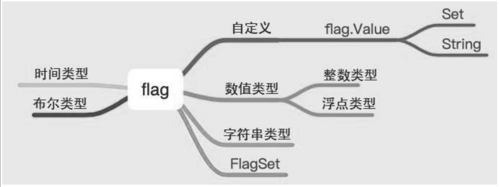

.. contents::
   :depth: 3
..

flag和go-flags
==============

1. flag简介
-----------

::

   import "flag"

flag包实现了命令行参数的解析。

在日常开发中经常会使用终端命令，特别是使用Linux作为开发环境时，使用到命令行的机会更多，因为几乎所有的服务器都使用Linux操作系统。再者，经常使用到的服务方式都是C/S（客户端/服务器端）的架构，如何和服务器端进行交互呢？

一种方式是服务器端提供RESTful
API的形式，以便于用户来操作服务器端的资源；

另一种形式是客户端对服器务端的操作进行封装，提供命令行的形式与服务器端进行交互。比如经常使用的容器服务Docker，用户之所以可以操作镜像和容器，就是因为Docker采用的是C/S架构，启动Docker本地即启动Docker服务，在终端中使用docker命令即可操作服务器端的资源。

在Go语言中支持对命令参数的解析，提供的库是flag，可以采用内置的基本数据类型用于参数的解析，比如整数类型、浮点类型、布尔类型、字符串类型、时间类型等，

有两种不同的方式可用于操作这几种基本数据类型，

**一种是先声明变量的形式，**

**另一种是直接使用指针的形式，**

如图

flag库提供的操作

下面查看基本的使用方式：

.. code:: go

   func FlagUsage() {
       var number int
       flag.IntVar(&number, "n", 10, "number")

       name := flag.String("name", "Go", "name of language")

       now := flag.Duration("time", time.Second, "time")
       flag.Parse()

       flag.PrintDefaults()
       fmt.Println(number, *name, *now)
   }

flag.IntVar/flag.Float64Var/flag.Int64Var/flag.Uint64Var/flag.UintVar/flag.BoolVar/flag.StringVar/flag.DurationVar：适用于声明变量的形式。

flag.Int/flag.Float/flag.Int64/flag.Uint64/flag.Uint/flag.Bool/flag.String/flag.Duration：适用于将值通过指针形式进行赋值。

区分这两种方式可以直接从方法的名称入手，带Var的关键字需要赋予指定的变量。

这两种方式可以指定接收命令的短参数、默认值以及帮助提示。必须使用flag.Parse才能正确地解析命令行参数。

.. code:: shell

    $ go run main.go -n 100 -name python -time 1h10m
     -n int
           number (default 10)
     -name string
           name of language (default "Go")
     -time duration
           time (default 1s)
   100 python 1h10m0s

也能采用=的形式进行

.. code:: shell

   $ go run main.go -n=1000 -name=golang -time 1h20m30s
     -n int
           number (default 10)
     -name string
           name of language (default "Go")
     -time duration
           time (default 1s)
   1000 golang 1h20m30s

默认对整数类型、浮点类型、字符串类型、布尔类型、时间类型进行操作，即将从命令行终端中获取到的值转变为整数类型、浮点类型、字符串类型、布尔类型和时间类型。如果想把从命令行终端获取的值转变为自定义类型，比如将传入的字符串转变为切片、数组、自定义类型，如何实现呢？

::

   type Value interface {
       String() string
       Set(string) error
   }

可以看出要实现自定义的类型解析，需要实现String方法和Set方法。

Set方法的作用是将接收的值转换成自定义类型，所以需要使用指针方法；

String方法是为了实现格式化输出。

1.1 示例
~~~~~~~~

自定义类型

.. code:: go

   package main

   import (
       "flag"
       "fmt"
       "strconv"
       "strings"
   )

   type Numbers struct {
       Num []int
   }

   func (n *Numbers) Set(value string) error {
       sList := strings.Split(value, "|")
       var num []int
       for _, i := range sList {
           in, _ := strconv.Atoi(i)
           num = append(num, in)
       }
       n.Num = num
       return nil
   }

   func (n *Numbers) String() string {
       return fmt.Sprintf("%#v", n.Num)
   }

   func FlagSpecial() {
       var n Numbers
       flag.Var(&n, "n", "number to parse")
       flag.Parse()
       // flag.PrintDefaults()
       fmt.Println(n.Num)
   }

   func main() {
       FlagSpecial()
   }

自定义结构体Numbers。

实现Set和String方法。

具体是将“\|”分隔符分隔的字符串转化为Numbers的属性。

.. code:: shell

   $ go run main.go -n "1|2|3"
     -n value
           number to parse
   [1 2 3]

.. _示例-1:

1.2 示例
~~~~~~~~

.. code:: go

   package main

   import (
       "flag"
       "fmt"
   )

   func main() {
       var confPath string
       var port int
       var b bool

       flag.StringVar(&confPath, "conf", "", "input config path.")
       flag.IntVar(&port, "p", 8000, "")
       flag.BoolVar(&b, "b", false, "input bool.")
       //注册
       flag.Parse()
       fmt.Println("configPath: ", confPath)
       fmt.Println("port: ", port)
       fmt.Println("b: ", b)
   }

.. code:: shell

   $ go build -o bin/flag.exe  github.com/flag_project/src/go_dev/args

   $ flag.exe -conf "/home/config" -p 8080 -b true
   configPath:  /home/config
   port:  8080
   b:  true

.. _示例-2:

1.3 示例
~~~~~~~~

Mysql接收参数的例子

.. code:: go

   package main

   import (
       "flag"
       "fmt"
   )

   func main() {
       var Username string
       var Password string
       var port int
       var DBname string

       flag.StringVar(&Username,"u","","mysql User")
       flag.StringVar(&Password,"p","","mysql Password")
       flag.IntVar(&port,"port",3306,"MySQL port default 3306")
       flag.StringVar(&DBname,"db","","MySQL database name")

       //注册
       flag.Parse()

       fmt.Println("MySQL Username: ",Username)
       fmt.Println("MySQL Password: ",Password)
       fmt.Println("MySQL Port: ",port)
       fmt.Println("MySQL DBName: ",DBname)
       if Username != "root" {
           fmt.Println("please input mysql user root!")
       }
   }

::

   D:\go_studay\go_path\src\github.com\flag_project>go build -o bin/mysql.exe  github.com/flag_project/src/go_dev/mysqlArgs

   D:\go_studay\go_path\src\github.com\flag_project\bin>mysql.exe -u root -p admin#123! -db dbweb
   MySQL Username:  root
   MySQL Password:  admin#123!
   MySQL Port:  3306
   MySQL DBName:  dbweb

.. _示例-3:

1.4 示例
~~~~~~~~

.. code:: go

   package main

   import (
       "flag"
       "fmt"
       "os"
       "strconv"
       "strings"
   )

   func usage() {
       flag.Usage()
       fmt.Printf("\n")
       fmt.Printf("Format:\nmooon_ssh -h=host1,host2,... -P=port -u=user -p=password -c=command\n")
       fmt.Printf("\n")
       fmt.Printf("Example:\nmooon_ssh -h=192.168.31.32 -P=22 -u=root -p='root@2018' -c='whoami'\n")
       fmt.Printf("\n")
   }

   func main() {
       var (
           g_help     = flag.Bool("H", false, "Display a help message and exit")
           g_hosts    = flag.String("h", "", "Connect to the remote machines on the given hosts separated by comma, can be replaced by environment variable 'H'")
           g_port     = flag.Int("P", 22, "Specifies the port to connect to on the remote machines, can be replaced by environment variable 'PORT'")
           g_user     = flag.String("u", "", "Specifies the user to log in as on the remote machines, can be replaced by environment variable 'U'")
           g_password = flag.String("p", "", "The password to use when connecting to the remote machines, can be replaced by environment variable 'P'")
           g_command  = flag.String("c", "", "The command is executed on the remote machines")
       )
       var hosts, user, password string
       var port int
       flag.Parse()

       // help
       if *g_help {
           usage()
           os.Exit(1)
       }

       // hosts
       if *g_hosts != "" {
           hosts = *g_hosts
       } else {
           s := os.Getenv("H")
           if s != "" {
               hosts = s
           } else {
               fmt.Printf("Parameter[\033[1;33m-h\033[m] not set\n\n")
               usage()
               os.Exit(1)
           }
       }

       // port
       s := os.Getenv("PORT")
       if s == "" {
           port = *g_port
       } else {
           port_, err := strconv.Atoi(s)
           if err != nil {
               fmt.Printf("Parameter[\033[1;33m-P\033[m]: invaid port\n\n")
               usage()
               os.Exit(1)
           } else {
               port = port_
           }
       }

       // user
       if *g_user != "" {
           user = *g_user
       } else {
           s := os.Getenv("U")
           if s != "" {
               user = s
           } else {
               fmt.Printf("Parameter[\033[1;33m-u\033[m] not set\n\n")
               usage()
               os.Exit(1)
           }
       }

       // password
       if *g_password != "" {
           password = *g_password
       } else {
           s := os.Getenv("P")
           if s != "" {
               password = s
           } else {
               fmt.Printf("Parameter[\033[1;33m-p\033[m] not set\n\n")
               usage()
               os.Exit(1)
           }
       }

       // command
       if *g_command == "" {
           fmt.Printf("Parameter[\033[1;33m-c\033[m] not set\n\n")
           usage()
           os.Exit(1)
       }

       host_array := strings.Split(hosts, ",")
       for _, host := range host_array {
           ip_port := host + ":" + fmt.Sprintf("%d", port)
           fmt.Println(ip_port, user, password)
       }
   }

.. _示例-4:

1.5 示例
~~~~~~~~

.. code:: go

   package main

   import (
       "flag"
       "fmt"
       "log"
   )

   var (
       host     string
       port     string
       user     string
       password string
       dbname   string
   )

   func main() {
       // 定义参数数组
       args := []string{"-mysql.host", "1.2.3.4",
           "--mysql.port", "13389",
           "-mysql.user", "app_user",
           "-mysql.password", "123456",
       }
       fs := flag.NewFlagSet("mysql", flag.ContinueOnError)
       fs.StringVar(&host, "mysql.host", "127.0.0.1", "mysql host")
       fs.StringVar(&port, "mysql.port", "3389", "mysql port")
       fs.StringVar(&user, "mysql.user", "test", "mysql user")
       fs.StringVar(&password, "mysql.password", "nil", "mysql password")
       fs.StringVar(&dbname, "mysql.dbname", "app", "mysql database name")

       if err := fs.Parse(args); err != nil {  // 解析参数
           log.Fatalln(err)
       }

       fmt.Println("mysql host:", host)         // mysql host: 1.2.3.4
       fmt.Println("mysql port:", port)         // mysql port: 13389
       fmt.Println("mysql user:", user)         // mysql user: app_user
       fmt.Println("mysql password:", password) // mysql password: 123456
       fmt.Println("mysql dbname:", dbname)     // mysql dbname: app
   }

NewFlagSet方法有两个参数，第一个参数是程序名称，输出帮助或出错时会显示该信息。第二个参数是解析出错时如何处理，有几个选项：

-  ContinueOnError：发生错误后继续解析，CommandLine就是使用这个选项；
-  ExitOnError：出错时调用os.Exit(2)退出程序；
-  PanicOnError：出错时产生panic。

.. _示例-5:

1.6 示例
~~~~~~~~

.. code:: go

   package main

   import (
       "flag"
       "fmt"
   )

   var (
       intflag    *int
       boolflag   *bool
       stringflag *string
   )

   func init() {
       intflag = flag.Int("intflag", 0, "int flag value")
       boolflag = flag.Bool("boolflag", false, "bool flag value")
       stringflag = flag.String("stringflag", "default", "string flag value")
   }

   func main() {
       flag.Parse()

       fmt.Println("int flag:", *intflag)
       fmt.Println("bool flag:", *boolflag)
       fmt.Println("string flag:", *stringflag)
   }

2. 参考文献
-----------

Go 每日一库之 flag

https://darjun.github.io/2020/01/10/godailylib/flag/

https://www.topgoer.cn/docs/goday/goday-1crg2k2ss6872

3. go-flags
-----------

参考文献

https://darjun.github.io/2020/01/10/godailylib/go-flags/

3.小结
------

要实现在终端中输入命令行的方式，可以使用内置库Flag，它提供了整数类型、浮点类型、字符串类型、时间类型等的接收参数，可以自动解析变量并转化为指定的类型，再进行后续的处理。另外，可以自定义解析任意类型的变量，只需要实现Value接口即可。

在后续的开发中还会接触一些优秀的第三方开源库，

比如urfave/cli（https://github.com/urfave/cli）或者cobra（https://github.com/spf13/cobra），

本质上这些开源库都封装了内置库Flag，提供了更为简便的处理方式。
