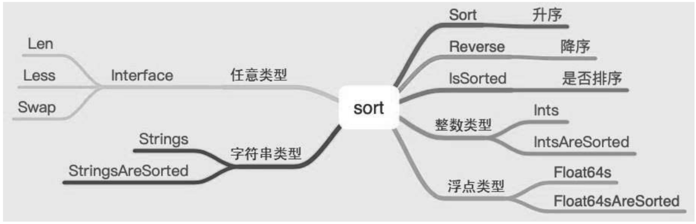

# sort

排序算法是常见的算法，内置库实现了插入排序、归并排序、堆排序和快速排序，有几种排序算法是不可直接访问的，需要使用内置的库来访问，因此使用过程中无须关心使用了哪种排序算法。


内置库提供了对常见数据类型的排序。排序包含如下操作：

- 升序、降序。
- 是否排序。
- 对任意数据类型进行排序。

对数值类型的数组进行排序很容易理解，如何对结构体进行排序呢？结构体中包含多个属性或者字段，对结构体排序时，应该按照某一个属性或者字段进行排序，否则无法比较。

内置库也提供了相应的接口，实现对任意数据类型的排序，如图



## 1. 整数类型数值的排序

```go
func SortIntsUsage() {
	list := []int{10, 9, 2, 8, 3}
	sort.Ints(list)
	fmt.Println(list)	// [2 3 8 9 10]
	sort.Sort(sort.Reverse(sort.IntSlice(list)))
	fmt.Println(list)	// [10 9 8 3 2]
}
```

## 2. 浮点类型数值的排序

```go
func SortFloatsUsage() {
	list := []float64{10, 9, 1.2, 3.4, 12.1}
	sort.Float64s(list)
	fmt.Println(list)		// [1.2 3.4 9 10 12.1]
	sort.Sort(sort.Reverse(sort.Float64Slice(list)))
	fmt.Println(list)		// [12.1 10 9 3.4 1.2]
}
```

## 3. 字符串类型数值的排序

```go
func SortStringsUsage() {
	list := []string{"a", "A", "c", "C", "B", "b"}
	sort.Strings(list)
	fmt.Println(list)	// [A B C a b c]
	sort.Sort(sort.Reverse(sort.StringSlice(list)))
	fmt.Println(list)	// [c b a C B A]
}
```


字符串按照首字母的ASCII编码进行排序。

可以很方便地实现对内置基本类型的排序，如何对任意类型（比如复杂的结构体）进行排序呢？

答案是实现Interface接口。

```go
type Interface interface {
	// Len is the number of elements in the collection.
	Len() int

	// Less reports whether the element with index i
	// must sort before the element with index j.
	Less(i, j int) bool

	// Swap swaps the elements with indexes i and j.
	Swap(i, j int)
}
```

要实现Interface接口，就需要实现Len、Less、Swap三个方法。

```go
package main

import (
	"fmt"
	"sort"
)

type Language struct {
	Year    int    `json:"year"`
	Name    string `json:"name"`
	Account string `json:"account"`
}

type Languages []Language

func (ls Languages) Len() int {
	return len(ls)
}
func (ls Languages) Less(i, j int) bool {
	return ls[i].Year < ls[j].Year
}
func (ls Languages) Swap(i, j int) {
	ls[i], ls[j] = ls[j], ls[i]
}

func SortStruct() {
	list := Languages{
		{
			10, "Golang", "Google",
		}, {
			28, "Python", "Google",
		}, {
			30, "Java", "***",
		}, {
			1, "Lua", "23",
		},
	}
	fmt.Println("Ori", list)
	sort.Sort(list)
	fmt.Println("sort", list)
	for _, i := range list {
		fmt.Println(i)
	}
}

func main() {
	SortStruct()
}
```

自定义的结构体Languages按照字段Year从小到大排序，开发者实现Interface接口即可。

再回过头来看如何排序内置的基本数据类型。

```go
// IntSlice attaches the methods of Interface to []int, sorting in increasing order.
type IntSlice []int
func (x IntSlice) Len() int           { return len(x) }
func (x IntSlice) Less(i, j int) bool { return x[i] < x[j] }
func (x IntSlice) Swap(i, j int)      { x[i], x[j] = x[j], x[i] }


type Float64Slice []float64
func (x Float64Slice) Len() int { return len(x) }
func (x Float64Slice) Less(i, j int) bool { return x[i] < x[j] || (isNaN(x[i]) && !isNaN(x[j])) }
func (x Float64Slice) Swap(i, j int)      { x[i], x[j] = x[j], x[i] }


type StringSlice []string
func (x StringSlice) Len() int           { return len(x) }
func (x StringSlice) Less(i, j int) bool { return x[i] < x[j] }
func (x StringSlice) Swap(i, j int)      { x[i], x[j] = x[j], x[i] }
```

由此可以看出，内置的基本数据类型已经实现了Interface接口。

同样的，浮点类型、字符串类型也实现了Interface接口。


## 4.sort -排序算法

https://www.topgoer.cn/docs/golangstandard/golangstandard-1cmksspljkkud


## 5. 小结

内置的排序库可以很方便地让开发者实现对基本数据类型的排序，或者对自定义结构体按照某一个字段进行排序，只要实现Interface接口即可。

而使用者无须关心内置库到底使用了哪种排序算法。

