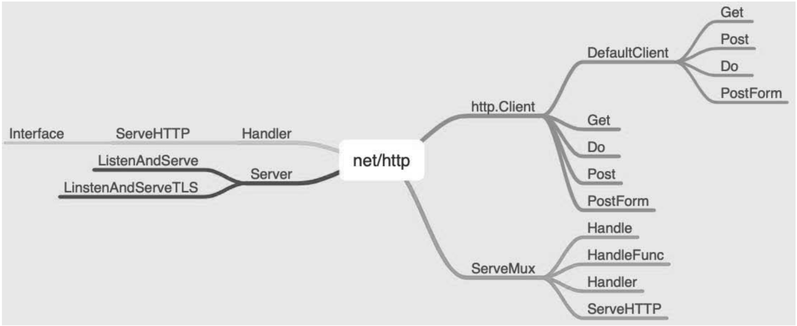

# net/http

net/http是内置库中一个非常重要的核心库，其他的编程语言要实现Web服务往往需要编写很多代码，而在Go语言中，只需要简短的几行程序代码即可实现Web服务或者发起网络请求。

关于网络请求，往往包含两个方向：

（1）客户端，即向某服务器端发起网络请求，访问该服务器端的资源。

（2）服务器端，即提供给各个客户端的资源，供各个客户端的访问。

下面分别从客户端和服务器端两个方面讲解内置库net/http的使用。

## 1. 客户端

客户端是向服务器端发起网络请求，根据服务器端提供的不同请求方法或者路由的不同，访问到的资源也各不相同。

为了便于访问，下面使用可以用来测试网络请求的一个开源网站http://httpbin.org，这是Python领域一个非常著名的开源库作者kennethreitz的作品。

当然，如果读者熟悉Docker，可以以容器的形式来启动：`docker run -p 80:80 kennethreitz/httpbin`，这样在读者的本地系统也可以启动这个服务，便于进行下面的访问测试。


### (1) 获取资源

Get

```go
package main

import (
	"fmt"
	"io/ioutil"
	"net/http"
)

func getHandle(rawString string) {
	response, err := http.Get(rawString)
	if err != nil {
		return
	}

	defer response.Body.Close()
	content, _ := ioutil.ReadAll(response.Body)
	fmt.Println(string(content))

}

func main() {
	// get: 分别获取标头信息、IP地址、user-agent
	getHandle("http://httpbin.org/headers")
	getHandle("http://httpbin.org/ip")
	getHandle("http://httpbin.org/user-agent")

}
```

客户端获取资源的方式非常简便，只需调用http.Get即可。通过查看源代码可以看到，其实是调用了内置默认的http.Client结构体的Get方法。

```go
// DefaultClient.Do.
func Get(url string) (resp *Response, err error) {
	return DefaultClient.Get(url)
}
```


##### 并发获取多个URL-示例1

```go
package main

import (
	"fmt"
	"io"
	"io/ioutil"
	"net/http"
	"os"
	"time"
)

func fetch(url string,ch chan <-string)  {
	start := time.Now()
	resp,err := http.Get(url)
	if err != nil {
		ch <- fmt.Sprint(err)
		return
	}
	nbytes,err := io.Copy(ioutil.Discard,resp.Body)
	resp.Body.Close()
	if err != nil {
		ch <- fmt.Sprintf("while reading %s: %v",url,err)
		return
	}
	secs := time.Since(start).Seconds()
	ch <- fmt.Sprintf("%.2fs %7d %s",secs,nbytes,url)

}

func main() {
	start := time.Now()
	ch := make(chan string)
	for _, url := range os.Args[1:] {
		go fetch(url,ch)		// 启动一个goroutine
	}
	for range os.Args[1:] {
		fmt.Println(<-ch)		// 从通道接受
	}

	fmt.Printf("%.2fs elapsed\n",time.Since(start).Seconds())
}
```


##### 并发获取多个URL-示例2

```go
package main

import (
	"fmt"
	"io"
	"io/ioutil"
	"log"
	"net/http"
)

type Page struct {
	Url  string
	Size int
}

func responseSize(url string, channel chan Page) {
	response, err := http.Get(url)
	if err != nil {
		log.Fatal(err)
	}
	defer func(Body io.ReadCloser) {
		err := Body.Close()
		if err != nil {
			log.Fatal(err)
		}
	}(response.Body)

	body, err := ioutil.ReadAll(response.Body)
	if err != nil {
		log.Fatal(err)
	}
	channel <- Page{Url: url, Size: len(body)}
}

func main() {
	pages := make(chan Page)
	urls := []string{
		"https://example.com/",
		"https://baidu.com/",
		"https://gitee.com/",
	}
	for _, url := range urls {
		go responseSize(url, pages)
	}
	for i := 0; i < len(urls); i++ {
		page := <-pages
		fmt.Printf("Url: %s  Size: %d\n", page.Url, page.Size)
	}
}
```


### (2) 创建资源

Post、PostForm

```go
package main

import (
	"bytes"
	"encoding/json"
	"fmt"
	"io"
	"io/ioutil"
	"net/http"
	"net/url"
	"strings"
)

func postHandle(rawString string, body io.Reader) {
	response, err := http.Post(rawString, "application/json", body)
	if err != nil {
		return
	}
	defer response.Body.Close()
	content, _ := ioutil.ReadAll(response.Body)
	fmt.Println(string(content))
}

func ClientUsage() {
	// post
	var buf bytes.Buffer
	buf.WriteString("hello golang")
	postHandle("http://localhost:80/anything", &buf)

	val := strings.NewReader("hello python")
	postHandle("http://localhost:80/anything", val)

	bytesNew := struct {
		Name string `json:"name"`
		Age  int    `json:"age"`
	}{
		Name: "Golang",
		Age:  10,
	}
	byt, _ := json.Marshal(bytesNew)
	postHandle("http://localhost:80/anything", bytes.NewReader(byt))
	// PostForm
	response, err := http.PostForm("http://localhost:80/anything", url.Values{
		"name": []string{"Golang"},
		"age":  []string{"10"},
	})
	if err != nil {
		return
	}
	defer response.Body.Close()
	content, _ := ioutil.ReadAll(response.Body)
	fmt.Println(string(content))

}
```

上面的示例都是调用默认的客户端访问服务器端资源的方法，这种情况通常能够满足大部分的需求。如果想采用定制的方法，就需要实例化相应的结构体，并调用相应的方法。

```go
package main

import (
	"errors"
	"fmt"
	"io/ioutil"
	"net/http"
	"strings"
)

func redirectPolicyFunc(req *http.Request, via []*http.Request) error {
	if strings.Contains(req.URL.Path, "header") {
		return errors.New("header")
	}
	return nil

}
func UserClientUsage() {
	request, _ := http.NewRequest(http.MethodGet, "http://httpbin.org/ip", nil)
	client := &http.Client{
		CheckRedirect: redirectPolicyFunc,
	}
	response, err := client.Do(request)
	if err != nil {
		return
	}
	defer response.Body.Close()
	content, _ := ioutil.ReadAll(response.Body)
	fmt.Println(string(content))
}

func main() {
	UserClientUsage()
}
```

上面的示例代码中实例化了http.Client结构体，再调用了http.Client的Do方法。


## 2. 服务器端

服务器端主要的角色是提供资源访问的服务，在Go语言中可以快速地启动Web服务，通常启动Web服务的方式有下面几种：

### （1）默认的形式

【示例】

```go
package main

import (
	"log"
	"net/http"
)

func main() {
	http.HandleFunc("/hello_golang", func(writer http.ResponseWriter, request *http.Request) {
		writer.Write([]byte("Hello Golang"))
	})
	log.Fatal(http.ListenAndServe(":8080",nil))
}
```

### （2）实现Handler接口

```go
package main

import (
	"log"
	"net/http"
)

type SelfHandler struct {
}

func (SelfHandler) ServeHTTP(writer http.ResponseWriter, req *http.Request) {
	writer.Write([]byte("Hello Python"))
}

func main() {
	var self SelfHandler
	http.Handle("/hello_python",self)
	log.Fatal(http.ListenAndServe(":8080",nil))
}
```


其实重要的是Handler接口和自定义结构体，实现ServeHTTP方法即可。

```go
type Handler interface {
	ServeHTTP(ResponseWriter, *Request)
}
```

上文中关于服务端资源的获取可以使用如下命令调用：

```shell
$ curl http://localhost:8080/hello_python
Hello Python
```

### （3）自定义HTTP服务器配置

```go
package main

import (
	"fmt"
	"log"
	"net/http"
)

type Self struct {

}

func (s Self) ServeHTTP(writer http.ResponseWriter,req *http.Request)  {
	fmt.Fprintf(writer,"Hello Self Sever 1")
}

func (s Self) Say(writer http.ResponseWriter,req *http.Request)  {
	fmt.Fprintf(writer,"Hello Self Sever 1")
}

func main() {
	var selfServer http.Server
	var selfHandler Self
	var selfMux  *http.ServeMux
	selfMux = &http.ServeMux{}
	selfHandler = Self{}
	selfMux.Handle("/say",selfHandler)

	selfServer = http.Server{
		Addr:    "localhost:9099",
		Handler: selfHandler,
	}
	log.Fatal(selfServer.ListenAndServe())


}
```

自定义服务器配置代替了默认的服务器配置，自定义了Handler与服务器端口及地址。

当然，还可以配置读写超时时间、请求标头的最大字节数等。上文中关于服务器端资源的调用可以使用如下方法：

```shell
$ curl  http://localhost:9099/say
```

以上是几种常见的启动Web服务的方式，可以看出启动Web服务主要包含如下步骤：

- 设置路由：访问的地址（链接）。

- 设置路由对应的控制器：决定访问路由后触发的操作，比如为什么上文访问对应的路由会返回不同的内容。

- 启动相应的服务：确定端口等，即访问的主机的地址和端口。


## 3.Go最简单的http服务器

``` go
package main

import (
	"fmt"
	"net/http"
)

func myfunc(w http.ResponseWriter, r *http.Request) {
	fmt.Fprintf(w, "<h1>hi<h1>")
}

func main() {
	http.HandleFunc("/", myfunc)
	http.ListenAndServe(":8080", nil)
}
```

访问 `http://localhost:8080/` , 我们可以看到网页输出”hi” 


## 4.GET请求示例

使用net/http包编写一个简单的发送HTTP请求的Client端，代码如下：

``` go
package main

import (
	"fmt"
	"io/ioutil"
	"net/http"
)

func main() {
	resp, err1 := http.Get("https://www.liwenzhou.com/")
	if err1 != nil {
		fmt.Println("get failed, err:", err1)
		return
	}
	defer resp.Body.Close()
	body, err2 := ioutil.ReadAll(resp.Body)
	if err2 != nil {
		fmt.Println("read from resp.Body failed,err:", err2)
		return
	}
	fmt.Print(string(body))
}
```


执行命令GET网页信息：

```shell
$ go run main.go http://www.baidu.com
```

```go
package main

import (
	"fmt"
	"io/ioutil"
	"net/http"
	"os"
)

func main() {
	for _, url := range os.Args[1:] {
		resp, err := http.Get(url)
		if err != nil {
			fmt.Fprintf(os.Stderr, "fetch:%v\n", err)
			os.Exit(1)
		}
		b, err := ioutil.ReadAll(resp.Body)
		resp.Body.Close()
		if err != nil {
			fmt.Fprintf(os.Stderr, "fetch: reading %s:%v\n", url, err)
			os.Exit(1)
		}
		fmt.Printf("%s", b)
	}
}
```


## 5. 带参数的GET请求示例

关于GET请求的参数需要使用Go语言内置的net/url这个标准库来处理。


本地server端HandlerFunc如下：
`server01.go`

``` go
package main

import (
	"fmt"
	"net/http"
)


func getHandler(w http.ResponseWriter, r *http.Request) {
	defer r.Body.Close()
	data := r.URL.Query()
	fmt.Println(data.Get("name"))
	fmt.Println(data.Get("age"))
	answer := `{"status": "ok"}`
	w.Write([]byte(answer))
}

func main() {
	http.HandleFunc("/", getHandler)
	http.ListenAndServe(":9090", nil)
}
```


`client01.go`

``` go
package main

import (
	"fmt"
	"io/ioutil"
	"net/http"
	"net/url"
)

func main() {
	apiUrl := "http://127.0.0.1:9090/get"
	// URL param
	data := url.Values{}
	data.Set("name", "小王子")
	data.Set("age", "18")
	u, err1 := url.ParseRequestURI(apiUrl)
	if err1 != nil {
		fmt.Printf("parse url requestUrl failed,err:%v\n", err1)
	}
	u.RawQuery = data.Encode() // URL encode
	fmt.Println(u.String())
	resp, err2 := http.Get(u.String())
	if err2 != nil {
		fmt.Println("post failed, err:%v\n", err2)
		return
	}
	defer resp.Body.Close()
	b, err3 := ioutil.ReadAll(resp.Body)
	if err3 != nil {
		fmt.Println("get resp failed,err:%v\n", err3)
		return
	}
	fmt.Println(string(b))
}
```

## 6. Post请求示例

上面演示了使用net/http包发送GET请求的示例，发送POST请求的示例代码如下：

`server02.go`

``` go
package main

import (
	"fmt"
	"io/ioutil"
	"net/http"
)

func getHandler(w http.ResponseWriter, r *http.Request) {
	defer r.Body.Close()
	// 1. 请求类型是application/x-www-form-urlencoded时解析form数据
	r.ParseForm()
	fmt.Println(r.PostForm) //打印form数据
	fmt.Println(r.PostForm.Get("name"), r.PostForm.Get("age"))
	// 2. 请求类型是application/json时从r.Body读取数据
	b, err := ioutil.ReadAll(r.Body)
	if err != nil {
		fmt.Println("read request.Body fauled, err:%v\n", err)
		return
	}
	fmt.Println(string((b)))
	answer := `{"status": "ok"}`
	w.Write([]byte(answer))
}

func main() {
	http.HandleFunc("/", getHandler)
	http.ListenAndServe(":9090", nil)
}

```


`client02.go`

``` go
package main

import (
	"fmt"
	"io/ioutil"
	"net/http"
	"strings"
)

func main() {
	url := "http://127.0.0.1:9090/post"
	// 表单数据
	//contentType := "application/x-www-form-urlencoded"
	//data := "name=小王子&age=18"
	// json
	contentType := "application/json"
	data := `{"name":"小王子","age":18}`
	resp, err1 := http.Post(url, contentType, strings.NewReader(data))
	if err1 != nil {
		fmt.Println("post failed, err:%v\n", err1)
		return
	}
	defer resp.Body.Close()
	b, err2 := ioutil.ReadAll(resp.Body)
	if err2 != nil {
		fmt.Println("get resp failed,err:%v\n", err2)
		return
	}
	fmt.Println(string(b))
}

```

## 7. 静态站点

下面代码通过指定目录，作为静态站点

``` go
package main

import "net/http"

func main() {
	http.Handle("/", http.FileServer(http.Dir("D:\\my_blog\\build\\html")))
	http.ListenAndServe(":8080", nil)
}
```


##  8.小结

在Go语言中能够非常方便地执行客户端或者服务器端的操作，仅仅使用内置库就能很方便地实现诸如网络请求、启动网络服务。

net/http库的核心包括两个方面：Client（客户端）和Server（服务器端），从事后端开发的程序员应该很熟悉这两个概念，尤其是从事Web开发的人员。

客户端的角色是发起网络请求，服务器端的角色是提供网络资源的访问，再稍微扩充一下，就可以使用内置的net/http库打造性能更好的Web服务。

当然，原生的在路由层面的设计并不完美，所以衍生了很多第三方基于net/http库的Web框架，诸如Gin、Beego、Echo、Iris等，第三方库提高了开发人员的开发效率，在企业中经常用于业务逻辑的开发，但所有的本质都是对内置库net/http的封装或者优化。




net/http库提供的操作

## 9.参考文献

<https://www.bookstack.cn/read/topgoer/a4d91804c507fc2a.md>


