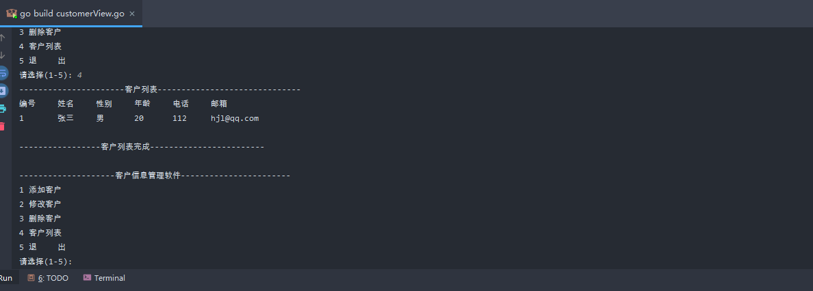

# 客户信息关系系统


## model

model/customer.go
``` 
package model

import "fmt"

// 声明一个Customer结构体，表示一个客户信息
type Customer struct {
	Id     int
	Name   string
	Gender string
	Age    int
	Phone  string
	Email  string
}

//使用工厂模式返回一个Customer的实例
func NewCustomer(id int, name string, gender string, age int, phone string, email string) Customer {
	return Customer{
		Id:     id,
		Name:   name,
		Gender: gender,
		Age:    age,
		Phone:  phone,
		Email:  email,
	}
}

//第二种创建Customer实例方法，不带id
func NewCustomer2(name string, gender string, age int, phone string, email string) Customer {
	return Customer{
		Name:   name,
		Gender: gender,
		Age:    age,
		Phone:  phone,
		Email:  email,
	}
}

func (this Customer) GetInfo() string {
	info := fmt.Sprintf("%v\t\t%v\t\t%v\t\t%v\t\t%v\t\t%v", this.Id, this.Name, this.Gender, this.Age, this.Phone, this.Email)
	return info
}

```

## service
service/customerService.go
``` 
package service

import (
	"github.com/go_hexin01/day35/model"
)

//该CuteomerService,完成对Customer的操作，包括增删改查
type CustomerService struct {
	customers []model.Customer
	//声明一个字段，表示当前切片含有多少个客户
	//该字段后面，还可以作为新客户的 id+1
	customerNum int
}

// 编写一个方法，返回*CustomerService
func NewCustomerService() *CustomerService {
	// 为了能够看到有客户在切片中，我们初始化一个客户
	customerService := &CustomerService{}
	customerService.customerNum = 1
	customer := model.NewCustomer(1, "张三", "男", 20, "112", "hjl@qq.com")
	customerService.customers = append(customerService.customers, customer)
	return customerService
}

// 返回客户切片List方法。
func (this *CustomerService) List() []model.Customer {
	return this.customers
}

// 添加客户到customers切片
//!!!
func (this *CustomerService) Add(customer model.Customer) bool {
	//我们确定一个分配id的规则，就是添加的顺序
	this.customerNum++
	// 将id赋值给新加入的信息中，自增1
	customer.Id = this.customerNum
	// 添加到切片
	this.customers = append(this.customers, customer)
	return true
}

// 根据id号删除切片中的元素
func (this *CustomerService) Delete(id int) bool {
	index := this.FindByid(id)
	if index == -1 {
		return false
	}
	// 如果从切片中删除一个元素
	this.customers = append(this.customers[:index], this.customers[index+1:]...)
	return true
}

// 根据id查找客户在切片中对应下标，如果没有该客户，返回-1
func (this *CustomerService) FindByid(id int) int {
	index := -1
	//遍历this.customers切片
	for i := 0; i < len(this.customers); i++ {
		if this.customers[i].Id == id {
			//找到
			index = i
		}
	}
	return index
}

// 根据ID获取切片内容信息
func (this *CustomerService) GetInfoById(id int) model.Customer {
	i := id - 1
	return this.customers[i]
}

//根据id修改客户信息
func (this *CustomerService) Update(id int, customer model.Customer) bool {
	for i := 0; i < len(this.customers); i++{
		if this.customers[i].Id == id{
			this.customers[i].Name = customer.Name
			this.customers[i].Gender = customer.Gender
			this.customers[i].Age = customer.Age
			this.customers[i].Phone = customer.Phone
			this.customers[i].Email = customer.Email
		}
	}
	return true
}
```

## view
view/customerView.go
``` 
package main

import (
	"fmt"
	"github.com/go_hexin01/day35/model"
	"github.com/go_hexin01/day35/service"
)

func main() {
	// 在main函数中，创建一个customerView，并运行显示主菜单
	customerView := customerView{
		key:  "",
		loop: true,
	}
	//这里完成对 customerView 结构体的 customerService 字段的初始化
	customerView.customerService = service.NewCustomerService()

	// 显示主菜单
	customerView.mainMenu()
}

type customerView struct {
	//定义必要字段
	key  string //接收用户输入....
	loop bool   //表示是否循环的显示主菜单
	//增加一个字段customerService
	customerService *service.CustomerService
}

// 列出所有客户，遍历切片返回客户信息
func (this *customerView) list() {
	//获取到当前所有的客户信息(在切片中)
	customers := this.customerService.List()

	//显示
	fmt.Println("----------------------客户列表------------------------------")
	fmt.Println("编号\t\t姓名\t\t性别\t\t年龄\t\t电话\t\t邮箱")
	for i := 0; i < len(customers); i++ {
		//fmt.Println(customers[i].Id,"\t",customers[i].Name ....)
		fmt.Println(customers[i].GetInfo())
	}
	fmt.Printf("\n-----------------客户列表完成------------------------\n\n")
}

//得到用户的输入，信息构建新的客户，并完成添加
func (this *customerView) add() {
	fmt.Println("----------------------------添加客户--------------------------")
	fmt.Print("姓名:")
	name := ""
	fmt.Scanln(&name)
	fmt.Print("性别:")
	gender := ""
	fmt.Scanln(&gender)
	fmt.Print("年龄:")
	age := 0
	fmt.Scanln(&age)
	fmt.Print("电话:")
	phone := ""
	fmt.Scanln(&phone)
	fmt.Print("邮箱:")
	email := ""
	fmt.Scanln(&email)
	//构建一个新的Custom实例，
	//注意id号没有让用户输入，id是唯一的，需要系统分配
	customer := model.NewCustomer2(name, gender, age, phone, email)
	//调用
	if this.customerService.Add(customer) {
		fmt.Println("------------------添加完成--------------------")
	} else {
		fmt.Println("------------------添加失败--------------------")
	}

}

//得到用户的输如id，删除该id对应的客户
func (this *customerView) delete() {
	fmt.Println("----------------------------------删除客户----------------------------------")
	fmt.Println("请输入要删除客户的编号(-1退出)")
	id := -1
	fmt.Scanln(&id)
	if id == -1 {
		return //放弃删除操作
	}
	fmt.Println("确认是否删除(Y/N)")
	// 这里可以加入一个循环判断，直到用户输入y或者n，才退出
	choice := ""
	fmt.Scanln(&choice)
	if choice == "y" || choice == "Y" {
		//调用customerService的Deletc方法
		if this.customerService.Delete(id) {
			fmt.Println("----------------------删除完成---------------------------------------")
		} else {
			fmt.Println("------------删除失败，输入的id号不存在--------------------------------")
		}
	}

}

//得到用户的输入id，修改该id对应客户
func (this *customerView) update() {
	this.list()
	fmt.Println()
	fmt.Println("---------------修改客户--------------------------")
	fmt.Println("请输入要修改客户的编号(-1退出)")
	id := -1
	fmt.Scanln(&id)
	if id == -1 {
		return //放弃修改操作
	}
	fmt.Println("确认是否修改(Y/N)")
	//这里可以加入一个循环判断，直到用户输入y或者n，才退出...
	choice := ""
	fmt.Scanln(&choice)
	if choice == "y" || choice == "Y" {
		//调用CustomerService的FindByid方法
		if this.customerService.FindByid(id) != -1 {
			customer := this.customerService.GetInfoById(id)
			fmt.Printf("姓名(%v:)", customer.Name)
			name := ""
			fmt.Scanln(&name)
			fmt.Printf("性别（%v）：", customer.Gender)
			gender := ""
			fmt.Scanln(&gender)
			fmt.Printf("年龄（%v）：", customer.Age)
			age := 0
			fmt.Scanln(&age)
			fmt.Printf("电话（%v）：", customer.Phone)
			phone := ""
			fmt.Scanln(&phone)
			fmt.Printf("邮箱（%v）：", customer.Email)
			email := ""
			fmt.Scanln(&email)
			customer2 := model.NewCustomer2(name, gender, age, phone, email)
			this.customerService.Update(id, customer2)
		}
	}
}

//退出
func (this *customerView) logout() {
	fmt.Print("确认是否退出(Y/N)")
	for {
		fmt.Scanln(&this.key)
		// 如果输入其他就一直询问，是否退出
		if this.key == "Y" || this.key == "y" || this.key == "N" || this.key == "n"{
			break
		}
		fmt.Print("你的输入有误，确认是否退出(Y/N)")
	}
	// 如果是y或者Y就退出程序
	if this.key == "y"|| this.key == "Y"{
		this.loop = false
	}

}

func (this *customerView) mainMenu() {
	for {
		fmt.Println("--------------------客户信息管理软件-----------------------")
		fmt.Println("1 添加客户")
		fmt.Println("2 修改客户")
		fmt.Println("3 删除客户")
		fmt.Println("4 客户列表")
		fmt.Println("5 退	出")
		fmt.Print("请选择(1-5): ")
		fmt.Scanln(&this.key)
		switch this.key {
		case "1":
			//fmt.Println("添加客户")
			this.add()
		case "2":
			//fmt.Println("修改客户")
			this.update()
		case "3":
			//fmt.Println("删除客户")
			this.delete()
		case "4":
			//fmt.Println("客户列表")
			this.list()
		case "5":
			//退出
			//this.loop = false
			this.logout()
		default:
			fmt.Println("你的输入有误，请重新输入.....")
		}
		//如果loop为false状态就退出
		if !this.loop {
			break
		}
	}
	fmt.Println("你退出了客户关系管理系统......")
}
```

