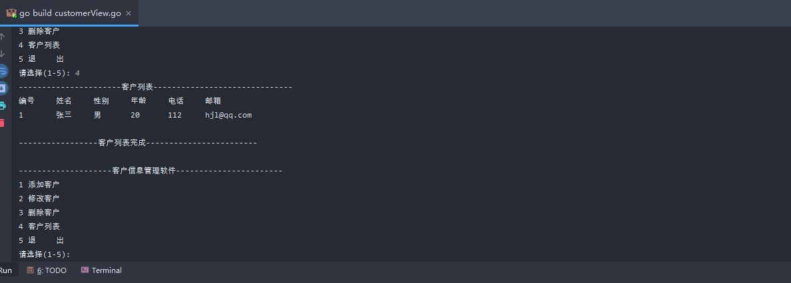

.. contents::
   :depth: 3
..

客户信息关系系统
================

model
-----

model/customer.go

::

   package model

   import "fmt"

   // 声明一个Customer结构体，表示一个客户信息
   type Customer struct {
       Id     int
       Name   string
       Gender string
       Age    int
       Phone  string
       Email  string
   }

   //使用工厂模式返回一个Customer的实例
   func NewCustomer(id int, name string, gender string, age int, phone string, email string) Customer {
       return Customer{
           Id:     id,
           Name:   name,
           Gender: gender,
           Age:    age,
           Phone:  phone,
           Email:  email,
       }
   }

   //第二种创建Customer实例方法，不带id
   func NewCustomer2(name string, gender string, age int, phone string, email string) Customer {
       return Customer{
           Name:   name,
           Gender: gender,
           Age:    age,
           Phone:  phone,
           Email:  email,
       }
   }

   func (this Customer) GetInfo() string {
       info := fmt.Sprintf("%v\t\t%v\t\t%v\t\t%v\t\t%v\t\t%v", this.Id, this.Name, this.Gender, this.Age, this.Phone, this.Email)
       return info
   }

service
-------

service/customerService.go

::

   package service

   import (
       "github.com/go_hexin01/day35/model"
   )

   //该CuteomerService,完成对Customer的操作，包括增删改查
   type CustomerService struct {
       customers []model.Customer
       //声明一个字段，表示当前切片含有多少个客户
       //该字段后面，还可以作为新客户的 id+1
       customerNum int
   }

   // 编写一个方法，返回*CustomerService
   func NewCustomerService() *CustomerService {
       // 为了能够看到有客户在切片中，我们初始化一个客户
       customerService := &CustomerService{}
       customerService.customerNum = 1
       customer := model.NewCustomer(1, "张三", "男", 20, "112", "hjl@qq.com")
       customerService.customers = append(customerService.customers, customer)
       return customerService
   }

   // 返回客户切片List方法。
   func (this *CustomerService) List() []model.Customer {
       return this.customers
   }

   // 添加客户到customers切片
   //!!!
   func (this *CustomerService) Add(customer model.Customer) bool {
       //我们确定一个分配id的规则，就是添加的顺序
       this.customerNum++
       // 将id赋值给新加入的信息中，自增1
       customer.Id = this.customerNum
       // 添加到切片
       this.customers = append(this.customers, customer)
       return true
   }

   // 根据id号删除切片中的元素
   func (this *CustomerService) Delete(id int) bool {
       index := this.FindByid(id)
       if index == -1 {
           return false
       }
       // 如果从切片中删除一个元素
       this.customers = append(this.customers[:index], this.customers[index+1:]...)
       return true
   }

   // 根据id查找客户在切片中对应下标，如果没有该客户，返回-1
   func (this *CustomerService) FindByid(id int) int {
       index := -1
       //遍历this.customers切片
       for i := 0; i < len(this.customers); i++ {
           if this.customers[i].Id == id {
               //找到
               index = i
           }
       }
       return index
   }

   // 根据ID获取切片内容信息
   func (this *CustomerService) GetInfoById(id int) model.Customer {
       i := id - 1
       return this.customers[i]
   }

   //根据id修改客户信息
   func (this *CustomerService) Update(id int, customer model.Customer) bool {
       for i := 0; i < len(this.customers); i++{
           if this.customers[i].Id == id{
               this.customers[i].Name = customer.Name
               this.customers[i].Gender = customer.Gender
               this.customers[i].Age = customer.Age
               this.customers[i].Phone = customer.Phone
               this.customers[i].Email = customer.Email
           }
       }
       return true
   }

view
----

view/customerView.go

::

   package main

   import (
       "fmt"
       "github.com/go_hexin01/day35/model"
       "github.com/go_hexin01/day35/service"
   )

   func main() {
       // 在main函数中，创建一个customerView，并运行显示主菜单
       customerView := customerView{
           key:  "",
           loop: true,
       }
       //这里完成对 customerView 结构体的 customerService 字段的初始化
       customerView.customerService = service.NewCustomerService()

       // 显示主菜单
       customerView.mainMenu()
   }

   type customerView struct {
       //定义必要字段
       key  string //接收用户输入....
       loop bool   //表示是否循环的显示主菜单
       //增加一个字段customerService
       customerService *service.CustomerService
   }

   // 列出所有客户，遍历切片返回客户信息
   func (this *customerView) list() {
       //获取到当前所有的客户信息(在切片中)
       customers := this.customerService.List()

       //显示
       fmt.Println("----------------------客户列表------------------------------")
       fmt.Println("编号\t\t姓名\t\t性别\t\t年龄\t\t电话\t\t邮箱")
       for i := 0; i < len(customers); i++ {
           //fmt.Println(customers[i].Id,"\t",customers[i].Name ....)
           fmt.Println(customers[i].GetInfo())
       }
       fmt.Printf("\n-----------------客户列表完成------------------------\n\n")
   }

   //得到用户的输入，信息构建新的客户，并完成添加
   func (this *customerView) add() {
       fmt.Println("----------------------------添加客户--------------------------")
       fmt.Print("姓名:")
       name := ""
       fmt.Scanln(&name)
       fmt.Print("性别:")
       gender := ""
       fmt.Scanln(&gender)
       fmt.Print("年龄:")
       age := 0
       fmt.Scanln(&age)
       fmt.Print("电话:")
       phone := ""
       fmt.Scanln(&phone)
       fmt.Print("邮箱:")
       email := ""
       fmt.Scanln(&email)
       //构建一个新的Custom实例，
       //注意id号没有让用户输入，id是唯一的，需要系统分配
       customer := model.NewCustomer2(name, gender, age, phone, email)
       //调用
       if this.customerService.Add(customer) {
           fmt.Println("------------------添加完成--------------------")
       } else {
           fmt.Println("------------------添加失败--------------------")
       }

   }

   //得到用户的输如id，删除该id对应的客户
   func (this *customerView) delete() {
       fmt.Println("----------------------------------删除客户----------------------------------")
       fmt.Println("请输入要删除客户的编号(-1退出)")
       id := -1
       fmt.Scanln(&id)
       if id == -1 {
           return //放弃删除操作
       }
       fmt.Println("确认是否删除(Y/N)")
       // 这里可以加入一个循环判断，直到用户输入y或者n，才退出
       choice := ""
       fmt.Scanln(&choice)
       if choice == "y" || choice == "Y" {
           //调用customerService的Deletc方法
           if this.customerService.Delete(id) {
               fmt.Println("----------------------删除完成---------------------------------------")
           } else {
               fmt.Println("------------删除失败，输入的id号不存在--------------------------------")
           }
       }

   }

   //得到用户的输入id，修改该id对应客户
   func (this *customerView) update() {
       this.list()
       fmt.Println()
       fmt.Println("---------------修改客户--------------------------")
       fmt.Println("请输入要修改客户的编号(-1退出)")
       id := -1
       fmt.Scanln(&id)
       if id == -1 {
           return //放弃修改操作
       }
       fmt.Println("确认是否修改(Y/N)")
       //这里可以加入一个循环判断，直到用户输入y或者n，才退出...
       choice := ""
       fmt.Scanln(&choice)
       if choice == "y" || choice == "Y" {
           //调用CustomerService的FindByid方法
           if this.customerService.FindByid(id) != -1 {
               customer := this.customerService.GetInfoById(id)
               fmt.Printf("姓名(%v:)", customer.Name)
               name := ""
               fmt.Scanln(&name)
               fmt.Printf("性别（%v）：", customer.Gender)
               gender := ""
               fmt.Scanln(&gender)
               fmt.Printf("年龄（%v）：", customer.Age)
               age := 0
               fmt.Scanln(&age)
               fmt.Printf("电话（%v）：", customer.Phone)
               phone := ""
               fmt.Scanln(&phone)
               fmt.Printf("邮箱（%v）：", customer.Email)
               email := ""
               fmt.Scanln(&email)
               customer2 := model.NewCustomer2(name, gender, age, phone, email)
               this.customerService.Update(id, customer2)
           }
       }
   }

   //退出
   func (this *customerView) logout() {
       fmt.Print("确认是否退出(Y/N)")
       for {
           fmt.Scanln(&this.key)
           // 如果输入其他就一直询问，是否退出
           if this.key == "Y" || this.key == "y" || this.key == "N" || this.key == "n"{
               break
           }
           fmt.Print("你的输入有误，确认是否退出(Y/N)")
       }
       // 如果是y或者Y就退出程序
       if this.key == "y"|| this.key == "Y"{
           this.loop = false
       }

   }

   func (this *customerView) mainMenu() {
       for {
           fmt.Println("--------------------客户信息管理软件-----------------------")
           fmt.Println("1 添加客户")
           fmt.Println("2 修改客户")
           fmt.Println("3 删除客户")
           fmt.Println("4 客户列表")
           fmt.Println("5 退    出")
           fmt.Print("请选择(1-5): ")
           fmt.Scanln(&this.key)
           switch this.key {
           case "1":
               //fmt.Println("添加客户")
               this.add()
           case "2":
               //fmt.Println("修改客户")
               this.update()
           case "3":
               //fmt.Println("删除客户")
               this.delete()
           case "4":
               //fmt.Println("客户列表")
               this.list()
           case "5":
               //退出
               //this.loop = false
               this.logout()
           default:
               fmt.Println("你的输入有误，请重新输入.....")
           }
           //如果loop为false状态就退出
           if !this.loop {
               break
           }
       }
       fmt.Println("你退出了客户关系管理系统......")
   }

