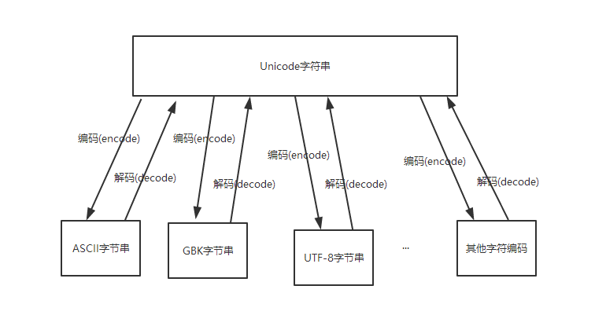
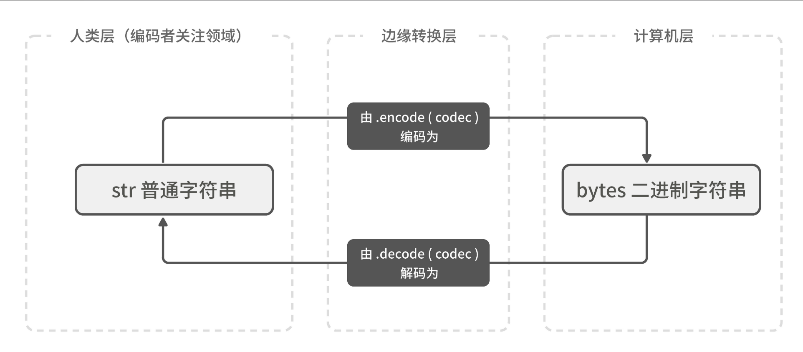

# 字符编码学习

## 1.入门

字符编码


Python解释器在加载 .py文件中的代码时，会对内容进行编码（python2.x默认ascill）


### ASCII

ASCII（American Standard Code for Information Interchange，美国标准信息交换代码）是基于拉丁字母的一套电脑编码系统，主要用于显示现代英语和其他西欧语言，其最多只能用 8 位来表示（一个字节），即：2**8 = 256，所以，ASCII码最多只能表示 256 个符号。

显然ASCII码无法将世界上的各种文字和符号全部表示，所以，就需要新出一种可以代表所有字符和符号的编码，即：Unicode

### Unicod

Unicod（统一码、万国码、单一码）是一种在计算机上使用的字符编码。Unicode 是为了解决传统的字符编码方案的局限而产生的，它为每种语言中的每个字符设定了统一并且唯一的二进制编码，规定虽有的字符和符号最少由 16 位来表示（2个字节），即：2 **16 = 65536，

> 注：此处说的的是最少2个字节，可能更多

### UTF-8

UTF-8，是对Unicode编码的压缩和优化，他不再使用最少使用2个字节，而是将所有的字符和符号进行分类：

ascii码中的内容用1个字节保存、欧洲的字符用2个字节保存，东亚的字符用3个字节保存。


- Python2.x版本，默认支持的字符编码为ASCll   


- Python3.x版本，默认支持的是Unicode，不用声明字符编码可以直接显示中文


简单来说：
```
#encode("utf-8") 		  # 编码为utf-8，解码必须一致
#decode("utf-8")	   	  # 解码utf-8

Unicode 最纯，
utf-8 ————> Unicode -----> gbk
gbk -------> Unicode -----utf-8
```


代码演示：

```python
#!/usr/bin/env python
#-*- coding:utf8 -*-
wd = "胡建力学python"
wd_encode = wd.encode()
print(wd_encode)
wd_decode = wd_encode.decode()
print(wd_decode)

wd_encode_gb2312 = wd.encode("gb2312")
print(wd_encode_gb2312)
wd_decode_gb2312 = wd_encode_gb2312.decode("gb2312")
print(wd_decode_gb2312)

wd_encode_utf8 = wd.encode("utf-8")
print(wd_encode_utf8)
wd_decode_utf8 = wd_encode_utf8.decode("utf-8")
print(wd_decode_utf8)
```

## 2.记忆方法参考下图：



## 3.指定字符编码

python制定字符编码的方式有多种，而编码格式是要写在解释器的下面的，常用的如下面三种:


```
第一种
#!/usr/bin/env python
# _*_ coding:utf-8 _*_


第二种
#!/usr/bin/env python
# -*- coding:utf-8 -*-


第三种
#!/usr/bin/env python
# coding:utf-8
```


## 4.字符串类型转换图

“字符串”和“字节串”的转换，字节串在字符串声明时前面新增b

```python
def upper_s(s):
    """把输入字符串里的所有 "s" 都转为大写"""
    return s.replace('s', 'S')


bin_obj = b'super sunflowers.'
print(bin_obj)
str_obj = bin_obj.decode('utf-8')
print(upper_s(str_obj))
```


**字符串类型转换图**




## 5.Pychrm设置文件头模板

* 用于开发团队标记文件
```python
#!/usr/bin/env python
#-*- coding:utf8 -*-
# auther; ${USER}
# Date：${DATE} ${TIME}
# filename: ${NAME}.py
```


## 6.Python中的保留字
```python
import keyword
print(keyword.kwlist)
"""
['False', 'None', 'True', 'and', 'as', 'assert', 'break', 
    'class', 'continue', 'def', 'del', 'elif', 'else', 'except',
    'finally', 'for', 'from', 'global', 'if', 'import', 'in', 'is',
     'lambda', 'nonlocal', 'not', 'or', 'pass', 'raise', 'return', 'try', 
    'while', 'with', 'yield']

"""
```

