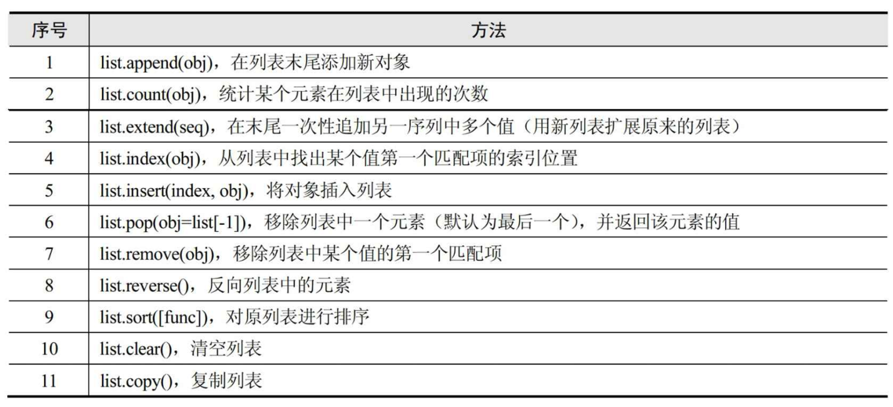
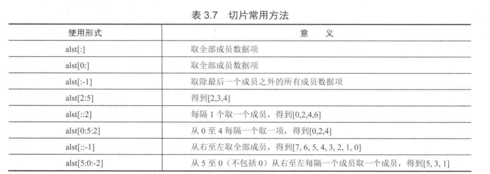

# 列表 List
```
list() #创建一个空列表
[]     #创建一个空列表
```
## 1. 列表类型内建函数
```
list.append(obj)                 # 向列表中添加一个对象obj
list.count(obj)                  # 返回一个对象obj在列表中出现的次数
list.extend(seq)                 # 把序列seq的内容添加到列表中
list.index(obj,i=0,j=len(list))  # 返回list[k] == obj 的k值,并且k的范围在i<=k<j;否则异常
list.insert(index.obj)           # 在索引量为index的位置插入对象obj
list.pop(index=-1)               # 删除并返回指定位置的对象,默认是最后一个对象
list.remove(obj)                 # 从列表中删除对象obj
list.reverse()                   # 原地翻转列表
list.sort(func=None,key=None,reverse=False)  # 以指定的方式排序列表中成员,如果func和key参数指定,则按照指定的方式比较各个元素,如果reverse标志被置为True,则列表以反序排列
list.sort(reverse=True)          #降序
```

del 

``` 
In [16]: maxnum=["hu","jianli","xiaojian","yes"]

In [17]: maxnum[-1]
Out[17]: 'yes'

In [18]: del maxnum[-1]

In [19]: maxnum
Out[19]: ['hu', 'jianli', 'xiaojian']

In [20]: del maxnum[2]

In [21]: maxnum
Out[21]: ['hu', 'jianli']
```

in

``` 
In [22]: maxnum=["hu","jianli","xiaojian","yes"]

In [23]: "hu" in maxnum
Out[23]: True

In [24]: "hu1" in maxnum
Out[24]: False
```




### 1.1 代码示例1
```python
#!/usr/bin/env python
# -*- coding:utf8 -*-
lsit1 = ["a", 1, "b", 2.0]
print(lsit1[1])     #1
print(lsit1[2])     #b
print(lsit1[-2])    #b
print(lsit1[::-1])  # 反转列表      [2.0, 'b', 1, 'a']

lsit2 = [3, 4, 5, 6]
print(lsit1 + lsit2)        #['a', 1, 'b', 2.0, 3, 4, 5, 6]

lsit3 = ["python"]
print(lsit3 * 3)            #['python', 'python', 'python']

print("apped()".center(100, "#"))
alst = [1, 2, 3, 4, 5]
alst.append("hu")
print(alst)                 # [1, 2, 3, 4, 5, 'hu']

print("count()".center(100, "#"))
print(alst.count(1))                    #1

print("在列表后追加另一个列表".center(100, "#"))
alst.extend(["1", "哈哈"])
print(alst)                         # [1, 2, 3, 4, 5, 'hu', '1', '哈哈']
print("查找列表中出现的下标".center(100, "#"))
print(alst.index(2))                    # 1

print("在下标处插入元素".center(100, "#"))
alst.insert(2, "hu")
print(alst)                 #[1, 2, 'hu', 3, 4, 5, 'hu', '1', '哈哈']

print("返回删除的列表元素，最后一个".center(100, "#"))
pop_num = alst.pop()
print(pop_num)              # 哈哈
print(alst)                 # [1, 2, 'hu', 3, 4, 5, 'hu', '1']

print("删除列表的元素2".center(100, "#"))
alst.remove(2)
print(alst)                 # [1, 'hu', 3, 4, 5, 'hu', '1']

print("反转列表，颠倒".center(100, "#"))
alst.reverse()
print(alst)                     # ['1', 'hu', 5, 4, 3, 'hu', 1]

# 原地排序
alst1 = [6, 2, 3, 4, 5]
print("对列表进行排序".center(100, "#"))
alst1.sort()
print(alst1)                    #[2, 3, 4, 5, 6]

# 复制排序
alst1 = [6, 2, 3, 4, 5]
print("对列表进行复制排序".center(100, "#"))
alst2 = sorted(alst1)
print(alst1)    #[6, 2, 3, 4, 5]
print(alst2)    #[2, 3, 4, 5, 6]

```
## 2.列表的切片


### 2.1 代码示例2

```python
# 列表元素的个数最多 536870912
shoplist = ['apple', 'mango', 'carrot', 'banana']
marxes = ['Groucho', 'Chico', 'Harpo', 'Zeppo']
others = ['Gummo', 'Karl']
marxes.extend(others)  #合并列表
marxes += others      #合并列表

shoplist[2] = 'aa'
del shoplist[0]
shoplist.insert(4,'www')
shoplist.append('aaa')

############ 列表的切片 ###########
shoplist[::-1]    # 倒着打印 对字符翻转串有效
shoplist[2::3]    # 从第二个开始每隔三个打印
shoplist[:-1]     # 排除最后一个
'\t'.join(li)     # 将列表转换成字符串 用字表符分割
sys.path[1:1]=[5] # 在位置1前面插入列表中一个值
list(set(['qwe', 'as', '123', '123']))   # 将列表通过集合去重复
{}.fromkeys(l).keys()					#列表去重的方法② 通过转换为字典然后在取键
eval("['1','a']")                        # 将字符串当表达式求值,得到列表

# enumerate 可得到每个值的对应位置
for i, n in enumerate(['a','b','c']):
    print i,n

#与enumerate 方式一样
for i in range(len(list)):
	print(i,list[i])
```
## 3.序列的内置操作


### 3.1 列表的高级特性

代码示例

```python
#!/usr/bin/env python
#-*- coding:utf8 -*-
'''
import sys  #加载sys模块
if len(sys.argv) != 2:      #判断输入参数是否为2
    print("Please supply a filename")
    raise SystemExit(1)

f = open(sys.argv[1])       #命令行上参数1的文件名
lines = f.readlines()                   #将所有行读到一个列表中
f.close()

#将所有输入值从字符串转换为浮点数
fvalues = [float(line) for line in lines]

#打印最小值和最大值
print("The minimum value is  ",min(fvalues))
print("The maximum value is  ",max(fvalues))
'''

fruit1 = ['apple','orange']
fruit2 = ['pear','grape']
fruit1.extend(fruit2)
print(fruit1)
for i,v in enumerate(fruit1):
    print(i, v)
```

### 3.2 使用any/all函数
``` python
##不推荐
found = False
for item in a_list:
  if condition(item):
    found = True
    break
if found:
  # do something if found...
  
  
##推荐
if any(condition(item) for item in a_list):
  # do something if found...
```

### 3.3 列表的查找、排序、反转

代码举例

```python
#!/usr/bin/env python
#-*- coding:utf-8 -*-
__author__ = '18793'

list = ["apple", "banana", "grape", "orange"]
print(list.index("apple"))          #打印apple的索引
print(list.index("orange"))         #打印orange的索引
print("orange" in list)             #判断orange是否在列表中
list.sort()             #排序
print("Sorted list :",list)

list.reverse()      #反转
print("Reversed list:",list)

'''
0
3
True
Sorted list : ['apple', 'banana', 'grape', 'orange']
Reversed list: ['orange', 'grape', 'banana', 'apple']
'''
```

