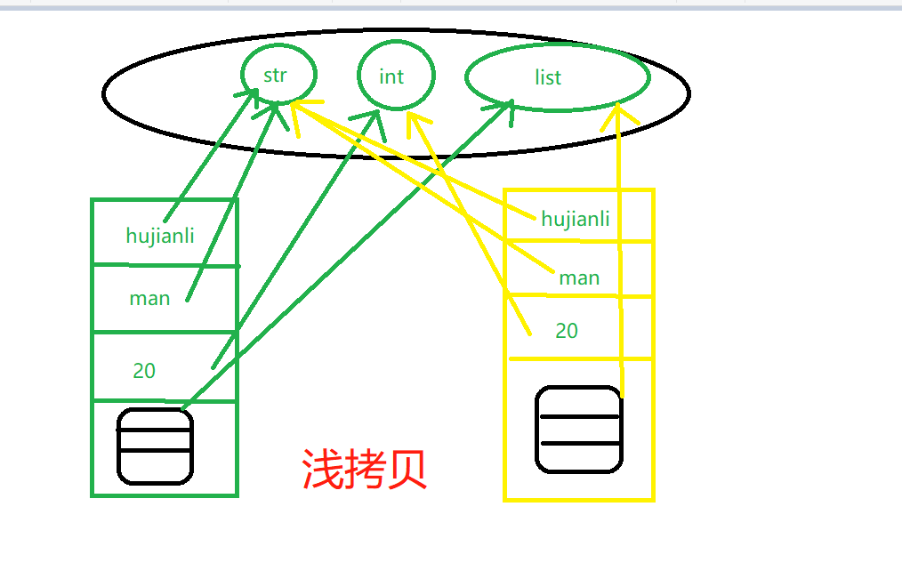

# 深浅拷贝

## 什么是可变类型和不可变类型

### 不可变数据类型

不可变类型:
    `int`、`float`、`str`、`tuple`、`bool`


```
# int类型为不可变，重新定义之后，内存地址改变
Int_var = 10
print(Int_var, "-------->", id(Int_var))  # 10 --------> 1762591504

Int_var = 20
print(Int_var, "-------->", id(Int_var))  # 20 --------> 1762591824

print()

# float类型为不可变，重新定义之后，内存地址改变
float_var = 10.111
print(float_var, "-------->", id(float_var))  # 10.111 --------> 1701696015480

float_var = 20.111
print(float_var, "-------->", id(float_var))  # 20.111 --------> 1701696015408

print()

# str类型为不可变，重新定义之后，内存地址改变
Str_var = "hello hujianli"
print(Str_var, "-------->", id(Str_var))  # hello hujianli --------> 1701662799344

Str_var = "hello huxiaojian"
print(Str_var, "-------->", id(Str_var))  # hello huxiaojian --------> 1701712521376

print()
# tuple类型为不可变，重新定义之后，内存地址改变
tuple_var = (1, 2, 3)
print(tuple_var, "------>", id(tuple_var))  # (1, 2, 3) ------> 1701712521040
tuple_var = (1, 2, 3, 4, 5, 6)
print(tuple_var, "------>", id(tuple_var))  # (1, 2, 3, 4, 5, 6) ------> 1701712508296
print()

# bool类型为不可变，重新定义之后，内存地址改变
bool_var = True
print(bool_var, "------>", id(bool_var))  # True ------> 1762336944

bool_var = False
print(bool_var, "------>", id(bool_var))  # False ------> 1762336976
print()

```

### 可变数据类型

可变数据类型：
    `list`、`set`、`dict`
    
```
# 可变数据类型
list1 = [1, 2, 3, 4, 5, 6]
print(list1, "------------->", id(list1))  # [1, 2, 3, 4, 5, 6] -------------> 2048223991688
list1.append(7)
print(list1, "------------->", id(list1))  # [1, 2, 3, 4, 5, 6, 7] -------------> 2048223991688
```


## 说明

```
浅拷贝：
    在内存开辟新的地址空间，
    对于可变对象，拷贝时，拷贝顶层引用，可变对象改变时，顶层引用不变。
    对于不可变对象，拷贝时，拷贝地址引用一份，对象改变，浅拷贝对象也变，共享可变对象引用。

深拷贝：拷贝所有对象，顶级对象及其嵌套对象。或者说：父级对象及其子对象，
        对于不可变对象，依旧指向引用内存空间。
        对于可变对象，重新开辟内存地址，对象改变，互不影响。

        """
···深浅拷贝都是对源对象的复制，占用不同的内存空间
···如果源对象只有一级目录的话，源做任何改动，不影响深浅拷贝对象
···如果源对象不止一级目录的话，源做任何改动，都要影响浅拷贝，但不影响深拷贝
···序列对象的切片其实是浅拷贝，即只拷贝顶级的对象
        """
```



## 浅拷贝
``` 
#!/usr/bin/env python
# -*- coding:utf8 -*-
# auther; 18793
# Date：2020/3/22 14:38
# filename: 数据的拷贝浅拷贝.py
import copy

print("-----------------浅拷贝-----------------------------")
print()
# 浅拷贝
name = ["hujianli", "man", 20, ["刘亦菲", "高圆圆", "关晓彤"]]

print("----------浅拷贝之前所有元素的id--------")
for n in name:
    print("{}--->{}".format(n, id(n)))

# name1 = name.copy()           ## 浅拷贝方式1，注意：只有可变对象才有.copy()方法。
# name1 = copy.copy(name)       ## 浅拷贝方式2，内存开辟新的空间,
name1 = name[::]  ## ## 浅拷贝方式2
print()

print("----------浅拷贝之后所有元素的id--------")
for n in name1:
    print("{}--->{}".format(n, id(n)))

print()
print(name, "原始数据的内存-------->", id(name))
print(name1, "浅拷贝后的内存-------->", id(name1))
print()

# 修改可变对象,拷贝副本和原始数据共用可变对象。
name[3].append("鸭蛋")
print(name)
print(name1)
print()
# 修改不可变对象,原始数据的指向更改，拷贝数据指向不变。原始数据改变，拷贝副本不变
name[0] = "huxiaojian"
print(name)
print(name1)
print()

name[2] = 18
print(name, id(name))
print(name1, id(name1))

```
    
输出信息
``` 
-----------------浅拷贝-----------------------------

----------浅拷贝之前所有元素的id--------
hujianli--->1858928711152
man--->1858934290672
20--->1519846480
['刘亦菲', '高圆圆', '关晓彤']--->1858984001160

----------浅拷贝之后所有元素的id--------
hujianli--->1858928711152
man--->1858934290672
20--->1519846480
['刘亦菲', '高圆圆', '关晓彤']--->1858984001160

['hujianli', 'man', 20, ['刘亦菲', '高圆圆', '关晓彤']] 原始数据的内存--------> 1858984001224
['hujianli', 'man', 20, ['刘亦菲', '高圆圆', '关晓彤']] 浅拷贝后的内存--------> 1858934250312

['hujianli', 'man', 20, ['刘亦菲', '高圆圆', '关晓彤', '鸭蛋']]
['hujianli', 'man', 20, ['刘亦菲', '高圆圆', '关晓彤', '鸭蛋']]

['huxiaojian', 'man', 20, ['刘亦菲', '高圆圆', '关晓彤', '鸭蛋']]
['hujianli', 'man', 20, ['刘亦菲', '高圆圆', '关晓彤', '鸭蛋']]

['huxiaojian', 'man', 18, ['刘亦菲', '高圆圆', '关晓彤', '鸭蛋']] 1858984001224
['hujianli', 'man', 20, ['刘亦菲', '高圆圆', '关晓彤', '鸭蛋']] 1858934250312
```


## 深拷贝
``` 
print("-----------------深拷贝-----------------------------")

names = ["hujianli", "man", 20, ["刘亦菲", "高圆圆", "关晓彤"]]
print("深拷贝前的内存地址：", id(names), "\n")  
for name in names:
    print(name, "------->", id(name))

name2 = copy.deepcopy(names)               
print("深拷贝后的内存地址：", id(name2), '\n')  
for name in name2:
    print(name, "---->", id(name))

# 因为列表中的可变对象是新开辟的空间，所以进行修改不影响深拷贝的内容
names[3].pop()
names.reverse()
print(names)  # [['刘亦菲', '高圆圆'], 20, 'man', 'hujianli']
print(name2)  # ['hujianli', 'man', 20, ['刘亦菲', '高圆圆', '关晓彤']]

```


输出信息
``` 
-----------------深拷贝-----------------------------
深拷贝前的内存地址： 1770977537224 

hujianli -------> 1770925725168
man -------> 1770927765688
20 -------> 1519846480
['刘亦菲', '高圆圆', '关晓彤'] -------> 1770977537288
深拷贝后的内存地址： 1770925725064                       # 重新开辟内存空间

hujianli ----> 1770925725168                            # 不可变对象，指向了内存空间中的引用
man ----> 1770927765688
20 ----> 1519846480
['刘亦菲', '高圆圆', '关晓彤'] ----> 1770977537992       #  对于可变对象新开辟了空间
[['刘亦菲', '高圆圆'], 20, 'man', 'hujianli']
['hujianli', 'man', 20, ['刘亦菲', '高圆圆', '关晓彤']]
```


### 举例说明：
```
"""
深浅拷贝都是对源对象的复制，占用不同的内存空间
如果源对象只有一级目录的话，源做任何改动，不影响深浅拷贝对象
如果源对象不止一级目录的话，源做任何改动，都要影响浅拷贝，但不影响深拷贝
序列对象的切片其实是浅拷贝，即只拷贝顶级的对象

"""
import copy
d = {'name':'hujianli','age':'22'}
c1 = copy.copy(d)       #浅拷贝
c2 = copy.deepcopy(d)   #深拷贝

print(id(d),id(c1),id(c2))   #  三个不同对象

d["name"] = "hujianli"
print(d,c1,c2)   #  三个不同对象


#深拷贝
print("深拷贝".center(100,"="))
d1 = {'name':{'first':'hu','last':'jianli'},
    'job':['IT','HR']}
c1 = copy.copy(d1)
c2 = copy.deepcopy(d1)
d1["job"][0] = "test"
print(d1)
print(c1)
print(c2)

```