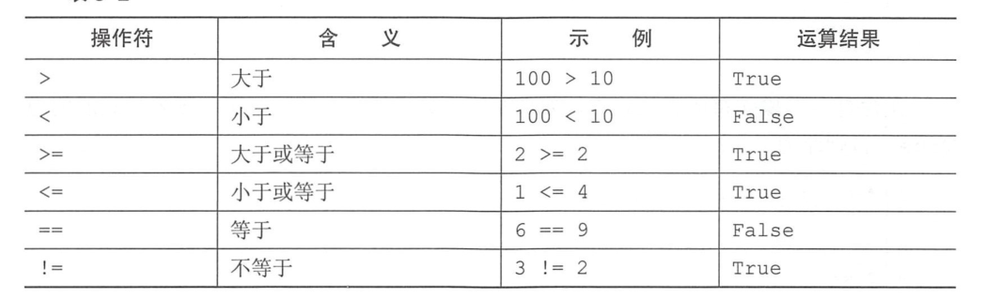

.. contents::
   :depth: 3
..

内置常量与逻辑运算符、比较运算符
================================

内置常量
--------

::

   None 的意义是”无“，常用来表示没有值的对象

   python中逻辑假包括：False、None、0、空字符串、（）空元祖、[]空列表、和{}空字典，其余的任何值都视为真
   布尔             False
   null 类型        None
   整型             0
   浮点型           0.0
   空字符串         ''
   空列表           []
   空元组           ()
   空字典           {}
   空集合           set()

代码示例

::

   In [2]: if 0:
      ...:     print("None")
      ...: else:
      ...:     print('True')
      ...:
   True
   In [9]: if {}:
      ...:     print("None")
      ...: else:
      ...:     print("true")
      ...:
   true

   In [12]: if "":
       ...:     print("None")
       ...: else:
       ...:     print("True")
       ...:
   True

   In [13]: if None:
       ...:     print("None")
       ...: else:
       ...:     print("True")
       ...:
   True

python中的逻辑运算符
--------------------

.. image:: ../../_static/lj-ysf.png

or运算符的操作
~~~~~~~~~~~~~~

::

   In [14]: [1,2] or 0         #第一个操作为真，结果为真
   Out[14]: [1, 2]

   In [15]: 0 or [1,2]         #第一个操作为假，直接返回第二个操作数，即(1,2)，结果为真
   Out[15]: [1, 2]

   In [16]: [] or ()           #第一个操作为假，直接返回第二个操作数，() 空元祖
   Out[16]: ()

and运算操作符
~~~~~~~~~~~~~

::

   In [17]: [1,2] and 3        #第一个操作为真，直接返回第二个操作，结果为真
   Out[17]: 3

   In [18]: [] and [1,2]       #第一个操作为假，直接返回[]，结果为假
   Out[18]: []

   In [19]: [] and ()          # 第一个操作为假，直接返回[]，结果为假
   Out[19]: []

   In [20]: 1 and 0             #第一个操作为真，直接返回第二个操作 0 ，结果为假
   Out[20]: 0

   In [21]: 0 and True         ## 第一个操作为假，直接返回 0 ，结果为假
   Out[21]: 0

python中的比较运算符
--------------------

::

   Python 中的比较操作符见下表。
   相等       ==
   不等于     !=
   小于       <
   不大于     <=
   大于       >
   不小于     >=
   属于      in...

is 和 is not
------------

::

   In [22]: x=3.14

   In [23]: y=x

   In [24]: x is y
   Out[24]: True

   In [25]: x is not y
   Out[25]: False

   In [27]: x is None
   Out[27]: False

   In [28]: x = None

   In [29]: x is None
   Out[29]: True

in 和not in
===========

::

   hujianli = [1,2,3]
   hujianli2 = ['a', 'b', 'v']

   In [34]: hujianli
   Out[34]: [1, 2, 3]

   In [35]: 1 in hujianli
   Out[35]: True

   In [36]: 1 in hujianli2
   Out[36]: False

   In [38]: 'a' in hujianli2
   Out[38]: True

   In [39]: hujianli3 = {'a':1,'b':2}

   In [40]: 'a' in hujianli3           #检查'a'是否在字典的键中，返回为True。in只检测字典的键
   Out[40]: True

   In [41]: 1 in  hujianli3            #值不检测，返回False
   Out[41]: False

赋值运算符
----------

.. image:: ../../_static/python_ysf.png
