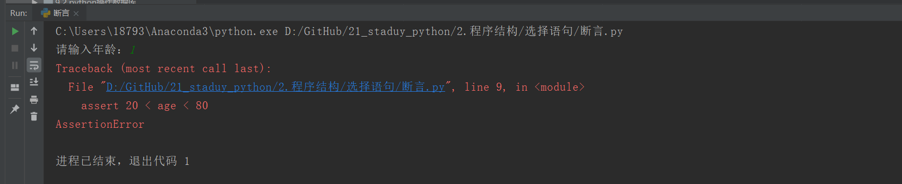

# 选择语句

## 1.Python代码执行过程
Python代码在执行过程中，遵循下面的基本原则：

- 普通语句，直接执行；
- 碰到函数，将函数体载入内存，并不直接执行
- 碰到类，执行类内部的普通语句，但是类的方法只载入，不执行
- 碰到if、for等控制语句，按相应控制流程执行
- 碰到@，break，continue等，按规定语法执行
- 碰到函数、方法调用等，转而执行函数内部代码，执行完毕继续执行原有顺序代码


## 2.条件判断
Python 中的比较操作符见下表。

    相等 ==
    不等于 !=
    小于 <
    不大于 <=
    大于 >
    不小于 >=
    属于 in...


**什么是真值（ True ）**
如果表达式的返回类型不是布尔会发生什么？什么情况下 Python 会认为是 True 和 False ?
一个成假赋值不一定明确表示为 False 。


其他内置类型的布尔值规则如下：

- 布尔值为假：False、None、0、False、[]、()、{}、set()、frozenset()，等等。·
- 布尔值为真：True 、非0的数值、True，非空的序列、元组、字典，用户定义的类和实例，等等。


```
简单的if语句
if 表达式：（布尔值）
    语句块


if 表达式:
   语句块1
else:
    语句块2


if 表达式:
    语句块1
elif 表达式:
    语句块2
else:
    语句块3


#推荐写法
if flag:
    pass

if not flag:
    pass


if a == 1:
    pass


##不推荐
if x == True:
  # ....
if len(items) != 0:
  # ...
if items != []:
  # ... 
  
  
##推荐
if x:
  # ....
if items:
  # ...
```


eg

```python

str = ''
if str:
    print("str不是空字符串")
else:
    print("str是空字符串")


list = []
if list:
    print("list 不是空列表")
else:
    print("list 是空列表")


dict2 = {}
if dict2:
    print("dict2 不是空字典")
else:
    print("dict2 是空字典")
```


### 2.1 演示一个if语句

```python
import sys

param = None

if len(sys.argv) > 0:
    param = int(sys.argv[1])

if param is None:
    print("Alert")
    print("The param is not set")

elif param < -10:
    print("The param is samll")

elif param > 10:
    print("The param is big")

else:
    print("The param is middle")
```

### 2.2 python中的case语言

`python没有switch或case语句用于测试多个值，要处理多个值，可以使用elif语句，如下`
``` python
suffix = "hujianli.py"
suffix = "." + suffix.split(".")[1]

if suffix == ".htm":
    content = "text/html"
elif suffix == ".py":
    content = "python"
elif suffix == ".sh":
    content = "shell"
elif suffix == ".png" or suffix == ".jpg":
    content = "image/png"
else:
    raise RuntimeError("Unknow content type.")

print(content)
```
输出
``` 
python
```

`表示真值，可以用True和False`
``` python
has_y = False

suffix = "hujianli.py"
suffix = "." + suffix.split(".")[1]

if suffix == ".htm":
    has_y = True
elif suffix == ".py":
    has_y = True
elif suffix == ".sh":
    has_y = True
elif suffix == ".png" or suffix == ".jpg":
    has_y = True
else:
    raise RuntimeError("Unknow content type.")

print(has_y)
```
输出
``` 
True
```


```
########################if 的嵌套方式########################
if 表达式1：
    if 表达式2：
        语句块2
    else:
        语句块3
else:
    语句块1
```
代码示例1

`if...else嵌套的语句`

``` 
#!/usr/bin/env python
#-*- coding:utf8 -*-
print("\n 为了您和家人的安全，请不要酒后开车\n")
var1=int(input("请输入每100毫升血液中的酒精含量度数："))

if var1 <20:
    print("您的血液中酒精含量为:{},可以开车，建议找个代驾。".format(var1))
else:
    if 80 >= var1 >=20:
        print("您血液中酒精含量为{},已经超标，不要开车，谢谢！".format(var1))
    else:
        print("您血液中酒精含量为{},请不要开车....严重超标。".format(var1))

```


## 3.三元运算符

代码示例2

```python
#!/usr/bin/env python
#-*- coding:utf8 -*-
a = 4
b = 5
c = a if a > b else b
print(c)

if a > b:
    print(a)
else:
    print(b)


if a<=b:
    minalue = a
else:
    minalue = b

minalue = a if a<=b else b
```

``` python
#!/usr/bin/env python
# -*- coding:utf8 -*-
# auther; 18793
# Date：2019/6/5 18:28
# filename: test2.py
secore = int(input("Please you enter number: "))

result = "及格" if secore >= 60 else "不及格"
print(result)
```

``` python
a = 5
b = 3
st = "a大于b" if a > b else  "a不大于b" 
# 输出"a大于b"
print(st)

# 输出"a大于b"
print("a大于b") if a > b else print("a不大于b")

# 第一个返回值部分使用两条语句，逗号隔开
st = print("crazyit"), 'a大于b' if a > b else  "a不大于b" 
print(st)

# 第一个返回值部分使用两条语句，分号隔开
st = print("crazyit"); x = 20 if a > b else  "a不大于b" 
print(st)
print(x)

c = 5
d = 5
# 下面将输出c等于d
print("c大于d") if c > d else (print("c小于d") if c < d else print("c等于d"))

```

## 4.断言 assert

assert 断言的执行逻辑是：

    if条件为Fa1se
        程序引发AssertionError 错误


断言： 使用assert关键字后面接着一个条件表达式

* 如果条件表达式为真，证明与开发人员自己的断言一致，程序继续运行。

* 如果为假，则表明一定是前面发生了错误，程序停止运行，报出异常。

示例1:

```python
assert  1!=1,"1不等于1报错，断言错误....."
```


```
#!/usr/bin/env python
#-*- coding:utf8 -*-

'''
# 伪代码
if not condition:
    crash program
'''

#当不知道程序会在哪里出错，与其在运行时崩溃，不如在出现错误条件时就崩溃
x=3
assert x>0, "x is not zero or negative"
assert x%2 == 0, "x is not an even number"

'''
使用assert断言时，要注意以下几点： 
（1）assert断言用来声明某个条件是真的。 
（2）如果你非常确信你使用的列表中至少有一个元素，想要检验这一点，并在它非真时引发一个错误，那么assert语句是应用在这种情形下的理想语句。 
（3）assert语句失败时，会引发一个AssertionError。
'''
```

eg

``` python
#!/usr/bin/env python
# -*- coding:utf8 -*-
# auther; 18793
# Date：2019/5/10 15:17
# filename: 断言.py
s_age = input("请输入年龄：")
age = int(s_age)

assert 20 < age < 80
print("您输入的年龄在20和80之间")
```



## 5.pass 占位符
```python
name="xiaoming"
if name == "xiaoming":
    print("{0} hello".format(name))
elif name == "xiaozhang":
    pass
else:
    print("do nothing")
```


## 6.is和==的区别

（1）==对比两个对象的值是否相等，行为可被__eq__方法重载；

（2）**is判断两个对象是否是内存里的同一个东西**，无法被重载。


