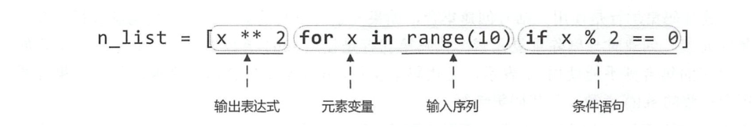

# 列表推导式
快速生成列表，根据某个列表生成满足需要的列表

## 语法
``` 
# 基本语法
[ expression  for item  in iterable  ]

[ 表达式  for x in iterable if 条件 ]
[ 表达式1 if 条件 else 表达式2 for x in iterable ]

## 加上条件判断后的语法
[ expression  for item  in iterable  if condition ]
```
```python
#!/usr/bin/env python
# -*- coding:utf8 -*-
# auther; 18793
# Date：2019/4/15 18:00
# filename: 列表推导式.py
list1 = [100, 200, 355, 466, 766, 566, 888]
list2 = [float(pice*0.5) for pice in list1]
list3 = [pice for pice in list1 if pice >400]

print("原价格为：{}".format(" ".join([str(i) for i in list1])))
print("打完五折后的价格为：{}".format(" ".join([str(i) for i in list2])))
print("价格中大于400的有:{}".format(" ".join(str(i) for i in list3)))
```

#### 代码示例1
```python
import random   #导入生成随机数的模块
list1 = []   #定义一个空列表
for i in range(10):
    list1.append(random.randint(10,100))    #向列表中添加随机数
print(list1)


list1 = [random.randint(10, 100) for i in range(10)]
print(list1)

print("偶数的平方".center(100,"="))
#偶数平方的列表，10以内的2的平方
list2 = [i*i for i in range(2,11,2)]
print(list2)


price = [1000,500,800,888,666]
sale = [int(x/2) for x in price]
#sale = [int(x*0.5) for x in price]
print(sale)

#求偶数
list3 = [i for i in range(11) if i % 2 ==0 ]
print(list3)

#求基数
list3 = [i for i in range(11) if i % 2 ==1 ]
print(list3)

#筛选
list3 = [i for i in range(11) if 4 < i < 10]
print(list3)

print("分割线".center(100,"*"))
odd_list = [i for i in range(21) if i %2 == 1]
print(odd_list)
odd_list = list(map(lambda i:i*i,odd_list))
print(odd_list)
```

语法：



#### 代码示例2
```python
#列表生成器可以使用2层、3层循环
In [61]: [x+y+z for x in "yY" for y in "eE" for z in "sS" ]
Out[61]: ['yes', 'yeS', 'yEs', 'yES', 'Yes', 'YeS', 'YEs', 'YES']

In [62]: [ x+y for x in "nN" for y in "oO" ]
Out[62]: ['no', 'nO', 'No', 'NO']

In [63]: [ (x,y) for x in range(1,4) for y in range(5,9) ]
Out[63]:
[(1, 5),
 (1, 6),
 (1, 7),
 (1, 8),
 (2, 5),
 (2, 6),
 (2, 7),
 (2, 8),
 (3, 5),
 (3, 6),
 (3, 7),
 (3, 8)]
 

print([ x+y for x in "yes" for y in "no" ])

list2 = [(x, y) for x in range(5) if x % 2 == 0 for y in range(5) if y % 2 == 1]
print(list2)

'''
[line.rstrip() for line in open('myfile').readlines()] ['aaa', 'bbb', 'ccc']
[line.rstrip() for line in open('myfile')] ['aaa', 'bbb', 'ccc']
list(map((lambda line: line.rstrip()), open('myfile'))) ['aaa', 'bbb', 'ccc']
'''

print("="*100)
#20以内每个数字的平方
squmber = [x**2 for x in range(20)]
print(squmber)

print("="*100)
#去掉列表中元素前后的空格
mybag = [" hujianli", "  apple", "green leaf "]
mybag_after = [ str(x).strip() for x in mybag]
print(mybag_after)


# 找出0~99之间能被5整除的数
number = [x for x in range(100) if x % 5 == 0]
print(number)


print("***************奇数+1，偶数不变*********************8")
tuple_example = (1, 2, 3, 4, 5, 6, 7, 8, 9)
exam1 = [x if x % 2 == 0 else x + 1 for x in tuple_example]
print(exam1)

```

#### 列表推导示例
``` python
##不推荐
new_list = []
for item in a_list:
  if condition(item):
    new_list.append(fn(item))
     
##推荐
new_list = [fn(item) for item in a_list if condition(item)]
```

#### 列表推导-嵌套
``` python
##不推荐
for sub_list in nested_list:
  if list_condition(sub_list):
    for item in sub_list:
      if item_condition(item):
        # do something... 
##推荐
gen = (item for sl in nested_list if list_condition(sl) \
      for item in sl if item_condition(item))
for item in gen:
  # do something...
```