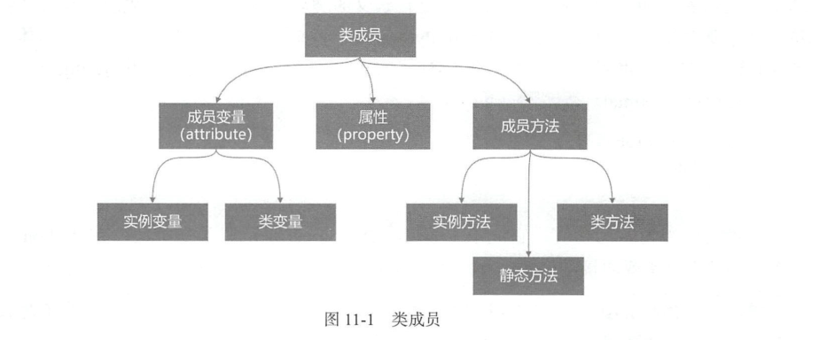

# 什么是面对对象设计

### 面对对象编程的三要素
 * 封装性
 
 
 
        封装能使外部访问者不能随意存取对象的内部数据，隐藏了对象的内部细节，只保留有限的对外接口，外部访问
        者不必关心内部细节，操作对象变得简单
 * 继承性
 
 
        父类和子类，子类可以继承父类的方法和属性，相同的特性不必重复去编写。
        父类又称“超类”，子类又名“派生类”
        
        统一称为父类和子类，这么容易理解
 
 * 多态性
 
 
        父类成员被子类继承之后，可以具有不同的状态和表现行为。
        
 
### 万物皆对象

    人    动物   植物

    动态方法：人-->走、跑、跳、吃饭、睡觉、开门、关门
    静态属性：人---> 高矮胖瘦、男人、女人、小孩、青年、中年、老年、帅气、漂亮

    类需要实例化之后才能使用里面的方法和属性
    静态方法例外

    类的实例化就相当于根据汽车模型图纸，生成一辆汽车。
    这辆汽车的外观就是类里面的属性，功能就是类里面的方法


    类就是一组相似事物的统称
    属性---静态
    方法--动态

    封装--把类的内部实现和接口分离，只留出接口供调用
    继承--子类可以继承、重写、添加父类的方法和属性
    多态--同一种事物的多种形态


### 创建第一个类
```
#!/usr/bin/env python
#-*- coding:utf8 -*-
class Geeese:
    '''
    大雁类,类名采用首字母大写，驼峰式约定俗成定义法
    '''
    #属性
    #方法
    pass

widGoose = Geeese()     #创建大雁类的实例
widGoose1 = Geeese()    #创建第二个实例
print(widGoose)
print(widGoose1)

```
### 请牢记这张图




[面向过程编程vs函数式编程](https://pythonav.com/wiki/detail/1/19/)

