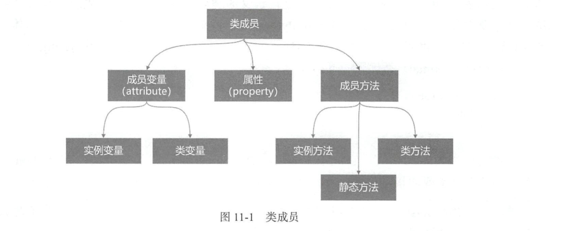

.. contents::
   :depth: 3
..

什么是面对对象设计
==================

面对对象编程的三要素
--------------------

-  封装性

   ::

       封装能使外部访问者不能随意存取对象的内部数据，隐藏了对象的内部细节，只保留有限的对外接口，外部访问
       者不必关心内部细节，操作对象变得简单

-  继承性

   ::

       父类和子类，子类可以继承父类的方法和属性，相同的特性不必重复去编写。
       父类又称“超类”，子类又名“派生类”

       统一称为父类和子类，这么容易理解

-  多态性

   ::

       父类成员被子类继承之后，可以具有不同的状态和表现行为。

万物皆对象
----------

::

   人    动物   植物

   动态方法：人-->走、跑、跳、吃饭、睡觉、开门、关门
   静态属性：人---> 高矮胖瘦、男人、女人、小孩、青年、中年、老年、帅气、漂亮

   类需要实例化之后才能使用里面的方法和属性
   静态方法例外

   类的实例化就相当于根据汽车模型图纸，生成一辆汽车。
   这辆汽车的外观就是类里面的属性，功能就是类里面的方法

   类就是一组相似事物的统称
   属性---静态
   方法--动态

   封装--把类的内部实现和接口分离，只留出接口供调用
   继承--子类可以继承、重写、添加父类的方法和属性
   多态--同一种事物的多种形态

创建第一个类
------------

::

   #!/usr/bin/env python
   #-*- coding:utf8 -*-
   class Geeese:
       '''
       大雁类,类名采用首字母大写，驼峰式约定俗成定义法
       '''
       #属性
       #方法
       pass

   widGoose = Geeese()     #创建大雁类的实例
   widGoose1 = Geeese()    #创建第二个实例
   print(widGoose)
   print(widGoose1)

请牢记这张图
------------

`面向过程编程vs函数式编程 <https://pythonav.com/wiki/detail/1/19/>`__
