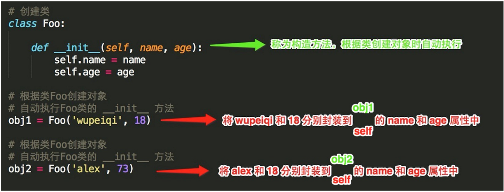

.. contents::
   :depth: 3
..

类中的__init__方法
==================

\__init__方法又称构造方法，
---------------------------

::

   在实例化类的时候，自动加载里面定义的属性
   实例化的时候传入的参数必须要和__init__中的参数保持一致，
   传入的参数将被自动加载到类中，变为实例属性

代码示例1：
~~~~~~~~~~~

::

   #!/usr/bin/env python
   # -*- coding:utf8 -*-
   class INIT_class:
       def __init__(self, x, y=0):
           self.x = x
           self.y = y

       def mycalc(self):
           return self.x + self.y

   diaoyong1 = INIT_class(2)
   print("调用myclac方法1")
   print(diaoyong1.mycalc())
   print("".center(100, "*"))
   print("调用myclac方法2")
   diaoyong2 = INIT_class(5, 6)
   print(diaoyong2.mycalc())

eg

::

   #!/usr/bin/env python
   # -*- coding:utf8 -*-
   # auther; 18793
   # Date：2019/5/18 0:02
   # filename: 构造方法.py
   class Animal(object):
       """
       定义动物类
       """

       def __init__(self, age, sex=1, weight=0.0):
           # 定义实例变量，实例化时自动载入
           self.age = age
           self.sex = sex
           self.weight = weight

   a1 = Animal(2, 0, 10.0)
   a2 = Animal(1, weight=5.0)
   a3 = Animal(1, sex=0)

   print("a1年龄：{0}".format(a1.age))
   print("a2体重：{0}".format(a2.weight))
   print("a3性别：{0}".format("雌雄" if a3.sex == 0 else "雄性"))
