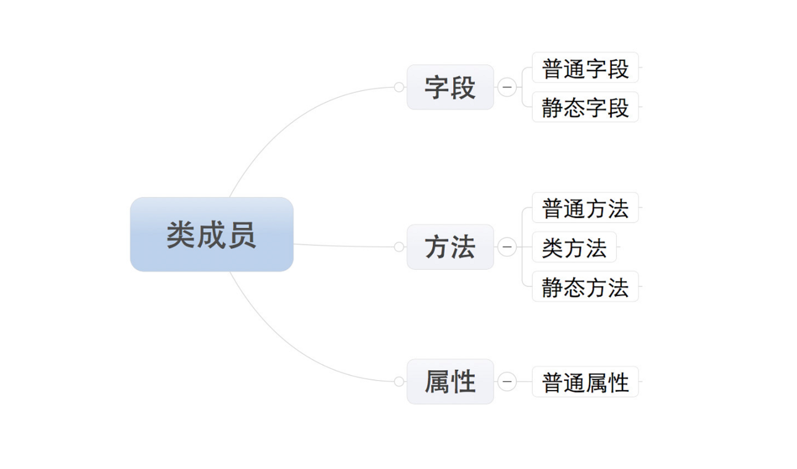
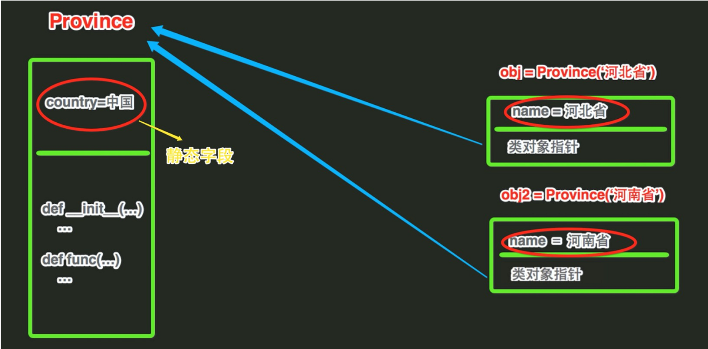

# 一个基础有方法和属性的类
### 类成员
类的成员可以分为三大类：字段、方法和属性


- 字段

字段包括：

普通字段和静态字段，他们在定义和使用中有所区别，而最本质的区别是内存中保存的位置不同，
```  
#!/usr/bin/env python
#-*- coding:utf8 -*-
class Province:

    #静态字段
    country = "中国"

    def __init__(self,name):
        #普通字段
        self.name = name


#直接访问普通字段
hu = Province("hujianli")
print(hu.name)

#直接访问静态字段
print(Province.country)
```

* 静态字段在内存中只保存一份 
* 普通字段在每个对象中都要保存一份

### 方法和属性
#### 代码示例 1

```
#!/usr/bin/env python
#-*- coding:utf8 -*-
class Geese:
    '''
    大雁类
    '''
    neck = '脖子较长'   #类属性
    wing = '翅膀频率高'
    leg = '腿位于身体的中心支点，行走自如'

    def __init__(self):  #定义构造方法
        print('我是大雁类，我有以下特征：')
        print(Geese.neck)
        print(Geese.wing)
        print(Geese.leg)

    def fly(self, state):        #飞行方法
        print(state)

beak_1 = "喙的基部较高，长度和头的长度几乎相等"
wing_1 = "翅膀长而尖"
claw_1 = "爪子是噗状的"
# windGoose = Geese(beak_1, wing_1, claw_1)
# print()
# windGoose.fly("我飞行的时候，一会排成人字，一会排成一字")
print()
print("我的形态特征是：")
windGoose = Geese()
```

#### 代码示例 2

```
#!/usr/bin/env python
#-*- coding:utf8 -*-

class Geese:
    '''
    大雁类
    '''
    neck = '脖子较长'   #类属性
    wing = '翅膀频率高'
    leg = '腿位于身体的中心支点，行走自如'
    number = 0

    def __init__(self):  #定义构造方法
        Geese.number +=1
        print('\n我是第{}只大雁类，我有以下特征：'.format(Geese.number))
        print(Geese.neck)
        print(Geese.wing)
        print(Geese.leg)

    def fly(self, state):        #飞行方法
        print(state)


list1 = []
for i in range(4):
    list1.append(Geese())

print("一共有{}只大雁!".format(Geese.number)) #输出大雁的只数
Geese.beak = "这是添加的一个属性,属性名称beak."
print(list1[1].beak)

```
