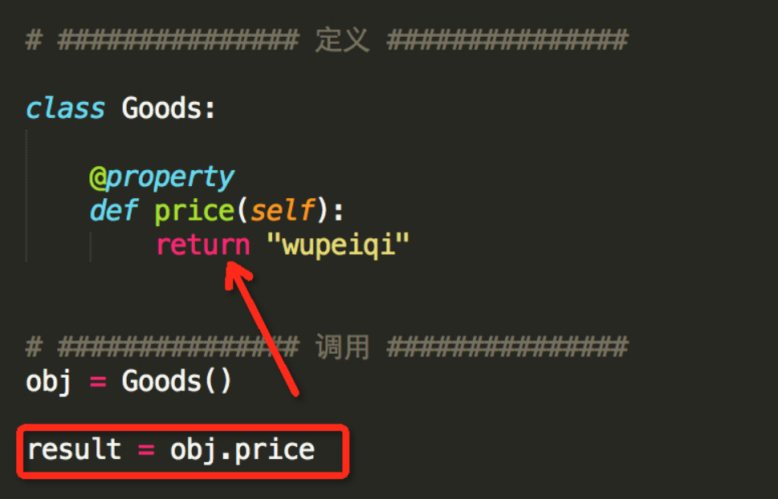

# property装饰器，将方法转为属性,动态属性

``` 
#!/usr/bin/env python
# -*- coding:utf8 -*-
# auther; 18793
# Date：2019/6/13 17:54
# filename: property2.py
class Rectangle:
    # 定义构造方法
    def __init__(self, width, height):
        self.width = width
        self.height = height
    # 定义setsize()函数
    def setsize (self , size):
        self.width, self.height = size
    # 定义getsize()函数
    def getsize (self):
        return self.width, self.height
     # 定义delsize()函数
    def delsize (self):
        self.width, self.height = 0, 0
    # 使用property定义属性
    size = property(getsize, setsize, delsize, '用于描述矩形大小的属性')


print(Rectangle.size.__doc__)

# print(help(Rectangle.size))
rect = Rectangle(3, 4)
print(rect.size)
rect.size = 7, 8
print(rect.height)
print(rect.width)
del rect.size
print(rect.width)
print(rect.height)


```

### 访问方式和之前略有区别,用属性的方式访问
#### 代码示例 1
```
#!/usr/bin/env python
#-*- coding:utf8 -*-

#通过装饰器方法来获取私有属性
class TVShow:       #电视节目类
    list_film = ["战狼2", "红海行动", "西游记女儿国", "熊出没变形记"]

    def __init__(self, show):
        self.__show = show      ## 私有的实例属性

    @property
    def show(self):
        '''
        :return:私有属性
        '''
        return self.__show      #返回类的实例


    @show.setter                #让属性可以进行修改
    def show(self, value):
        if value in TVShow.list_film:       #判断值是否在列表中
            self.__show = '您选择了《'+ value + "》,稍后将播放"    #修改返回值
        else:
            self.__show = "您点播的电影不存在"


tvshow = TVShow("战狼2")  #创建类的实例
print("正在播放:《", tvshow.show, "》")     #获取属性值
print("您可以从", TVShow.list_film, "中选择台点播的电影")

tvshow.show = '红海行动'
print(tvshow.show)      #获取属性值
```
### @property 实现只读属性
    
    @property 可以实现一个只读属性， 为属性添加了安全保护的机制。
    注意：
    @property 所装饰的方法变成属性之后，为只读的属性
        不能通过 实例.xxx=  的方式进行修改。

#### 用代码来理解 2

新式类中的属性有三种访问方式，

并分别对应了三个被@property、@方法名.setter、@方法名.deleter修饰的方法
```
#!/usr/bin/env python
#-*- coding:utf8 -*-
class Rect:
    def __init__(self,weight,height):
        self.__weight = weight
        self.__height = height

    @property                       #将方法转为属性
    def area(self):
        return self.__weight*self.__height

    @area.setter                    #设置属性的值
    def set_area(self, value):
        if isinstance(value,int):
            self.__weight += value
        else:
            raise ValueError

    @area.deleter
    def delete_are(self):
        print("删除属性.......")

hu = Rect(10,20)
print(hu.area)

#不能进行重新赋值，会报错
hu.set_area = 100
print(hu.area)
del hu.delete_are

```
#### 代码示例 3
```
#!/usr/bin/env python
#-*- coding:utf8 -*-
from datetime import datetime,date

class User:
    def __init__(self,name,birthday):
        self.name = name
        self.birthday = birthday
        self._age = 0

    @property
    def age(self):
        return datetime.now().year - self.birthday.year

    @age.setter
    def age(self,value):
        self._age = value

if __name__ == '__main__':
    user = User("derek",date(year=1994,month=11,day=11))
    user.age = 23
    print(user._age)   # 23,setter设置的
    print(user.age)    # 24 ,动态计算出来的

```

### 使用property函数调用私有属性
使用方式如图所示：

```python
#!/usr/bin/env python
# coding=utf-8

__metaclass__ = type

class ProtectMe:
    def __init__(self):
        self.me = "qiwsir"
        self.__name = "kivi"

    @property
    def name(self):
        return self.__name

if __name__ == "__main__":
    p = ProtectMe()
    print p.name
```
```  
定义时，在普通方法的基础上添加 @property 装饰器； 
定义时，属性仅有一个self参数 
调用时，无需无括号
```

### 实现一个分页打印的类的代码
``` 
#!/usr/bin/env python
# -*- coding:utf8 -*-
# auther; 18793
# Date：2019/4/21 10:32
# filename: 分页的类.py

class Pagination(object):
    """
    分页相关的代码
    """

    def __init__(self, data_list, page, per_page=30):
        """

        :param data_list: 数据的列表
        :param page: 当前查看的页面
        :param per_page: 每页默认要显示的行数
        """
        self.data_list = data_list
        self.page = page
        self.per_page = per_page

    @property
    def start(self):
        """
        计算索引的起始位置
        :return:
        """
        return (self.page - 1) * self.per_page

    @property
    def end(self):
        """
        计算分页的结束位置
        :return:
        """
        return self.page * self.per_page

    @property
    def check_show(self):
        res = None
        if self.page * self.per_page > len(self.data_list):
            print("--------已为您打开最后一页-------------")
            last_index = int(len(self.data_list)/self.per_page)
            self.page = last_index
            res = self.data_list[self.start:self.end]
        else:
            res = self.data_list[self.start:self.end]

        for index in res:
            print(index)


if __name__ == '__main__':

    # 模拟所有数据写入到一个list里面
    data_list = []
    for i in range(1, 901):
        data_list.append("hujianli-blog-{}".format(i))

    # 循环查看页面页数
    while True:
        page = int(input("请输入要查看的页数:"))
        obj = Pagination(data_list, page)
        obj.check_show

```

### 属性(property)
``` 
##不推荐
class Clock(object):
  def __init__(self):
    self.__hour = 1
  def setHour(self, hour):
    if 25 &gt; hour &gt; 0: self.__hour = hour
    else: raise BadHourException
  def getHour(self):
    return self.__hour
    
##推荐
class Clock(object):
  def __init__(self):
    self.__hour = 1
  def __setHour(self, hour):
    if 25 &gt; hour &gt; 0: self.__hour = hour
    else: raise BadHourException
  def __getHour(self):
    return self.__hour
  hour = property(__getHour, __setHour)
```