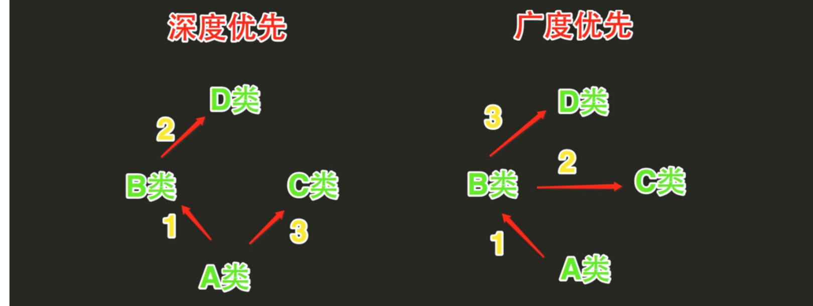

# 类的继承

### 类继承的顺序

    经典类:深度优先
    新式类:广度优先

    
### Python3 默认广度优先-新式类

```python
#!/usr/bin/env python
# -*- coding:utf8 -*-
class A:
    attr = 1


class B(A):
    pass


class C(A):
    attr = 2


class D(B, C):
    pass


if __name__ == '__main__':
    x = D()
    print(x.attr)       # 2
    
    
#明确解决冲突
class A:
    attr = 1


class B(A):
    pass


class C(A):
    attr = 2


class D(B, C):
    attr = B.attr


if __name__ == '__main__':
    x = D()
    print(x.attr)  #  1

```

#### 代码示例 1
```
#!/usr/bin/env python
#-*- coding:utf8 -*-
class Ant:

    def __init__(self, x=0, y=0, color="black"):  #定义构造方法，将实例属性和参数一一绑定
        self.x = x
        self.y = y
        self.color = color

    def crawl(self,x,y):
        self.x = x
        self.y = y
        print("爬行....")
        self.info()

    def info(self):
        print("当前位置({}，{})".format(self.x, self.y))

    def attack(self):
        '模拟攻击'
        print("用嘴咬")

class FlyAnt(Ant):
    '''
    定义FlyAnt类，继承Ant类
    '''
    def attack(self):
        '修改行为，攻击方法不同'
        print("用尾针..！")

    def fly(self,x,y):
        print("飞行.....")
        self.x = x
        self.y = y
        self.info()
flyant = FlyAnt(color="red")   #实例化类
flyant.crawl(3,5)              #模拟爬行
flyant.fly(20,30)              #模拟飞行
flyant.attack()                #模拟攻击

```

输出信息
``` 
爬行....
当前位置(3，5)
飞行.....
当前位置(20，30)
用尾针..！
```

eg
``` 
#!/usr/bin/env python
# -*- coding:utf8 -*-
# auther; 18793
# Date：2019/6/22 9:21
# filename: 类的继承4.py
import types


class Person(object):
    def __init__(self, name="", age=20, sex='man'):
        self.setName(name)
        self.setAge(age)
        self.setSex(sex)

    def setName(self, name):
        if type(name) != str:
            print("名字必须是字符串")
            return
        self.__name = name

    def setAge(self, age):
        if type(age) != int:
            print("年龄必须是整数")
            return
        self.__age = age

    def setSex(self, sex):
        if sex != "男" and sex != "女":
            print("性别输入错误")
            return
        self.__sex = sex

    def show(self):
        print("姓名：{0}  性别：{1}  年龄：{2}".format(self.__name, self.__age, self.__sex))


class Student(Person):
    def __init__(self, name="", age=20, sex='man', schoolyear=2018):
        super(Student, self).__init__(name, age, sex)
        self.setSchoolyear(schoolyear)

    def setSchoolyear(self, schoolyear):
        if type(schoolyear) != int:
            print("输入入学年份错误")
            return
        self.__schoolyear = schoolyear

    def show(self):
        Person.show(self)
        print("入学年份：{0}".format(self.__schoolyear))


if __name__ == '__main__':
    zhangsan = Person("张三", 18, "男", )
    zhangsan.show()

    lisi = Student("李四", 21, "男", 2019)
    lisi.show()
    lisi.setAge(20)
    lisi.setSchoolyear(2015)
    lisi.show()


```

输出信息:
``` 
姓名：张三  性别：18  年龄：男
姓名：李四  性别：21  年龄：男
入学年份：2019
姓名：李四  性别：20  年龄：男
入学年份：2015

```


#### 代码示例 2
``` 
#!/usr/bin/env python
# -*- coding:utf8 -*-
# auther; 18793
# Date：2019/6/13 22:47
# filename: 类的继承性2.py
class Fruit:
    def info(self):
        '''实例方法'''
        print("我是一个水果！重{}克".format(self.weight))


class Food:
    def taste(self):
        '''实例方法'''
        print("不同食物的口感不同")


# 定义Apple类，继承了Fruit类和Food类
class Apple(Fruit, Food):
    pass


# 创建Apple对象
a = Apple()
a.weight = 5.6
#调用Apple类的info()方法
a.info()

#调用Apple类的teste()方法
a.taste()

```
输出信息
``` 
我是一个水果！重5.6克
不同食物的口感不同
```


### 类的多重继承，同时继承多个类的顺序
``` 
当一个子类有多个父类时，该子类会继承所有父类的方法，如果父类中包含多个同名的方法时，排在前面的父类
中的方法会“遮蔽”排在后面父类中同名的方法
```
#### 示例代码
``` 
#!/usr/bin/env python
# -*- coding:utf8 -*-
# auther; 18793
# Date：2019/6/13 23:00
# filename: 多重继承2.py
class Item:
    def info(self):
        print("Item中方法：", "这是一个商品")


class Product:
    def info(self):
        print("Product中方法：", "这是一个工业商品")


# 开始多继承1
class Mouse_I(Item, Product):
    pass


# 开始多继承2
class Mouse_P(Product, Item):
    pass


hu = Mouse_I()
hu.info()       #Item中方法： 这是一个商品

hu2 = Mouse_P()
hu2.info()      #Product中方法： 这是一个工业商品

```


#### 代码示例 2
```
#!/usr/bin/env python
#-*- coding:utf8 -*-
"""
经典类:深度优先
新式类:广度优先
"""
class PrntA:
    namea = 'PrntA'
    def set_value(self,a):
        self.a = a

    def set_name(self,namea):
        PrntA.namea = namea

    def info(self):
        print("PrntA：{}，{}".format(PrntA.namea,self.a))

class PrntB:
    nameb = "PrntB"
    def set_nameb(self,nameb):
        PrntB.nameb = nameb

    def info(self):
        print("PrntB:{}".format(PrntB.nameb))

class Sub(PrntA,PrntB):
    pass

class Sub2(PrntB,PrntA):
    pass

class Sub3(PrntA,PrntB):
    def info(self):
        PrntA.info(self)
        PrntB.info(self)

print()
print("使用第一个子类：")
sub = Sub()
sub.set_value("aaaaa")
sub.info()
sub.set_nameb("BBBB")
sub.info()

print()
print("使用第二个子类：")
sub2 = Sub2()               #实例化类Sub2
sub2.set_value("aaaa")
sub2.info()
sub2.set_nameb("BBBBB")
sub2.info()

print()
print("使用第三个子类：")
sub3 = Sub3()               #实例化类Sub2
sub3.set_value("aaaa")
sub.info()
sub3.set_nameb("BBBB")
sub.info()


```
输出信息
``` 
使用第一个子类：
PrntA：PrntA，aaaaa
PrntA：PrntA，aaaaa

使用第二个子类：
PrntB:BBBB
PrntB:BBBBB

使用第三个子类：
PrntA：PrntA，aaaaa
PrntA：PrntA，aaaaa
```

* 多继承先找左边，再找右边

``` 
#!/usr/bin/env python
# -*- coding:utf8 -*-
# auther; 18793
# Date：2019/4/20 16:36
# filename: 继承中self的使用.py

class Base1:
    def f1(self):
        print("Base1:f1")

    def f2(self):
        print("Base1:f2")


class Base2:
    def f1(self):
        print("Base2:f1")

    def f2(self):
        print("Base2:f2")

    def f3(self):
        print("Base2:f3")
        self.f1()


class Foo(Base1, Base2):
    def f0(self):
        print("Foo:f0")
        self.f3()


if __name__ == '__main__':
    obj = Foo()
    obj.f0()

#遵循原则，多继承先找左边
# self是实例化的实例，先从实例后的实例里面开始找

```

## 钻石类
``` 
#!/usr/bin/env python
# -*- coding:utf8 -*-
class A:
    attr = 1


class B(A):
    pass


class C(A):
    attr = 2


class D(B, C):
    pass


if __name__ == '__main__':
    x = D()
    print(x.attr)


class A:
    attr = 1


class B(A):
    pass


class C(A):
    attr = 2


class D(B, C):
    attr = B.attr


if __name__ == '__main__':
    x = D()
    print(x.attr)
```

## 类的继承和方法的重写

``` 
#!/usr/bin/env python
# -*- coding:utf8 -*-
# auther; 18793
# Date：2019/5/18 7:51
# filename: 继承性1.py
class Person(object):
    def __init__(self, name, age):
        self.name = name
        self.age = age

    def info(self):
        template = "Person [name={0},age={1}]"
        s = template.format(self.name, self.age)
        return s


class Student(Person):
    def __init__(self, name, age, school):
        super().__init__(name, age)
        self.school = school  # 所在学校

    def info(self):
        '''
        方法重写
        :return:
        '''
        template = "Person [name={0},age={1},school={2}]"
        s = template.format(self.name, self.age,self.school)
        return s


if __name__ == '__main__':
    hujianli1 = Person("胡建力", 18)
    print(hujianli1.info())

    hujianli2 = Student("胡建力", 18, "西电大")
    print(hujianli2.info())


```

eg
``` 
#!/usr/bin/env python
#-*- coding:utf8 -*-
# auther; 18793
# Date：2019/5/10 17:53
# filename: 类的继承2.py
class Employee:
    def __init__(self,salary):
        self.salary = salary

    def work(self):
        print("普通员工正在写代码,工资是：",self.salary)

class Customer:
    def __init__(self,favorite,address):
        self.favorite = favorite
        self.address = address
    def info(self):
        print("我是一个顾客，我的爱好是：{},地址是：{}".format(self.favorite,self.address))


class Manager(Employee,Customer):
    #重写父类的构造方法
    def __init__(self,salary,favorite,address):
        print("--------Manager的构造方法------------")
        #通过super()函数调用父类的构造方法
        super(Manager, self).__init__(salary)
        #同上面的效果一样
        # super().__init__(salary)
        Customer.__init__(self,favorite, address)

if __name__ == '__main__':
    m = Manager(25000,"IT产品","深圳")
    m.work()
    m.info()
```

## 类型检查
``` 
#!/usr/bin/env python
# -*- coding:utf8 -*-
# auther; 18793
# Date：2019/6/6 14:42
# filename: 类型检查.py

# 几何图形
class Figure:
    def draw(self):
        print("绘制Figure.......")


# 椭圆形
class Ellipse(Figure):
    def draw(self):
        print("绘制Ellipse.......")


# 三角形
class Triangle(Figure):
    def draw(self):
        print("绘制Trangle.........")


f1 = Figure()  # 没有发生多态
f1.draw()

f2 = Ellipse()  # 发生多态
f2.draw()

f3 = Triangle()  # 发生多态
f3.draw()

print(isinstance(f1, Triangle))
print(isinstance(f2, Triangle))
print(isinstance(f3, Triangle))
print(isinstance(f2, Figure))
```

输出结果：
``` 
绘制Figure.......
绘制Ellipse.......
绘制Trangle.........
False
False
True
True
```