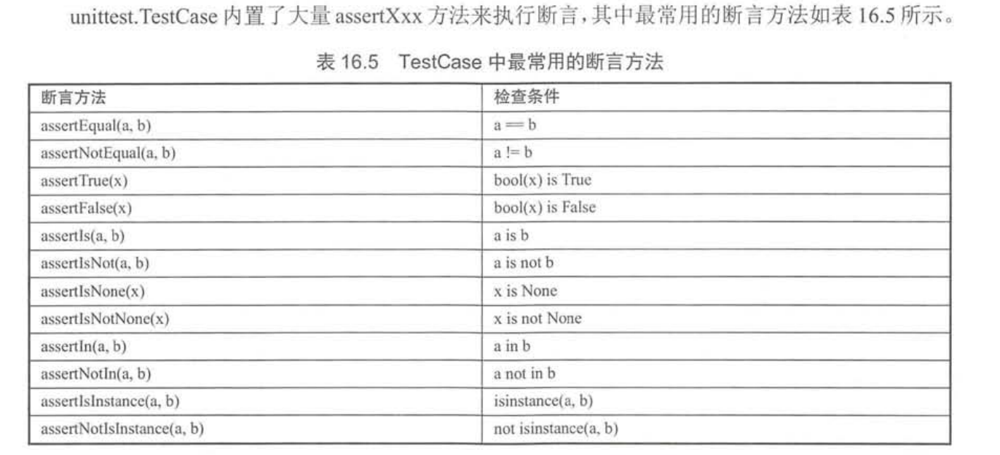
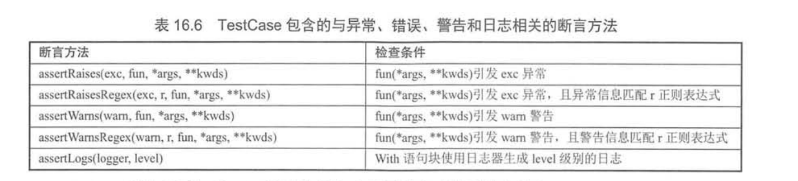
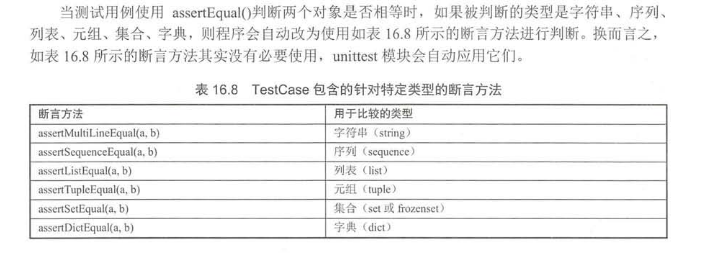

# 测试程序

## 使用pydoc生成文档
示例代码

fkmodule.py
```python
MY_NAME = '疯狂软件教育中心'


def say_hi(name):
    '''
    定义一个打招呼的函数
    返回对指定用户打招呼的字符串
    '''
    print("执行say_hi函数")
    return name + '您好！'


def print_rect(height, width):
    '''
    定义一个打印矩形的函数
    height - 代表矩形的高
    width - 代表矩形的宽
    '''
    print(('*' * width + '\n') * height)


class User:
    NATIONAL = 'China'
    '''
    定义一个代表用户的类
    该类包括name、age两个变量
    '''

    def __init__(self, name, age):
        '''
        name初始化该用户的name
        age初始化该用户的age
        '''
        self.name = name
        self.age = age

    def eat(self, food):
        '''
        定义用户吃东西的方法
        food - 代表用户正在吃的东西
        '''
        print('%s正在吃%s' % (self.name, food))
```


在控制台中查看文档：
``` 
>python -m pydoc fkmodule
```

生成HTML文档:
``` 
>python -m pydoc -w fkmodule
wrote fkmodule.html
```

pydoc 指定目录生成html文件
```
>python3 -m pydoc -w 目录名
```

启动本地服务器查看文档信息
``` 
>python -m pydoc -p 8899
Server ready at http://localhost:8899/
Server commands: [b]rowser, [q]uit
```

查找模块
``` 
>python -m pydoc -k 被搜索模块的部分内容
```

``` 
>python -m pydoc -k fk
fkmodule
```

## 文档测试
所谓文档测试，指的是通过doctest模块运行Python源文件的说明文档中的测试用例，从而生成测试报告。

代码示例：
``` 
def square (x):
    '''
    一个用于计算平方的函数

    例如
    >>> square(2)
    4
    >>> square(3)
    9
    >>> square(-3)
    9
    >>> square(0)
    0
    '''
#    return x * 2 # ①、故意写错的
    return x ** 2 # 修改正确

class User:
    '''
    定义一个代表用户的类，该类包含如下两个属性：
    name - 代表用户的名字
    age - 代表用户的年龄

    例如
    >>> u = User('fkjava', 9)
    >>> u.name
    'fkjava'
    >>> u.age
    9
    >>> u.say('i love python')
    'fkjava说: i love python'
    '''
    def __init__(self, name, age):
        # self.name = 'fkit' # ②、故意写错的
        self.name = name # 修改正确
        self.age = age
    def say(self, content):
        return self.name + '说: ' + content
if __name__=='__main__':
    import doctest
    doctest.testmod()
```

运行时，错误的输出如下：
``` 
.py", line 43, in User
Failed example:
    u.name
Expected:
    'fkjava'
Got:
    'fkit'


.py", line 47, in User
Failed example:
    u.say('i love python')
Expected:
    'fkjava说: i love python'
Got:
    'fkit说: i love python'
```


## 使用PyUnit(unittest)

PyUnit是Python自带的单元测试框架，用于编写和运行可重复的测试，PyUnit是xUnit体系的一个成员，
xUnit是众多测试框架的一个总称，PyUnit主要用于白盒测试和回归测试。


``` 
所有测试的本质其实都是一样的：通过给定参数来执行函数，然后判断函数的实际输出结果和期望输出的结果是否一致。
```

PyUnit测试与其他xUnit的套路是一样的：基于断言机制来判断函数和方法的实际输出结果和期望输出结果是否一致。
测试用例提供参数来执行函数或方法，获取他们的执行结果，然后使用断言方法判断该函数或方法的输出结果和期望输出结果是否一致，
如果一致说明测试通过，如果不一致说明测试不通过。
``` 
unittest要求单元测试类必须继承unittest.TestCase,该类中的测试方法需要满足如下要求：

· 测试方法应该没有返回值。
· 测试方法不应该有任何参数。
· 测试方法应该以test_开头。
```

### 代码示例
splitter.py
```python
#!/usr/bin/env python
# -*- coding: utf-8 -*-
# @auther:   18793
# @Date：    2020/11/2 10:36
# @filename: splitter.py
# @Email:    1879324764@qq.com
# @Software: PyCharm

def split(line, types=None, delimiter=None):
    """
    :param line:
    :param types:
    :param delimiter:
    :return: Splits a line text and optionally performe type conversion.
    """
    fields = line.split(delimiter)
    if types:
        fields = [ty(val) for ty, val in zip(types, fields)]
    return fields

```

testsplitter.py
```python
import unittest
import splitter


class MyTestCase(unittest.TestCase):
    def test_something(self):
        self.assertEqual(True, True)

    def setUp(self) -> None:
        # 执行设置操作 (如果有的话)
        pass

    def tearDown(self) -> None:
        # 执行清除操作 (如果有的话)
        pass

    def testsimplestring(self):
        r = splitter.split("GOOG 100 490.50")
        self.assertEqual(r, ["GOOG", "100", "490.50"])

    def testtypeconvert(self):
        r = splitter.split("GOOG 100 490.50", [str, int, float])
        self.assertEqual(r, ["GOOG", 100, 490.50])

    def testdelimiter(self):
        r = splitter.split("GOOG,100,490.50", delimiter=",")
        self.assertEqual(r, ["GOOG", "100", "490.50"])


if __name__ == '__main__':
    unittest.main()
```

输出结果如下：
``` 
testsplitter.py::MyTestCase::test_something 
testsplitter.py::MyTestCase::testdelimiter 
testsplitter.py::MyTestCase::testsimplestring 
testsplitter.py::MyTestCase::testtypeconvert 

========================== 4 passed in 0.06 seconds ===========================

进程已结束，退出代码 0
PASSED                       [ 25%]PASSED                        [ 50%]PASSED                     [ 75%]PASSED                      [100%]
```


mathfunc.py
```python
#!/usr/bin/env python
# -*- coding:utf8 -*-
# @auther:   18793
# @Date：    2020/6/17 14:51
# @filename: mathfunc.py
# @Email:    1879324764@qq.com
# @Software: PyCharm

def add(a, b):
    return a + b


def minus(a, b):
    return a - b


def multi(a, b):
    return a * b


def divide(a, b):
    return a / b

```

单元测试代码示例：

inittest_01.py

```python
#!/usr/bin/env python
# -*- coding:utf8 -*-
# @auther:   18793
# @Date：    2020/6/17 14:53
# @filename: inittest_01.py
# @Email:    1879324764@qq.com
# @Software: PyCharm

import unittest
from mathfunc import *


class TestMathFunc(unittest.TestCase):
    def test_add(self):
        self.assertEqual(3, add(1, 2))
        # self.assertNotEqual(3, add(1, 2))

    def test_multi(self):
        self.assertEqual(6, multi(3, 2))

    def test_divide(self):
        self.assertEqual(2, divide(6, 3))
        self.assertEqual(2.5, divide(5, 2))


if __name__ == '__main__':
    unittest.main()

```


```
import arithmetic
import unittest
# Testing add_numbers function from arithmetic.
class Test_addition(unittest.TestCase):
	# Testing Integers
	def test_add_numbers_int(self):
		sum = arithmetic.add_numbers(50, 50)
		self.assertEqual(sum, 100)

	# Testing Floats
	def test_add_numbers_float(self):
		sum = arithmetic.add_numbers(50.55, 78)
		self.assertEqual(sum, 128.55)

	# Testing Strings
	def test_add_numbers_strings(self):
		sum = arithmetic.add_numbers('hello','python')
		self.assertEqual(sum, 'hellopython')

class Test_subtraction(unittest.TestCase):
	# Testing Integers
	def test_sub_numbers_int(self):
		diff = arithmetic.sub_numbers(50, 50)
		self.assertEqual(diff, 0)

	# Testing Floats
	def test_sub_numbers_float(self):
		diff = arithmetic.sub_numbers(80.00, 78)
		self.assertEqual(diff, 2.00)

class Test_multiplication(unittest.TestCase):
	# Testing Integers
	def test_mul_numbers_int(self):
		multi = arithmetic.mul_numbers(78, 46)
		self.assertEqual(multi, 3588)

	# Testing Floats
	def test_mul_numbers_float(self):
		multi = arithmetic.mul_numbers(77.85, 8)
		self.assertEqual(multi, 622.8)

class Test_division(unittest.TestCase):
	# Testing Integers
	def test_div_numbers_int(self):
		quotient = arithmetic.div_numbers(78, 2)
		self.assertEqual(quotient, 39)

	# Testing Floats
	def test_div_numbers_float(self):
		quotient = arithmetic.div_numbers(77.8, 2)
		self.assertEqual(quotient, 38.9)

if __name__ == '__main__':
	unittest.main()
```








``` 
import if_example
import unittest

class Test_if(unittest.TestCase):
	def test_if(self):
		result = if_example.check_if()
		self.assertEqual(result, 100)
		
if __name__ == '__main__':
	unittest.main()

```

## 使用测试包
使用测试包可以组织多个测试用例，测试包可以嵌套测试包，可以使用测试运行器来运行该测试包所包含的所有测试用例。


```python
import unittest
# 加载两个测试类
from test_fk_math import TestFkMath
from test_hello import TestHello

test_cases = (TestHello, TestFkMath)
def whole_suite():
    # 创建测试加载器
    loader = unittest.TestLoader()
    # 创建测试包
    suite = unittest.TestSuite()
    # 遍历所有测试类
    for test_class in test_cases:
        # 从测试类中加载测试用例
        tests = loader.loadTestsFromTestCase(test_class)
        # 将测试用例添加到测试包中
        suite.addTests(tests)
    return suite
if __name__ == '__main__':
#    # 创建测试运行器（TestRunner）
#    runner = unittest.TextTestRunner(verbosity=2)
#    runner.run(whole_suite())
    with open('fk_test_report.txt', 'a') as f:
        # 创建测试运行器（TestRunner），将测试报告输出到文件中
        runner = unittest.TextTestRunner(verbosity=2, stream=f)
        runner.run(whole_suite())


if __name__ == '__main__':
    unittest.main()
```

## 测试固件之setUp和tearDown
unittest.TestCase包含了setUp()和tearDown()两个方法，其中

* setUp() 用于初始化测试固件
* tearDown() 用于销毁测试固件

程序会在运行每个测试用例(以test_开头的方法)之前自动执行setUp()方法来初始化测试固件，
并在每个测试用例(以test_开头的方法)运行完成之后自动执行tearDown()方法来销毁测试固件。

代码示例
```python
import unittest

from hello import *

class TestHello(unittest.TestCase):
    # 测试say_hello函数
    def test_say_hello(self):
        self.assertEqual(say_hello() , "Hello World.")
    # 测试add函数
    def test_add(self):
        self.assertEqual(add(3, 4) , 7)
        self.assertEqual(add(0, 4) , 4)
        self.assertEqual(add(-3, 0) , -3)
    def setUp(self):
        print('\n====执行setUp模拟初始化固件====')
    def tearDown(self):
        print('\n====调用tearDown模拟销毁固件====')        
```

也可以重写setUpClass()和tearDownClass()类来执行测试用例之前初始化固件和执行测试用例之后销毁固件。

```python
import unittest

from hello import *

class TestHello(unittest.TestCase):
    # 测试say_hello函数
    def test_say_hello(self):
        self.assertEqual(say_hello() , "Hello World.")
    # 测试add函数
    def test_add(self):
        self.assertEqual(add(3, 4) , 7)
        self.assertEqual(add(0, 4) , 4)
        self.assertEqual(add(-3, 0) , -3)
    @classmethod
    def setUpClass(cls):
        print('\n====执行setUpClass在类级别模拟初始化固件====')
    @classmethod
    def tearDownClass(cls):
        print('\n====调用tearDownClass在类级别模拟销毁固件====')

```

```
>python -m unittest -v fixture_test2.
py

====执行setUpClass在类级别模拟初始化固件====
test_add (fixture_test2.TestHello) ... ok
test_say_hello (fixture_test2.TestHello) ... ok

====调用tearDownClass在类级别模拟销毁固件====

----------------------------------------------------------------------
Ran 2 tests in 0.000s

```

