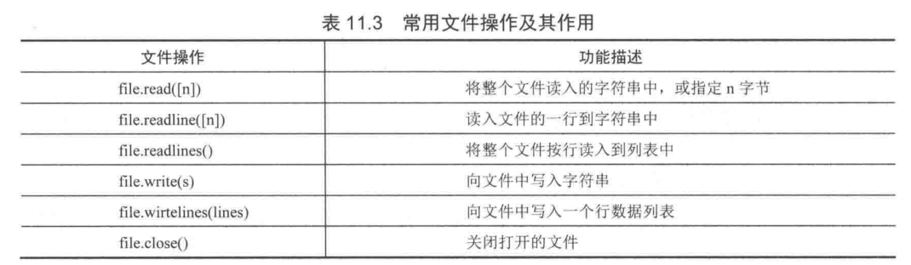

# 读写文件
### 再次理解文件打开的模式
|    模式    | 说明 |
| ---------- | --- |
| w | 以写方式打开 |
| a |  以追加模式打开 (从 EOF 开始, 必要时创建新文件) |
|r+ |以读写模式打开|
|w+ |以读写模式打开 (参见 w )|
|a+ |以读写模式打开 (参见 a )|
|rb |以二进制读模式打开|
|wb |以二进制写模式打开 (参见 w )|
|ab |以二进制追加模式打开 (参见 a )|
|rb+ |以二进制读写模式打开 (参见 r+ )|
|wb+ |以二进制读写模式打开 (参见 w+ )|
|ab+ |以二进制读写模式打开 (参见 a+ )|


### Python文件读取方式
	read([size])	读取文件全部内容，如果设置了size，那么就读取size字节
	readline([size])	一行一行的读取
	readlines()	读取到的每一行内容作为列表中的一个元素
    open()函数默认为'r'读模式
    open(file, mode='r', buffering=-1, encoding=None, errors=None, newline=None, closefd=True, opener=None)



#### 代码示例 1
```
#!/usr/bin/env python
#-*- coding:utf8 -*-

print('蚂蚁庄园'.center(50,'='))
with open('message.txt','r') as f:
    f.seek(4)
    string = f.read(4)
    print(string)
    print('\n','='*29,'over','='*29,'\n')

```
#### 代码示例 2

```
#读文件 1
f = file('/etc/passwd','r')
c = f.read().strip()        # 读取为一个大字符串，并去掉最后一个换行符
for i in c.split('\n'):     # 用换行符切割字符串得到列表循环每行
    print i
f.close()
```

循环读文件的行

``` 
f = open("with语句.py", "r", encoding="utf-8")
while True:
    line = f.readline()
    if not line:
        break
    print(line.strip())

f.close()
```


```
#读文件 2
f = file('/etc/passwd','r')
while True:
    line = f.readline()    # 返回一行
    if len(line) == 0:
        break
    x = line.split(":")                  # 冒号分割定义序列
    #x = [ x for x in line.split(":") ]  # 冒号分割定义序列
    #x = [ x.split("/") for x in line.split(":") ]  # 先冒号分割,在/分割 打印x[6][1]
    print x[6],"\n",
f.close()
```


```
#读文件 3
for i in open('b.txt'):   # 直接读取也可迭代,并有利于大文件读取,但不可反复读取
    print i
```

由于文件操作可能会出现IO异常，一旦出现IO异常，后面的close()方法就不会调用，为了保证程序的健壮性，
我们需要使用`try...finally`来实现

``` 
#!/usr/bin/env python
# -*- coding:utf8 -*-
# auther; 18793
# Date：2019/7/27 10:05
# filename: open基本使用.py

try:
    f = open("message.txt", "r")
    print(f.read())
finally:
    if f:
        f.close()

```


```
##一行一行的读取文件
#!/usr/bin/env python
#-*- coding:utf8 -*-
# auther; 18793
# Date：2019/4/16 10:35
# filename: readlinefile.py
print("\n","="*20,"Python来读取文件","="*20,"\n")

with open("message.txt","r", encoding="utf-8") as file:
    number =0
    while True:
        number +=1
        line = file.readline()
        if line == "":
            break

        print(number, "行内容是: ", line, end="\n")
print("\n","="*20,"over","="*20,"\n")
```

Python提供了一种简单的写法，使用with语句来替代try...finally代码块和close（）方法，
``` 
with open(r'c:\text\qiye.txt','r') as fileReader:         
    print(fileReader.read())
```

### 逐行读取文件
#### 代码示例
```
#!/usr/bin/env python
#-*- coding:utf8 -*-

path = r"写入文件内容.py"
#传入要读的文件路径

file = open(path,"r",encoding="utf-8",errors="ignore")
"""
open表示打开你要执行的文件用读的方式打开
第一个参数是上面的文件path路径,第二个是所要执行的操作，（r）代表读，
#encoding="utf-8表示指定编码为“utf-8”，errors="ignore"表示读的时候遇到错误忽略

"""
while True:
    mystr = file.readline()#表示一次读取一行
    if not mystr:
    #读到数据最后跳出，结束循环。数据的最后也就是读不到数据了，mystr为空的时候
        break
    print(mystr)#打印每次读到的内容

```

### 读取大文件时，建议采用while循环来逐行进行读取
#### 代码示例
```
with open('message.txt', 'r') as f1:
    number =0   #标识符为0开始
    while True:
        number +=1
        line = f1.readline()    #逐行读取文件
        if line == '':          #如果读取完毕，则跳出循环
            break
        print(number,line,end='\n')
    print("文件读取完毕".center(50,'='))
print()

print('蚂蚁庄园'.center(50,'='))
with open('message.txt','r') as f:
    string = f.readlines()
    for line in string:
        print(line)
    print('\n','='*29,'over','='*29,'\n')
```

例如小文件可以直接采取read()方法读到内存，大文件更加安全的方式是连续调用read（size），而对于配置文件等文本文件，使用readline()方法更加合理。

#### 代码示例
``` 
with open(r'c:\text\qiye.txt','r') as fileReader:         
    for line in fileReader.readlines():                 
        print(line.strip())
```

#### 将文件中的所有单词首字母大写

```
with open("data.txt") as inf, open("out.txt", "w") as outf:
    for line in inf:
        outf.write(" ".join([word.capitalize() for word in line.split()]))
        outf.write("\n")
```


### 追加日志
#### 代码示例
```
追加日志
log = open('/home/peterli/xuesong','a')
print(log,file=hu.txt)
```


### 二进制读取“rb”
#### 代码示例
```
#rb  二进制模式读取
f = open('libai','rb')  #主要用于网络传输
print(f.readline())

b'\xe5\xba\x8a\x98\xaf\xe5\x9c\xb0\xe4\xb8\x8a\xe9\x9c\x9c\r\n'
```


### Python文件写入方式
```
    方法                                  说明 

write(str)                          将字符串写入文件  
writelines(sequence or strings)   写多行到文件，参数可以是一个可迭代的对象，列表、元组等 |

```


#### 代码示例1
```
#!/usr/bin/env python
#-*- coding:utf8 -*-
'''
print('\n','='*10,'蚂蚁庄园动态','='*10)
file = open('messages1.txt','a',encoding='utf-8')
file.write("this is message txt\ntest!\n")
print('\n写入了一条动态......\n')
file.flush()
file.close()
'''

list1 = ['姚明','博尔特','姆巴佩','张艺龄']
list2 = [i + '\n' for i in list1]
with open('message2.txt','w') as file:
    file.writelines(list2)

```
### 代码示例2
```
写文件
i={'ddd':'ccc'}
f = file('poem.txt', 'a')
f.write("string")
f.write(str(i))
f.flush()
f.close(
```

使用with上下文管理器，写入文件。

``` 
with open(r'c:\text\qiye.txt','w') as fileWriter:         
    fileWriter.write('qiye')
```

### 二进制写“wb”
#### 代码示例
```
f = open('libai','wb')
f.write('中文'.encode())
```

### Python文件操作所提供的方法
    close(self):
	关闭已经打开的文件
	fileno(self):
	文件描述符
	flush(self):
	刷新缓冲区的内容到硬盘中
	isatty(self):
	判断文件是否是tty设备，如果是tty设备则返回True，否则返回False
	readable(self):
	是否可读，如果可读返回True，否则返回False
	readline(self, limit=-1):
	每次仅读取一行数据
	readlines(self, hint=-1):
	把每一行内容当作列表中的一个元

### 文件随机读写
#### 代码示例
```
# 文件本没有换行,一切都是字符,文件也没有插入功能
f.tell()       # 当前读写位置
f.read(5)      # 读取5个字符并改变指针
f.seek(5)      # 改变用户态读写指针偏移位置,可做随机写
f.seek(p,0)    # 移动当文件第p个字节处，绝对位置
f.seek(p,1)    # 移动到相对于当前位置之后的p个字节
f.seek(p,2)    # 移动到相对文件尾之后的p个字节
f.seek(0,2)    # 指针指到尾部
# 改变指针超出文件尾部,会造成文件洞,ll看占用较大，但du -sh却非常小
f.read(65535)  # 读取64K字节
f.write("str") # 写会覆盖当前指针后的响应字符,无插入功能
```


eg

``` 
#调用open()方法打开指定的文本文件
fb=open("introduct.txt","r")
#将文件指针移到文件的起始处
fb.seek(0)
#调用read(n)方法读取文件的内容
text=fb.read(4)
#输出字符串变量text的内容
print(text)
#将文件指针往前移动20个字节
fb.seek(20)
#调用read(n)方法读取文件的内容
text=fb.read(13)
#输出字符串变量text的内容
print(text)
#调用close()方法关闭文件
fb.close()

```

