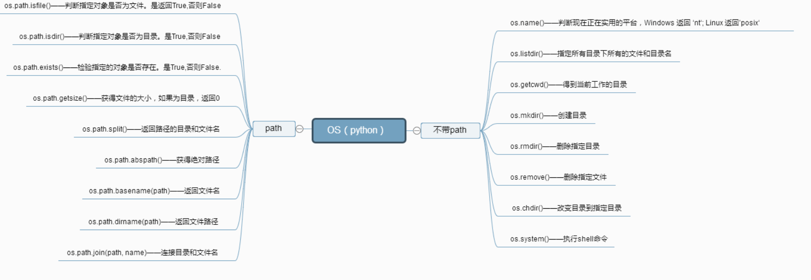
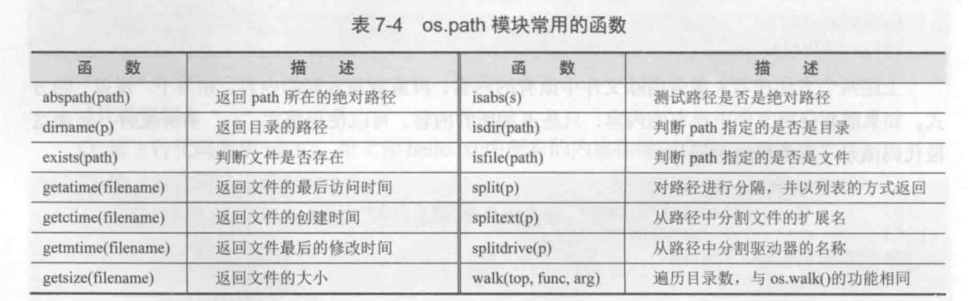

# 高级文件操作



## os模块常用的文件处理函数


## os模块常用的目录处理函数


## os.path模块常用函数



## 文件属性信息转换 函数

代码示例
```
#!/usr/bin/env python
#-*- coding:utf8 -*-
import os

def fomatTime(logtime):
    '''
    格式化时间函数
    :param logtime:
    :return:
    '''
    import time
    return time.strftime("%Y-%m-%d %H:%M:%S", time.localtime(logtime))


def formatByte(number):
    '''
    格式化文件大小的函数
    :param number:
    :return:
    '''
    for (scale,label) in [(1024*1024*1024,'GB'),(1024*1024,'MB'),(1024,'KB')]:
        if number >= scale:     #大于等于1KB
            return "%.2f &s" %(number*1.0/scale,label)
        elif number == 1:
            return "1 字节"
        else:       #处理文件大小小于1KB
            byte = '%.2f' % (number or 0)
    return (byte[:-3] if byte.endswith(".00") else byte) + "字节"


fileinfo = os.stat('重命名文件.py')      #获取文件的基本信息
print("文件完整路径: ", os.path.abspath('重命名文件.py')) #获取文件完整路径
#输出文件的基本信息
print("索引号: ",fileinfo.st_ino)
print("设备名：",fileinfo.st_dev)
print("文件大小: ",formatByte(fileinfo.st_size))
print("最后一次访问时间: ",fomatTime(fileinfo.st_atime))
print("最后一次修改时间: ",fomatTime(fileinfo.st_mtime))
print("最后一次状态变化时间: ",fomatTime(fileinfo.st_ctime))


```

## exists()检查文件是否存在

 ``` 
 #!/usr/bin/env python
#-*- coding:utf8 -*-
import os
filename = "hujianli.txt"
if os.path.exists(filename):
    print("file is exists...")
else:
    f = open(filename,"w")
    f.write("this is test file!")
    f.close()

print(os.path.exists(filename))
print(os.path.exists("test"))
print(os.path.exists("."))
print(os.path.exists(".."))

 ```

## isfile()检测文件
 ``` 
 #!/usr/bin/env python
#-*- coding:utf8 -*-
import os
filename = "hujianli.txt"
##检查是否是文件
print(os.path.isfile(filename))
## 检查是否是目录
print(os.path.isdir(filename))

## 检查是否是绝对路径
print(os.path.isabs("/home/rzrk/hujianli.txt"))
print(os.path.isabs("../hujianli.txt"))
 
 ```

## copy()进行复制文件

```  
#!/usr/bin/env python
#-*- coding:utf8 -*-
import shutil
filename = "hujianli.txt"
shutil.copy(filename, filename +".bak")

## 改名文件
shutil.move(filename,filename + "remove.bak")

```

## 重命名文件

代码示例
```
#!/usr/bin/env python
#-*- coding:utf8 -*-
import os
'''
scr = r"D:\\deam\\aaa.txt"      #原路径
dst = r"D:\\deam\\aaa22.txt"    #修改后

if os.path.exists(scr):
    os.rename(scr, dst)         #重名了文件
else:
    print("目录不存在")

'''
scr = r"D:\\deam"      #原路径
dst = r"D:\\deam1"    #修改后

if os.path.exists(scr):
    os.rename(scr, dst)         #重名了文件
else:
    print("目录不存在")
```


## os.path模块
``` 
#!/usr/bin/env python
#-*- coding:utf8 -*-
# auther; 18793
# Date：2019/6/6 16:25
# filename: os.path模块.py
import os.path
from datetime import datetime

f_name = "test.txt"
af_name = r"D:\GitHub\21_staduy_python\9.1.python文件操作\foo_bak.txt"

#返回路径中基础名部分
basename = os.path.basename(af_name)
print(basename)

#返回路径中的目录部分
dirname = os.path.dirname(af_name)
print(dirname)

#返回文件的绝对路径
abs_path = os.path.abspath(af_name)
print(abs_path)

#返回文件的大小
print("{0}: {1}KB".format(os.path.basename(af_name), os.path.getsize(af_name)))

#返回文件的创建时间
ctime = datetime.fromtimestamp(os.path.getctime(af_name))
print(ctime)

#返回文件修改时间
mtime = datetime.fromtimestamp(os.path.getmtime(af_name))
print(mtime)

print(os.path.isfile(dirname))  
print(os.path.isdir(dirname))
print(os.path.isfile(f_name))
print(os.path.isdir(f_name))
print(os.path.exists(f_name))
```

输出结果
```
foo_bak.txt
D:\GitHub\21_staduy_python\9.1.python文件操作
D:\GitHub\21_staduy_python\9.1.python文件操作\foo_bak.txt
foo_bak.txt: 49KB
2018-09-15 22:19:35.005511
2018-09-15 22:26:22.143960
False
True
False
False
False
 
```

## 永久删除文件或文件夹
```
os.rmdir(path)      # 将删除 path 处的文件夹。该文件夹必须为空，其中没有任何文件和文件夹。
os.remove()     	# 删除单一文件


一般使用如下：
os.unlink(path)     # 将删除 path 处的文件
shutil.rmtree(path)     # 将删除 path 处的文件夹，它包含的所有文件和文件夹都会被删除,无论目录或文件夹是否为空
```


如果你有某些重要的文件以.rxt 结尾，它们就会被不小心永久地删除。

作为替代，你应该先运行像这样的程序**,删除文件之前，最好先进行`print()`打印,防止误删除。**

``` 
import os
for filename in os.listdir():
    if filename.endswith('.rxt'):
        #os.unlink(filename)
        print(filename)
```


eg 举例：
``` 

#系统信息
import time,platform
#1.当前时间
print("------------------------1.当前时间----------------------------")
now=time.localtime(time.time())
now=time.strftime("%Y-%m-%d %H:%M:%S",now)
print("当前时间：",now)

#2.平台信息
print("\n------------------------2.平台信息----------------------------")
print("操作系统：",platform.system())
print("操作系统版本：",platform.version())
#获取操作系统的类型和位数
print("基于",platform.machine(),"机器的",platform.architecture(),"架构计算机") 
print("网络名：",platform.node())
print("处理器：",platform.processor())

#3.目录信息
import os
print("\n------------------------3.目录信息----------------------------")
print("当前文件系统名称：",os.name)
current=os.getcwd()
print("当前目录：",current)
print("当前目录文件：",os.listdir(current))
print("根目录绝对路径：",os.path.abspath('.'))
print("根目录文件：",os.listdir('.'))
mtime=time.localtime(os.path.getmtime(current))
mtime=time.strftime("%Y-%m-%d %H:%M:%S",mtime)
print("当前文件夹最后修改时间：",mtime)

#4.文件信息
import stat
print("\n------------------------4.文件信息----------------------------")
testfile=os.path.abspath('aROtestfile')
os.chmod(testfile,stat.S_IREAD)
mode_dict={0:'存在',4:'只读',2:'可写',1:'可执行'}
print("文件",testfile,"的权限为：")
for mode in (os.F_OK,os.R_OK,os.W_OK,os.X_OK):
    print(mode_dict[mode],':',end='')
    if os.access(testfile,mode):
        print("True")
    else:
        print("Flase")
thisfile=os.path.abspath('sys_info.py')
print(thisfile,"文件大小：",os.path.getsize(thisfile),"字节")


#5.调用系统命令
print("\n------------------------5.执行系统命令----------------------------")
while 1:
    cmd=input("============\n|1.网络信息|\n|2.画图板  |\n|3.计算器  |\n============\n")
    if cmd in ('1','2','3'):
        if cmd=='1':
            ipcon=os.popen('ipconfig').read()
            print(ipcon)
        if cmd=='2':
            os.popen('mspaint')         #启动画板
        if cmd=='3':
            os.popen('calc')            #启动计算器
    else:
        print("输入无效。")
        break

```


## 操作文件目录相关BIF
``` 
·获得当前Python脚本工作的目录路径：os.getcwd（）。 
·返回指定目录下的所有文件和目录名：os.listdir（）。例如返回C盘下的文件：os.listdir（“C：\\”） 
·删除一个文件：os.remove（filepath）。 
·删除多个空目录：os.removedirs（r“d：\python”）。 
·检验给出的路径是否是一个文件：os.path.isfile（filepath）。 
·检验给出的路径是否是一个目录：os.path.isdir（filepath）。 
·判断是否是绝对路径：os.path.isabs（）。 
·检验路径是否真的存在：os.path.exists（）。例如检测D盘下是否有Python文件夹：os.path.exists（r“d：\python”） 
·分离一个路径的目录名和文件名：os.path.split（）。例如： 
·os.path.split（r“/home/qiye/qiye.txt”），返回结果是一个元组：（‘/home/qiye’，‘qiye.txt’）。 
·分离扩展名：os.path.splitext（）。例如os.path.splitext（r“/home/qiye/qiye.txt”），返回结果是一个元组：（‘/home/qiye/qiye’，‘.txt’）。 
·获取路径名：os.path.dirname（filetpah）。 
·获取文件名：os.path.basename（filepath）。 
·读取和设置环境变量：os.getenv（）与os.putenv（）。 
·给出当前平台使用的行终止符：os.linesep。Windows使用‘\r\n’，Linux使用‘\n’而Mac使用‘\r’。 
·指示你正在使用的平台：os.name。对于Windows，它是‘nt’，而对于Linux/Unix用户，它是‘posix’。 
·重命名文件或者目录：os.rename（old，new）。 
·创建多级目录：os.makedirs（r“c：\python\test”）。 
·创建单个目录：os.mkdir（“test”）。 
·获取文件属性：os.stat（file）。 
·修改文件权限与时间戳：os.chmod（file）。 
·获取文件大小：os.path.getsize（filename）。 
·复制文件夹：shutil.copytree（“olddir”，“newdir”）。olddir和newdir都只能是目录，且newdir必须不存在。 
·复制文件：shutil.copyfile（“oldfile”，“newfile”），oldfile和newfile都只能是文件；shutil.copy（“oldfile”，“newfile”），oldfile只能是文件，newfile可以是文件，也可以是目标目录。
·移动文件（目录）：shutil.move（“oldpos”，“newpos”）。 
·删除目录：os.rmdir（“dir”），只能删除空目录；shutil.rmtree（“dir”），空目录、有内容的目录都可以删。
```


## 使用案例
``` 
#!/usr/bin/env python
# -*- coding:utf8 -*-
# auther; 18793
# Date：2020/3/19 17:29
# filename: 常规的系统管理.py

import os

# 获取当前用户home目录下所有文件列表
file_list = [item for item in os.listdir(os.path.expanduser("~")) if os.path.isfile(item)]

# 获取当前用户home目录下所有的目录列表
dir_list = [item for item in os.listdir(os.path.expanduser("~")) if os.path.isdir(item)]

# 获取当前用户home目录下所有目录的目录名到绝对路径之间的字典：
fiel_path = {item: os.path.realpath(item) for item in os.listdir(os.path.expanduser("~")) if os.path.isdir(item)}

# 获取当前用户home目录下所有文件到文件大小之间的字典
file_size = {item: os.path.getsize(item) for item in os.listdir(os.path.expanduser("~")) if os.path.isfile(item)}

```


## 文件赋权示例
``` 
#!/usr/bin/env python
# -*- coding:utf8 -*-
# auther; 18793
# Date：2020/3/19 20:03
# filename: 文件赋权.py
import os
import sys


def main():
    sys.argv.append("")
    filename = sys.argv[1]
    if not os.path.isfile(filename):
        raise SystemExit(filename + ' does not exists')
    elif not os.access(filename, os.R_OK):
        os.chmod(filename, 0o775)
    else:
        with open(filename) as f:
            print(f.read())


if __name__ == '__main__':
    main()
```


## 文件内容管理

### MD5校验比较

``` 
#!/usr/bin/env python
# -*- coding:utf8 -*-
# auther; 18793
# Date：2020/3/20 10:19
# filename: sample01.py
import hashlib
d = hashlib.md5()

with open("passwd.txt") as f:
    # d.update(f.read().encode("utf-8"))
    for line in f:
        d.update(line.encode("utf-8"))

print(d.hexdigest())

```

### 找到目录下的重复文件
``` 
#!/usr/bin/env python
# -*- coding:utf8 -*-
# auther; 18793
# Date：2020/3/20 10:32
# filename: sample02.py
import fnmatch
import os
import hashlib
import sys

CHUNK_SIZE = 8192


def is_file_match(filename, patterns):
    for pattern in patterns:
        if fnmatch.fnmatch(filename, pattern):
            return True
    return False


def find_specific_files(root, patterns=['*'], exclude_dirs=[]):
    for root, dirnames, filenames in os.walk(root):
        for filename in filenames:
            if is_file_match(filename, patterns):
                yield os.path.join(root, filename)
        for d in exclude_dirs:
            if d in dirnames:
                dirnames.remove(d)


def get_chunk(filename):
    """
    :param filename: 文件名
    :return:  读取文件，使用while，yield生成器方式读取节省内存
    """
    with open(filename) as f:
        while True:
            chunk = f.read(CHUNK_SIZE)
            if not chunk:
                break
            else:
                yield chunk


def get_file_checksum(filename):
    """
    :param filename: 文件名
    :return: 返回文件的MD5值
    """
    h = hashlib.md5()
    for chunk in get_chunk(filename):
        h.update(chunk)
    return h.hexdigest()


def main():
    # 判断用户输入，捕获用户输入的参数1
    sys.argv.append("")
    directory = sys.argv[1]
    if not os.path.isdir(directory):
        raise SystemExit("{0} is not a directory ".format(directory))

    # 开始校验目录下的文件，将文件MD5值与字典中的key进行比对，如果在字典中者显示重复
    record = {}
    for item in find_specific_files(directory):
        checksum = get_file_checksum(item)
        if checksum in record:
            print("find duplicate file:{0} vs {1}".format(record[checksum], item))
        else:
            record[checksum] = item


if __name__ == '__main__':
    main()

```