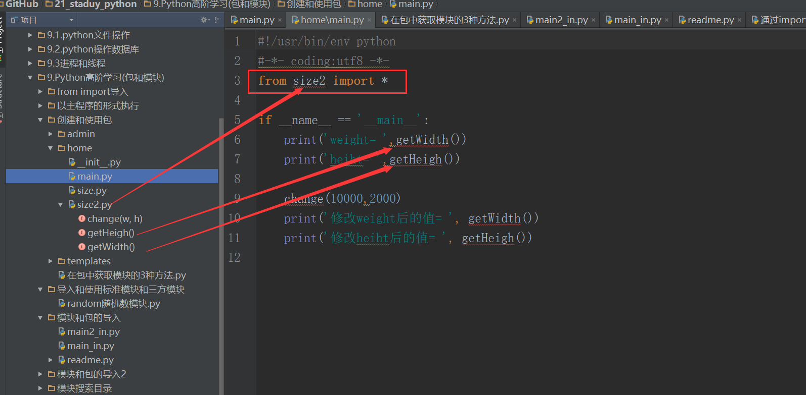
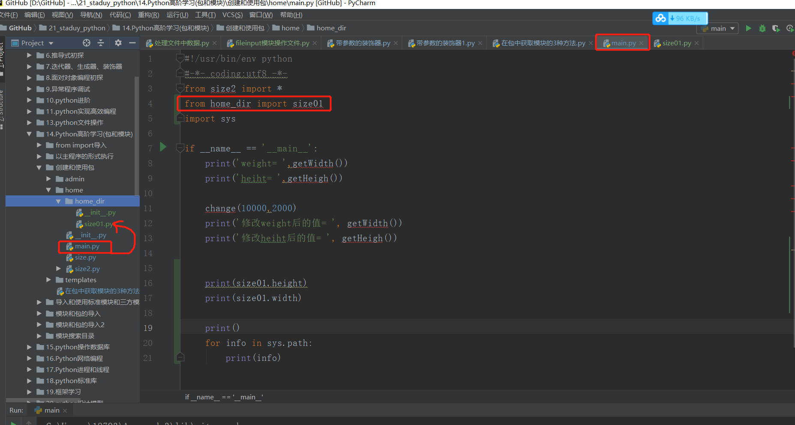
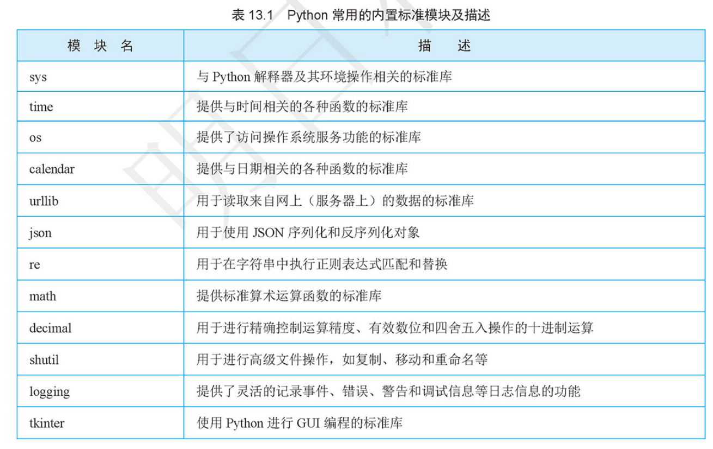

# 模块与包
    在编程语言中，代码块、函数、类、模块，一直到包，逐级封装，层层调用。在Python中，一个.py文件就是一个模块，模块是比类更高一级的封装。在其他语言，被导入的模块也通常称为库。
    模块可以分为自定义模块、内置模块和第三方模块。自定义模块就是你自己编写的模块，如果你自认水平很高，也可以申请成为Python内置的标准模块之一！如果你在网上发布自己的模块并允许他人使用，那么就变成了第三方模块。内置模块是Python“内置电池”哲学的体现，在安装包里就提供了跨平台的一系列常用库，涉及方方面面。第三方模块的数量非常庞大，有许多非常有名并且影响广泛的模块，比如Django。

### 使用模块有什么好处？
- 首先，提高了代码的可维护性。
- 其次，编写代码不必从零开始。当一个模块编写完毕，就可以被其他的模块引用。不要重复造轮子，我们简简单单地使用已经有的模块就好了。
- 使用模块还可以避免类名、函数名和变量名发生冲突。相同名字的类、函数和变量完全可以分别存在不同的模块中。但是也要注意尽量不要与内置函数名（类名）冲突

### 为了避免模块名冲突，Python又引入了按目录来组织模块的方法，称为包（Package）
* 包是模块的集合，比模块又高一级的封装
* 包可以嵌套包

### 包名通常为全部小写，避免使用下划线。
要在我们的程序中，使用其它的模块（包、类、函数），就必须先导入对应的模块（包、类、函数）。在Python中，模块（包、类、函数）的导入方式有以下四种：

    import xx.xx
    from xx.xx import xx
    from xx.xx import xx as rename
    from xx.xx import *

#### 1. import moudle
    调用方法：Moudle.xxx     #模块名.方法名

#### 2. from module_a import func
    调用方法：func()  # 直接调用func

#### 3.from module_a import func as f
- 为了避免命名冲突，在导入的时候，可以给导入的对象重命名。


    调用方法：f()

#### 4.from module_a import *


- 将对象内的所有内容全部导入。非常容易发生命名冲突，请慎用！
- 当不同的模块中又相同变量名的变量时，尽量使用import而不是from，避免名字冲突。
- 这将很难确认变量来自何处，当一个程序中又多个form xxx import *的时候


```
from module_a import *

def func():
    print("this is main module!")
func()  # 从module导入的func被main的func覆盖了
```
### 记忆方法参考下图：
调用同级模块中的某个函数或者Class的方法



调用目录下子包中的某个模块的方法：





### Python中自带电池

#### 自带常用的标准库
