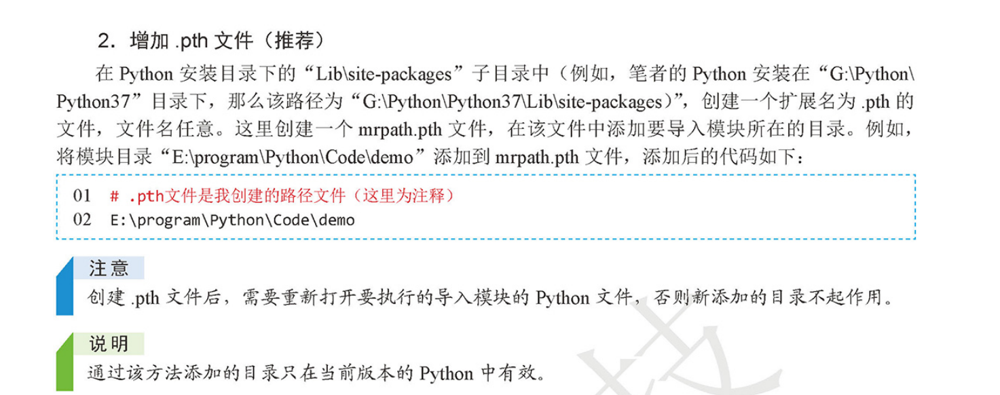

# 包的讲解

### 模块搜索路径
* import语句的时候，Python解释器是怎样找到对应的文件的呢？


    Python根据sys.path的设置，按顺序搜索模块。
```
>>> import sys
>>> sys.path
['', 'C:\\Python36\\Lib\\idlelib', 'C:\\Python36\\python36.zip', 'C:\\Python36\\DLLs', 'C:\\Python36\\lib', 'C:\\Python36', 'C:\\Python36\\lib\\site-packages']
```

### 像设置windos环境变量一样的设置sys.path

    通过sys.path.append('路径')的方法为sys.path路径列表添加你想要的路径。添加临时的环境变量

```
import sys
import os

new_path = os.path.abspath('../')
sys.path.append(new_path)
```



### 模块的搜索顺序是这样的：
- 当前执行脚本所在目录

- Python的安装目录

- Python安装目录里的site-packages目录


    其实就是“自定义”——>“内置”——>“第三方”模块的查找顺序。任何一步查找到了，就会忽略后面的路径，所以模块的放置位置是有区别的。


### 包（Package）：
- 只有包含__init__.py文件的目录才会被认作是一个包！
- __init__.py可以是空文件，也可以有Python代码，__init__.py本身就是一个模块，但是要注意，它的模块名是它所在的包名而不是__init__。

```
如果包定义文件__init__.py中存在一个叫做__all__的列表变量，那么在使用from package import *的时候就把这个列表中的所有名字作为要导入的模块名。

例如在example/p1/__init__.py中包含如下代码:
__all__ = ["x"]
这表示当你使用from example.p1 import *这种用法时，你只会导入包里面的x子模块。
```

### 导入文件名中带空格的模块
解决方法是__import__方法

``` 
hujianli = __import__("94 722 hujianli")
hujianli.print01()
```

### 导入上级路径模块
``` 
import ..模块名
```