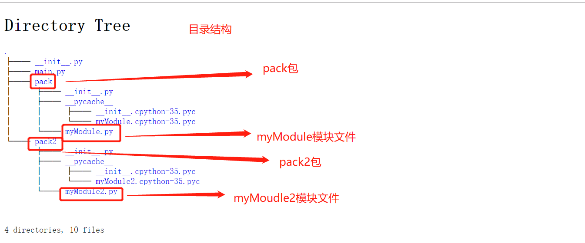

# 自定义包




tree 命令生成HTML形式的目录树

用下面的命令可以生成一个包含目录树输出的HTML文件：
`$ tree PATH -H http://localhost -o out.html`

`将http://localhost替换为适合存放输出文件的URL。将 PATH 替换为主目录的真实路径。当前
目录可以用 . 作为 PATH 。`


`pack下的__init__.py`
``` 
if __name__ == '__main__':
    print("作为主程序运行.......")
else:
    print("pack初始化")
```

`pack下的myModule.py`
``` 
#!/usr/bin/env python
# -*- coding:utf8 -*-
# auther; 18793
# Date：2019/7/20 9:35
# filename: myModule.py

def func():
    print("pack.myModule.func()")


if __name__ == '__main__':
    print("myMoudels作为主程序")
else:
    print("myMoudle被另外的模块调用")

```


`pack2下的__init__.py`
``` 
if __name__ == '__main__':
    print("作为主程序运行.......")
else:
    print("pack初始化")
```


`pack2下的myModule2.py`
``` 
#!/usr/bin/env python
#-*- coding:utf8 -*-
# auther; 18793
# Date：2019/7/20 9:35
# filename: myModule2.py

def func2():
    print("pack2.myModule2.fun()")

if __name__ == '__main__':
    print("myModule2作为主程序运行")
else:
    print("myModule2被另外的模块调用")

```

输出信息：
``` 
pack初始化
myMoudle被另外的模块调用
pack2初始化
myModule2被另外的模块调用
pack.myModule.func()
pack2.myModule2.fun()
```