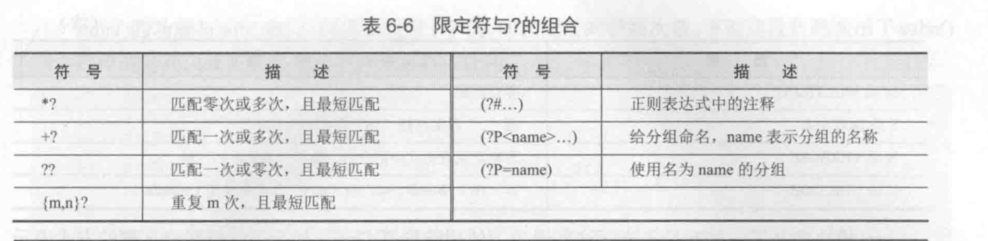

# 正则表达式


正则表达式测试和生成工具

https://www.toolnb.com/tools/regex.html


## 正则表达式语法

### 正则表达式查询表


### 行定位符
字母、数字、汉字、下划线、以及没有特殊定义的符号，都是"普通字符"。正则表达式中的普通字符，在匹配的时候，只匹配与自身相同的一个字符。

例如：表达式c，在匹配字符串abcde时，匹配结果是：成功；匹配到的内容是c；匹配到的位置开始于2，结束于3。（注：下标从0开始还是从1开始，因当前编程语言的不同而可能不同）

```
^tm          #匹配tm开头的字符
tm$          #匹配tm结尾的字符
tm           #匹配子串出现在字符串的任意部分
```

### 元字符

| 表达式 | 匹配                                                         |
| ------ | ------------------------------------------------------------ |
| `.`    | 小数点可以匹配除了换行符\\n以外的任意一个字符                |
| `|`    | 逻辑或操作符                                                 |
| `[]`   | 匹配字符集中的一个字符                                       |
| `[^]`  | 对字符集求反，也就是上面的反操作。尖号必须在方括号里的最前面 |
| `-`    | 定义[]里的一个字符区间，例如[a-z]                            |
| `\`    | 对紧跟其后的一个字符进行转义                                 |
| `()`   | 对表达式进行分组，将圆括号内的内容当做一个整体，并获得匹配的值 |

例如：

    a.c匹配abc
    
    (a|b)c匹配ac与bc
    
    [abc]1匹配a1或者b1或者c1
    
    使用方括号[]包含一系列字符，能够匹配其中任意一个字符。用[^]包含一系列字符，则能够匹配其中字符之外的任意一个字符。
    
    [ab5@]匹配a或b或5或@
    
    [^abc]匹配a,b,c之外的任意一个字符
    
    [f-k]匹配f~k 之间的任意一个字母
    
    [^A-F0-3]匹配A~F以及0~3之外的任意一个字符


### 限定符
使用(\w*)匹配任意数量的字母或数字，如果要匹配特定数量的数字，匹配8位QQ号可以使用如下表达式
    
    ^\d{8}$




### 字符类匹配

| 表达式                 | 匹配                                 |
| ---------------------- | ------------------------------------ |
| `[aeiou]`              | 匹配任何一个英文元音字母             |
| `[.?!]`                | 匹配标点符号"."、“？”、“！”          |
| `[0-9]`                | 与\\d完全一致                        |
| `[a\-z0\-9A\-Z_]`      | 与\\w类似                            |
| `[\\u4e00\-\\u9fa5\]`  | 匹配字符串中任意一个汉字             |
| `[\\u4e00\-\\u9fa5\]+` | 匹配字符串中连续多个汉字             |
| `[^a-zA-Z]`            | 匹配一个不是字母的字符  **排除字符** |


### 选择字符
包含着条件选择的逻辑，需要使用选择字符(|)来实现。该字符可以理解为“或”

`(^\d{15}$)|(^\d{18}$)|(^\d{17})(\d|X|x)$`
匹配15位数字或者18位数字、或者17位数字和最后一位，最后一位可以是X或者是x

### 转义字符

| 表达式   | 匹配             |
| -------- | ---------------- |
| `\r, \n` | 匹配回车和换行符 |
| `\t`     | 匹配制表符       |
| `\`      | 匹配斜杠\\       |
| `\^`     | 匹配^符号        |
| `$`      | 匹配$符号        |
| `.`      | 匹配小数点.      |

### 分组
小括号的作用

        ①改变限定符的作用范围，如“|”、“*”、“^”
        (six|four)th
        表示匹配sixth或者fourth。
        
        ②分组，子表达式
        (\.[0-9]{1..3}{3})      #对(\.[0-9]{1..3})进行重复操作


​    

### 预定义匹配字符集
    表达式	匹配
    \d	    任意一个数字，0~9 中的任意一个
    \w	    任意一个字母或数字或下划线，也就是 A~Z,a~z,0~9,_ 中的任意一个
    \s	    空格、制表符、换页符等空白字符的其中任意一个
    \D	    \d的反集，也就是非数字的任意一个字符，等同于[^\d]
    \W	    \w的反集，也就是[^\w]
    \S	    \s的反集，也就是[^\s]
    
    例如表达式\d\d，在匹配abc123时，匹配的结果是：成功；匹配到的内容是12；匹配到的位置开始于3，结束于5。


更多字符集匹配的详细内容可以参考
 <a href="https://www.jb51.net/tools/regexsc.htm" target="_blank">正则表达式速查表</a>
 <a href="https://www.jb51.net/tools/regex.htm" target="_blank">常用的正则表达式</a>
 <a href="http://shouce.jb51.net/py-re-guide/" target="_blank">python正则表达式操作指南</a>

### 重复匹配
    表达式	匹配
    {n}	    表达式重复n次，比如\d{2}相当于\d\d,a{3}相当于aaa
    {m,n}	表达式至少重复m次，最多重复n次。比如ab{1,3}可以匹配ab或abb或abbb
    {m,}	表达式至少重复m次，比如\w\d{2,}可以匹配a12,_1111,M123等等
    ?	    匹配表达式0次或者1次，相当于{0,1}，比如a[cd]?可以匹配a,ac,ad
    +	    表达式至少出现1次，相当于{1,}，比如a+b可以匹配ab,aab,aaab等等
    *	    表达式出现0次到任意次，相当于{0,}，比如\^*b可以匹配b,^^^b等等
    
    其中有些例子一定要注意！比如ab{1,3}中重复的是b而不是ab，(ab){1,3}这样重复的才是ab。表达式\^*b中重复的是\^而不是^，要从左往右读正则表达式，转义符号有更高的优先级，需要和后面的字符整体认读。
    表达式\d+\.?\d*在匹配It costs $12.5时，匹配的结果是：成功；匹配到的内容是12.5；匹配到的位置开始于10，结束于14。
    表达式go{2,8}gle在匹配Ads by goooooogle时，匹配的结果是：成功；匹配到的内容是goooooogle；匹配到的位置开始于7，结束于17。

### 位置匹配
    表达式	匹配
    ^	在字符串开始的地方匹配，符号本身不匹配任何字符
    $	在字符串结束的地方匹配，符号本身不匹配任何字符
    \b	匹配一个单词边界，也就是单词和空格之间的位置，符号本身不匹配任何字符
    \B	匹配非单词边界，即左右两边都是\w范围或者左右两边都不是\w范围时的字符缝隙


### 贪婪与非贪婪模式

    在重复匹配时，正则表达式默认总是尽可能多的匹配，这被称为贪婪模式。
    比如，针对文本dxxxdxxxd，表达式(d)(\w+)(d)中的\w+将匹配第一个d和最后一个d之间的所有字符xxxdxxx。

#### 举例说明
```
string = '''<table>
    <tr>
        <td>电视机</td>
        <td>冰箱</td>
        <td>空调</td>
    </tr>
</table>
'''
string = "".join(string.split())
print(re.search("<td>(.*)</td>", string).group())       # <td>电视机</td><td>冰箱</td><td>空调</td>

print(re.search("<td>\w+?</td>", string).group())       # <td>电视机</td>


```
我们的意图是获取每个`<td></td>`标签中的元素内容，
如果你将正则表达式写成`<td>(.*)</td>`的话，你得到的是`<td>电视机</td><td>冰箱</td><td>空调</td>这么个东西，而不是“电视机”、“冰箱”、“空调”。`
表达式`<td>(.*?)</td>`匹配上面的字符串时，将只得到`<td>电视机</td>`，再次匹配下一个时，可以得到<td>冰箱</td>，以此类推。贪婪匹配
表达式`<td>(\w+?)</td>`为了让整个表达式匹配成功，`\w+? `将尽可能少的匹配，从而使整个表达式匹配成功，实现非贪婪的匹配。


* 贪婪匹配和惰性匹配
  eg

```python
#!/usr/bin/env python
# -*- coding:utf8 -*-
# auther; 18793
# Date：2019/5/21 17:31
# filename: 贪婪匹配和懒惰匹配.py
import re

# 使用贪婪匹配
m = re.search(r'\d{5,8}', '87654321')
print(m)				# <_sre.SRE_Match object; span=(0, 8), match='87654321'>
print(m.group())		 # 87654321

# 使用惰性匹配
m = re.search(r'\d{5,8}?', '87654321')
print(m)				# <_sre.SRE_Match object; span=(0, 5), match='87654'>
print(m.group())		 # 87654
```

懒惰限定符的使用方式

| 语法   | 含义                            |
| ------ | ------------------------------- |
| *？    | 重复任意次，但尽可能少重复      |
| +？    | 重复1次或更多次，但尽可能少重复 |
| ？？   | 重复0次或1次，但尽可能少重复    |
| (n,m)? | 重复n到m次，但尽可能少重复      |
| (n.)?  | 重复n次以上，但尽可能少重复     |

## 正则表达式匹配模式


| 方法                                       | 描述                                   | 返回值                           |
| ------------------------------------------ | -------------------------------------- | -------------------------------- |
| compile(pattern[, flags])                  | 根据包含正则表达式的字符串创建模式对象 | re对象                           |
| search(pattern, string[, flags])           | 在字符串中查找                         | 第一个匹配到的对象或者None       |
| match(pattern, string[, flags])            | 在字符串的开始处匹配模式               | 在字符串开头匹配到的对象或者None |
| split(pattern, string[, maxsplit=0,flags]) | 根据模式的匹配项来分割字符串           | 分割后的字符串列表               |
| findall(pattern, string,flags)             | 列出字符串中模式的所有匹配项           | 所有匹配到的字符串列表           |
| sub(pat,repl, string[,count=0,flags])      | 将字符串中所有的pat的匹配项用repl替换  | 完成替换后的新字符串             |
| finditer(pattern, string,flags)            | 将所有匹配到的项生成一个迭代器         | 所有匹配到的字符串组合成的迭代器 |
| subn(pat,repl, string[,count=0,flags])     | 在替换字符串后，同时报告替换的次数     | 完成替换后的新字符串及替换次数   |
| escape（string                             | 将字符串中所有特殊正则表达式字符串转义 | 转义后的字符串                   |
| purge(pattern)                             | 清空正则表达式                         |                                  |
| template(pattern[,flags])                  | 编译一个匹配模板                       | 模式对象                         |
| fullmatch(pattern, string[, flags])        | match方法的全字符串匹配版本            | 类似match的返回值                |


参考资料：

https://ansheng.me/python-full-stack-way-regular-expressions/

https://wiki.ubuntu.org.cn/Python%E6%AD%A3%E5%88%99%E8%A1%A8%E8%BE%BE%E5%BC%8F%E6%93%8D%E4%BD%9C%E6%8C%87%E5%8D%97#.E6.89.A7.E8.A1.8C.E5.8C.B9.E9.85.8D