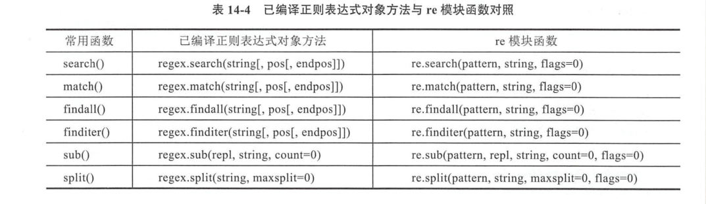

# 编译正则表达式


```python

#!/usr/bin/env python
# -*- coding:utf8 -*-
# auther; 18793
# Date：2019/5/21 17:43
# filename: re_compile.py
import re

p = r'\w+@hujianli\.com'
regex = re.compile(p)

text = "Tony's email is tony_187@hujianli.com"
m = regex.search(text)
print(m)                #<_sre.SRE_Match object; span=(16, 37), match='tony_187@hujianli.com'>

m = regex.match(text)
print(m)                    #None

p = r"[Jj]ava"
regex = re.compile(p)
text = 'I like Java and java'
match_list = regex.findall(text)
print(match_list)           #['Java', 'java']

match_iter = regex.finditer(text)
for m in match_iter:
    print(m.group())            #Java
                                #java

p = r'\d+'
regex = re.compile(p)
text = 'AB1234QCD34EF'     

clist = regex.split(text)
print(clist)                    #['AB', 'QCD', 'EF']

repace_text = regex.sub("-",text)
print(repace_text)              #AB-QCD-EF
```


## 编译标志

### re.A和re.U
* re.A  设置采用ASCII编码
* re.U  设置采用Unicode编码

eg
``` 
# -*- coding:utf8 -*-
# auther; 18793
# Date：2019/5/21 17:54
# filename: re_compile2.py
import re

text = "你们好Hello"

p = r"\w+"
regex = re.compile(p, re.U)

m = regex.search(text)
print(m)            #匹配         <_sre.SRE_Match object; span=(0, 8), match='你们好Hello'>

m1 = regex.match(text)
print(m1)            #匹配        <_sre.SRE_Match object; span=(0, 8), match='你们好Hello'>


regex = re.compile(p, re.A)
m = regex.search(text)
print(m)            #匹配         <_sre.SRE_Match object; span=(3, 8), match='Hello'>


regex = re.compile(p, re.A)
m = regex.match(text)
print(m)        #不匹配            None
```
