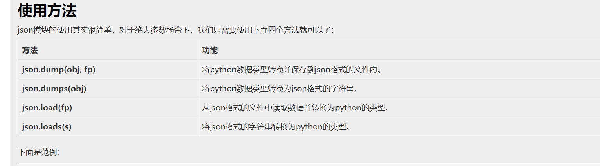
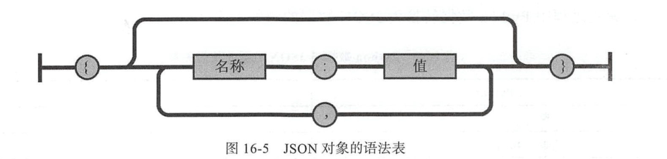
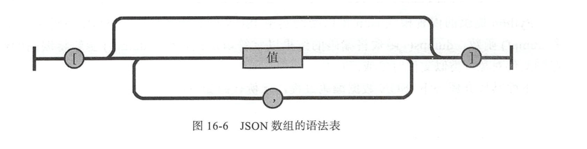
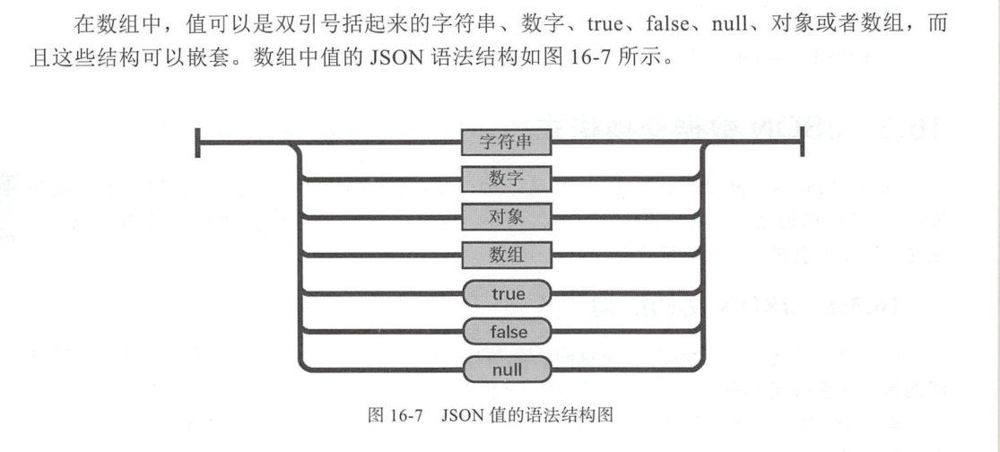
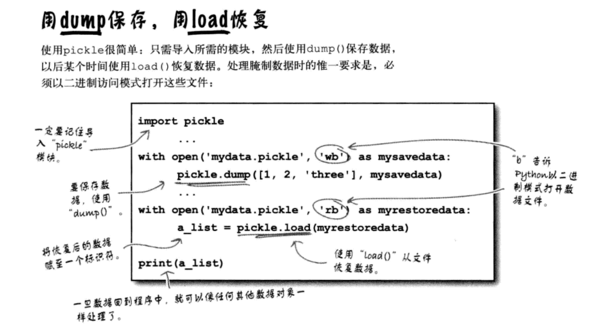

# Json和Pickle序列化

### json
- 什么是序列化？


    我们把对象(变量)从内存中变成可存储或传输的过程称之为序列化

1：持久保存状态

    需知一个软件/程序的执行就在处理一系列状态的变化，在编程语言中，'状态'会以各种各样有结构的数据类型(也可简单的理解为变量)的形式被保存在内存中。
    内存是无法永久保存数据的，当程序运行了一段时间，我们断电或者重启程序，内存中关于这个程序的之前一段时间的数据（有结构）都被清空了。
    在断电或重启程序之前将程序当前内存中所有的数据都保存下来（保存到文件中），以便于下次程序执行能够从文件中载入之前的数据，然后继续执行，这就是序列化。
    具体的来说，你玩使命召唤闯到了第13关，你保存游戏状态，关机走人，下次再玩，还能从上次的位置开始继续闯关。或如，虚拟机状态的挂起等。

2：跨平台数据交互

    序列化之后，不仅可以把序列化后的内容写入磁盘，还可以通过网络传输到别的机器上，如果收发的双方约定好实用一种序列化的格式，那么便打破了平台/语言差异化带来的限制，实现了跨平台数据交互。
    反过来，把变量内容从序列化的对象重新读到内存里称之为反序列化，即unpickling。


```
JavaScript Object Notation（JSON，http://www.json.org）是源于 JavaScript 的当今很流行的
数据交换格式，它是 JavaScript 语言的一个子集，也是 Python 合法可支持的语法。对于
Python 的兼容性使得它成为程序间数据交换的较好选择
```

* json()将字符串形式的列表或字典转换为list或dict类型，json是所有语言相互通信的方式
* 注意外层字符形式一定是 '' 单引号,'{"a":"xiao","b":"xiao"}'列表或字典中的字符串一定要""双引号,否则报错




### json小工具，将字符串转为JSON
简单的字符格式
``` 
[root@k8s-master ~]# echo '{"job":"developer","name":"lmx","sex":"male"}' | python -m json.tool
{
    "job": "developer",
    "name": "lmx",
    "sex": "male"
}

```

复杂的嵌套的格式
``` 
[root@k8s-master yum.repos.d]# echo '{"address":{"python":"wuhan","java":"shanghai","Go":"beijing"},"name":"hu"}'| python -m json.tool
{
    "address": {
        "Go": "beijing",
        "java": "shanghai",
        "python": "wuhan"
    },
    "name": "hu"
}


```
json对象

示例：
```
{"name":"hujianli",
  "age":18,
  "webname":"python",
  "save":true
}
```

json数组


示例：
``` 
["json1","json2","json3"]
```



json与基本数据类型对应关系

`python数据类型 ------>json数据   进行传输和存储的过程叫做“编码”`

`json数据 ------> python         进行读写的过程叫做“解码”`


### json读写文件示例
- 如果你要处理的是文件而不是字符串
- 你可以使用 json.dump() 和 json.load()来编码和解码 JSON 数据。例如：
```

# Writing JSON data
with open('data.json', 'w') as f:
	json.dump(data, f)

# Reading data back
with open('data.json', 'r') as f:
	data = json.load(f)

json.dumps({'ret':'cmd_ret0', 'out':'cmd_ret1'}, separators=(',', ':'))    # 紧凑的json格式,去掉空格
```

## json数据编码
eg

``` 
#!/usr/bin/env python
# -*- coding:utf8 -*-
# auther; 18793
# Date：2019/6/23 9:43
# filename: json模块编码.py
import json

py_dict = {"name": "hujianli", "age": 18, "sex": True}
py_list = [1, 3]
py_tuple = ("A", "B", "C")

py_dict["a"] = py_list
py_dict["b"] = py_tuple
print(py_dict)
print(type(py_dict))

# 编码过程
json_obj = json.dumps(py_dict)
print(json_obj)
print(type(json_obj))

# 编码过程，使用格式化输出
json_obj = json.dumps(py_dict, indent=4)
# 输出格式化后的字符串
print(json_obj)
print(type(json_obj))

# 写入json数据到data1.json文件
with open('data1.json', 'w') as f:
    json.dump(py_dict, f)

# 写入json数据到data2.json文件
with open('data2.json', 'w') as f:
    json.dump(py_dict, f, indent=4)


# 读取data2.json文件中的内容
with open("data2.json", 'r') as f:
    data = json.load(f)
    print(data)

```


## json数据解码

``` 
#!/usr/bin/env python
#-*- coding:utf8 -*-
# auther; 18793
# Date：2019/6/23 9:49
# filename: json模块数据解码.py
import json
#准备数据

json_obj = r'{"name":"hujianli","age":20,"sex":true,"a":[1,3],"b":["A","B","C"]}'
print(type(json_obj))

print("开始数据解码".center(100,"*"))
py_dict = json.loads(json_obj)
print(type(py_dict))
print(py_dict["name"])
print(py_dict["sex"])
print(py_dict["age"])

py_list1 = py_dict["a"]
py_list2 = py_dict["b"]
print(py_list1)
print(py_list2)


# 读取data2.json中的数据
with open("data2.json","r") as f:
    data = json.load(f)
    print(data)
    print(type(data))
```

### 一个快递API的例子
``` 
#!/usr/bin/env python
# -*- coding:utf8 -*-
# auther; 18793
# Date：2019/11/11 13:44
# filename: 快递数据爬取.py

import requests
import json

url = "http://www.kuaidi100.com/query"

querystring = {"type": "shunfeng", "postid": "121213123"}

headers = {
    'User-Agent': "PostmanRuntime/7.19.0",
    'Accept': "*/*",
    'Cache-Control': "no-cache",
    'Host': "www.kuaidi100.com",
    'Accept-Encoding': "gzip, deflate",
    'Connection': "keep-alive",
    'cache-control': "no-cache"
}

response = requests.request("GET", url, headers=headers, params=querystring)

json_data = json.loads(response.text)


with open("kuaidi1.json", "w", encoding="utf-8") as f:
    json.dump(json_data, f, ensure_ascii=False, indent=4)

with open("kuaidi2.json", "w", encoding="utf-8") as f_json:
    f_json.write(json.dumps(json_data, ensure_ascii=False, indent=4))

```


`写入json文件的时候保持中文，使用参数 ensure_ascii=False `


``` 
with open("翻译.json", "w", encoding="utf-8") as f:
    json.dump(json_data, f, ensure_ascii=False, indent=4)

with open("data.json", "w", encoding="utf-8") as file:
    file.write(json.dumps(json_data, indent=4, ensure_ascii=False))
```

## Pickle(只能用于python中)


在Python中提供了两个模块：cPickle和pickle来实现序列化，前者是由C语言编写的，效率比后者高很多，但是两个模块的功能是一样的。一般编写程序的时候，采取的方案是先导入cPickle模块，如果此模块不存在，再导入pickle模块。




```
#序列化
import pickle
dic={'name':'alvin','age':23,'sex':'male'}
print(type(dic))#<class 'dict'>
j=pickle.dumps(dic)
print(type(j))#<class 'bytes'>

f=open('序列化对象_pickle','wb')    #注意是w是写入str,wb是写入bytes,j是'bytes'
f.write(j)                          #等价于pickle.dump(dic,f)
f.close()


#反序列化
import pickle
f=open('序列化对象_pickle','rb')
data=pickle.loads(f.read())#  等价于data=pickle.load(f)

print(data['age'])

```

代码示例
``` 
#!/usr/bin/env python
# -*- coding:utf8 -*-
# auther; 18793
# Date：2020/2/26 10:35
# filename: 序列化01.py

try:
    import cPickle as pickle
except:
    import pickle

d = dict(url="index.html", title="首页", content="首页")
# print(pickle.dumps(d))
with open("dump1.txt", "wb") as f:
    # f.write(pickle.dumps(d))
    pickle.dump(d, f)

with open("dump1.txt", "rb") as f:
    # print(pickle.loads(f.read()))
    print(pickle.load(f))
```


## shelve模块
- shelve模块比pickle模块简单，只有一个open函数，返回类似字典的对象，可读可写;key必须为字符串，而值可以是python所支持的数据类型
```
#!/usr/bin/env python
#-*- coding:utf8 -*-
import shelve
#写入数据
'''
f=shelve.open(r'sheve.txt')
f['stu1_info'] = {'name':'egon','age':18,'hobby':['piao','smoking','drinking']}
f['stu2_info'] = {'name':'gangdan','age':53}
f['school_info'] = {'website':'http://www.pypy.org','city':'beijing'}
f.close()
'''

#读取数据
'''
shelveFile_read2 = shelve.open("sheve.txt")
print(type(shelveFile_read2))
print(shelveFile_read2['stu1_info'])
print(shelveFile_read2['school_info'])

print(list(shelveFile_read2.keys()))
print(list(shelveFile_read2.values()))
'''
#写入数据
'''
shelveFile = shelve.open('mydata')
shelveFile['cats'] = ['hujianli', 'xiaojian2', 'huxiaojian3']
shelveFile.close()
'''

#读取数据
'''
shelveFile_read = shelve.open('mydata')
print(type(shelveFile_read))
print(shelveFile_read['cats'])
'''
```

参考资料

序列化及其相关模块（json,pickle,shelve,xml）详解
``` 
链接：http://www.cnblogs.com/wj-1314/p/8206840.html
```