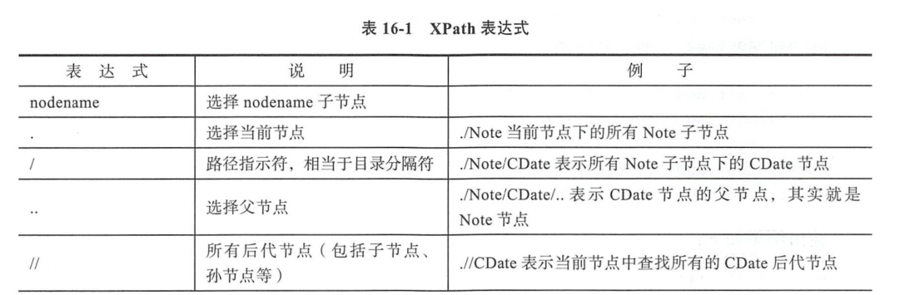
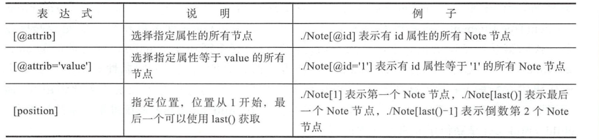

# 解析XML文档

示例文件 Notes.xml
``` 
<?xml version="1.0" encoding="utf-8" ?>
<Notes>
    <Note id="1">
        <CDdate>2019-6-20</CDdate>
        <Countent> 发布Python0</Countent>
        <UserID>tony1</UserID>
    </Note>

    <Note id="2">
        <CDdate>2019-6-21</CDdate>
        <Countent> 发布Python1</Countent>
        <UserID>tony2</UserID>
    </Note>

    <Note id="3">
        <CDdate>2019-6-22</CDdate>
        <Countent> 发布Python2</Countent>
        <UserID>tony3</UserID>
    </Note>

    <Note id="4">
        <CDdate>2019-6-23</CDdate>
        <Countent> 发布Python3</Countent>
        <UserID>tony4</UserID>
    </Note>

    <Note id="5">
        <CDdate>2019-6-24</CDdate>
        <Countent> 发布Python4</Countent>
        <UserID>tony5</UserID>
    </Note>
</Notes>
```

### 读取XML文件
``` 
#!/usr/bin/env python
# -*- coding:utf8 -*-
# auther; 18793
# Date：2019/6/23 8:45
# filename: 1.读取xml文件.py
import xml.etree.ElementTree as ET

tree = ET.parse("Notes.xml")  # 创建xml文档树
print(type(tree))

root = tree.getroot()  # root是根元素
print(type(root))
print(root.tag)

for index, child in enumerate(root):
    print("第{}个{}元素，属性{}".format(index, child.tag, child.attrib))
    for i, child_child in enumerate(child):
        print("     标签：{}，内容：{}".format(child_child.tag, child_child.text))
```

输出信息:
```
<class 'xml.etree.ElementTree.ElementTree'>
<class 'xml.etree.ElementTree.Element'>
Notes
第0个Note元素，属性{'id': '1'}
     标签：CDdate，内容：2019-6-20
     标签：Countent，内容： 发布Python0
     标签：UserID，内容：tony
第1个Note元素，属性{'id': '2'}
     标签：CDdate，内容：2019-6-21
     标签：Countent，内容： 发布Python1
     标签：UserID，内容：tony2
第2个Note元素，属性{'id': '3'}
     标签：CDdate，内容：2019-6-22
     标签：Countent，内容： 发布Python2
     标签：UserID，内容：tony3
第3个Note元素，属性{'id': '4'}
     标签：CDdate，内容：2019-6-23
     标签：Countent，内容： 发布Python3
     标签：UserID，内容：tony4
第4个Note元素，属性{'id': '5'}
     标签：CDdate，内容：2019-6-24
     标签：Countent，内容： 发布Python4
     标签：UserID，内容：tony5

```
## 使用XPath



### 使用XPath 定位html文件或xml文件

``` 
#!/usr/bin/env python
#-*- coding:utf8 -*-
# auther; 18793
# Date：2019/6/23 8:54
# filename: 使用XPath寻找xml文件指定内容.py
import xml.etree.ElementTree as ET

tree = ET.parse("Notes.xml")
root = tree.getroot()

node = root.find("./Note")      # 查找当前接电线的第一个Note子节点
print(node.tag, node.attrib)
node = root.find("./Note/CDate")    # 查找Note子节点下的第一个CDdate节点
print(node.text)

node = root.find("./Note/CDate/..")     # Note节点
print(node.tag, node.attrib)

node = root.find(".//CDate")        # 当前节点查找所有后代节点中第一个CDate节点
print(node.text)

node = root.find("./Note[@id]")     # 具有id属性的Note节点
print(node.tag, node.attrib)

node = root.find("./Note[@id='2']")     # id属性等于'2'的Note节点
print(node.tag, node.attrib)

node = root.find("./Note[2]")     # 第二个Note节点
print(node.tag, node.attrib)

node = root.find("./Note[last()]")     # 最后一个Note节点
print(node.tag, node.attrib)

node = root.find("./Note[last()-2]")     # 倒数第三个Note节点
print(node.tag, node.attrib)

```

输出内容：
``` 
Note {'id': '1'}
2019-6-20
Note {'id': '1'}
2019-6-20
Note {'id': '1'}
Note {'id': '2'}
Note {'id': '2'}
Note {'id': '5'}
Note {'id': '3'}

```

#### xpath用于数据爬取
``` 
#!/usr/bin/env python
#-*- coding:utf8 -*-
from lxml import etree

text = '''
<div>
<ul>
    <li class="red"<h1>red flowers</h1></li>
    <li class="yellow"<h1>yellow flowers</h2></li>
    <li class="white"<h1>white flowers</h3></li>
    <li class="black"<h1>black flowers</h4></li>
    <li class="blue"<h1>blue flowers</h5></li>
</ul>

</div>

'''
html = etree.HTML(text)
result = etree.tostring(html)
print(result)
```


语法解析：
``` 

#!/usr/bin/env python
#-*- coding:utf8 -*-
'''

            节点选择
表达式
nodename            #选取此节点的所有子节点
/                   #从根节点选取
//                  #从匹配当前节点选择文档中的节点，不考虑它们的位置
.                   #选取当前节点
..                  #选取当前节点的父节点
@                   #选取属性
'''

'''
        谓语
路径表达式
/user_database/user[1]      #选取属于user_database子元素的第一个user元素
//li[@attribute]            #选取所有拥有名为attribute属性的li元素
//li[@attribute='red']      #选取所有li元素，且这些元素用于值为red的attribute属性
*                           #可以匹配任何元素节点

'''


"""
//*[@id="qiushi_tag_121402573"]/div[1]/a[2]/h2
"""


#获取单个用户的id
# import requests
# from lxml import etree
#
# headers = {
# "User-Agent": "Mozilla/5.0 (Windows NT 10.0; WOW64) AppleWebKit/537.36 "
#               "(KHTML, like Gecko) Chrome/68.0.3440.84 Safari/537.36"
# }
# url = "https://www.qiushibaike.com/text/"
# res = requests.get(url, headers=headers)
# selector = etree.HTML(res.text)
# id = selector.xpath('//*[@id="qiushi_tag_121431185"]/div[1]/a[2]/h2/text()')
# # id = selector.xpath('//*[@id="qiushi_tag_121431185"]/div[1]/a[2]/h2/text()')[0]
# print(id)


#批量获取用户的id
'''
//div[@class="article block untagged mb15]'
div[1]/a[2]/h2          #用户id信息
#content-left
//*[@id="content-left"]
'''
import requests
from lxml import etree

headers = {
"User-Agent": "Mozilla/5.0 (Windows NT 10.0; WOW64) AppleWebKit/537.36 (KHTML, like Gecko) Chrome/68.0.3440.84 Safari/537.36"
}
url = "https://www.qiushibaike.com/text/"
res = requests.get(url,headers=headers)
selector = etree.HTML(res.text)
url_infos = selector.xpath('//div[@class="article block untagged mb15 typs_hot"]')
for url in url_infos:
    id = url.xpath('div[1]/a[2]/h2/text()')[0]
    print(id)
```

参考文献：

https://www.cnblogs.com/derek1184405959/p/8449682.html