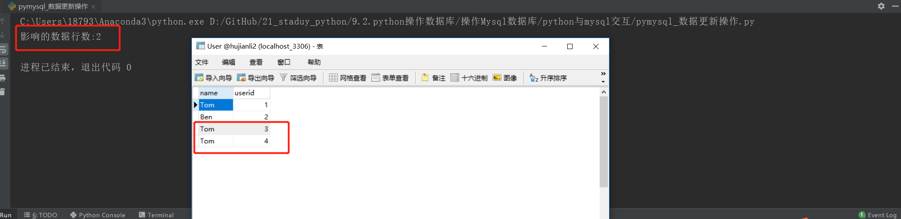

# python操作mysql数据库

## Linux/UNIX和Window平台上安装Mysql步骤详解

http://www.xz577.com/j/17019.html

## 连接mysql的驱动
* 目前python有2个驱动器
``` 
pip3 install  mysql-connector
pip3 install PyMySQL


import pymysql
import mysql.connector


pymysql：纯Python实现的一个驱动。因为是纯Python编写的，因此执行效率不如MySQL-python。并且也因为是纯Python编写的，因此可以和Python代码无缝衔接。

MySQL Connector/Python：MySQL官方推出的使用纯Python连接MySQL的驱动。因为是纯Python开发的，效率不高。

```

MySqlConnector.py
``` 
#!/usr/bin/python3

import mysql.connector

# 打开数据库连接
db = mysql.connector.connect(
  host="localhost",
  user="root",
  passwd="123456",
  database="seckill"
)

# 使用 cursor() 方法创建一个游标对象 cursor
cursor = db.cursor()

# 使用 execute()  方法执行 SQL 查询
cursor.execute("SELECT * FROM seckill")

# 使用 fetchall() 方法获取s所有数据
data = cursor.fetchall()

print(data)

# 关闭数据库连接
db.close()

```

PyMySQL.py
```
import pymysql

# 打开数据库连接
db = pymysql.connect("localhost", "root", "123456", "seckill")

# 使用 cursor() 方法创建一个游标对象 cursor
cursor = db.cursor()

# 使用 execute()  方法执行 SQL 查询
cursor.execute("SELECT * FROM seckill")

# 使用 fetchall() 方法获取s所有数据.
data = cursor.fetchall()

print(data)

# 关闭数据库连接
db.close()

```

## 安装python连接mysql驱动pymysql
```
PyMySQL是在Python3.x版本中用于连接MySQL服务器的一个库,Python2中则使用mysqldb。
PyMySQL遵循Python数据库APIv2.0规范,并包含了pure-Python MySQL 客户端库。

PyMySQL模块下载地址:https://github.com/PyMySQL/PyMySQL
安装PyMySQL模块的方法：

复制代码
#(1)pip方式安装
$pip install PyMySQL

#(2)克隆安装
$git clone https://github.com/PyMySQL/PyMySQL
$cd PyMySQL
$python3 setup.py install

#(3)源码安装
$curl -L https://github.com/PyMySQL/PyMySQL/tarball/pymysql-X.X | tar xz
$cd PyMySQL*
$python3 setup.py install
```


### python连接mysql数据库
+ pymysql中conn对象常用的方法如下：


执行流程如下：

#### 代码示例
```
#!/usr/bin/env python
# -*- coding: utf-8 -*-
__author__ = 'xiaojian'
import pymysql
#连接数据库
    参数1：mysql服务所在主机的IP
    参数2：用户名
    参数3：密码
    参数4：要连接的数据库名

# db = pymysql.connect('localhost','root','123456','ttmgrportal')
db = pymysql.connect('192.168.2.122','root','123456','ttmgrportal')
#创建一个cursor对象(用于执行sql语句)
cursor = db.cursor()
sql = "select version()"

#执行sql语句
cursor.execute(sql)

#获取返回的信息
data = cursor.fetchone()
print(data)

#断开
cursor.close()
db.close()

```


### python创建数据库表
#### 代码示例 1
```
#!/usr/bin/env python
# -*- coding: utf-8 -*-
__author__ = 'xiaojian'
import pymysql
db = pymysql.connect('192.168.2.122','root','123456','ttmgrportal')
cursor = db.cursor()

#检查表是否存在，如果存在则删除
cursor.execute("drop table if EXISTS student4")

#创建表
sql = "create TABLE  student4(id INT auto_increment PRIMARY " \
      "KEY ,money int NOT  NULL )"

cursor.execute(sql)


#断开
cursor.close()
db.close()


```

#### 代码示例2
```
#!/usr/bin/env python
#-*- coding:utf8 -*-

#导入PyMySQL模块
import pymysql

#调用connect()函数生成connection连接对象
db = pymysql.connect(host="39.96.10.11", user="hujianli",
                     password="admin#123", database="test_hu",
                     charset="utf8")

#调用cursor()方法，创建Cursor对象
cursor = db.cursor()
cursor.execute("drop table if EXISTS students2")
#执行SQL语句

sql = '''
create table students2(id int auto_increment primary key,name varchar(20) not null,
age int not null ,gender bit default 1,address varchar(20),isDelete bit default 0);
"""
sql2 = '''
CREATE TABLE users (
  'name' varchar(32) NOT NULL,
  'age' int(10) unsigned NOT NULL DEFAULT '0',
  PRIMARY KEY ('name')
) ENGINE=InnoDB DEFAULT CHARSET=utf8
'''
"""
cursor.execute(sql)

#关闭连接
cursor.close()
db.close()

```
### 数据库修改操作
#### 1.数据插入
```

#!/usr/bin/env python
# -*- coding: utf-8 -*-
__author__ = 'xiaojian'
import pymysql
db = pymysql.connect('192.168.2.122','root','123456','ttmgrportal')
cursor = db.cursor()

#插入数据，捕获异常
sql = "insert into student4 VALUES(3,110),(4,220)"
try:
    cursor.execute(sql)
    #提交事务
    db.commit()
except:
    #如果提交失败，回滚到上一次的数据
    db.rollback()

cursor.close()
db.close()

```


```
#!/usr/bin/env python
#-*- coding:utf8 -*-
"""
操作mysql：增删改查
"""

#!/usr/bin/env python
#-*- coding:utf8 -*-

#导入PyMySQL模块
import pymysql

#调用connect()函数生成connection连接对象
db = pymysql.connect(host="39.96.10.11", user="hujianli",
                     password="admin#123", database="test_hu",
                     charset="utf8")

#调用cursor()方法，创建Cursor对象
cursor = db.cursor()
data = ('1','hujianli')
#执行SQL语句
sql = "insert into sheng(s_id,s_name) values(%s,%s)"
cursor.execute(sql, data)


#关闭连接
cursor.close()
db.close()

```
eg2
``` 
#!/usr/bin/env python
#-*- coding:utf8 -*-
# auther; 18793
# Date：2019/4/16 11:16
# filename: pymysql_insert.py
import pymysql

#打开数据库连接
db = pymysql.connect(host="localhost", user="root",
                     password="admin#123", database="mrsoft",
                     charset="utf8")

#使用cursor()方法获取操作游标
cursor = db.cursor()

#数据列表
data = [
    ("零基础学python", "pyhton","80.2","2019-04-16"),
    ("零基础学Java", "Java","50.2","2019-04-16"),
    ("零基础学C++", "C++","60.2","2019-04-16"),
    ("零基础学shell", "shell","30.2","2019-04-16"),
]

try:
    #执行SQL语句，插入多条数据
    cursor.executemany("insert into books(name,category,price,publish_time) value (%s,%s,%s,%s)",data)

    #提交数据
    db.commit()
except:
    #发生错误时回滚
    db.rollback()

#关闭数据库
db.close()

```

插入数据代码示例
eg
``` 
#!/usr/bin/env python
# -*- coding:utf8 -*-
# auther; 18793
# Date：2019/5/22 11:07
# filename: pymysql_插入操作.py
import pymysql


# 查询最大用户Id
def read_max_userid():
    with connection.cursor() as cursor:
        # 3.执行SQL操作
        sql = 'select max(userid) from user '
        cursor.execute(sql)

        # 4.提取结果集
        row = cursor.fetchone()  # 提取1条数据

    return row[0]

# 1.建立数据库连接
connection = pymysql.connect(host='localhost',
                             user='root',
                             password='admin#123',
                             database='hujianli2',
                             charset='utf8')
# 查询最大值
maxid = read_max_userid()

try:
    # 2.创建游标对象
    with connection.cursor() as cursor:
        # 3.执行SQL操作
        sql = 'insert into user (userid,name) values (%s,%s)'
        nextid = maxid + 1
        name = "Tony" + str(nextid)
        affectedcount = cursor.execute(sql, (nextid, name))
        print("影响的数据行数:{0}".format(affectedcount))
        #4.提交数据库事务
        connection.commit()


except pymysql.DatabaseError:
        # 5.回滚数据库事务
        connection.rollback()
finally:
    # 6.关闭数据连接
    connection.close()

```


#### 2.数据库更新

```
#!/usr/bin/env python
# -*- coding: utf-8 -*-
__author__ = 'xiaojian'
import pymysql

db = pymysql.connect("127.0.0.1","root","123456","ttmgrportal")
cursor = db.cursor()


sql = "UPDATE student4 set money=15000 WHERE id=1"
try:
    cursor.execute(sql)
    db.commit()
except:
    db.rollback()

cursor.close()
db.close()
```


eg

``` 
#!/usr/bin/env python
# -*- coding:utf8 -*-
# auther; 18793
# Date：2019/5/22 11:19
# filename: pymysql_数据更新操作.py
import pymysql

# 1.建立数据库连接
connection = pymysql.connect(host='localhost',
                             user='root',
                             password='admin#123',
                             database='hujianli2',
                             charset='utf8')

try:
    # 2.创建游标对象
    with connection.cursor() as cursor:

        # 3.执行SQL操作
        sql = "update user set name = %s where userid > %s"
        affectedcount = cursor.execute(sql, ("Tom", 2))
        print("影响的数据行数:{0}".format(affectedcount))

        # 4. 提交数据库事务
        connection.commit()

        #5.with代码块结束，关闭游标
except pymysql.DatabaseError as e:
    # 6.回滚数据库事务
    connection.rollback()
    print(e)

finally:
    # 7.关闭数据库连接
    connection.close()

```



#### 3.数据库删除

```
#!/usr/bin/env python
# -*- coding: utf-8 -*-
__author__ = 'xiaojian'
import pymysql

db = pymysql.connect("127.0.0.1","root","123456","ttmgrportal")
cursor = db.cursor()


sql = "delete from student4 WHERE money = 110"
try:
    cursor.execute(sql)
    db.commit()
except:
    db.rollback()

cursor.close()
db.close()
```

eg

``` 
#!/usr/bin/env python
# -*- coding:utf8 -*-
# auther; 18793
# Date：2019/5/22 11:35
# filename: pymysql_删除操作.py

import pymysql


# 查询最大用户Id
def read_max_userid():
    with connection.cursor() as cursor:
        # 3.执行SQL操作
        sql = 'select max(userid) from user '
        cursor.execute(sql)

        # 4.提取结果集
        row = cursor.fetchone()  # 提取1条数据

    return row[0]


# 1.建立数据库连接
connection = pymysql.connect(host='localhost',
                             user='root',
                             password='admin#123',
                             database='hujianli2',
                             charset='utf8')
# 查询最大值
maxid = read_max_userid()

try:
    # 2.创建游标对象
    with connection.cursor() as cursor:
        # 3.执行SQL操作
        sql = 'delete from user where  userid = %s '
        affectedcount = cursor.execute(sql, (maxid))
        print("影响的数据行数:{0}".format(affectedcount))
        # 4.提交数据库事务
        connection.commit()


except pymysql.DatabaseError:
    # 5.回滚数据库事务
    connection.rollback()
finally:
    # 6.关闭数据连接
    connection.close()
```


#### 数据库查询

```
#!/usr/bin/env python
# -*- coding: utf-8 -*-
__author__ = 'xiaojian'
"""
fetchone()
功能:获取下一个查询结果集，结果集是一个对象

fetchall()
功能：接收全部的返回的行

rowcount:是一个只读属性，返回execute()方法影响的行数
"""
import pymysql

db = pymysql.connect("127.0.0.1","root","123456","ttmgrportal")
cursor = db.cursor()


sql = "select * from student4 where money>100"
try:
    cursor.execute(sql)
    reslist = cursor.fetchall()
    for row in reslist:
        print("%d -- %d"%(row[0], row[1]))
except:
    #如果提交失败，回滚到上一次数据
    db.rollback()

cursor.close()
db.close()
```


##### 有条件的查询
``` 
#!/usr/bin/env python
# -*- coding:utf8 -*-
# auther; 18793
# Date：2019/5/22 10:49
# filename: pymysql_有条件的查询.py
import pymysql

# 1.建立数据库连接
connection = pymysql.connect(host='localhost',
                             user='root',
                             password='admin#123',
                             database='hujianli2',
                             charset='utf8')

# 2.创建游标对象

try:
    with connection.cursor() as cursor:
        # 3.执行SQL操作
        sql = 'select name,userid from user where userid > %(id)s'
        cursor.execute(sql, {'id': 0})

        #4.提取结果集
        result_set = cursor.fetchall()

        for row in result_set:
            print("id:{0} - name:{1}".format(row[1], row[0]))

        #5.with代码块结束，关闭游标
finally:
    #6.关闭数据连接
    connection.close()


```

##### 无条件查询
``` 
#!/usr/bin/env python
#-*- coding:utf8 -*-
# auther; 18793
# Date：2019/5/22 11:00
# filename: pymysql_无条件的查询.py
import pymysql

# 1.建立数据库连接
connection = pymysql.connect(host='localhost',
                             user='root',
                             password='admin#123',
                             database='hujianli2',
                             charset='utf8')

# 2.创建游标对象
try:
    with connection.cursor() as cursor:
        # 3.执行SQL操作
        sql = 'select max(userid) from user '
        cursor.execute(sql)

        #4.提取结果集
        row = cursor.fetchone()             #提取1条数据

        if row is not None:                 #判断非空时，提取字段内容
            print("最大用户Id:{0}".format(row[0]))

        #5.with代码块结束，关闭游标
finally:
    #6.关闭数据连接
    connection.close()

```

eg3
``` 
import time
import pymysql

def show_info():
    print('''输入提示数字，执行相应操作
0：退出
1：查看登录日志
    ''')

def init_mysql():
    db = pymysql.connect("localhost", "root", "root", "mrsoft",charset="utf8")
    cursor = db.cursor()
    return cursor,db


def save_data(username,password):
    """
    存入MySQL数据库
    :param username: 用户名
    :param password: 密码
    """
    cursor,db = init_mysql()
    try:
        create_time = time.strftime('%Y-%m-%d %H:%M:%S',time.localtime(time.time()))
        cursor.execute("insert into login(username,password,create_time) values( % s, % s, % s)" ,(username,password,create_time))
        db.commit()
    except:
        db.rollback()
    db.close()

def get_loginfo():
    cursor, db = init_mysql()
    cursor.execute('select username,create_time from login')
    results = cursor.fetchall()
    db.close()
    return results

if __name__ == "__main__":
    # 输入用户名
    username = input('请输入用户名：')
    # 检测用户名
    while len(username) < 2 :
        print('用户名长度应不少于2位')
        username = input('请输入用户名：')
    # 输入密码
    password = input('请输入密码：')
    # 检测密码
    while len(password) < 6 :
        print('密码长度应不少于6位')
        password = input('请输入密码：')

    print('登录成功')
    save_data(username,password)      # 写入日志
    show_info()                       # 提示信息
    num = int(input('输入操作数字:')) # 输入数字

    # 菜单功能
    while True:
        if num == 0:
            print('退出成功')
            break
        elif num == 1:
            print('查看登录日志')
            results = get_loginfo()
            for result in results:
                print("用户名：{} 登录时间：{}\r".format(result[0],result[1]))
            show_info()
            num = int(input('输入操作数字:'))
        else:
            print('您输入的数字有误')
            show_info()
            num = int(input('输入操作数字:'))
```


## MariaDB数据库安装

Linux上安装MariaDB（CentOS Linux release 7.6.1810 (Core)）
``` 
yum install mariadb-server mariadb
rpm -q mariadb mariadb-server
systemctl enable mariadb
ln -s '/usr/lib/systemd/system/mariadb.service' '/etc/systemd/system/multi-user.target.wants/mariadb.service'

lsof -i:3306
systemctl start mariadb.service 
systemctl stop mariadb
systemctl restart mariadb
systemctl status mariadb

```
运行“/usr/bin/mysql_secure_installation”命令，加固MariaDB数据库，操作过程如下。
``` 
[root@k8s-master centos]# mysql -uroot -padmin#123
Welcome to the MariaDB monitor.  Commands end with ; or \g.
Your MariaDB connection id is 10
Server version: 5.5.60-MariaDB MariaDB Server

Copyright (c) 2000, 2018, Oracle, MariaDB Corporation Ab and others.

Type 'help;' or '\h' for help. Type '\c' to clear the current input statement.

MariaDB [(none)]> 
MariaDB [(none)]> exit

```

安装完成。


## Python操作MariaDB案例：
``` 
#!/usr/bin/env python
# -*- coding:utf8 -*-
# auther; 18793
# Date：2019/6/24 17:52
# filename: 操作MariaDB数据库.py
from mysql import connector
import random

src = "abcdefghijklmnopqrstuvwxyz"


def get_str(x, y):
    """ 生成随机数，x~y之间的随机字母字符串"""
    str_sum = random.randint(x, y)  # 产生x,y之间一个随机整数
    astr = ""
    for i in range(str_sum):
        astr += random.choice(src)
    return astr


def output():
    """
    定义输出数据库表中所有记录函数
    :return:
    """
    # 执行查询
    cur.execute("select * from mytab")

    # 遍历记录
    for sid, name, ps in cur:
        print(sid, " ", name, " ", ps)  # 输出记录


def out_put_all():
    """
    定义输出数据库表中所有记录函数
    :return:
    """
    cur.execute("select * from mytab")
    for item in cur.fetchall():
        print(item)  # 使用fetchall()函数


def get_data_list(n):
    """
    定义生成记录列表数据的函数
    :param n:
    :return:
    """
    res = []
    for i in range(n):
        res.append((get_str(2, 4), get_str(8, 12)))
    return res


if __name__ == '__main__':
    print("建立连接.......................")
    con = connector.connect(host="172.16.56.21", user="hujianli", password="admin#123",
                            database="hujianliDB")  # 建立连接使用内存中的数据库
    # con = sqlite3.connect("test.db")  # 建立连接使用内存中的数据库
    print("建立游标.......................")
    cur = con.cursor()  # 获取游标
    print("创建一张表mytab.......................")
    sql = """ 
    CREATE TABLE `mytab` (
  `id` int(11) NOT NULL AUTO_INCREMENT,
  `name` text,
  `passwd` text,
  PRIMARY KEY (`id`)
) ENGINE=InnoDB DEFAULT CHARSET=utf8; """
    cur.execute(sql)
    print("插入一条记录.......................")
    cur.execute("insert into mytab(name,passwd)values (%s,%s)", (get_str(2, 4), get_str(8, 12),))  # 插入1条记录
    output()  # 显示所有记录
    print("批量插入多条记录.......................")
    cur.executemany("insert into mytab(name,passwd)values (%s,%s)", get_data_list(3))  # 插入多条记录
    print("显示所有记录........................")
    out_put_all()  # 显示所有记录
    print("更新一条记录..............")
    cur.execute("update mytab set name=%s where id =%s", ("aaa", 1))  # 更新记录
    print("显示所有记录.........................")
    output()  # 显示所有记录
    print("删除一条记录.......................")
    cur.execute("delete from mytab where id=%s", (3,))  # 删除一条记录
    print("显示所有记录：")
    output()  # 显示所有记录
    con.commit()        #提交数据
    cur.close()  # 关闭游标
    con.close()  # 关闭连接


```

输出信息
``` 
建立连接.......................
建立游标.......................
创建一张表mytab.......................
插入一条记录.......................
1   jxc   xoytczjox
批量插入多条记录.......................
显示所有记录........................
(1, 'jxc', 'xoytczjox')
(2, 'cd', 'qlievmcwycd')
(3, 'yrvf', 'qxmbudaxagh')
(4, 'ajs', 'jmwujbctcevq')
更新一条记录..............
显示所有记录.........................
1   aaa   xoytczjox
2   cd   qlievmcwycd
3   yrvf   qxmbudaxagh
4   ajs   jmwujbctcevq
删除一条记录.......................
显示所有记录：
1   aaa   xoytczjox
2   cd   qlievmcwycd
4   ajs   jmwujbctcevq

```


此代码和操作SQLite数据库基本上是相同的，区别在于：
    
    * 导入的包不同（此处为MySQL）；
    * 连接函数参数不同
    * SQL语句中的占位符不同


`补充一个例子`
``` 
#!/usr/bin/env python
# -*- coding:utf8 -*-
# auther; 18793
# Date：2019/8/18 14:12
# filename: 01.连接mysql数据库.py
import os
import pymysql as db


def get_conn(**kwargs):
    return db.connect(host=kwargs.get('host', 'localhost'),
                      user=kwargs.get('user'),
                      passwd=kwargs.get('passwd'),
                      port=kwargs.get('port', 3306),
                      db=kwargs.get('db'))


def execute_sql(conn, sql):
    """
    执行sql语句函数
    :param conn: cur数据库连接对象
    :param sql: 要执行的SQL
    :return: 
    """
    with conn as cur:
        cur.execute(sql)


def create_table(conn):
    sql_drop_table = "DROP TABLE IF EXISTS student;"
    sql_create_table = """create table 'student'('sno' int(11) not null ,
    'sname' varchar(20) DEFAULT null,'sage' int(11) default null,
    primary key ('sno')) ENGINE=InnoDB default charset=utf-8"""

    for sql in [sql_drop_table, sql_create_table]:
        execute_sql(conn, sql)


def insert_data(conn, sno, sname, sage):
    INSERT_FORMAT = "insert into student values({0},'{1}',{2})"
    sql = INSERT_FORMAT.format(sno, sname, sage)
    execute_sql(conn, sql)


def main():
    mysql_info = {
        "host": "127.0.0.1",
        "user": "root",
        "passwd": "admin#123",
        "port": "3306",
        "db": "test"
    }

    conn = get_conn(**mysql_info)

    try:
        create_table(conn)
        insert_data(conn, 1, "zhangsan", 20)
        insert_data(conn, 1, "lisi", 21)
        
        with conn as cur:
            cur.execute("select * from student")
            rows = cur.fetchall()
            for row in rows:
                print(row)
    finally:
        if conn:
            conn.close()

    # # get cyrsor object
    # cur = conn.cursor()
    # 
    # # execute sql statement
    # cur.execute('select * from student')
    # print(cur.fetchall())
    # 
    # # close resources
    # cur.close()
    # conn.close()


if __name__ == '__main__':
    main()

```