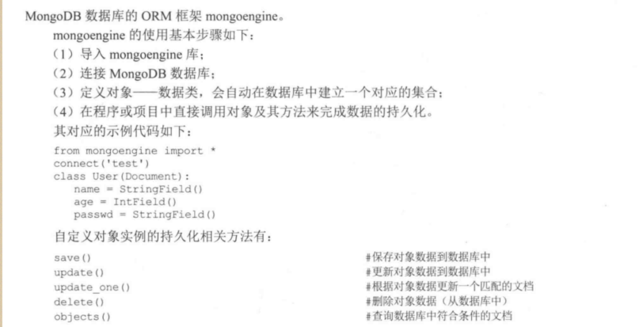

# 使用ORM工具操作mongoDB数据库

``` 
#!/usr/bin/env python
# -*- coding:utf8 -*-
# auther; 18793
# Date：2019/6/26 10:06
# filename: 使用ORM工具操作MongoDB.py
import random
from mongoengine import *  # 导入mongoengine库

connect("test")  # 连接到数据库test


class Stu(Document):  # 定义ORM框架类
    sid = SequenceField()  # 定义序号属性
    name = StringField()  # 定义字符串属性
    passwd = StringField()  # 定义字符串属性

    def introduce(self):
        print("序号:", self.sid, end="")
        print("姓名:", self.name, end=' ')
        print("密码:", self.passwd)

    def set_pw(self, pw):
        if pw:
            self.passwd = pw
            self.save()


src = "abcdefghijklmnopqrstuvwxyz"


def get_str(x, y):
    """ 生成随机数，x~y之间的随机字母字符串"""
    str_sum = random.randint(x, y)  # 产生x,y之间一个随机整数
    astr = ""
    for i in range(str_sum):
        astr += random.choice(src)
    return astr


if __name__ == '__main__':
    print("插入一个文档： ")
    stu = Stu(name="hujianli", passwd="123123")  # 创建一个类(对应一个文档)
    stu.save()  # 持久化类(保存文档)

    stu = Stu.objects(name="lilei").first()  # 查询出数据并初始化类
    if stu:
        stu.introduce()  # 显示(文档)信息

    print("插入多个文档")
    for i in range(3):  # 插入3个文档
        Stu(name=get_str(2, 4), passwd=get_str(6, 8)).save()

    stus = Stu.objects()  # 查询所有文档
    for stu in stus:
        stu.introduce()  # 遍历文档逐个显示

    print("修改一个文档")
    stu = Stu.objects("lilei").first()  # 查询某个文档(自动化构建为类)
    if stu:
        stu.name = "aaaa"  # 修改实例属性
        stu.save()  # 持久化入数据库
        stu.set_pw("111111")  # 调用类的业务方法，修改passwd
        stu.introduce()

    print("删除一个文档")
    stu = Stu.objects(name="aaaa").first()  # 查询获取一个文档
    stu.delete()  # 删除一个文档

    stus = Stu.objects()  # 查询所有文档
    for stu in stus:
        stu.introduce()  # 变量文档并逐个显示


```

代码示例2：

``` python
from mongoengine import *

connect('mongoengine_test',host='localhost',port=27017)

import datetime

class Post(Document):
    title = StringField(required=True, max_length=200)
    content = StringField(required=True)
    author = StringField(required=True, max_length=50)
    published = DateTimeField(default=datetime.datetime.now)

post_1 = Post(
    title='Sample Post',
    content='Some engaging',
    author='scott'
)
post_1.save()
print(post_1.title)

post_1.title = 'hujianli'

post_1.save()
print(post_1.title)
```